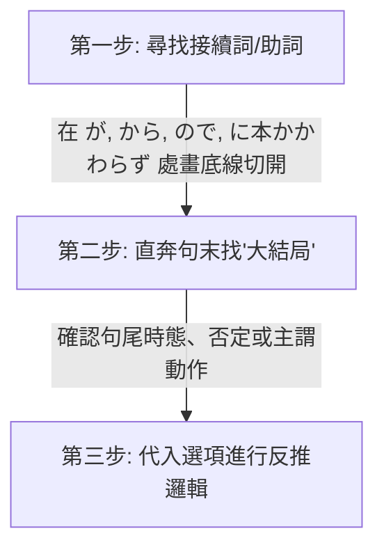
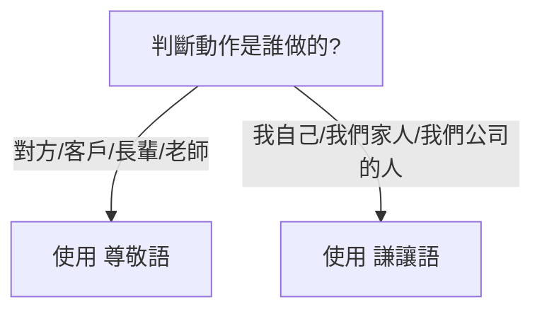

# 🌸 JLPT N2 核心備考與學習優化筆記（一）：學習策略與文法句型

本筆記已拆分為四個部分，以減少 Context 長度並提升學習效率：
1. **[第一部分：學習策略與文法句型](file:///D:/StudyJapanese/1_N2_Study_Strategy_and_Grammar.md)** (本文件)
2. **[第二部分：核心漢字與近義詞辨析](file:///D:/StudyJapanese/2_N2_Kanji_and_Synonym_Distinctions.md)**
3. **[第三部分：自他動詞與分類詞彙表](file:///D:/StudyJapanese/3_N2_Vocabulary_Bank_and_Verbs.md)**
4. **[第四部分：副詞與接續詞專項](file:///D:/StudyJapanese/4_N2_Adverbs_and_Conjunctions.md)**

---

## 🎯 個人化學習背景與備考策略 (Personalized Strategy)

> [!NOTE]
> **你的學習畫像 (Learning Profile)**：
> *   **優勢**：通過動漫、遊戲積累了良好的「語感」與「聽力直覺」，具備接近 **N3** 的潛在實力。
> *   **盲點**：從未系統性學習日語，直接挑戰 **N2**，文法地基較為薄弱。**N3 文法亦有遺漏與不扎實之處**，需要隨時回顧鞏固。
> *   **核心策略**：以 **N2 為絕對重心**（超綱詞僅作字根比對輔助，不作重點），並且在學習 N2 句型時，**主動對接並複習相關的 N3 語法**以鞏固地基。
> *   **核心教材**：《新日檢完勝對策 N2》（8 週架構） + 動漫/遊戲日常生詞積累。

### 🚀 學習優化三部曲
1.  **「單字」與「文法」雙軌並行，不要分開！**
    *   由於 N2 的字彙和文法深度綁定（很多副詞和接續詞就是文法題考點，例如 `のに` / `ので`），**不需要等整本單字背完才看文法書**。建議每天在看《完勝對策單字》的同時，翻開《完勝對策文法》的對應章節進行對照，把看不懂的接續規則隨時發在這裡，我來幫你梳理。
2.  **將「動漫/遊戲生詞」融入《完勝對策》的主題中**
    *   《完勝對策》是按**生活主題**（如：廚房、掃除、辦公室）劃分每天任務的。當你在動漫或遊戲裡看到生詞時，我會幫你把它們歸類到筆記中的相應主題表格中。這樣可以把“破碎的娛樂記憶”轉化為“系統的考試分數”。
3.  **語感轉化為文法規則**
    *   在遊戲中聽到的「口語/台詞」，往往包含複雜的語法（例如使役被動、授受關係）。遇到看不懂的台詞，隨時寫在 [note.txt](file:///D:/StudyJapanese/note.txt)，我會為你拆解背後的 N2/N3 文法邏輯。

### 📊 N2 考試核心考點與優先級分析 (Exam Priorities)

由於你是從 N3 語感直接跳考 N2，**不需要死背每一個單字**，應採取「高回報率」的策略。以下為你分析 N2 考題中各類內容的權重與筆記中的優先級標記：

#### 🔴 優先級 1：核心考點與語意理解關鍵（⚠️ 權重極高，必拿分）
*   **自他動詞**：如 `ずれる/ずらす`、`閉まる/閉める`。不僅單字會考，**聽力題**中也常考「到底是誰做了這件事」，分不清自他動詞在聽力中會被秒殺。
*   **核心漢字辨析**：如六個 `はかる`（`量る/計る/測る/圖る/謀る/諮る`）、`揃う/揃える`。常考在讀音或漢字選擇題中。
*   **敬語與謙讓語**：如 `伺う`、`拝見する`。主要考在文法選擇題 and 職場閱讀中，也是華人考生的重災區。
*   **備考策略**：**每天都要看一遍**。這部分是考試的硬性拿分點，必須熟練到反射動作的程度。

#### 🟡 優先級 2：副詞、接續詞與核心動詞（🌟 權重高，閱讀理解的靈魂）
*   **副詞與接續詞**：如 `一段と`、`常々`、`差異`。副詞常出現在單字填空題，而接續詞決定了文章的邏輯轉折，**閱讀理解（長文）的死活完全取決於你有沒有看懂接續詞**。
*   **動作與身體狀態動詞**：如 `省く`、`溜まる`、`しつける`、`綜合` 系列。這些動詞是閱讀理解中描述細節的關鍵。
*   **備考策略**：**每週複習一次**。重點在於理解其前後語意邏輯與情境接續。

#### 🟢 優先級 3：日常/電腦文書處理詞彙（📊 權重中低，混個眼熟即可）
*   **日常/生活專有名詞**：如 `小兒科`、`停留所`、`築二十年`。
*   **電腦文書詞彙**：如 `改行する` (換行)、`余白` (邊距)。
*   **備考策略**：這類詞彙主要是為了應對**「資訊檢索（通知信件、公文閱讀）」**題型。你不需要會拼寫、也不用知道它的深層字源，**只要在閱讀題中看到時能「認出」它是換行、邊距或小兒科即可**。**每兩週複習一次**即可。

---

## 📅 學習進度與每日複習建議 (Study Tracker)
> [!TIP]
> **「1-3-7-14」 遺忘曲線複習法與筆記瘦身機制**：
> - **第一天**：通讀本筆記中的「核心學習策略」，嘗試用「切西瓜法」分析 3 個長難句。
> - **第三天**：重點複習「自他動詞對照表」，遮住他動詞，嘗試根據畫面感寫出對應的自動詞。
> - **第七天**：複習「六大 Hakarus」與「Awases」，用它們各自造一個句子。
> - **第十四天**：快速掃視「分類詞彙表」，只看日語漢字，能在一秒內反應出讀音與畫面者過關，否則打星號標記。
>
> **💡 筆記防臃腫與高效複習三原則**：
> 1.  **導入「紅黃綠」標記**：
>     *   `🔴` (生疏/極難記)：每天都要看一遍。
>     *   `🟡` (模糊/需複習)：每週複習一次，若複習時答對則升為綠色，答錯降為紅色。
>     *   `🟢` (熟記/已掌握)：兩週複習一次。
> 2.  **定期歸檔 (Archiving)**：
>     *   當某些單字已經連續三次維持在 `🟢` (熟記) 狀態時，我們會將它們**移出主筆記**，歸檔到 `Mastered_Vocabulary_Archive.md` 中。主筆記只保留你「還不會」或「不熟」的內容，永遠保持在 **500 行以內**。
>     *   只在考前一週把歸檔文件調出來快速掃視即可。
> 3.  **主動回想 (Active Recall) 摺疊設計**：
>     *   我們會在複習表中將中文釋義或讀音用 Markdown / HTML 摺疊代碼包裹，複習時遮住答案，點擊再顯現，達到自我測試的效果。

---

## 目錄 (Table of Contents)
- [💡 核心學習策略與方法論 (Methodology)](#-核心學習策略與方法論-methodology)
  - [1. 「切西瓜」長難句拆解法 (Sentence Slicing)](#1-切西瓜長難句拆解法-sentence-slicing)
  - [2. 「畫面感」字根聯想記憶法 (Visual Anchoring)](#2-畫面感字根聯想記憶法-visual-anchoring)
  - [3. 「猜字遊戲」：面對日語生詞的三大推理工具 (How to Deduce Vocabulary)](#3-猜字遊戲面對日語生詞的三大推理工具-how-to-deduce-vocabulary)
- [⚠️ 語法與句型易錯點 (Common Pitfalls)](#-語法與句型易錯點-common-pitfalls)
  - [1. 職場社交：主動請求 vs 被動請求](#1-職場社交主動請求-vs-被動請求)
  - [2. 時間接續：做完某事之後](#2-時間接續做完某事之後)
  - [3. 因果與轉折：ので vs のに](#3-因果與轉折ので-vs-のに)
  - [4. 易混淆詞彙與情境辨析 (職場與生活)](#4-易混淆詞彙與情境辨析-職場與生活)
  - [5. 實用長句拆解與語法分析 (Real-World Sentence Slicing)](#5-實用長句拆解與語法分析-real-world-sentence-slicing)
  - [6. 實用商業告示牌與免責聲明句型拆解 (Store Signs & Disclaimers)](#6-實用商業告示牌與免責聲明句型拆解-store-signs--disclaimers)
  - [7. N2 核心文法：～がたい (難以……)](#7-n2-核心文法がたい-難以)
  - [8. N2 核心文法與語境：限り（かぎり）、限りない（かぎりない）與 限りなく（かぎりなく）](#8-n2-核心文法與語境限りかぎり限りないかぎりない與-限りなくかぎりなく)
  - [9. N2 核心文法與語境：げ、がち、っぽい與氣味（ぎみ）](#9-n2-核心文法與語境げがちっぽい與氣味ぎみ)
  - [10. N2 核心文法與語境：ものなら、ものだから、もの、ものの](#10-n2-核心文法與語境ものならものだからものものの)
  - [11. N2 核心文法與語境：はもとより、はともかく、はまだしも、は抜きにして](#11-n2-核心文法與語境はもとよりはともかくはまだしもは抜きにして)
  - [12. N2 核心文法與語境：てたまらない、てしょうがない、てかなわない、てならない](#12-n2-核心文法與語境てたまらないてしょうがないてかなわないてならない)
  - [13. N2 核心文法與語境：ないことはない、ないこともない、ないではいられない、ずにはいられない](#13-n2-核心文法與語境ないことはないないこともないないではいられないずにはいられない)
  - [14. N2 核心文法與語境：ねばならない、てはならない、ていられない、てばかりはいられない](#14-n2-核心文法與語境ねばならないてはならないていられないてばかりはいられない)
  - [15. N2 核心文法與語境：敬語（尊敬語與謙讓語）快速秒殺密技](#15-n2-核心文法與語境敬語尊敬語與謙讓語快速秒殺密技)

---

## 💡 核心學習策略與方法論 (Methodology)

### 1. 「切西瓜」長難句拆解法 (Sentence Slicing)
閱讀 N2 長難句時，不要習慣性地從左到右死譯。這會導致大腦短期記憶載荷過大，漏掉前後邏輯。請使用以下三步：

#### 💡 實戰案例分析
> **例題**：申し訳ありません。部長はちょっと（　　）おりますが、すぐ戻ると思います。
>
> 1. **切斷**：在 **が** (但是/稍微帶出後文) 處切開。
>    - 前半句：`部長はちょっと（ 空格 ）おりますが`
>    - 後半句：`すぐ戻ると思います` (我想他馬上會回來)
> 2. **找大結局**：後半句的靈魂是 **「すぐ戻る (馬上回來)」**。
> 3. **反推空格邏輯**：既然能「馬上回來」，說明人還在公司，只是暫時離開。
>    - 選項 `早退して` (早退/回家了)、`休みを取って` (請假了) 均不符合「馬上回來」的前提。
>    - 選項 `不足して` (人手不足) 搭配不通。
>    - 答案鎖定：**`席を外して` (離開一下座位)**，完美契合！

---

### 2. 「畫面感」字根聯想記憶法 (Visual Anchoring)
利用漢字字根的核心「動作畫面」來連帶記憶一長串詞彙，避免孤立背誦。

#### 🔹 典型案例 1：字尾 `込む（こむ）` —— “深深地塞入、灌注、沉浸”
*   **字根獨立用法**：
    *   **込む（こむ）** 與 **混む（こむ）**【自動詞】：這兩個詞在發音與語源上完全相同，但在現代日語的漢字書寫上有明確的分工：
        *   **混む**：專門用來表示**「擁擠、人多、混雜」**（例：`電車が混んでいる` 電車很擠。因為「混」有混雜擠在一起的畫面，這是最標準的寫法）。
        *   **込む**：專門用來表示**「進入內部、包含在內」**（例：`税込み` 含稅、複合動詞接尾詞 `～込む`）。
*   **字尾接尾詞用法（～込む）**：
    *   接在動詞連用形（去ます形）後，構成複合動詞。主要有以下 **四大核心畫面感**：

##### 1. 朝著內部進去、放入之內 (Into / Inside)
*   **書き込む（かきこむ）**：寫（書き）進去（込む） ➔ **填寫、留言、登錄數據**。
*   **飛び込む（とびこむ）**：跳（飛び）進去（込む） ➔ **跳入、飛奔進入**（例：`プールに飛び込む` 跳入泳池）。
*   **吸い込む（すいこむ）**：吸（吸い）進去（込む） ➔ **吸入、吸收**（例：`掃除機がゴミを吸い込む` 吸塵器吸入垃圾）。
*   **入れ込む（いれこむ）**：
    1.  *物理面*：放（入れ）進去（込む） ➔ **裝入、塞入**（例：`予定をカレンダーに入れ込む` 把行程塞入行事曆）。
    2.  *精神面*：把心力/感情放（入れ）得很深進去（込む） ➔ **沉迷、著迷、熱衷、傾注情感**（例：`競馬に入れ込む` 沉迷賽馬、`彼女に入れ込む` 對女友極度迷戀）。

##### 2. 徹底、深刻、持續的狀態 (Thoroughly / Deeply)
*   **思い込む（お模いこむ）**：想（思い）得太深進去了 ➔ **深信不疑、認定、誤以為**（例：`自分が正しいと思い込む` 盲目認定自己是對的）。
*   **信じ込む（しんじこむ）**：相信（信じ）得很深 ➔ **深信不疑、篤信**。
*   **落ち込む（おちこむ）**：掉（落ち）得很深進去 ➔ **情緒低落、沮喪**；或經濟**下滑、蕭條**（例：`成績が落ち込む` 成績下滑）。
*   **煮込む（にこむ）**：煮（煮）得很透、讓味道滲透進去 ➔ **燉煮、熬煮**。

##### 3. 固化、保持在原地 (Fixing / Staying)
*   **座り込む（すわりこむ）**：坐下就不起來了 ➔ **靜坐、坐著不動**（例：`道端に座り込む` 坐在路邊不走）。
*   **泊まり込む（とまりこむ）**：住下不走了 ➔ **留宿、通宵加班不回家**（例：`会社に泊まり込む` 住在公司加班）。
*   **黙り込む（だまりこむ）**：保持沉默不說話了 ➔ **陷入沉默、沉默不語**。

##### 4. 原有詞彙的延伸：
*   **振り込む（ふりこむ）**：揮動(振る)著把錢「塞入」 ➡️ **轉帳**。
*   **払い込む（はらいこむ）**：把應付款項「塞入」 ➡️ **繳納、還錢**。
*   **仕込む（しこむ）**：為了做事(仕事)而提前把材料或心力「塞入」 ➡️ **事先準備、訓練/教導徒弟或動物**（類似 `躾ける` 的畫面）。
*   **引き込む（ひきこむ）**：拉扯(引く)著塞進去 ➡️ **拉入、捲入**。

##### 🎮 覺得聯想太抽象？請直接記住 N2 / 動漫與遊戲最常出現的「這 5 個核心詞」：
1.  **落ち込む（おちこむ）**
    *   *動漫畫面*：角色頭頂有三條藍色陰影，蹲在角落畫圈圈。
    *   *含意*：**沮喪、憂鬱、心情掉進谷底**；或經濟/業績**下滑**。
    *   *例句*：`成績が落ちて、かなり落ち込んでいる。` (成績退步，現在非常沮喪。)
2.  **思い込む（おもいこむ）**
    *   *遊戲畫面*：你一直主觀認定某個角色是壞人，結果他根本是來幫你的。
    *   *含意*：**誤以為、主觀認定、深信不疑**（思維鑽牛角尖出不來）。
    *   *例句*：`彼は犯人だと思い込んでいたが、間違いだった。` (我深信他就是犯人，結果搞錯了。)
3.  **申し込む（もうしこむ）**
    *   *動漫畫面*：男主角鼓起勇氣對女主角提出交往的請求（交際を申し込む）。
    *   *含意*：**申請、報名、提出（申請/告白）**（把自己的請求送進去）。
    *   *例句*：`日本語能力試験の受験を申し込む。` (報名參加日語能力試驗。)
4.  **黙り込む（だまりこむ）**
    *   *RPG對話畫面*：對話框出現「……」，角色低下頭，氣氛陷入尷尬。
    *   *含意*：**陷入沉默、一句話也不說**（沉默的狀態固定不變了）。
    *   *例句*：`理由を聞かれて、彼は黙り込んでしまった。` (被問及理由，他便陷入了沉默。)
5.  **煮込む（にこむ）**
    *   *遊戲烹飪系統*：把各種蔬菜 and 肉類丟進大鍋裡慢火熬煮以製作料理。
    *   *含意*：**慢火燉煮、熬煮**（讓調味料和湯汁徹底滲透進去）。
    *   *例句*：`カレーを弱火でじっくり煮込む。` (用小火慢慢熬煮咖哩。)

##### 💡 額外補充：你提過的 **入れ込む（いれこむ）**
*   *聯想*：把自己的精力與熱情「全部塞進去」某個嗜好或對象中。
*   *含意*：**沉迷、熱衷、迷戀**。
*   *例句*：`彼はソシャゲ（手遊）のガチャに入れ込んでいる。` (他沉迷於手機遊戲的抽卡。)

---
#### 🔹 典型案例 2：字根 `組む（くむ）` —— “互相交叉、結合、 interlocking”
想像兩根繩子或人的雙手雙腳交織在一起的動作：
*   **腕/足を組む**：雙手抱胸 / 翹二郎腿（身體交叉）。
*   **スケジュールを組む**：把零散的時間塊「交叉拼接」在一起 ➡️ **制定/排定日程表**。
*   **コンビを組む**：兩個人緊密結合在一起 ➡️ **搭檔、組隊**。

---

### 3. 「猜字遊戲」：面對日語生詞的三大推理工具 (How to Deduce Vocabulary)
日語確實很難死記硬背，但它有一個巨大的優勢：**高度模組化**。面對不認識的 N2 甚至 N1 單字，可以利用以下三個推理工具來猜測意思：

#### 🛠️ 工具一：音讀字（漢語詞）的「積木拆字法」
音讀單字（如 `削減`, `削除`, `消去`, `排除`, `除去`）是由漢字積木拼接而成的。只要掌握個別漢字的核心畫面，就可以像拼積木一樣猜出整組詞的意思：
*   **削（さく）**：核心畫面是「拿刀去切、刮掉、削弱」。
    *   `削減` = 刮掉（削）+ 變少（減） ➔ **縮減（預算/成本）**。
    *   `削除` = 刮掉（削）+ 去掉（除） ➔ **刪除（字元/檔案/帳號）**。
*   **除（じょ）**：核心畫面是「除掉、弄走不想要的雜質或東西」。
    *   `除去` = 除掉（除）+ 拿走（去） ➔ **排除、清除（毒素/雜質）**。
    *   `排除` = 除掉（除）+ 排擠（排） ➔ **排除、排除（障礙/威脅）**。

#### 🛠️ 工具二：訓讀動詞的「字尾/接頭詞推理」
日語的純日語動詞（訓讀字，如 `～直す`, `～出す`, `～合わせ連`, `～込む`）非常規律。複合動詞的後半部分決定了**「動作的方向、狀態或性質」**：
*   **～直す（なおす）** ➔ 核心畫面是「修復、改進、重新來過」。
    *   `やり直す` = 做（やり）+ 重新來 ➔ **重做**。
    *   `見直す` = 看（見）+ 重新來 ➔ **重新考慮、複審、改觀**。
    *   `書き直す` = 寫（書き）+ 重新來 ➔ **重寫**。
*   **～出す（だす）** ➔ 核心畫面是「朝向外面、或是動作開始」。
    *   `引き出す` = 拉（引き）+ 出來 ➔ **拉出、提款**。
    *   `思い出す` = 想（思い）+ 出來 ➔ **回想起來**。
    *   `動き出す` = 動（動き）+ 出來 ➔ **開始動起來**。
*   **～合わせる（あわせる）** ➔ 核心畫面是「湊在一起、核對、對齊」 ➔ `問い合わせる`（詢問核對）、`打ち合わせる`（事前商量）。

#### 🛠️ 工具三：「名詞/擬聲詞變身動詞」的字源溯源法
日語許多三音節、四音節的訓讀動詞，通常是由**我們已經認識的基礎名詞**或**擬聲擬態詞**演變而來的。當你看到一個生詞，試著看它的前半部分：
*   **こなす** ➔ 前兩個音是 `こな`（粉） ➔ 磨成粉 ➔ 消化 ➔ **消化、搞定工作**。
*   **ずらす/ずれる** ➔ 來自副詞 `ずるずる`（滑動、拖延的擬態聲音） ➔ **偏離、挪動**。
*   **たまる/ためる** ➔ 來自 `田（た - 水田）` 或 `水たまり（水窪）` ➔ 聚水 ➔ **積攢、儲存**（如：垃圾堆積、存錢）。
*   **宿る（やどる）** ➔ 來自 `宿（やど - 旅館/客棧）` ➔ 住宿 ➔ **寄生、寄宿、懷孕**。
*   **煙る（けむる）** ➔ 來自 `煙（けむり - 煙霧）` ➔ **冒煙、煙霧濛濛**。

---

## ⚠️ 語法與句型易錯點 (Common Pitfalls)

### 1. 職場社交：主動請求 vs 被動請求
在商務日語中，主動請求對方做事與請求對方允許自己做事極易混淆，直接關係到職場禮貌。

> [!WARNING]
> *   **`～してください`** / **`ご～ください`**：**「請你做某事」**（動作發出者是**對方**）。
> *   **`～させてください`**：**「請讓我做某事」**（使役形 + ください，動作發出者是**自己**）。

*   **錯誤造句**：`スケジュールを組んだあとで、連絡させてください。`❌
    *   *誤讀意*：日程表排好之後，請**讓我**聯絡你（如果你是老闆/客戶，這樣說顯得很奇怪）。
*   **正確改法**：
    *   **平輩/一般同事**：`スケジュールを組んだあとで、連絡してください。` (排好日程後請聯絡我)
    *   **對上級/客戶（敬語）**：`スケジュールを組んだあとで、ご連絡ください。` / `スケジュールを組んでから、ご連絡ください。`

---

### 2. 時間接續：做完某事之後
表示「做完前項動作，再做後項」時：
*   **`動詞た形 + あとで`** (在...之後)
    *   注意「組む」的過去式是 `組んだ`。不要多寫促音，如 `組んだったあとで` ❌ 是錯誤的，應為 **`組んだあとで`** ⭕。
*   **`動詞て形 + から`** (自從...以後 / 緊接著做...)
    *   **`スケジュールを組んでから、ご連絡ください。`**

---

### 3. 因果與轉折：ので vs のに
這兩個詞非常容易因為只差一個字而混淆：
*   **`ので`（表示客觀因果）**：相當於 `から`，表示「因為前者的緣故，所以導致了後者的客觀結果」。語氣比 `から` 更柔和客氣。
*   **`のに`**：
    1.  **表示轉折（明明……卻）**：`一生懸命勉強したのに、不合格だった。` (明明拼命學了，卻沒考過)。
    2.  **表示目的/用途（為了……）**：當後面接 `使う` (使用)、`必要` (必要)、`かかる` (花費時間/金錢) 等詞時。
        *   `この仕事をするのに1時間かかる。` (為了做這工作需要花1小時)。

---

### 4. 易混淆詞彙與情境辨析 (職場與生活)

#### 💡 辨析 1：轉勤（転勤） vs 派遣（派遣）
*   **句型**：`大阪支社から（転勤）してきました、田中と申します。` (我叫田中，是從大阪分公司調職過來的。)
*   **為什麼不能用「派遣」？**
    *   **転勤（てんきん）**：指**「同一家公司內部，不同分公司/部門之間的調職、轉勤」**。你依然是這家公司的正式員工，所以說「從大阪分公司（支社）調職過來」非常自然。
    *   **派遣（はけん）**：指**「派遣（外包）員工」**。派遣員工的雇主是「派遣公司（派遣会社）」，被派到客戶公司工作。
        1.  *文法問題*：`派遣する` 是他動詞「派遣某人」，自我介紹時應使用被動形 `派遣されてきました`。
        2.  *情境問題*：派遣通常是從「派遣公司」派來，而不是從「大阪分公司（支社）派遣過來」。

#### 💡 辨析 2：離席（席を外す） vs 讓座（席を譲る）
*   **為什麼「バスで老人に席を外した」是錯誤的？**
    *   **席を外す（せきをはずす）**：指**「暫時離開座位/辦公桌（一會兒就回來）」**。這張辦公桌或座位的**所有權依然是你的**，你只是人暫時不在。
        *   *例句*：`課長の鈴木は今、席を外しております。` (鈴木課長現在暫時離開座位了 ➔ 他還在上班，等一下就回座位)。
    *   **席を譲る（せきをゆずる）**：指**「讓座、把座位讓給別人（轉交所有權）」**。
        *   *例句*：`バスで老人に席を譲った。` (在公車上讓座給老人 ➔ 正確 ⭕)。

---

### 5. 實用長句拆解與語法分析 (Real-World Sentence Slicing)

在你提供的 [note.txt](file:///D:/StudyJapanese/note.txt) 中有以下兩句經典的日檢及日常實用句子，我們使用**「切西瓜閱讀法」**來為你逐一拆解：

#### 💡 句子 1：再配送須知（快遞/物流常用提示）
> **ご連絡を頂きました時間によっては、当日の再配達ができない場合がございます。**
> *(原文 `できない場合はございます` 應為商務日語的 `場合がございます`，在此作標準語法拆解。)*

*   **切西瓜分段拆解**：
    1.  **ご連絡を頂きました** ➔ **主動聯絡的動作（對象是「您」）**
        *   `頂きました` 是 `もらう` 的謙讓語，字面是「我們承蒙您給予聯絡」，這是日本商家對顧客的客氣說法。
    2.  **時間によっては** ➔ **文法考點：`～によっては` (根據……而有所不同)**
        *   表示前項的「時間」會決定後面的結果。
    3.  **当日の再配達ができない** ➔ **當天無法重新配送**
        *   `再配達（さいはいたつ）`：在日本，如果快遞員送貨上門時你不在家，他會留下一張「不在聯絡票」，你需要聯絡他們重新投遞。
    4.  **場合がございます** ➔ **文法考點：`～場合がある / ～ことがあります` (有時會出現……的情況)**
        *   用在商務或委婉口氣中，比直接說 `できません` (不行) 更客氣。
*   **整句中文大意**：**「根據您聯絡我們的時間不同，有時候可能會出現當天無法重新配送的情況。」**
*   *備考策略*：遇到 N2 的資訊檢索題（閱讀最後一題，通常是快遞單或廣告），這句話非常關鍵，代表「如果聯絡得太晚，今天就拿不到包裹了」。

---

#### 💡 句子 2：工作分配說明（辦公室/班級常用語）
> **今お配りしたプリントに作業の分擔が書いてあります。**

*   **切西瓜分段拆解**：
    1.  **今お配りした** ➔ **文法考點：`お + 動詞連用形 + した / する` (謙讓語，我為您做某事)**
        *   `配る（くばる）` (分發) 去掉 `る` 接上 `お...した` 變成 `お配りした`，表示「我發（給各位）的」。
    2.  **プリントに** ➔ **講義/資料上**
        *   `プリント`：源自英文 Print，在日本指學校或公司開會發的**單張講義、印好的資料**。
    3.  **作業の分担が** ➔ **工作的分配/分工**
    4.  **書いてあります** ➔ **文法考點：`動詞て形 + あります` (表示人有意施加的動作所留下來的既存狀態)**
        *   這裡的動作是「寫（書く）」，`書いてあります` 表示「上面已經寫好了（你現在能看到這個寫好的狀態）」。
*   **整句中文大意**：**「剛剛發給各位的講義上，有寫著工作的分配。」**
*   *備考策略*：這句話在 N2 聽力的第一大題（課題理解）非常常考，聽到這句話，接下來的題目通常就會問你「接下來某個人要負責做什麼工作」。

---

#### 💡 句子 3：垃圾郵件的煩惱
> **迷惑メールが何通も届いて困っている。**

*   **「切西瓜」分段拆解**：
    1.  **迷惑メールが** ➔ **垃圾郵件（主語）**
        *   **`迷惑（めいわく）`**：給人添麻煩、困擾（N2 核心字彙）。`迷惑メール` 即垃圾郵件、騷擾信件。
    2.  **何通も** ➔ **好幾封 / 許多封**
        *   **`通（つう）`**：信件、郵件的計量計數詞（N2/N3 常考量詞）。
        *   `何 + 量詞 + も` 表示「好幾次/好幾件」，起強烈強調數量多之意。
    3.  **届いて** ➔ **寄到、送達**
        *   動詞 **`届く（とどく）`** (自動詞，寄達/傳遞) 的て形，表示原因或前後連貫。
    4.  **困っている** ➔ **感到困擾、為難**
        *   動詞 `困る（こまる）` (自動詞) 的正在進行/持續狀態。
*   **整句中文大意**：**「好幾封垃圾郵件接連寄達，真讓人感到困擾。」**
*   *備考策略*：這句話常用於模擬真實生活或辦公室日常中的困擾描述。在 N2 聽力中，聽到 `困っている` 往往是「問題解決/對策題」的起點。

---

#### 💡 句子 4：商務邀請與客氣拜訪 (常見於官網或店面告示)
> **お近くにお越しの際は是非お立ち寄りください。**

*   **「切西瓜」分段拆解**：
    1.  **お近くに** ➔ **附近、這附近（敬語美化語）**
        *   `近く（ちかく）` 前面加上 `お` 表示客氣禮貌。
    2.  **お越しの際は** ➔ **文法考點：`お越し` (「來/去」的尊他敬語) + `の際は` (在……的時候)**
        *   `お越しになる` 是 `來/去` 的敬語。
        *   `～の際（さい）` 是比 `～のとき` 更正式、更莊重的書面語，意為「在……之際 / 當……之時」。
    3.  **是非** ➔ **務必、一定要**
        *   副詞 **`是非（ぜひ）`**，後接請求或願望，起強烈推薦、懇請之意。
    4.  **お立ち寄りください** ➔ **文法考點：`お + 立ち寄り + ください` (敬語：請您順道前來)**
        *   動詞 **`立ち寄る（たちよる）`**：順道前來、順路拜訪（指去主要目的地途中，順便到某個地方待一下）。
        *   `立ち寄り` 是 `立ち寄る` 去掉 `る` 的連用形，加上 `お...ください` 尊他敬語。
*   **整句中文大意**：**「如果您來到這附近時，請務必順道前來坐坐。」**
*   *備考策略*：這句話是日本店家、企業或朋友發出邀請時的「黃金社交客套話」。在 N2 聽力的職場對話或信件閱讀中極其高頻，代表「隨時歡迎光臨」。

---

#### 💡 句子 5：職場職責與詞彙選擇 (任務 vs 事務)
> **会社の経理（事務）を担当しています。**

*   **「切西瓜」分段拆解**：
    1.  **会社の経理** ➔ **公司的財務/會計**
        *   `経理（けいり）` 指公司的財務會計工作。
    2.  **（事務）を担当** ➔ **負責……事務**
        *   **`事務（じむ）`**：日常行政、辦公室文書處理（日常性、重複性的工作）。「經理事務」是固定搭配。
        *   **`任務（にんむ）`**：上級給予的特定、重大、必須完成的使命（如：國防任務、機密任務）。一般日常會計工作不會用「任務」來形容，除非是極其特殊的秘密使命。
        *   `担当する（たんとうする）`：擔任、負責。
    3.  **しています** ➔ **正在從事（狀態持續）**
*   **整句中文大意**：**「我目前負責公司的財務會計事務。」**
*   *備考策略*：這是一道經典的詞彙選擇題。在 N2 考試中，常考 `事務` 與 `任務`、`義務`、`職務` 的差別。記住：常規辦公室文書行政工作，一律用 **`事務（じむ）`**；重大使命才用 **`任務（にんむ）`**。

---

### 6. 實用商業告示牌與免責聲明句型拆解 (Store Signs & Disclaimers)

在日本生活、旅遊，或者在 N2 的閱讀理解「資訊檢索」中，常常需要看懂商店、洗衣店的提示牌與免責聲明。我們來拆解你提供的兩句非常地道、實用的告示牌句子：

#### 💡 句子 1：洗衣店/寄物處的溫馨提示
> **ポケットの中に忘れ物がないか点検してからお出し下さい。**

*   **「切西瓜」分段拆解**：
    1.  **ポケットの中に忘れ物がないか** ➔ **口袋裡有沒有遺留物品**
        *   `忘れ物`：遺漏的東西、忘記拿走的東西。
        *   `～ないか`：表示**「是否……」**的疑問（有沒有……）。
    2.  **点検してから** ➔ **檢查之後再……**
        *   `点検する`：檢查、點檢。
        *   `～てから`：表示動作的先後順序（先做前項，再做後項）。
    3.  **お出し下さい** ➔ **文法考點：`お + 動詞連用形 + ください` (敬語：請您做某事)**
        *   `出す` (拿出來/交給我們) 去掉 `す` 加上 `お...ください` 變成 `お出しください`（請拿出來/請交給我們）。
*   **整句中文大意**：**「請檢查口袋中是否有遺留物品後，再交給我們。」**
*   **實用場景**：常出現在洗衣店（送洗衣服前需清空口袋）或飯店前台寄放行李處。

---

#### 💡 句子 2：店家的免責聲明（非常重要！）
> **お引き取りがなく、1ヶ月以上経過した品物は責任を負いかねます。**

*   **「切西瓜」分段拆解**：
    1.  **お引き取りがなく** ➔ **若沒有前來領取**
        *   `引き取り（取件、領回）`：動詞 `引き取る` 的名詞化，前面加 `お` 敬語化。
    2.  **1ヶ月以上経過した品物は** ➔ **且經過了一個月以上的物品**
        *   `経過する（けいかする）`：時間流逝、經過。
    3.  **責任を負いかねます** ➔ **文法考點：`動詞連用形 + かねます` (很難…… / 無法……)**
        *   **`～かねます`** 是 N2 重點語法，用來表示**「主觀上很難做到，因此委婉拒絕/否定」**。在日本服務業中，店家絕對不會生硬地說 `できません` (我們不能)，而是用 `負いかねます` (恕難承擔)。
        *   `負う（おう）`：承擔、背負（責任、受傷等）。
*   **整句中文大意**：**「若未前來領回，且逾期一個月以上的物品，本公司恕不承擔保管責任。」**
*   **實用場景**：洗衣店、行李寄存處、失物招領處等。如果逾期未取，物品丟失或損壞，商家依法不予賠償。

---

#### 💡 句子 3：垃圾收集處的分類提示 (ゴミ集積所)
> **ダンボールはひもでしばって、お出してください。**
> **紙パックは洗って、開いて平らにしてしばってください。**

*   **「切西瓜」分段拆解**：
    1.  **ダンボールは** ➔ **紙箱/紙板（主體）**
        *   `ダンボール`：源於英文 Corrugated cardboard，日語特指**瓦楞紙箱、紙板**。
    2.  **ひもでしばって** ➔ **用繩子綁起來**
        *   `ひも` (繩子) + `で` (使用工具/方式)。
        *   `しばって`：動詞 **`縛る（しばる）`** (捆綁、束縛) 的て形。
    3.  **お出してください** ➔ **請拿出來（丟垃圾）**
        *   **`お + 動詞連用形 + ください`** 尊他敬語，請對方做某事。`出す` (丟出/拿出) 變成 `お出しください`。
    4.  **紙パックは洗って** ➔ **紙盒/紙包裝（牛奶盒等）要清洗後**
        *   `紙パック（かみぱっく）`：飲料紙盒（如牛奶盒）。
    5.  **開いて平らにして** ➔ **剪開、壓平**
        *   `開いて（ひらいて）`：動詞 `開く（ひらく）` (展開、剪開) 的て形。
        *   `平らにして`：形容動詞 **`平ら（たいら）`** (平坦、扁平) + `にする` (使動，使其變平)。
    6.  **しばってください** ➔ **再綁起來**
*   **整句中文大意**：**「紙箱請用繩子捆綁後再丟出。紙盒包裝請先清洗、剪開壓平後，再捆綁丟棄。」**
*   **實用場景**：日本社區的「垃圾收集處（ゴミ集積所）」。日本垃圾分類極其嚴格，紙箱與紙餐盒必須分別處理，若不壓平綁好，清潔隊會拒收。

---

### 7. N2 核心文法：～がたい (難以……)

在你的學習記錄中提到了 `～し難い（しがたい）`，這確實是 N2 語法考試的**必考常客**！

#### 💡 文法解析
*   **接續**：**`動詞連用形（去 ます 形）+ がたい`**
*   **字義**：表示**「很難做某事 / 難以做某事」**。
*   **核心語感與畫面**：
    *   這並非指「物理上無法做到」（如：沒有工具所以不能做），而是指**「心理上、情感上、道義上或常識上「極難接受或抗拒去做」**（Psychologically or morally impossible/difficult）。
    *   主語通常是第一人稱大腦或情感的活動（如：信じる、理解する、許す、動かす）。

#### 🔹 考試超高頻搭配（直接記住這 4 個黃金詞）：
1.  **信じがたい（しんじがたい）**：難以置信。
    *   *例句*：`彼が嘘をついたなんて、信じがたい。` (他居然撒謊了，真是令人難以置信)。
2.  **許しがたい（ゆるしがたい）**：難以原諒。
    *   *例句*：`犯人の行為は極めて許しがたい。` (犯人的行為極其難以原諒)。
3.  **理解しがたい（りかいしがたい）**：難以理解。
    *   *例句*：`彼の不可解な行動は、理解しがたい。` (他那令人費解的行為，實在難以理解)。
4.  **言い表しがたい（いいあらわしがたい）**：難以言喻 / 難以用言語表達。
    *   *例句*：`あの時の感動は、言葉では言い表しがたい。` (那時的感動，實在是難以用言語表達)。

#### ⚠️ 易混淆辨析：～がたい vs ～にくい vs ～づらい

這三個在中文都翻譯成「難以……」，但在日語中有本質上的差異：

| 句型 | 難以度類型 | 核心畫面與例句 |
| :--- | :--- | :--- |
| **～がたい** | **心理/主觀難以做到** | · 信じがたい（心理上無法相信） · 物理上可以相信，但理智或情感「抗拒相信」。 |
| **～にくい** | **物理/客觀難以做到** | · このペンは書き**にくい**（這筆不好寫 ➔ 筆的物理屬性導致不好寫） · この字は読み**にくい**（這字不好讀 ➔ 字跡遺漏） |
| **～づらい** | **肉體痛苦/尷忑難以做到** | · 喉が痛くて話し**づらい**（喉嚨痛說話很難受） · 相手に直接は言い**づらい**（當面跟對方說感覺很尷尬） |

*   **補充詞彙對照**：
    *   **難い / 難しい（むずかしい）**【形】：困難的。
    *   **易しい（やさしい）**【形】：簡單的、容易的。

---

### 8. N2 核心文法與語境：限り（かぎり）、限りない（かぎりない）與 限りなく（かぎりなく）

這三個詞源自同一個動詞 **`限る（かぎる - 限制、畫界線）`**。它們的詞性不同（分別為名詞、形容詞、副詞），因此在句子中的位置與扮演的文法角色也完全不同。

我們可以將其核心視覺畫面想像為：**在地上畫一條「界線（Boundary Line）」**。

---

#### 💡 1. 限り（かぎり）—— 名詞：「界線」與「只要在界線內」

作為名詞，`限り` 表示「極限、界限」。在 N2 文法中，它最常作為接續詞，用來表示**「時間或條件的邊界」**。

##### 🔹 用法 A：只要在……界線內，就……（Condition）
*   **文法結構**：`動詞 / 形容詞 + 限り`（只要……狀態持續，後項就成立）
*   *例句*：
    *   `生きている**限り**、あなたの恩は忘れません。`
        (只要我還活著（在活著的界線內），就絕不忘記你的恩情。)
    *   `体が動く**限り**、私は働き続けます。`
        (只要身體還能動（在能動的界線內），我就會繼續工作。)
    *   `不健康な生活をしている**限り**、病気は治りません。`
        (只要還過著不健康的生活，病就不會好。)

##### 🔹 用法 B：就……範圍內（Scope）
*   **文法結構**：`動詞已知形（知っている、調べた、見渡す）+ 限り（では）`（在我能觸及的界線內）
*   *例句*：
    *   `私が知っている**限り**では、彼はそんなことをする人ではありません。`
        (就我所知（在我的知識界線內），他絕不是會做出那種事的人。)
    *   `警察が調べた**限り**、事件に不審な点は見つからなかった。`
        (就警方調查的範圍內，案件並未發現可疑點。)

##### 🔹 用法 C：盡可能、達到極限（Limit）
*   **文法結構**：`V-る / 名詞 + の限り`
*   *例句*：
    *   `力の**限り**戦ったが、試合に負けてしまった。`
        (我用盡了全部的力量（力量的極限）戰鬥，但還是輸了比賽。)
    *   `できる**限り**のことはすべてやりました。`
        (凡是能做到的事（可能的極限），我全都做了。)

---

#### 💡 2. 限りない（かぎりない）—— 形容詞：「無邊無際、無限的」

`限りない` 是 `限り` 加上否定形容詞 `ない`。
*   **核心畫面**：**「找不到任何邊界線」** ➔ 無窮無盡、無限的。
*   **文法功能**：修飾名詞，通常直接接在名詞前面（`限りない + 名詞`）。
*   *例句*：
    *   `子供たちの未来には、**限りない**可能性が広がっている。`
        (孩子們的未來，展開著無限的（無邊界的）可能性。)
    *   `親の子供に対する愛情は、**限りない**ものだ。`
        (父母對孩子的愛，是無止境的（無限的）。)
    *   `限りない喜びを感じる。` (感到無窮的喜悅。)

---

#### 💡 3. 限りなく（かぎりなく）—— 副詞：「無窮地、極度接近……」

`限りなく` 是 `限りない` 的副詞修飾形（將 `い` 變為 `く`）。
*   **核心功能**：修飾後方的動詞、形容詞或形容動詞。

##### 🔹 用法 A：無限地、不停地（Limitlessly）
*   *例句*：
    *   `海が**限りなく**広がっている。`
        (大海無窮無盡地延伸著。)
    *   `科学技術は**限りなく**進歩し続ける。`
        (科學技術將無限地持續進步。)

##### 🔹 用法 B：極度接近某個邊界（幾近於…… / Extremely close to）
*   **常用搭配**：`限りなく + 形容詞 + に近い`（極度接近某狀態）
*   *例句*：
    *   `それは白に見えるが、**限りなく**黒に近いグレーだ。`
        (那看起來像白色，但實際上是個極度接近黑色的灰色。)
    *   `今回の作戰が成功する確率は、**限りなく**ゼロに近い。`
        (這次作戰成功的機率，極度接近於零（幾乎不可能）。)
    *   `限りなく不可能に近い挑戦。` (幾近於不可能的挑戰。)

---

#### 📌 三者對比總整理

| 詞彙 | 詞性 | 中文直譯 | 考試/造句口訣 |
| :--- | :--- | :--- | :--- |
| **限り** | 名詞 / 接續詞 | 只要…… / 範圍內 / 極限 | 接在動詞後，表示「**只要這條界線還在**」。 |
| **限りない** | 形容詞 (i) | 無限的、無邊的 | 直接修飾名詞，表示「**沒有界限的某物**」。 |
| **限りなく** | 副詞 | 無限地 / 極度接近 | 修飾後方詞彙，表示「**動作無限**」或「**幾乎就是……**」。 |

---

### 9. 🔴 N2 核心文法與語境：げ、がち、っぽい與氣味（ぎみ）

這四個文法都與**「傾向、外觀、狀態」**有關，但它們的接續規則、語氣以及使用場景有很大區別。我們可以將它們的核心概念對照如下：

---

#### 💡 1. げ —— 接尾詞：「看起來好像……的樣子」 (外觀與神情)

*   **核心視覺**：**從他人的表情、態度或外觀「感覺到」某種情緒**。
*   **文法結構**：
    *   形容詞-い（去い） + **げ** （如：`悲しげ`、`嬉しげ`）
    *   形容詞-な（去な） + **げ** （如：`不安げ`、`得意げ`）
    *   **特殊/固定用法**：
        *   `よい` ➔ `よさげ` (看起來不錯)
        *   `ない` ➔ `なさげ` (看起來沒有)
        *   動詞/名詞結合：`ありげ` (好像有)、`言いたげ` (好像想說什麼)
*   **使用限制**：主要用於**第三人稱**，多用於文學作品或書面語。通常接在表示感情、感覺的詞後。
*   *例句*：
    *   `男は意味**ありげな**笑いを浮かべた。` (那名男子露出了別有深意（意味深長）的笑容。)
    *   `彼女は悲し**げな**表情で窓的外を見つめていた。` (她帶著悲傷的神情注視著窗外。)
    *   `彼は自信**ありげに**スピーチを始めた。` (他一副自信滿滿的樣子開始了演講。)

---

#### 💡 2. がち —— 接尾詞：「容易……、經常……」 (負面的頻率與傾向)

*   **核心視覺**：**某個負面、不好的動作或狀態「發生頻率很高」**。
*   **文法結構**：
    *   動詞-ます形（去ます） + **がち** （如：`遅れがち`、`休みがち`、`忘れがち`）
    *   名詞 + **がち** （如：`病気がち`、`曇りがち`、`留守がち`）
*   **使用限制**：幾乎都用於**不好、不想要**的事情或傾向。
*   *例句*：
    *   `この時計は20年使っているが、このごろ遅れ**がち**だ。` (這支手錶已經用了20年，最近常常走慢。)
    *   `一人暮らしの自炊は、野菜が不足し**がち**だ。` (單身一人住的自炊生活，往往容易蔬菜攝取不足。)
    *   `彼は最近、仕事を休み**がち**だ。` (他最近經常請假不來上班。)

---

#### 💡 3. っぽい —— 接尾詞：「像……似的、多……的」 (本質屬性、多此特質)

*   **核心視覺**：**某物具有極強的某種感覺或傾向（多半是口語、帶點貶義）**。
*   **文法結構**：
    *   名詞 + **っぽい** （如：`子供っぽい` - 幼稚、`男っぽい` - 男人氣概、`水っぽい` - 水汪汪/稀薄）
    *   形容詞-い（去い） + **っぽい** （如：`安っぽい` - 廉價感、`白っぽい` - 偏白）
    *   動詞-ます形（去ます） + **っぽい** （用於性格傾向，如：`怒りっぽい` - 易怒、`飽きっぽい` - 三分鐘熱度）
*   **使用限制**：口語色彩濃厚。常指「雖然本質不是那樣，但看起來/感覺上卻很像那樣」（例如明明是大人卻「子供っぽい」），或指個人的性格特質。
*   *例句*：
    *   `あの人は怒り**っぽい**が、本当は優しい人だ。` (那個人雖然容易發脾氣（易怒），但其實是個溫柔的人。)
    *   `このスープは水**っぽい**。` (這碗湯水分太多（淡得像水一樣）。)
    *   `その服はデザインが安**っぽい**。` (那件衣服的設計看起來很廉價。)

---

#### 💡 4. 気味（ぎみ） —— 接尾詞：「稍微有點……、有……的趨勢」 (主觀感受的身心狀態)

*   **核心視覺**：**目前或最近的身體、心理狀態「稍微偏向」某種不好轉變**。
*   **文法結構**：
    *   動詞-ます形（去ます） + **気味** （如：`遅れ気味`、`疲れ気味`、`太り気味`）
    *   名詞 + **気味** （如：`風邪気味`、`緊張気味`、`寝不足気味`）
*   **使用限制**：強調的是**「現在/最近」**主觀感覺到的輕微狀態或變化趨勢，且多為不好的狀態。
*   *例句*：
    *   `最近、疲れ**気味**なので、早く寝ることにしている。` (最近稍微有點疲憊，所以我決定早點睡覺。)
    *   `電車が少し遅れ**気味**で、遅刻するかと焦った。` (火車稍微有點延誤，我急得以為要遲到了。)
    *   `彼女は風邪**気味**だ。` (她稍微有點感冒（有感冒跡象）。)

---

#### 📌 「遅れがち」 vs 「遅れ気味」 的語境辨析
*   **遅れがち** (負面傾向/頻率高)：強調**「發生的頻度很高、反覆出現」**。比如 20 年的舊手錶，經常性地會慢下來，這是一種長期的重複傾向。
*   **遅れ気味** (現在/最近的稍微狀態)：強調**「目前這一次/這陣子稍微慢了」**。比如平時很準的火車，今天因為某種原因「稍微慢了點」。

---

#### 📌 四者接續與語境對比總整理

| 句型 | 接續方式 | 核心語境與含意 | 典型搭配例句 |
| :--- | :--- | :--- | :--- |
| **～げ** | Adj-い/な去尾、あり/なし | **外觀神情**：看起來……（多用於他人與文學） | 意味**ありげな**笑い (別有深意的笑容) |
| **～がち** | V-ます形、Noun | **負面傾向/頻率高**：容易發生、常常會…… | 風邪をひき**がち**だ (經常容易感冒) |
| **～っぽい** | Noun、Adj去尾、V-ます形 | **特質屬性/易怒**：像……、容易……（口語貶義） | 子供**っぽい** (幼稚) / 怒り**っぽい** (易怒) |
| **～気味** | V-ます形、Noun | **身心微小變化**：稍微有點……（現在/最近） | 風邪**気味**だ (稍微有點感冒) |

---

#### 🌟 專項練習：排列組合星星題 (Scrambled/Star Questions)

為了加強你的星星題弱點，以下為你整理了結合本單元文法的排列組合題目。這些題目已被編譯進系統的「排列組合星星題特訓」模式：

*   `男は [意味] [ありげな] [★笑いを] [浮かべた]` (那名男子露出了別有深意的笑容。)
*   `この時計は [20年も] [使っている] [★せいか] [遅れがちだ]` (或許是因為用了20年之故，這支手錶最近常常走慢。)
*   `合格 [★したくて] [たまらない] [からこそ] [頑張る]` (正因為極度渴望合格，所以才要努力。)
*   `彼女は [悲しげな] [表情を] [★浮かべて] [うつむいた]` (她帶著悲傷的神情低下了頭。)
*   `怒り [★っぽい] [彼が] [怒らないのは] [珍しい]` (易怒的他居然沒發脾氣，真是稀奇。)
*   `風邪 [★気味で] [頭が] [痛いので] [帰ります]` (因為有點感冒頭痛，所以我先回去了。)

---

### 10. 🔴 N2 核心文法與語境：ものなら、ものだから、もの、ものの

這組文法都是以名詞 **`もの`（人、物、事物的本質/理所當然）** 為核心延伸出來的句型。它們在日文的日常口語與書面表達中出現頻率極高，但語氣與語境截然不同。

---

#### 💡 1. ～ものなら —— 「如果可以的話」（希望渺茫） / 「要是做了的話」（警告/威脅）

`ものなら` 根據前面接續動詞的形態，有兩種完全相反的含意：

##### 🔹 用法 A：能力上的假設 ➔ 「如果能做到（但實際上很難或不可能）」
*   **文法結構**：**動詞可能形（できる、帰れる等）** + **ものなら**
*   *例句*：
    *   `できる**ものなら**、もう一度人生をやり直したい。` (如果能做得到的話（雖然不可能），真想重新來過一次人生。)
    *   `帰れる**ものなら**、今すぐ国に帰りたい。` (如果回得去的話（雖然走不開），真想現在馬上回國。)

##### 🔹 用法 B：意志/行為上的假設 ➔ 「要是敢做（壞事）的話，就……」（警告、威脅、後果嚴重）
*   **文法結構**：**動詞意向形（V-よう）** + **ものなら**
*   *例句*：
    *   `そんなことをし**ようものなら**、大変なことになるぞ。` (你要是敢做出那種事情，後果可就嚴重了。)
    *   `授業中に居眠りをし**ようものなら**、先生にひどく怒られる。` (要是敢在課堂上打瞌睡，會被老師狠狠責罵。)

---

#### 💡 2. ～ものだから / ～ものですから —— 「因為……嘛」（主觀的藉口、致歉）

*   **核心視覺**：當自己做錯事或處於尷尬狀態時，用來**「向對方解釋主觀的個人原因或藉口」**，帶有**抱歉、希望對方諒解**的語氣。
*   **文法結構**：普形（名詞/Adj-な + **な**） + **ものだから / ものですから**
    *   *註：`ものですから` 是其禮貌/敬體形式。*
*   *例句*：
    *   `上着を着たままですみません。寒い**ものですから**。` (很抱歉我就這樣穿著外套。因為實在是太冷了（請原諒我）。)
    *   `遅れてすみません。事故で電車が止まってしまった**ものだから**。` (抱歉我遲到了。因為發生事故火車停開了（不是我故意遲到的）。)

##### ⚠️ 辨析：寒い「ものですから」 vs 「からですもの」
*   **寒いものですから** (正確)：這是標準的 N2 文法，表示「因為太冷了，所以...（表示歉意或委婉解釋）」。
*   **からですもの** (錯誤/不自然)：`～もの / ～もん` 雖然可以放在句尾表原因（多為女性或小孩口語），但通常接在普形後面（如 `寒いんだもん`）。`～からですもの` 結構極不自然，且在對旁人說 `すみません`（抱歉/不好意思）的禮貌情境下，使用 `からですもの` 會顯得語氣過於撒嬌、幼稚，與後半句的禮貌語氣相衝突。

---

#### 💡 3. ～もの / ～もん —— 「因為……嘛」（口語撒嬌、找藉口）

*   **核心視覺**：多用於**小孩子或女性的日常口語**，用來任性、撒嬌或理直氣壯地為自己辯護。
*   **文法結構**：普形 + **もの / もん**（常以 `だもん`、`んだもん` 形式出現）
*   *例句*：
    *   `「どうして食べないの？」「だって、美味しくないんだ**もん**。」` (「為什麼不吃？」「因為就不好吃嘛！」)
    *   `一人で行くのは嫌だ。怖いんだ**もの**。` (我不要一個人去，因為人家會怕嘛。)

---

#### 💡 4. ～ものの —— 「雖然……但是……」（客觀事實的轉折）

*   **核心視覺**：**「雖然前項是事實，但後項卻出現了不一致/未達預期的結果」**。屬於偏向**書面語、正式**的客觀陳述。
*   **文法結構**：普形（名詞 + **である** / Adj-な + **な/である**） + **ものの**
*   *例句*：
    *   `学校は休まずに行っている**ものの**、授業にはついていけない。` (雖然沒缺課每天都去學校，但功課根本跟不上。)
    *   `免許は持っている**ものの**、一度も車を運転したことがない。` (雖然持有駕照，但一次也沒有開過車。)

---

#### 📌 深度辨析：ものの、けれど、のに 有什麼不同？

雖然這三者都可以翻成「雖然……但是……」，但它們的**語感、感情色彩與使用情境**有很大的差別：

| 詞彙 | 詞性/體裁 | 中文直譯 | 核心語意與感情色彩 | 實戰案例對照 |
| :--- | :--- | :--- | :--- | :--- |
| **けれど (けど)** | 口語/書面皆可 | 雖然…… | **中性轉折**。最普通、最廣泛的對比，也可以單純做為說話的語氣鋪墊（無強烈衝突）。 | 買いたい**けれど**、お金がない。 (想買，但沒錢。) |
| **のに** | 口語/情感強烈 | 居然…… / 卻…… | **主觀情緒強烈**。帶有**生氣、抱怨、遺憾、不可置信**等情緒。後項通常是違背常理的事。 | 勉強した**のに**、不合格だった。 (明明那麼努力讀書了，**居然**還不及格！（生氣/遺憾）) |
| **ものの** | 書面語/客觀正式 | 雖然說……但…… | **客觀事實對照**。沒有主觀的埋怨，僅單純陳述「前項事實成立，但後項實際情況卻不理想」的客觀矛盾。 | 契約はした**ものの**、不安が残る。 (雖然簽了約，但仍感到不安。(客觀陳述)) |

---

#### 🌟 專項練習：排列組合星星題 (Scrambled/Star Questions)

*   `学校は [休まずに] [行っている] [★ものの] [授業には] ついていけない` (雖然沒缺課每天都去學校，但功課跟不上。)
*   `できる [★ものなら] [今すぐ] [国に] [帰りたい]` (如果能辦得到的話，真想現在馬上回國。)
*   `遅れて [すみません] [事故が] [あった] [★ものですから]` (抱歉我遲到了，因為路上發生了事故。)

---

### 11. 🔴 N2 核心文法與語境：はもとより、はともかく、はまだしも、は抜きにして

這組文法都與**「排除、對比、優先順序判定」**有關，常用於說明事物的重要性排列或條件排除。

---

#### 💡 1. ～はもとより……も —— 「不單是……，連……也」（當然如此）

*   **核心視覺**：**「A 是理所當然、不言而喻的事實，而程度更高的 B 也是如此」**。這是偏向**書面、正式**的說法。
*   **文法結構**：名詞 + **はもとより** + 名詞 + **も / まで / 甚至**
    *   *同義詞：`～はもちろん`（較為口語與普及）*
*   *例句*：
    *   `この製品は、日本国内**はもとより**海外でも広く知られている。` (這件產品不但在日本國內（理所當然），在海外也廣為人知。)
    *   `彼女は英語**はもとより**、フランス語もペラペラだ。` (她英文就不用說了，連法文也講得很流利。)

---

#### 💡 2. ～はともかく（として） —— 「暫且不談……」（後項更重要）

*   **核心視覺**：**「把 A 暫且擱置在一旁不討論，重點是要強調後項的 B」**。表示不糾結於 A 的好壞對錯，目前有更迫切或更重要的主體 B 需要關注。
*   **文法結構**：名詞 + **はともかく（として）**
*   *例句*：
    *   `味**はともかく**、見た目はとても美味しそうだ。` (味道暫且不談（不論好不好吃），外觀看起來倒是很好吃。)
    *   `彼が行くか**どうかはともかく**、私たちは予定通り出発しよう。` (他去不去暫且不論，我們照計劃出發吧。)

---

#### 💡 3. ～はまだしも / ～ならまだしも —— 「……的話還說得過去，但是……」

*   **核心視覺**：**「A 雖然也不好，但稍微容忍一下還能勉強接受；可是 B 簡直是完全無法原諒 / 更加糟糕」**。
*   **文法結構**：名詞 / 普形（動詞/Adj假定形 + なら） + **まだしも**
*   *例句*：
    *   `10分の遅刻**ならまだしも**、1時間も遅れるなんて許せない。` (遲到10分鐘的話還說得過去（還能原諒），但遲到一整小時簡直不可原諒。)
    *   `一度の失敗**ならまだしも**、何度も同じ間違いを繰り返すのは困る。` (一次失敗還勉強說得過去，但好幾次重複同樣的錯誤就令人困擾了。)

---

#### 💡 4. ～は抜きにして / ～を抜きにして（は） —— 「排除…… / 沒有……的話」

這裡需要詳細區分口語日常點餐的 `抜きで` 與 N2 正式句型 `抜きにして / 抜きにしては`：

##### 🔹 用法 A：トマト【ぬきで】（日常點餐排除某物）
*   **文法結構**：名詞 + **抜きで**
*   *例句*：
    *   `ハンバーガーはトマト**ぬきで**お願いします。` (漢堡請幫我**去番茄**（不要加番茄）。)
    *   `わさび**抜きで**寿司を握ってください。` (壽司請幫我做去哇沙比的。)

##### 🔹 用法 B：～を抜きにして / ～を抜きにしては（如果排除……就無法……）
*   **文法結構**：
    *   名詞 + **を抜きにして（は）** + **後項（否定/無法進行）**
    *   名詞 + **を抜きにして** + **動詞**
*   *例句*：
    *   `この計画は彼**を抜きにしては**、進められない。` (這個計劃如果**排除他（沒有他）**，就無法進行。)
    *   `冗談**は抜きにして**、真面目に今後の進路について話し合おう。` (我們**撇開**玩笑**不談**（不開玩笑了），認真討論一下未來的出路吧。)

---

#### 🌟 專項練習：排列組合星星題 (Scrambled/Star Questions)

*   `この計画は [彼を] [★抜きに] [しては] [進められない]` (這個計劃如果沒有他，就無法進行。)
*   `味は [ともかく] [★見た目は] [とても] [綺麗だ]` (味道暫且不談，外觀看起來非常漂亮。)
*   `10分の [遅刻なら] [★まだしも] [1時間も] [遅れるなんて許せない]` (遲到10分鐘還說得過去，但遲到一個小時無法原諒。)
*   `日本国内は [もとより] [★海外でも] [広く] [知られている]` (不但在日本國內，在國外也廣為人知。)

---

### 12. 🔴 N2 核心文法與語境：てたまらない、てしょうがない、てかなわない、てならない

這四個文法都表示**「非常……、……得不得了 / 受不了」**，用來加強某種身體感覺、情感或狀況的程度。但它們背後的「語意由來」與「使用限制」有很大不同。

---

#### 💡 1. ～てたまらない —— 「……得受不了 / 忍不住」（生理/主觀強烈慾望）

*   **字面視覺**：源自動詞 **`堪える（こらえる - 忍耐）`** ➔ `たまらない`（無法忍受）。
*   **核心語境**：表示生理上的痛覺、強烈慾望或強烈的主觀情感，已經**「到了無法忍耐的極限」**。通常用於第一人稱。
*   **文法結構**：V-て形 / Adj-くて / Adj-で + **たまらない**
*   *例句*：
    *   `虫歯が痛く**てたまらない**。` (牙齒痛得受不了（無法忍受的痛）。)
    *   `彼女に会い**たくてたまらない**。` (想見她想得不得了（強烈慾望）。)
    *   `合格できるかどうか、心配で**たまらない**。` (能不能合格，我擔心得不得了。)

---

#### 💡 2. ～てしょうがない / ～てしかたがない —— 「……得沒辦法」（無奈/無法控制）

*   **字面視覺**：源自 **`仕様がない / 仕方がない`** ➔ 沒有任何辦法、無濟於事。
*   **核心語境**：表示某種情感或身體狀態太過強烈，說話者**「沒有辦法去克制或改變這個狀態」**。比起 `たまらない` 更有「無可奈何、不知如何是好」的感覺。`しょうがない` 多用於口語。
*   **文法結構**：V-て形 / Adj-くて / Adj-で + **しょうがない / しかたがない**
*   *例句*：
    *   `今日は暇で**しょうがない**。` (今天閒得發慌（無可奈何地閒）。)
    *   `ゲームに負けて、悔しく**てしょうがない**。` (輸了遊戲，懊惱得不得了（無法控制懊惱的感覺）。)

---

#### 💡 3. ～てかなわない —— 「……得受不了 / 帶來極大困擾」（抱怨語氣）

*   **字面視覺**：源自動詞 **`敵う（かなう - 匹敵、抵擋）`** ➔ `かなわない`（無法抵擋、招架不住）。
*   **核心語境**：用於**「抱怨外界環境或他人帶來的困擾」**。表示某個不好的狀況太嚴重了，自己「招架不住、吃不消」。
*   **文法結構**：V-て形 / Adj-くて / Adj-で + **かなわない** (常接在否定或麻煩事後)
*   *例句*：
    *   `隣の部屋がうるさく**てかなわない**。` (隔壁房間吵得受不了（對我造成極大困擾，吃不消）。)
    *   `こんなに毎日暑く**てはかなわない**。` (每天都這麼熱，真是吃不消。)

---

#### 💡 4. ～てならない —— 「禁不住…… / 不由得……」（內心感情自然湧出）

這是你在 note.txt 中著重提出疑問的文法，以下是深度解析：

##### ❓ 疑難排解 A：`ならない` 不是「辦不成」或「不可以」的意思嗎？
沒錯，`ならない` 單獨使用時是 `なる`（成為/成功）的否定形。但在 **`～てならない`** 的固定文法中，它指的是：**「情感、感覺自然而然地湧現，『無法控制（成不了事）』它，無法讓自己回到平靜的狀態。」**
* 字面視覺：`て`（處於某狀態） + `ならない`（無法停下、無法平息） ➔ **「處於某種情感中，且完全無法克制它」**。

##### ❓ 疑難排解 B：為什麼是 `残念でならない`，而不是 `残念でいます`？
*   **`残念でいます` 是文法錯誤**。在日語中，`～ています` 不能接在形容動詞的 `で` 後面。如果一定要表示狀態，必須寫成 `残念に思っています`（正覺得遺憾）。
*   然而，`残念に思っています` 只是客觀地說「我現在覺得遺憾（平淡的事實說明）」。
*   **`残念でならない`** 則代表**「遺憾得不得了，這種遺憾的情感完全無法克制地從心底湧上來」**。在親友婚禮無法出席的重要場合，這種強烈的自責與無奈，必須用 `残念でならない` 才能傳達其百倍的心意。

##### ❓ 疑難排解 C：`気になってならない` 與 `気になっています` 有何不同？
*   `気になっています` ➔ **中性的客觀狀態**：「我最近滿在乎這件事的（偶爾想到）」。
*   `気になってならない` ➔ **極度焦慮、無法克制**：「我現在非常非常擔心，焦慮到坐立難安，大腦完全無法克制不去想它（不由自主地極度擔心）」。

*   **文法接續**：常搭配**「自然湧出的情感、感覺、想法動詞」**。
    *   *常見搭配*：`気がしてならない`（不由得覺得）、`思えてならない`（不由得認為）、`残念でならない`（無比遺憾）、`気になってならない`（無比擔心）、`悔しくてならない`（懊惱不已）。
*   *例句*：
    *   `いい夢を見ると、何かいいことが起こりそうな気がし**てならない**。` (當做了好夢，不由得會覺得好像有什麼好事要發生。)
    *   `親友の結婚式に出席できないのが、残念で**ならない**。` (無法出席好友的婚禮，我感到無比遺憾（遺憾之情難以平息）。)
    *   `検査の結果が気になっ**てならない**。` (體檢的結果讓我擔心得不得了（不由自主地焦慮）。)

---

#### 📌 四者情感語境與出發點總整理

| 句型 | 情感來源 | 字面含意 | 核心語意與感情色彩 | 典型例句 |
| :--- | :--- | :--- | :--- | :--- |
| **～てたまらない** | 生理 / 主觀願望 | 無法忍耐 | **生理痛覺或強烈慾望**。痛得受不了、想做某事想得不得了。 | 会いたくて**たまらない** (極度想見) |
| **～てしょうがない** | 主觀情緒 | 沒有辦法 | **無法克制的情感**。沒辦法控制這個情緒，感到無可奈何。 | 悔しくて**しょうがない** (懊惱得不行) |
| **～てかなわない** | 外界干擾 | 無法匹敵 / 招架不住 | **抱怨外界帶來的麻煩**。太吵、太熱，對我造成極大困擾。 | うるさくて**かなわない** (吵得吃不消) |
| **～てならない** | 內心深處 | 無法控制平息 | **不由自主地湧出**。書面正式，常接感覺、情感或猜測。 | 気になって**ならない** (無比擔心) |

---

#### 🌟 專項練習：排列組合星星題 (Scrambled/Star Questions)

*   `いい夢を見ると、[何か] [いいことが] [★起こりそうな] [気がして] ならない` (當做了好夢，不由得會覺得好像有什麼好事要發生。)
*   `隣の [部屋が] [うるさくて] [★かなわない] [から] 部屋を変えてほしい` (隔壁房間吵得受不了，所以我希望換房間。)
*   `彼女に [会いたくて] [★たまらない] [が] [今は] 会えない` (想見她想得不得了，但現在見不到。)
*   `暇で [しょうがない] [★ので] [ゲームでも] [しよう]` (閒得發慌沒事做，所以來玩遊戲吧。)
*   `検査の [結果が] [気になって] [★ならない] [から] 早く知りたい` (非常擔心體檢結果，想快點知道。)

---

### 13. 🔴 N2 核心文法與語境：ないことはない、ないこともない、ないではいられない、ずにはいられない

這組文法包含了日語中非常經典的**「雙重否定」**結構。雙重否定在日語中並不等於直接的強烈肯定，而是帶有**「保留、委婉妥協」**或**「情感上無法自拔的無奈」**。

---

#### 💡 1. ～ないことはない —— 「不是不…… / 並非不……」（勉強/妥協的肯定）

*   **核心語境**：雙重否定表肯定，但語氣相當**勉強、保留**。通常用於「被旁人詢問時，不情願地承認某事可行」，或者是「在特定條件下才可以做到」。
*   **文法結構**：動詞-ない形 / 形容詞-くない / 名詞+ではない + **ことはない**
*   *例句*：
    *   `納豆は食べられない**ことはない**が、あまり好きではない。` (納豆我不是不能吃（要我吃是可以），但不是很喜歡。)
    *   `お酒は飲まない**ことはない**ですが、すぐに赤くなります。` (酒我不是不喝，但一喝臉就會變紅。)

---

#### 💡 2. ～ないこともない —— 「也不是不…… / 並非不可能」（更委婉、希望渺茫）

*   **核心語境**：與 `ないことはない` 意思相同，但因為加了 `も`，語氣**比 `ことはない` 更加猶豫、更為保留**。隱含著「如果真的拼盡全力或在極端情況下，或許還有一絲可能性」。
*   **文法結構**：接續相同 + **こともない**
*   *例句*：
    *   `行きたくないが、行こうと思えば行けない**こともない**。` (雖然不想去，但如果真的要去的話，也不是去不了。)
    *   `毎日練習すれば、弾けるようにならない**こともない**。` (如果每天練習的話，也不是沒有學會彈奏的可能（但可能很難）。)

##### ⚠️ 實戰辨析：行こうと思えば「行ける」還是「行けない」？
*   **行けないこともない** (正確)：字面是「不（行けない）是不能去（こともない）」➔ **「可以去」**。
*   **行けることもない** (錯誤/不自然)：字面是「不是能去」➔ **「不能去」**。
*   這題的語境是「雖然不想去，但真的要去的話『也可以去（雙重否定）』」，因此必須使用否定詞 `行けない` 來搭配 `こともない`，形成雙重否定。

---

#### 💡 3. ～ないではいられない / ～ずにはいられない —— 「忍不住…… / 不能不……」（情感/生理的強烈衝動）

*   **字面視覺**：`いられない` ➔ 不能維持原本的狀態。`ないで / ずに` ➔ 不做某事。
*   **核心語境**：表示因為內心受到極大的情感、生理衝動刺激，**「理智無法克制，忍不住一定要做這件事」**。主語通常是第一人稱。
*   **文法結構**：
    *   動詞-ない形 + **ないではいられない** （如：`泣かないではいられない`）
    *   動詞-ず形 + **にはいられない** （如：`泣かずにはいられない`，*注意：`する` ➔ `せずにはいられない`*）
*   *例句*：
    *   `彼の話を聞くと、誰もが笑わ**ずにはいられない**だろう。` (聽了他的話，任誰都會忍不住笑出來吧。)
    *   `この悲しいニュースを聞いて、泣かない**ではいられない**。` (聽到這個悲傷的消息，我情不自禁地流下淚來。)

---

#### 📌 深度辨析：「～ずにはいられない」 vs 「～ざるを得ない」

這兩個文法在中文裡都可以翻成「不得不 / 忍不住」，但在日文的**「動機來源」**上有極大的差別，是日檢非常愛考的經典對比：

| 句型 | 動機來源（因為什麼而不得不？） | 情感色彩 | 實戰案例對照 |
| :--- | :--- | :--- | :--- |
| **～ずにはいられない** | **內心深處的情感 / 生理衝動** | **情不自禁**。自己內心太感動、太好笑或太悲傷，理智控制不住。 | 悲しい映画を見て、泣かずにはいられない。 (看悲傷電影，忍不住哭出來。(內心情感)) |
| **～ざるを得ない** | **外界環境的壓力 / 社會責任與現實** | **無奈妥協**。自己其實不想做，但因為現實不允許，只好妥協。 | 規則だから、罰金を払わざるを得ない。 (因為是規則，不得不交罰金。(現實妥協)) |

---

#### 🌟 專項練習：排列組合星星題 (Scrambled/Star Questions)

*   `たくさんは無理だが、一日に [４つ] [なら] [★覚えられない] [ことも] ない` (雖然多量是不可能的，但如果一天記4個的話，也並非記不住。)
*   `行きたくないが、行こうと思えば [★行けない] [ことも] [ない] [よ]` (雖然不想去，但如果真的要去的話，也不是去不了。)
*   `彼の話を聞くと、[★笑わず] [には] [いられない] [だろう]` (聽了他的話，大家都會忍俊不禁吧。)
*   `この悲しいニュースを [聞いて] 、 [★泣かない] [では] [いられない]` (聽到這個悲傷的消息，我情不自禁地流下淚來。)

---

### 14. 🔴 N2 核心文法與語境：ねばならない、てはならない、ていられない、てばかりはいられない

這組文法都是日語中非常核心的**「義務、禁止與狀態限制」**文法。這章的接續和語意細微差別較多，是許多考生的盲點。以下為你梳理最簡單的「秒殺訣竅」：

---

#### 💡 1. ～ねばならない —— 「必須…… / 不做不行」（書面義務）

*   **秒殺訣竅**：它就是 **`～なければならない`** 的古文/書面語寫法。
    *   `ねば` ➔ 古文的「如果不……的話」。
*   **文法結構**：**動詞 ない形 (去ない) + ねばならない**
    *   *例*：`持つ` ➔ `持たない` ➔ **`持たねばならない`**
    *   *特別注意：`する` ➔ **`せねばならない`** (特異變形，必考！)*
*   *例句*：
    *   `國民は、もう少し政治に関心を**持たねばならない**。` (國民必須對政治再多關心一點。)
    *   `自分の行動には責任を**持たねばならない**。` (必須對自己的行為負責。)

---

#### 💡 2. ～てはならない —— 「絕對不可以…… / 禁止……」（正式禁止）

*   **秒殺訣竅**：它就是 **`～てはいけない`** 的正式書面/法律規章寫法。
    *   多用於法律、社會規範、長輩對晚輩的嚴厲訓誡。
*   **文法結構**：**動詞 て形 + はならない**
    *   *例*：`犯す` ➔ **`犯してはならない`**
*   *例句*：
    *   `法律を**犯してはならない**。` (絕對不可觸犯法律。)
    *   `他人のプライバシーを侵害し**てはならない**。` (絕對不可以侵害他人的隱私。)

---

#### 💡 3. ～ていられない —— 「無法繼續（處於某狀態 / 做某事）」

*   **秒殺訣竅**：`て形` + `いる` (處於某狀態) + `られる` (能力) + `ない` (否定) ➔ **「在當前環境下，無法繼續維持這個狀態」**。
    *   常因為「時間緊急、生理無法承受、或外界壓力」，導致你**無法傻傻地繼續做這件事**。
*   **文法結構**：**動詞 て形 + いられない**
    *   *口語常用縮略形：`～ていられない` ➔ **`～てらんない`** (如：`やってらんない` 受夠了、做不下去了)*
*   *例句*：
    *   `風が強くって、立っ**ていられない**ほどです。` (風太大，到了**無法維持站立（站不住）**的程度。)
    *   `もうじっ**としていられない**（じっとしてらんない）。` (我已經**坐不住了 / 無法保持安靜不動**了。（因焦慮或緊急情況）)

---

#### 💡 4. ～てばかりはいられない —— 「不能一直光是……（必須採取行動）」

*   **秒殺訣竅**：`てばかりいる` (光是做某事、不做別的) + `はいられない` (無法繼續) ➔ **「雖然我很想這樣，但迫於時間或局勢，我不能一直傻傻地只做這件事了，必須動起來！」**。
*   **文法結構**：**動詞 て形 + ばかりはいられない**
*   *例句*：
    *   `先輩に**聞いてばかりはいられない**。自分でできるようにならないよ。` (不能一直光是問前輩。否則自己永遠不會獨立喔。)
    *   `もう子供ではないのだから、親に**甘えてばかりはいられない**。` (既然已經不是小孩子了，就不能一直光是依賴父母。)

---

### 📝 note.txt 實戰錯題逐題詳解

#### Q1. 國民應多關心政治
* `国民は、もう少し政治に関心を（持た）ねばならない。`
* **解析**：`ねばならない` 的接續是「動詞ない形去尾」。動詞 `持つ` 的ない形是 `持たない`，去尾後是 `持た`，因此接成 `持たねばならない`。

#### Q2. 不能光是問前輩
* `先輩に（聞いて）ばかりはいられない。`
* **解析**：這個文法結構是 `～てばかりはいられない`（不能一直光是做某事）。動詞 `聞く` 的て形是 `聞いて`，所以是 `聞いてばかりはいられない`。

#### Q3. 風大到站不住
* `風が強くって、立って（いられない）ほどです。`
* **解析**：風太大，導致「立っている（站著這個狀態）」無法維持（能力否定），所以是 `立っていられない`。而 `立ってならない` 是無意義的語法錯誤。

#### Q4. 絕對不可違法
* `法律を（犯しては）ならない。`
* **解析**：法律是禁止事項，要用嚴厲禁止的 `～てはならない`（絕對不可）。動詞 `犯す` 的て形為 `犯して` ➔ `犯してはならない`。而 `犯せばならない` 語意不通。

#### Q5. 為什麼不能安靜坐好？
* `そっちへ行っちゃだめ。動かないで。どうして、じっと（してらんないの）`
* **解析**：對話是「不要去那裡，不要動。你為什麼就是**無法保持安靜坐好**？」
  * `じっとする`（安靜不動）的狀態無法維持 ➔ `じっとしていられない`。
  * `してらんない` 是 `していられない` 的口語縮略形，所以選 `してらんないの`。
  * 另一個選項 `してんの` 是 `しているの`（你在安靜坐好嗎？），與前文「不要動」的責備邏輯完全相反。

---

#### 🌟 專項練習：排列組合星星題 (Scrambled/Star Questions)

*   `恥ずかしくて [聞いて] [いられない] [★ような] [話を] 彼らは大声でしている` (他們在大聲說著一些令人尷尬得聽不下去的話。)
*   `国民は [もう少し] [政治に] [★関心を] [持たねばならない]` (國民必須對政治再多一點關心。)
*   `先輩に [聞いて] [★ばかりは] [いられない] [から] 自分でやる` (不能一直光是問前輩，要自己動手。)
*   `風が [強くって] 、 [★立って] [いられない] [ほどだ]` (風好大，簡直站不住了。)
*   `法律を [★犯しては] [ならない] [ことになって] [いる]` (法律是有規定絕對不可以觸犯的。)

---

### 15. 🔴 N2 核心文法與語境：敬語（尊敬語與謙讓語）快速秒殺密技

敬語之所以難學，是因為中文裡沒有對應的動詞系統。但只要記住這個終極核心密碼，敬語就只是一道簡單的邏輯題：
> **「這句話的動作，到底是『誰』做的？」**

---

#### 💡 第一步：判斷動作執行者

*   **A. 動作是「對方」做的 ➔ 【尊敬語】** (抬高對方以示尊敬)
*   **B. 動作是「自己」做的 ➔ 【謙讓語】** (壓低自己以示尊敬)

---

#### 💡 第二步：代入公式模組

##### 🌟 1. 尊敬語（對方的動作）三大公式
*   **公式一**：`お + V-ます形 (去ます) + になる`
    *   *例*：`書く` ➔ **`お書きになる`** (您寫)
*   **公式二**：`ご + N-する (去する) + になる`
    *   *例*：`紹介する` ➔ **`ご紹介になる`** (您介紹)
*   **公式三**：動詞被動形 `V-(ら)れる`
    *   *例*：`話す` ➔ **`話される`** (您說)
*   *特殊專屬動詞（必背）*：`いらっしゃる` (您在/去/來)、`召し上がる` (您吃/喝)、`ご覧になる` (您看)、`おっしゃる` (您說)、`なさる` (您做)

##### 🌟 2. 謙讓語（我自己的動作）三大公式
*   **公式一**：`お + V-ます形 (去ます) + する / 申し上げる`
    *   *例*：`持つ` ➔ **`お持ちする`** (我幫您拿) / `お祝い申し上げる` (我向您祝賀)
*   **公式二**：`ご + N-する (去する) + する / 申し上げる`
    *   *例*：`紹介する` ➔ **`ご紹介申し上げる`** (我為您介紹)
*   **公式三** (極高頻！代表「請容許我做某事」)：**`V-使役形-て + いただく`**
    *   *例*：`休む` ➔ `休ませる` ➔ **`休ませていただく`** (請容許我休息 / 我就請假了)
*   *特殊專屬動詞（必背）*：`伺う` (我拜訪/去/來/問)、`拝見する` (我看（對方的東西）)、`いただく` (我吃/喝/收到)、`申し上げる` (我說)、`存じる` (我知道/想)、`いたす` (我做)

---

### 📝 note.txt 敬語實戰錯題詳解

#### Q1. 介紹我的家人
* `私の家族をご紹介（申し上げます）。父と母です。それから……`
* **解析**：
  * **第一步：誰介紹？** 是「我」要介紹我自己的家人。
  * **第二步：用什麼語？** 動作由「我」執行，必須用**謙讓語**。
  * **第三步：篩選選項**：
    * `になります` (ご紹介になります) ➔ `ご～になる` 是**尊敬語**。若選這個，意思會變成「客戶/您介紹我的家人」，邏輯混亂。
    * `いただきます` (ご紹介いただきます) ➔ 意思是「我得到您介紹我家人」的恩惠（還是對方在介紹），語意不符。
    * `申し上げます` (ご紹介申し上げます) ➔ `ご～申し上げる` 是**謙讓語**（我謙虛地向您報告/介紹）。完美契合，故為正確答案。

#### Q2. 因為感冒請假休息
* `すみませんが、風邪気味なので休ませて（いただきます）。`
  * *註：note.txt 中的 `休ませで` 為 `休ませて` 的筆誤。*
* **解析**：
  * **第一步：誰休息？** 是「我」要請假休息。
  * **第二步：用什麼語？** 「我」的動作，要用謙讓語。
  * **第三步：篩選公式**：
    * 日文在向主管、老師請假或表示自己要採取某個動作時，最常用且最禮貌的謙讓表達是：**`V-使役形-て + いただきます`**（請容許我做某事 / 我就承蒙您的特許做了某事）。
    * `休む` ➔ 使役形為 `休ませる` ➔ 加上 `ていただきます` ➔ **`休ませていただきます`**。這是最得體、最有禮貌的請假句型。

---

#### 🌟 專項練習：排列組合星星題 (Scrambled/Star Questions)

*   `私の家族を [ご紹介] [★申し上げます] [。父と] [母です。]` (我來介紹我的家人。這是我的父親和母親。)
*   `風邪をひいた [ので] 、 [★休ませて] [いただきます] [。]` (因為感冒了，所以容我請假休息。)
*   `先生、この [資料を] [★拝見しても] [よろしい] [でしょうか]` (老師，我可以看一下這份資料嗎？)
*   `お客様、何に [お決めに] [★なりました] [でしょうか] [。]` (顧客，請問您決定好要點什麼了嗎？)

