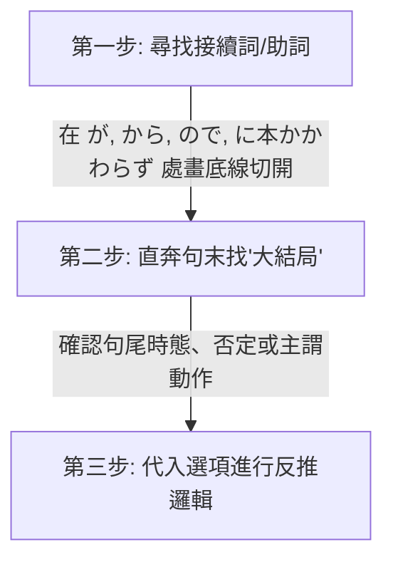
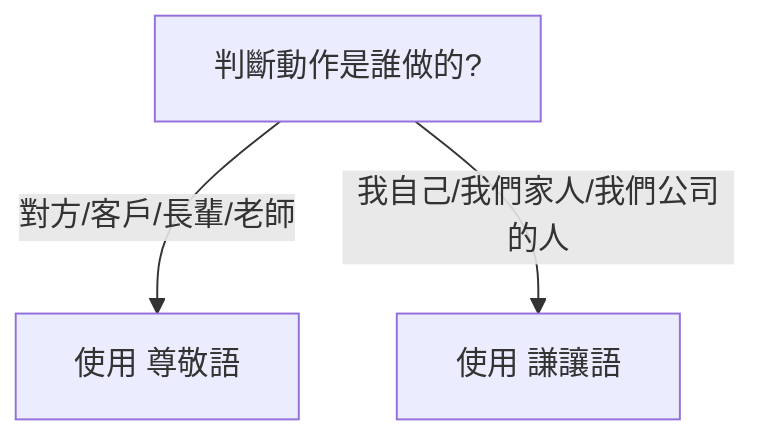

# 🌸 JLPT N2 核心備考與學習優化筆記（一）：學習策略與文法句型

本筆記已拆分為四個部分，以減少 Context 長度並提升學習效率：

1. **[第一部分：學習策略與文法句型](file:///D:/StudyJapanese/1_N2_Study_Strategy_and_Grammar.md)** (本文件)

2. **[第二部分：核心漢字與近義詞辨析](file:///D:/StudyJapanese/2_N2_Kanji_and_Synonym_Distinctions.md)**

3. **[第三部分：自他動詞與分類詞彙表](file:///D:/StudyJapanese/3_N2_Vocabulary_Bank_and_Verbs.md)**

4. **[第四部分：副詞與接續詞專項](file:///D:/StudyJapanese/4_N2_Adverbs_and_Conjunctions.md)**

---

## 🎯 個人化學習背景與備考策略 (Personalized Strategy)

> [!NOTE]

> **你的學習畫像 (Learning Profile)**：

> *   **優勢**：通過動漫、遊戲積累了良好的「語感」與「聽力直覺」，具備接近 **N3** 的潛在實力。

> *   **盲點**：從未系統性學習日語，直接挑戰 **N2**，文法地基較為薄弱。**N3 文法亦有遺漏與不扎實之處**，需要隨時回顧鞏固。

> *   **核心策略**：以 **N2 為絕對重心**（超綱詞僅作字根比對輔助，不作重點），並且在學習 N2 句型時，**主動對接並複習相關的 N3 語法**以鞏固地基。

> *   **核心教材**：《新日檢完勝對策 N2》（8 週架構） + 動漫/遊戲日常生詞積累。

### 🚀 學習優化三部曲

1.  **「單字」與「文法」雙軌並行，不要分開！**

    *   由於 N2 的字彙和文法深度綁定（很多副詞和接續詞就是文法題考點，例如 `のに` / `ので`），**不需要等整本單字背完才看文法書**。建議每天在看《完勝對策單字》的同時，翻開《完勝對策文法》的對應章節進行對照，把看不懂的接續規則隨時發在這裡，我來幫你梳理。

2.  **將「動漫/遊戲生詞」融入《完勝對策》的主題中**

    *   《完勝對策》是按**生活主題**（如：廚房、掃除、辦公室）劃分每天任務的。當你在動漫或遊戲裡看到生詞時，我會幫你把它們歸類到筆記中的相應主題表格中。這樣可以把“破碎的娛樂記憶”轉化為“系統的考試分數”。

3.  **語感轉化為文法規則**

    *   在遊戲中聽到的「口語/台詞」，往往包含複雜的語法（例如使役被動、授受關係）。遇到看不懂的台詞，隨時寫在 [note.txt](file:///D:/StudyJapanese/note.txt)，我會為你拆解背後的 N2/N3 文法邏輯。

### 📊 N2 考試核心考點與優先級分析 (Exam Priorities)

由於你是從 N3 語感直接跳考 N2，**不需要死背每一個單字**，應採取「高回報率」的策略。以下為你分析 N2 考題中各類內容的權重與筆記中的優先級標記：

#### 🔴 優先級 1：核心考點與語意理解關鍵（⚠️ 權重極高，必拿分）

*   **自他動詞**：如 `ずれる/ずらす`、`閉まる/閉める`。不僅單字會考，**聽力題**中也常考「到底是誰做了這件事」，分不清自他動詞在聽力中會被秒殺。

*   **核心漢字辨析**：如六個 `はかる`（`量る/計る/測る/圖る/謀る/諮る`）、`揃う/揃える`。常考在讀音或漢字選擇題中。

*   **敬語與謙讓語**：如 `伺う`、`拝見する`。主要考在文法選擇題 and 職場閱讀中，也是華人考生的重災區。

*   **備考策略**：**每天都要看一遍**。這部分是考試的硬性拿分點，必須熟練到反射動作的程度。

#### 🟡 優先級 2：副詞、接續詞與核心動詞（🌟 權重高，閱讀理解的靈魂）

*   **副詞與接續詞**：如 `一段と`、`常々`、`差異`。副詞常出現在單字填空題，而接續詞決定了文章的邏輯轉折，**閱讀理解（長文）的死活完全取決於你有沒有看懂接續詞**。

*   **動作與身體狀態動詞**：如 `省く`、`溜まる`、`しつける`、`綜合` 系列。這些動詞是閱讀理解中描述細節的關鍵。

*   **備考策略**：**每週複習一次**。重點在於理解其前後語意邏輯與情境接續。

#### 🟢 優先級 3：日常/電腦文書處理詞彙（📊 權重中低，混個眼熟即可）

*   **日常/生活專有名詞**：如 `小兒科`、`停留所`、`築二十年`。

*   **電腦文書詞彙**：如 `改行する` (換行)、`余白` (邊距)。

*   **備考策略**：這類詞彙主要是為了應對**「資訊檢索（通知信件、公文閱讀）」**題型。你不需要會拼寫、也不用知道它的深層字源，**只要在閱讀題中看到時能「認出」它是換行、邊距或小兒科即可**。**每兩週複習一次**即可。

---

## 📅 學習進度與每日複習建議 (Study Tracker)

> [!TIP]

> **「1-3-7-14」 遺忘曲線複習法**：

> - **第一天**：通讀本筆記中的「核心學習策略」，嘗試用「切西瓜法」分析 3 個長難句。

> - **第三天**：重點複習「自他動詞對照表」，遮住他動詞，嘗試根據畫面感寫出對應的自動詞。

> - **第七天**：複習「六大 Hakarus」與「Awases」，用它們各自造一個句子。

> - **第十四天**：快速掃視「分類詞彙表」，只看日語漢字，能在一秒內反應出讀音與畫面者過關，否則打星號標記。

>

> **💡 筆記高效複習與「紅綠燈」考試優先級管理**：

> 為了減輕備考負擔，本筆記文法與單字皆導入 **「紅黃綠」優先級標籤**。如果你時間有限，請根據以下標記進行策略性複習或選擇性放棄：

> 1.  **🔴 優先級 1：核心高頻考點 (考試必拿分！絕對不能放棄)**

>     *   **包含項目**：敬語謙讓語、自他動詞、授受關係、～がたい、限り系列、もの系列、情感表示（てならない）、雙重否定（ずにはいられない）。

>     *   **備考策略**：**每天/每兩天至少掃視一次**。這些在 N2 的文法選擇題、星星題與聽力中出題率極高，是得分的基本盤。

> 2.  **🟡 優先級 2：中頻常見考點 (星星題與長文常客，理解語意邏輯即可)**

>     *   **包含項目**：げ/がち/っぽい系列、はもとより系列、時間接續、因果與轉折。

>     *   **備考策略**：**每週複習一次**。重點在於了解前後接續和邏輯（例如是順接還是逆接），在閱讀測驗中看得懂意思、重組星星題能排對即可，不需花費大量時間死背。

> 3.  **🟢 優先級 3：低頻/偏難/冷門句型 (若覺得太難，可策略性放棄！)**

>     *   **包含項目**：實用商業告示牌與免責聲明中的行政詞彙、部分極冷門或超綱的日語古風用法（例如文法細項中的 `てかなわない` 或冷門的文書用詞）。

>     *   **備考策略**：**考前一週稍微混個眼熟即可**。如果複習時覺得難以消化，**請果斷放棄**，將時間留給 🔴 和 🟡 的核心考點，以追求最高的備考回報率。

>

> **💡 主動回想 (Active Recall) 摺疊設計**：

> *   我們在複習表中將中文釋義或讀音用 Markdown / HTML 摺疊代碼包裹，複習時遮住答案，點擊再顯現，達到自我測試的效果。

---

## 目錄 (Table of Contents)

- [💡 核心學習策略與方法論 (Methodology)](#-核心學習策略與方法論-methodology)

  - [1. 「切西瓜」長難句拆解法 (Sentence Slicing)](#1-切西瓜長難句拆解法-sentence-slicing)

  - [2. 「畫面感」字根聯想記憶法 (Visual Anchoring)](#2-畫面感字根聯想記憶法-visual-anchoring)

  - [3. 「猜字遊戲」：面對日語生詞的三大推理工具 (How to Deduce Vocabulary)](#3-猜字遊戲面對日語生詞的三大推理工具-how-to-deduce-vocabulary)

- [⚠️ 語法與句型易錯點 (Common Pitfalls)](#-語法與句型易錯點-common-pitfalls)

  - [1. 🔴 職場社交：主動請求 vs 被動請求](#1-職場社交主動請求-vs-被動請求)

  - [2. 🟡 時間接續：做完某事之後](#2-時間接續做完某事之後)

  - [3. 🟡 因果與轉折：ので vs のに](#3-因果與轉折ので-vs-のに)

  - [4. 🔴 易混淆詞彙與情境辨析 (職場與生活)](#4-易混淆詞彙與情境辨析-職場與生活)

  - [5. 🟡 實用長句拆解與語法分析 (Real-World Sentence Slicing)](#5-實用長句拆解與語法分析-real-world-sentence-slicing)

  - [6. 🟢 實用商業告示牌與免責聲明句型拆解 (Store Signs & Disclaimers)](#6-實用商業告示牌與免責聲明句型拆解-store-signs--disclaimers)

  - [7. 🔴 N2 核心文法：～がたい (難以……)](#7-n2-核心文法がたい-難以)

  - [8. 🔴 N2 核心文法與語境：限り（かぎり）、限りない（かぎりない）與 限りなく（かぎりなく）](#8-n2-核心文法與語境限りかぎり限りないかぎりない與-限りなくかぎりなく)

  - [9. 🟡 N2 核心文法與語境：げ、がち、っぽい與氣味（ぎみ）](#9-n2-核心文法與語境げがちっぽい與氣味ぎみ)

  - [10. 🔴 N2 核心文法與語境：ものなら、ものだから、もの、ものの](#10-n2-核心文法與語境ものならものだからものものの)

  - [11. 🟡 N2 核心文法與語境：はもとより、はともかく、はまだしも、は抜きにして](#11-n2-核心文法與語境はもとよりはともかくはまだしもは抜きにして)

  - [12. 🔴 N2 核心文法與語境：てたまらない、てしょうがない、てかなわない、てならない](#12-n2-核心文法與語境てたまらないてしょうがないてかなわないてならない)

  - [13. 🔴 N2 核心文法與語境：ないことはない、ないこともない、ないではいられない、ずにはいられない](#13-n2-核心文法與語境ないことはないないこともないないではいられないずにはいられない)

  - [14. 🟡 N2 核心文法與語境：ねばならない、てはならない、ていられない、てばかりはいられない](#14-n2-核心文法與語境ねばならないてはならないていられないてばかりはいられない)

  - [15. 🔴 N2 核心文法與語境：敬語（尊敬語與謙讓語）快速秒殺密技](#15-n2-核心文法與語境敬語尊敬語與謙讓語快速秒殺密技)

  - [16. 🔴 N2 核心文法與語境：～かいがあって（有價值/不負）、～てまで（甚至/不惜）](#16-n2-核心文法與語境かいがあって有價值與てまで甚至不惜)

  - [17. 🔴 N2 核心文法與語境：複合動詞接尾語（～かける、～切る、～得る、～抜く）](#17-n2-核心文法與語境複合動詞接尾語かける切る得る抜く)
  - [18. 🔴 N2 核心文法與語境：ばかり 家族（てばかりいる、たばかり、るばかりだ、ばかりに、ばかりか、んばかりに、とばかりに）](#18-n2-核心文法與語境ばかり家族てばかりいるたばかりるばかりだばかりにばかりかんばかりにとばかりに)
  - [19. 🔴 N2 核心文法與語境：～かねる（恕難……） vs ～かねない（極有可能……）](#19-n2-核心文法與語境かねる恕難-vs-かねない極有可能)
  - [20. 🔴 N2 から系列文法：～からには（既然……就） vs ～からして（單從……來看） vs ～からすると（從……推測/立場來看）](#20-n2-から系列文法からには既然就-vs-からして單從來看-vs-からすると從推測或立場來看)
  - [21. 🔴 N2 核心逆接與責難：～くせに vs ～くせして（明明……卻……）](#21-n2-核心逆接與責難くせに-vs-くせして明明卻)
  - [22. 🔴 N2 核心辨析：～ものだ vs ～ことだ（常理與義務 vs 具體建議）](#22-n2-核心辨析ものだ-vs-ことだ常理與義務-vs-具體建議)
  - [23. 🔴 N2 核心辨析：～ものだ vs ～ものがある（常理與感嘆 vs 令人……的特質）](#23-n2-核心辨析ものだ-vs-ものがある常理與感嘆-vs-令人的特質)
  - [24. 🔴 N2 核心辨析：～にも拘わらず vs ～に関わらず（儘管……卻 vs 不論……都）](#24-n2-核心辨析にも拘わらず-vs-に関わらず儘管卻-vs-不論都)
  - [25. 🔴 N2 核心文法與語境：～のももっともだ（也是理所當然的/合乎情理）](#25-n2-核心文法與語境のももっともだ也是理所當然的合乎情理)
  - [26. 🔴 N2 核心辨析：～の下で（のしたで） vs ～のもとで（の下で/の元で/の本で）](#26-n2-核心辨析の下でのしたで-vs-のもとでの下での元での本で)
  - [27. 🔴 N2 核心辨析：～に基づいて vs ～をもとにして（基於客觀基準 vs 以……為素材原料）](#27-n2-核心辨析に基づいて-vs-をもとにして基於客觀基準-vs-以爲素材原料)
  - [28. 🔴 N2 核心辨析：～というものではない vs ～だけではない/～だけでもなく（並非/不是……就一定行 vs 不僅僅是）](#28-n2-核心辨析というものではない-vs-だけではないだけでもなく並非不是就一定行-vs-不僅僅是)
  - [29. 🔴 N2 核心文法：～ところ系列大串聯（時態/差點就/一做發現/就算也/正在……時）](#29-n2-核心文法ところ系列大串聯時態差點就一做發現就算也正在時)
  - [30. 🔴 N2 核心文法與辨析：～よりほかない vs ～せざるを得ない（只能……之外別無他法 vs 不得不……）](#30-n2-核心文法與辨析よりほかない-vs-せざるを得ない只能之外別無他法-vs-不得不)
  - [31. 🔴 N2 核心文法與語境：～ようでは（如果是這種狀態的話/要是像這樣就完了）](#31-n2-核心文法與語境ようでは如果是這種狀態的話要是像這樣就完了)
  - [32. 🔴 N2 核心文法與語境：～ようではないか（讓我們一起……吧/號召與鼓舞）](#32-n2-核心文法與語境ようではないか讓我們一起吧號召與鼓舞)
  - [33. 🔴 N2 核心文法與接續：～ようか～まいか（要不要……的內心糾結與猶豫）](#33-n2-核心文法與接續ようかまいか要不要的內心糾結與猶豫)
  - [34. 🔴 N2 核心辨析：許されない vs 許されぬ vs 許されざる（現代否定 vs 古文終止 vs 古文連體）](#34-n2-核心辨析許されない-vs-許されぬ-vs-許されざる現代否定-vs-古文終止-vs-古文連體)
  - [35. 🔴 N2 核心辨析：とともに vs に伴って vs につれて vs にしたがって（隨著/伴隨著的四大「秒殺差異」）](#35-n2-核心辨析とともに-vs-に伴って-vs-につれて-vs-にしたがって隨著伴隨的的四大秒殺差異)
  - [36. 🔴 N2 核心辨析：～たとたん vs ～あげく（即時瞬間發生 vs 漫長折騰後的糟糕結果）](#36-n2-核心辨析たとたん-vs-あげく即時瞬間發生-vs-漫長折騰後的糟糕結果)
  - [37. 🔴 N2 核心辨析：～に反して vs ～反面 vs ～一方で（與預測相反 vs 同一事物兩面性 vs 兩主體對比或平行狀態）](#37-n2-核心辨析に反して-vs-反面與預測期待相反-vs-同一事物的正反兩面性)
  - [38. 🔴 N2 核心辨析：わけがない vs わけではない vs わけにはいかない（絕不可能 vs 並非/不代表 vs 礙於常理不能/必須）](#38-n2-核心辨析わけがない-vs-わけではない-vs-わけにはいかない絕不可能-vs-並非不代表-vs-礙於常理不能必須)

---

## 💡 核心學習策略與方法論 (Methodology)

### 1. 「切西瓜」長難句拆解法 (Sentence Slicing)

閱讀 N2 長難句時，不要習慣性地從左到右死譯。這會導致大腦短期記憶載荷過大，漏掉前後邏輯。請使用以下三步：

#### 💡 實戰案例分析

> **例題**：申し訳ありません。部長はちょっと（　　）おりますが、すぐ戻ると思います。

>

> 1. **切斷**：在 **が** (但是/稍微帶出後文) 處切開。

>    - 前半句：`部長はちょっと（ 空格 ）おりますが`

>    - 後半句：`すぐ戻ると思います` (我想他馬上會回來)

> 2. **找大結局**：後半句的靈魂是 **「すぐ戻る (馬上回來)」**。

> 3. **反推空格邏輯**：既然能「馬上回來」，說明人還在公司，只是暫時離開。

>    - 選項 `早退して` (早退/回家了)、`休みを取って` (請假了) 均不符合「馬上回來」的前提。

>    - 選項 `不足して` (人手不足) 搭配不通。

>    - 答案鎖定：**`席を外して` (離開一下座位)**，完美契合！

---

### 2. 「畫面感」字根聯想記憶法 (Visual Anchoring)

利用漢字字根的核心「動作畫面」來連帶記憶一長串詞彙，避免孤立背誦。

#### 🔹 典型案例 1：字尾 `込む（こむ）` —— “深深地塞入、灌注、沉浸”

*   **字根獨立用法**：

    *   **込む（こむ）** 與 **混む（こむ）**【自動詞】：這兩個詞在發音與語源上完全相同，但在現代日語的漢字書寫上有明確的分工：

        *   **混む**：專門用來表示**「擁擠、人多、混雜」**（例：`電車が混んでいる` 電車很擠。因為「混」有混雜擠在一起的畫面，這是最標準的寫法）。

        *   **込む**：專門用來表示**「進入內部、包含在內」**（例：`税込み` 含稅、複合動詞接尾詞 `～込む`）。

*   **字尾接尾詞用法（～込む）**：

    *   接在動詞連用形（去ます形）後，構成複合動詞。主要有以下 **四大核心畫面感**：

##### 1. 朝著內部進去、放入之內 (Into / Inside)

*   **書き込む（かきこむ）**：寫（書き）進去（込む） ➔ **填寫、留言、登錄數據**。

*   **飛び込む（とびこむ）**：跳（飛び）進去（込む） ➔ **跳入、飛奔進入**（例：`プールに飛び込む` 跳入泳池）。

*   **吸い込む（すいこむ）**：吸（吸い）進去（込む） ➔ **吸入、吸收**（例：`掃除機がゴミを吸い込む` 吸塵器吸入垃圾）。

*   **入れ込む（いれこむ）**：

    1.  *物理面*：放（入れ）進去（込む） ➔ **裝入、塞入**（例：`予定をカレンダーに入れ込む` 把行程塞入行事曆）。

    2.  *精神面*：把心力/感情放（入れ）得很深進去（込む） ➔ **沉迷、著迷、熱衷、傾注情感**（例：`競馬に入れ込む` 沉迷賽馬、`彼女に入れ込む` 對女友極度迷戀）。

##### 2. 徹底、深刻、持續的狀態 (Thoroughly / Deeply)

*   **思い込む（お模いこむ）**：想（思い）得太深進去了 ➔ **深信不疑、認定、誤以為**（例：`自分が正しいと思い込む` 盲目認定自己是對的）。

*   **信じ込む（しんじこむ）**：相信（信じ）得很深 ➔ **深信不疑、篤信**。

*   **落ち込む（おちこむ）**：掉（落ち）得很深進去 ➔ **情緒低落、沮喪**；或經濟**下滑、蕭條**（例：`成績が落ち込む` 成績下滑）。

*   **煮込む（にこむ）**：煮（煮）得很透、讓味道滲透進去 ➔ **燉煮、熬煮**。

##### 3. 固化、保持在原地 (Fixing / Staying)

*   **座り込む（すわりこむ）**：坐下就不起來了 ➔ **靜坐、坐著不動**（例：`道端に座り込む` 坐在路邊不走）。

*   **泊まり込む（とまりこむ）**：住下不走了 ➔ **留宿、通宵加班不回家**（例：`会社に泊まり込む` 住在公司加班）。

*   **黙り込む（だまりこむ）**：保持沉默不說話了 ➔ **陷入沉默、沉默不語**。

##### 4. 原有詞彙的延伸：

*   **振り込む（ふりこむ）**：揮動(振る)著把錢「塞入」 ➡️ **轉帳**。

*   **払い込む（はらいこむ）**：把應付款項「塞入」 ➡️ **繳納、還錢**。

*   **仕込む（しこむ）**：為了做事(仕事)而提前把材料或心力「塞入」 ➡️ **事先準備、訓練/教導徒弟或動物**（類似 `躾ける` 的畫面）。

*   **引き込む（ひきこむ）**：拉扯(引く)著塞進去 ➡️ **拉入、捲入**。

##### 🎮 覺得聯想太抽象？請直接記住 N2 / 動漫與遊戲最常出現的「這 5 個核心詞」：

1.  **落ち込む（おちこむ）**

    *   *動漫畫面*：角色頭頂有三條藍色陰影，蹲在角落畫圈圈。

    *   *含意*：**沮喪、憂鬱、心情掉進谷底**；或經濟/業績**下滑**。

    *   *例句*：`成績が落ちて、かなり落ち込んでいる。` (成績退步，現在非常沮喪。)

2.  **思い込む（おもいこむ）**

    *   *遊戲畫面*：你一直主觀認定某個角色是壞人，結果他根本是來幫你的。

    *   *含意*：**誤以為、主觀認定、深信不疑**（思維鑽牛角尖出不來）。

    *   *例句*：`彼は犯人だと思い込んでいたが、間違いだった。` (我深信他就是犯人，結果搞錯了。)

3.  **申し込む（もうしこむ）**

    *   *動漫畫面*：男主角鼓起勇氣對女主角提出交往的請求（交際を申し込む）。

    *   *含意*：**申請、報名、提出（申請/告白）**（把自己的請求送進去）。

    *   *例句*：`日本語能力試験の受験を申し込む。` (報名參加日語能力試驗。)

4.  **黙り込む（だまりこむ）**

    *   *RPG對話畫面*：對話框出現「……」，角色低下頭，氣氛陷入尷尬。

    *   *含意*：**陷入沉默、一句話也不說**（沉默的狀態固定不變了）。

    *   *例句*：`理由を聞かれて、彼は黙り込んでしまった。` (被問及理由，他便陷入了沉默。)

5.  **煮込む（にこむ）**

    *   *遊戲烹飪系統*：把各種蔬菜 and 肉類丟進大鍋裡慢火熬煮以製作料理。

    *   *含意*：**慢火燉煮、熬煮**（讓調味料和湯汁徹底滲透進去）。

    *   *例句*：`カレーを弱火でじっくり煮込む。` (用小火慢慢熬煮咖哩。)

##### 💡 額外補充：你提過的 **入れ込む（いれこむ）**

*   *聯想*：把自己的精力與熱情「全部塞進去」某個嗜好或對象中。

*   *含意*：**沉迷、熱衷、迷戀**。

*   *例句*：`彼はソシャゲ（手遊）のガチャに入れ込んでいる。` (他沉迷於手機遊戲的抽卡。)

---

#### 🔹 典型案例 2：字根 `組む（くむ）` —— “互相交叉、結合、 interlocking”

想像兩根繩子或人的雙手雙腳交織在一起的動作：

*   **腕/足を組む**：雙手抱胸 / 翹二郎腿（身體交叉）。

*   **スケジュールを組む**：把零散的時間塊「交叉拼接」在一起 ➡️ **制定/排定日程表**。

*   **コンビを組む**：兩個人緊密結合在一起 ➡️ **搭檔、組隊**。

---

### 3. 「猜字遊戲」：面對日語生詞的三大推理工具 (How to Deduce Vocabulary)

日語確實很難死記硬背，但它有一個巨大的優勢：**高度模組化**。面對不認識的 N2 甚至 N1 單字，可以利用以下三個推理工具來猜測意思：

#### 🛠️ 工具一：音讀字（漢語詞）的「積木拆字法」

音讀單字（如 `削減`, `削除`, `消去`, `排除`, `除去`）是由漢字積木拼接而成的。只要掌握個別漢字的核心畫面，就可以像拼積木一樣猜出整組詞的意思：

*   **削（さく）**：核心畫面是「拿刀去切、刮掉、削弱」。

    *   `削減` = 刮掉（削）+ 變少（減） ➔ **縮減（預算/成本）**。

    *   `削除` = 刮掉（削）+ 去掉（除） ➔ **刪除（字元/檔案/帳號）**。

*   **除（じょ）**：核心畫面是「除掉、弄走不想要的雜質或東西」。

    *   `除去` = 除掉（除）+ 拿走（去） ➔ **排除、清除（毒素/雜質）**。

    *   `排除` = 除掉（除）+ 排擠（排） ➔ **排除、排除（障礙/威脅）**。

#### 🛠️ 工具二：訓讀動詞的「字尾/接頭詞推理」

日語的純日語動詞（訓讀字，如 `～直す`, `～出す`, `～合わせ連`, `～込む`）非常規律。複合動詞的後半部分決定了**「動作的方向、狀態或性質」**：

*   **～直す（なおす）** ➔ 核心畫面是「修復、改進、重新來過」。

    *   `やり直す` = 做（やり）+ 重新來 ➔ **重做**。

    *   `見直す` = 看（見）+ 重新來 ➔ **重新考慮、複審、改觀**。

    *   `書き直す` = 寫（書き）+ 重新來 ➔ **重寫**。

*   **～出す（だす）** ➔ 核心畫面是「朝向外面、或是動作開始」。

    *   `引き出す` = 拉（引き）+ 出來 ➔ **拉出、提款**。

    *   `思い出す` = 想（思い）+ 出來 ➔ **回想起來**。

    *   `動き出す` = 動（動き）+ 出來 ➔ **開始動起來**。

*   **～合わせる（あわせる）** ➔ 核心畫面是「湊在一起、核對、對齊」 ➔ `問い合わせる`（詢問核對）、`打ち合わせる`（事前商量）。

#### 🛠️ 工具三：「名詞/擬聲詞變身動詞」的字源溯源法

日語許多三音節、四音節的訓讀動詞，通常是由**我們已經認識的基礎名詞**或**擬聲擬態詞**演變而來的。當你看到一個生詞，試著看它的前半部分：

*   **こなす** ➔ 前兩個音是 `こな`（粉） ➔ 磨成粉 ➔ 消化 ➔ **消化、搞定工作**。

*   **ずらす/ずれる** ➔ 來自副詞 `ずるずる`（滑動、拖延的擬態聲音） ➔ **偏離、挪動**。

*   **たまる/ためる** ➔ 來自 `田（た - 水田）` 或 `水たまり（水窪）` ➔ 聚水 ➔ **積攢、儲存**（如：垃圾堆積、存錢）。

*   **宿る（やどる）** ➔ 來自 `宿（やど - 旅館/客棧）` ➔ 住宿 ➔ **寄生、寄宿、懷孕**。

*   **煙る（けむる）** ➔ 來自 `煙（けむり - 煙霧）` ➔ **冒煙、煙霧濛濛**。

---

## ⚠️ 語法與句型易錯點 (Common Pitfalls)

### 1. 🔴 職場社交：主動請求 vs 被動請求

在商務日語中，主動請求對方做事與請求對方允許自己做事極易混淆，直接關係到職場禮貌。

> [!WARNING]

> *   **`～してください`** / **`ご～ください`**：**「請你做某事」**（動作發出者是**對方**）。

> *   **`～させてください`**：**「請讓我做某事」**（使役形 + ください，動作發出者是**自己**）。

*   **錯誤造句**：`スケジュールを組んだあとで、連絡させてください。`❌

    *   *誤讀意*：日程表排好之後，請**讓我**聯絡你（如果你是老闆/客戶，這樣說顯得很奇怪）。

*   **正確改法**：

    *   **平輩/一般同事**：`スケジュールを組んだあとで、連絡してください。` (排好日程後請聯絡我)

    *   **對上級/客戶（敬語）**：`スケジュールを組んだあとで、ご連絡ください。` / `スケジュールを組んでから、ご連絡ください。`

---

### 2. 🟡 時間接續：做完某事之後

表示「做完前項動作，再做後項」時：

*   **`動詞た形 + あとで`** (在...之後)

    *   注意「組む」的過去式是 `組んだ`。不要多寫促音，如 `組んだったあとで` ❌ 是錯誤的，應為 **`組んだあとで`** ⭕。

*   **`動詞て形 + から`** (自從...以後 / 緊接著做...)

    *   **`スケジュールを組んでから、ご連絡ください。`**

---

### 3. 🟡 因果與轉折：ので vs のに

這兩個詞非常容易因為只差一個字而混淆：

*   **`ので`（表示客觀因果）**：相當於 `から`，表示「因為前者的緣故，所以導致了後者的客觀結果」。語氣比 `から` 更柔和客氣。

*   **`のに`**：

    1.  **表示轉折（明明……卻）**：`一生懸命勉強したのに、不合格だった。` (明明拼命學了，卻沒考過)。

    2.  **表示目的/用途（為了……）**：當後面接 `使う` (使用)、`必要` (必要)、`かかる` (花費時間/金錢) 等詞時。

        *   `この仕事をするのに1時間かかる。` (為了做這工作需要花1小時)。

---

### 4. 🔴 易混淆詞彙與情境辨析 (職場與生活)

#### 💡 辨析 1：轉勤（転勤） vs 派遣（派遣）

*   **句型**：`大阪支社から（転勤）してきました、田中と申します。` (我叫田中，是從大阪分公司調職過來的。)

*   **為什麼不能用「派遣」？**

    *   **転勤（てんきん）**：指**「同一家公司內部，不同分公司/部門之間的調職、轉勤」**。你依然是這家公司的正式員工，所以說「從大阪分公司（支社）調職過來」非常自然。

    *   **派遣（はけん）**：指**「派遣（外包）員工」**。派遣員工的雇主是「派遣公司（派遣会社）」，被派到客戶公司工作。

        1.  *文法問題*：`派遣する` 是他動詞「派遣某人」，自我介紹時應使用被動形 `派遣されてきました`。

        2.  *情境問題*：派遣通常是從「派遣公司」派來，而不是從「大阪分公司（支社）派遣過來」。

#### 💡 辨析 2：離席（席を外す） vs 讓座（席を譲る）

*   **為什麼「バスで老人に席を外した」是錯誤的？**

    *   **席を外す（せきをはずす）**：指**「暫時離開座位/辦公桌（一會兒就回來）」**。這張辦公桌或座位的**所有權依然是你的**，你只是人暫時不在。

        *   *例句*：`課長の鈴木は今、席を外しております。` (鈴木課長現在暫時離開座位了 ➔ 他還在上班，等一下就回座位)。

    *   **席を譲る（せきをゆずる）**：指**「讓座、把座位讓給別人（轉交所有權）」**。

        *   *例句*：`バスで老人に席を譲った。` (在公車上讓座給老人 ➔ 正確 ⭕)。

---

### 5. 🟡 實用長句拆解與語法分析 (Real-World Sentence Slicing)

在你提供的 [note.txt](file:///D:/StudyJapanese/note.txt) 中有以下兩句經典的日檢及日常實用句子，我們使用**「切西瓜閱讀法」**來為你逐一拆解：

#### 💡 句子 1：再配送須知（快遞/物流常用提示）

> **ご連絡を頂きました時間によっては、当日の再配達ができない場合がございます。**

> *(原文 `できない場合はございます` 應為商務日語的 `場合がございます`，在此作標準語法拆解。)*

*   **切西瓜分段拆解**：

    1.  **ご連絡を頂きました** ➔ **主動聯絡的動作（對象是「您」）**

        *   `頂きました` 是 `もらう` 的謙讓語，字面是「我們承蒙您給予聯絡」，這是日本商家對顧客的客氣說法。

    2.  **時間によっては** ➔ **文法考點：`～によっては` (根據……而有所不同)**

        *   表示前項的「時間」會決定後面的結果。

    3.  **当日の再配達ができない** ➔ **當天無法重新配送**

        *   `再配達（さいはいたつ）`：在日本，如果快遞員送貨上門時你不在家，他會留下一張「不在聯絡票」，你需要聯絡他們重新投遞。

    4.  **場合がございます** ➔ **文法考點：`～場合がある / ～ことがあります` (有時會出現……的情況)**

        *   用在商務或委婉口氣中，比直接說 `できません` (不行) 更客氣。

*   **整句中文大意**：**「根據您聯絡我們的時間不同，有時候可能會出現當天無法重新配送的情況。」**

*   *備考策略*：遇到 N2 的資訊檢索題（閱讀最後一題，通常是快遞單或廣告），這句話非常關鍵，代表「如果聯絡得太晚，今天就拿不到包裹了」。

---

#### 💡 句子 2：工作分配說明（辦公室/班級常用語）

> **今お配りしたプリントに作業の分擔が書いてあります。**

*   **切西瓜分段拆解**：

    1.  **今お配りした** ➔ **文法考點：`お + 動詞連用形 + した / する` (謙讓語，我為您做某事)**

        *   `配る（くばる）` (分發) 去掉 `る` 接上 `お...した` 變成 `お配りした`，表示「我發（給各位）的」。

    2.  **プリントに** ➔ **講義/資料上**

        *   `プリント`：源自英文 Print，在日本指學校或公司開會發的**單張講義、印好的資料**。

    3.  **作業の分担が** ➔ **工作的分配/分工**

    4.  **書いてあります** ➔ **文法考點：`動詞て形 + あります` (表示人有意施加的動作所留下來的既存狀態)**

        *   這裡的動作是「寫（書く）」，`書いてあります` 表示「上面已經寫好了（你現在能看到這個寫好的狀態）」。

*   **整句中文大意**：**「剛剛發給各位的講義上，有寫著工作的分配。」**

*   *備考策略*：這句話在 N2 聽力的第一大題（課題理解）非常常考，聽到這句話，接下來的題目通常就會問你「接下來某個人要負責做什麼工作」。

---

#### 💡 句子 3：垃圾郵件的煩惱

> **迷惑メールが何通も届いて困っている。**

*   **「切西瓜」分段拆解**：

    1.  **迷惑メールが** ➔ **垃圾郵件（主語）**

        *   **`迷惑（めいわく）`**：給人添麻煩、困擾（N2 核心字彙）。`迷惑メール` 即垃圾郵件、騷擾信件。

    2.  **何通も** ➔ **好幾封 / 許多封**

        *   **`通（つう）`**：信件、郵件的計量計數詞（N2/N3 常考量詞）。

        *   `何 + 量詞 + も` 表示「好幾次/好幾件」，起強烈強調數量多之意。

    3.  **届いて** ➔ **寄到、送達**

        *   動詞 **`届く（とどく）`** (自動詞，寄達/傳遞) 的て形，表示原因或前後連貫。

    4.  **困っている** ➔ **感到困擾、為難**

        *   動詞 `困る（こまる）` (自動詞) 的正在進行/持續狀態。

*   **整句中文大意**：**「好幾封垃圾郵件接連寄達，真讓人感到困擾。」**

*   *備考策略*：這句話常用於模擬真實生活或辦公室日常中的困擾描述。在 N2 聽力中，聽到 `困っている` 往往是「問題解決/對策題」的起點。

---

#### 💡 句子 4：商務邀請與客氣拜訪 (常見於官網或店面告示)

> **お近くにお越しの際は是非お立ち寄りください。**

*   **「切西瓜」分段拆解**：

    1.  **お近くに** ➔ **附近、這附近（敬語美化語）**

        *   `近く（ちかく）` 前面加上 `お` 表示客氣禮貌。

    2.  **お越しの際は** ➔ **文法考點：`お越し` (「來/去」的尊他敬語) + `の際は` (在……的時候)**

        *   `お越しになる` 是 `來/去` 的敬語。

        *   `～の際（さい）` 是比 `～のとき` 更正式、更莊重的書面語，意為「在……之際 / 當……之時」。

    3.  **是非** ➔ **務必、一定要**

        *   副詞 **`是非（ぜひ）`**，後接請求或願望，起強烈推薦、懇請之意。

    4.  **お立ち寄りください** ➔ **文法考點：`お + 立ち寄り + ください` (敬語：請您順道前來)**

        *   動詞 **`立ち寄る（たちよる）`**：順道前來、順路拜訪（指去主要目的地途中，順便到某個地方待一下）。

        *   `立ち寄り` 是 `立ち寄る` 去掉 `る` 的連用形，加上 `お...ください` 尊他敬語。

*   **整句中文大意**：**「如果您來到這附近時，請務必順道前來坐坐。」**

*   *備考策略*：這句話是日本店家、企業或朋友發出邀請時的「黃金社交客套話」。在 N2 聽力的職場對話或信件閱讀中極其高頻，代表「隨時歡迎光臨」。

---

#### 💡 句子 5：職場職責與詞彙選擇 (任務 vs 事務)

> **会社の経理（事務）を担当しています。**

*   **「切西瓜」分段拆解**：

    1.  **会社の経理** ➔ **公司的財務/會計**

        *   `経理（けいり）` 指公司的財務會計工作。

    2.  **（事務）を担当** ➔ **負責……事務**

        *   **`事務（じむ）`**：日常行政、辦公室文書處理（日常性、重複性的工作）。「經理事務」是固定搭配。

        *   **`任務（にんむ）`**：上級給予的特定、重大、必須完成的使命（如：國防任務、機密任務）。一般日常會計工作不會用「任務」來形容，除非是極其特殊的秘密使命。

        *   `担当する（たんとうする）`：擔任、負責。

    3.  **しています** ➔ **正在從事（狀態持續）**

*   **整句中文大意**：**「我目前負責公司的財務會計事務。」**

*   *備考策略*：這是一道經典的詞彙選擇題。在 N2 考試中，常考 `事務` 與 `任務`、`義務`、`職務` 的差別。記住：常規辦公室文書行政工作，一律用 **`事務（じむ）`**；重大使命才用 **`任務（にんむ）`**。

---

### 6. 🟢 實用商業告示牌與免責聲明句型拆解 (Store Signs & Disclaimers)

在日本生活、旅遊，或者在 N2 的閱讀理解「資訊檢索」中，常常需要看懂商店、洗衣店的提示牌與免責聲明。我們來拆解你提供的兩句非常地道、實用的告示牌句子：

#### 💡 句子 1：洗衣店/寄物處的溫馨提示

> **ポケットの中に忘れ物がないか点検してからお出し下さい。**

*   **「切西瓜」分段拆解**：

    1.  **ポケットの中に忘れ物がないか** ➔ **口袋裡有沒有遺留物品**

        *   `忘れ物`：遺漏的東西、忘記拿走的東西。

        *   `～ないか`：表示**「是否……」**的疑問（有沒有……）。

    2.  **点検してから** ➔ **檢查之後再……**

        *   `点検する`：檢查、點檢。

        *   `～てから`：表示動作的先後順序（先做前項，再做後項）。

    3.  **お出し下さい** ➔ **文法考點：`お + 動詞連用形 + ください` (敬語：請您做某事)**

        *   `出す` (拿出來/交給我們) 去掉 `す` 加上 `お...ください` 變成 `お出しください`（請拿出來/請交給我們）。

*   **整句中文大意**：**「請檢查口袋中是否有遺留物品後，再交給我們。」**

*   **實用場景**：常出現在洗衣店（送洗衣服前需清空口袋）或飯店前台寄放行李處。

---

#### 💡 句子 2：店家的免責聲明（非常重要！）

> **お引き取りがなく、1ヶ月以上経過した品物は責任を負いかねます。**

*   **「切西瓜」分段拆解**：

    1.  **お引き取りがなく** ➔ **若沒有前來領取**

        *   `引き取り（取件、領回）`：動詞 `引き取る` 的名詞化，前面加 `お` 敬語化。

    2.  **1ヶ月以上経過した品物は** ➔ **且經過了一個月以上的物品**

        *   `経過する（けいかする）`：時間流逝、經過。

    3.  **責任を負いかねます** ➔ **文法考點：`動詞連用形 + かねます` (很難…… / 無法……)**

        *   **`～かねます`** 是 N2 重點語法，用來表示**「主觀上很難做到，因此委婉拒絕/否定」**。在日本服務業中，店家絕對不會生硬地說 `できません` (我們不能)，而是用 `負いかねます` (恕難承擔)。

        *   `負う（おう）`：承擔、背負（責任、受傷等）。

*   **整句中文大意**：**「若未前來領回，且逾期一個月以上的物品，本公司恕不承擔保管責任。」**

*   **實用場景**：洗衣店、行李寄存處、失物招領處等。如果逾期未取，物品丟失或損壞，商家依法不予賠償。

---

#### 💡 句子 3：垃圾收集處的分類提示 (ゴミ集積所)

> **ダンボールはひもでしばって、お出してください。**

> **紙パックは洗って、開いて平らにしてしばってください。**

*   **「切西瓜」分段拆解**：

    1.  **ダンボールは** ➔ **紙箱/紙板（主體）**

        *   `ダンボール`：源於英文 Corrugated cardboard，日語特指**瓦楞紙箱、紙板**。

    2.  **ひもでしばって** ➔ **用繩子綁起來**

        *   `ひも` (繩子) + `で` (使用工具/方式)。

        *   `しばって`：動詞 **`縛る（しばる）`** (捆綁、束縛) 的て形。

    3.  **お出してください** ➔ **請拿出來（丟垃圾）**

        *   **`お + 動詞連用形 + ください`** 尊他敬語，請對方做某事。`出す` (丟出/拿出) 變成 `お出しください`。

    4.  **紙パックは洗って** ➔ **紙盒/紙包裝（牛奶盒等）要清洗後**

        *   `紙パック（かみぱっく）`：飲料紙盒（如牛奶盒）。

    5.  **開いて平らにして** ➔ **剪開、壓平**

        *   `開いて（ひらいて）`：動詞 `開く（ひらく）` (展開、剪開) 的て形。

        *   `平らにして`：形容動詞 **`平ら（たいら）`** (平坦、扁平) + `にする` (使動，使其變平)。

    6.  **しばってください** ➔ **再綁起來**

*   **整句中文大意**：**「紙箱請用繩子捆綁後再丟出。紙盒包裝請先清洗、剪開壓平後，再捆綁丟棄。」**

*   **實用場景**：日本社區的「垃圾收集處（ゴミ集積所）」。日本垃圾分類極其嚴格，紙箱與紙餐盒必須分別處理，若不壓平綁好，清潔隊會拒收。

---

### ### 7. 🔴 N2 核心文法：～がたい (難以……)

在你的學習記錄中提到了 `～し難い（しがたい）`，這確實是 N2 語法考試的**必考常客**！

#### 💡 文法解析

*   **接續**：**`動詞連用形（去 ます 形）+ がたい`**

*   **字義**：表示**「很難做某事 / 難以做某事」**。

*   **核心語感與畫面**：

    *   這並非指「物理上無法做到」（如：沒有工具所以不能做），而是指**「心理上、情感上、道義上或常識上「極難接受或抗拒去做」**（Psychologically or morally impossible/difficult）。

    *   主語通常是第一人稱大腦或情感的活動（如：信じる、理解する、許す、動かす）。

#### 🔹 考試超高頻搭配（直接記住這 4 個黃金詞）：

1.  **信じがたい（しんじがたい）**：難以置信。

    *   *例句*：`彼が嘘をついたなんて、信じがたい。` (他居然撒謊了，真是令人難以置信)。

2.  **許しがたい（ゆるしがたい）**：難以原諒。

    *   *例句*：`犯人の行為は極めて許しがたい。` (犯人的行為極其難以原諒)。

3.  **理解しがたい（りかいしがたい）**：難以理解。

    *   *例句*：`彼の不可解な行動は、理解しがたい。` (他那令人費解的行為，實在難以理解)。

4.  **言い表しがたい（いいあらわしがたい）**：難以言喻 / 難以用言語表達。

    *   *例句*：`あの時の感動は、言葉では言い表しがたい。` (那時的感動，實在是難以用言語表達)。

#### ⚠️ 易混淆辨析：～がたい vs ～にくい vs ～づらい

這三個在中文都翻譯成「難以……」，但在日語中有本質上的差異：

| 句型 | 難以度類型 | 核心畫面與例句 |

| :--- | :--- | :--- |

| **～がたい** | **心理/主觀難以做到** | · 信じがたい（心理上無法相信） · 物理上可以相信，但理智或情感「抗拒相信」。 |

| **～にくい** | **物理/客觀難以做到** | · このペンは書き**にくい**（這筆不好寫 ➔ 筆的物理屬性導致不好寫） · この字は読み**にくい**（這字不好讀 ➔ 字跡遺漏） |

| **～づらい** | **肉體痛苦/尷忑難以做到** | · 喉が痛くて話し**づらい**（喉嚨痛說話很難受） · 相手に直接は言い**づらい**（當面跟對方說感覺很尷尬） |

*   **補充詞彙對照**：

    *   **難い / 難しい（むずかしい）**【形】：困難的。

    *   **易しい（やさしい）**【形】：簡單的、容易的。

---

### 8. 🔴 N2 核心文法與語境：「限り（かぎり）」家族大召集（全 8 種變種與中文語境配對）

`限り` 源自於動詞 **`限る（かぎる - 劃定界線、限制）`**。在地上畫一條「界線（Boundary Line）」，就是它的核心畫面。

日檢 N2 非常喜歡考 `限り` 的各種文法變種，它們雖然都長得很像，但透過不同的接續與結尾，表現出截然不同的**時間界限、空間範圍、主觀限制或情緒極限**。

---

> [!NOTE]
> 💡 **「限り」家族 8 大變種與中文語境配對表**
> 
> | 語法變種 | 核心接續 | 中文配對語境 (Nuance) | 記憶鉤子與底層視覺 |
> | :--- | :--- | :--- | :--- |
> | **1. ～限り（は）** | 動詞/形 簡體 N + である | **「只要……就一直……」** | 只要不踏出這條界線，後面的狀態就一直成立。 |
> | **2. ～限りでは** | 認知動詞 (知る/調べる) | **「據我所知/所查的範圍內」** | 在我的視線/情報界線之內，事實是如此。 |
> | **3. ～に限る** | N / V-る / V-ない | **「最好是…… / 莫過於……」** | 這是唯一的界線，它是最完美的選擇（主觀強烈建議）。 |
> | **4. ～に限らず** | N | **「不僅限於……（連其他也是）」** | 劃分的界線沒用，界線內外的東西都包括在內。 |
> | **5. ～に限り / に限って** | N | **「唯獨…… / 偏偏……」** | 專門在這條界線上挑出一個例外（優待、倒楣或絕對信任）。 |
> | **6. ～を限りに** | 表示時間/狀態的名詞 | **「以……為限（最後一次/截止）」** | 把這條線當成終點線，從此告一段落或終止。 |
> | **7. ～ない限り** | V-ない形 | **「除非……否則就……」** | 如果不越過這條必備的界線，後面的結果就不會發生。 |
> | **8. ～限りだ** | 情感形容詞 (い/な) | **「無比的…… / 真是……極了」** | 情感已經頂到了界線的最高峰（極限狀態）。 |

---

### 🔍 「限り」家族 8 大變體逐一詳解

#### 💡 1. ～限り（は） —— 「只要在……界線內，就一直……」
*   **語境**：表達「只要前項的狀態持續（不超越這條界線），後半句的狀態就必定會一直維持下去」。
*   **接續**：動詞・形容詞普通形 / 名詞 + である + 限り（は）
*   *例句*：
    *   `生きている**限り**、君の恩は忘れません。` (只要我還活著（在活著的界線內），就絕不忘記你的恩情。)
    *   `不健康な生活をしている**限り**、病気は治りません。` (只要還過著不健康的生活，病就不會好。)

#### 💡 2. ～限りでは —— 「就我所……的範圍內（據我所知）」
*   **語境**：表示「在我所擁有的資訊、調查或所見所聞的『有限界線』內，我得出後面的判斷」。後半句多為判斷或事實。
*   **常接動詞**：`知っている` (知道)、`調べた` (調查)、`見た` (看到)、`聞いた` (聽到)。
*   *例句*：
    *   `私が知っている**限りでは**、彼はそんなことをする人ではありません。` (就我所知，他絕不是會做出那種事的人。)
    *   `警察が調べた**限りでは**、不審な点は見つからなかった。` (就警方調查的範圍內，並未發現可疑點。)

#### 💡 3. ～に限る（にかぎる） —— 「最好是…… / 莫過於……」
*   **語境**：說話者基於個人經驗或主觀判斷，認為**「某人事物是當下最完美的解決方案（沒有比這更好的了）」**。
*   **接續**：名詞 / 動詞連體形（原形、ない形） + に限る
*   *例句*：
    *   `風邪を引いた時は、温かくして早く寝る**限る**。` (感冒的時候，最好是保暖並早點睡覺。)
    *   `夏のビールは、冷えている**限る**。` (夏天的啤酒，莫過於冰鎮的了。)

#### 💡 4. ～に限らず（にかぎらず） —— 「不僅限於…… / 不僅……連……也」
*   **語境**：表示「不單單只有前項，連範圍之外的其他事物也一樣適用」。類似於 `～だけでなく`。
*   **接續**：名詞 + に限らず
*   *例句*：
    *   `このアニメは、子供**に限らず**大人にも人気がある。` (這部動漫不僅限於小孩，連大人也很受歡迎。)
    *   `最近は女性**に限らず**、男性も化粧品を使うようになってきた。` (最近不僅限於女性，連男性也開始使用化妝品了。)

#### 💡 5. ～に限り / ～に限って —— 「唯獨…… / 偏偏……」
這個語法在不同的語境下有三種截然不同的考點：
*   **A. 唯獨/僅限（特別優待與限制）**：`～に限り`
    *   `本日**に限り**、全商品半額セールを行います。` (僅限今天，所有商品進行半額促銷。)
*   **B. 偏偏碰上（無奈、倒楣的時機）**：`～に限って`
    *   `傘を持っていない**限って**、雨が降る。` (偏偏在沒帶傘的時候，雨就落下來了。)
*   **C. 絕對信任的例外**：`～に限って`
    *   `あの彼**に限って**、そんな嘘をつくはずがない。` (唯獨他，絕對不可能撒那種謊。)

#### 💡 6. ～を限りに —— 「以……為限 / 最後一次 / 到……截止」
*   **語境**：將某個時間點（如今天、今年、這次）或狀態當作最後的「邊界線」，從此之後該事情終止或發生重大改變。
*   **接續**：名詞（通常是時間、期限） + を限りに / を限りとして
*   *例句*：
    *   `今日**を限りに**、タバコをやめることにした。` (以今天為限，我決定戒菸。➔ 今天是最後一天抽菸。)
    *   `声を**限りに**叫んだ。` (用盡喉嚨的極限（聲嘶力竭地）呼喊。➔ 實體力量的極限。)

#### 💡 7. ～ない限り —— 「除非……否則就……」
*   **語境**：表示「如果前面必備的條件（界線）不達成，後面的結果就絕對無法實現」。
*   **接續**：動詞ない形 + 限り / 名詞 + でない限り
*   *例句*：
    *   `本人が諦め**ない限り**、まだ可能性はある。` (除非他本人放棄，否則就依然有可能性。)
    *   `特別の理由が**ない限り**、欠席は認められません。` (除非有特別理由，否則不允許缺席。)

#### 💡 8. ～限りだ —— 「無比…… / ……極了」（情感的最高極限）
*   **語境**：表示說話者的主觀情感（如高興、悲傷、遺憾、羨慕）達到了頂點。
*   **接續**：表示情感的形容詞（い形/な形） + 限りだ
*   *例句*：
    *   `こんな素晴らしい賞をいただき、光栄な**限りだ**。` (能得到這麼棒的獎，真是光榮極了。)
    *   `長年可愛がっていたペットが亡くなり、悲しい**限りだ**。` (疼愛多年的寵物過世了，真是悲痛無比。)

---

#### 🌟 專項練習：排列組合星星題 (Scrambled/Star Questions)

*   `生きている [限り] [★あなたの] [恩は] [忘れません]` (只要我還活著，就絕不忘記你的恩情。)
*   `私が [知っている] [★限りでは] [彼は] [犯人ではない]` (據我所知，他並非犯人。)
*   `風邪を [引いた] [時は] [★早く寝る] [限る]` ➔ `風邪を [引いた] [ときは] [★早く] [寝るに限る]` (感冒的時候，最好是早點睡覺。)
*   `今日 [を] [★限りに] [タバコを] [やめる]` (以今天為限，我戒菸。)
*   `謝ら [ない] [限り] [★絶対に] [許さない]` (除非他道歉，否則我絕對不原諒。)

---

### 9. 🟡 N2 核心文法與語境：げ、がち、っぽい與氣味（ぎみ）

這四個文法都與**「傾向、外觀、狀態」**有關，但它們的接續規則、語氣以及使用場景有很大區別。我們可以將它們的核心概念對照如下：

---

#### 💡 1. げ —— 接尾詞：「看起來好像……的樣子」 (外觀與神情)

*   **核心視覺**：**從他人的表情、態度或外觀「感覺到」某種情緒**。

*   **文法結構**：

    *   形容詞-い（去い） + **げ** （如：`悲しげ`、`嬉しげ`）

    *   形容詞-な（去な） + **げ** （如：`不安げ`、`得意げ`）

    *   **特殊/固定用法**：

        *   `よい` ➔ `よさげ` (看起來不錯)

        *   `ない` ➔ `なさげ` (看起來沒有)

        *   動詞/名詞結合：`ありげ` (好像有)、`言いたげ` (好像想說什麼)

*   **使用限制**：主要用於**第三人稱**，多用於文學作品或書面語。通常接在表示感情、感覺的詞後。

*   *例句*：

    *   `男は意味**ありげな**笑いを浮かべた。` (那名男子露出了別有深意（意味深長）的笑容。)

    *   `彼女は悲し**げな**表情で窓的外を見つめていた。` (她帶著悲傷的神情注視著窗外。)

    *   `彼は自信**ありげに**スピーチを始めた。` (他一副自信滿滿的樣子開始了演講。)

---

#### 💡 2. がち —— 接尾詞：「容易……、經常……」 (負面的頻率與傾向)

*   **核心視覺**：**某個負面、不好的動作或狀態「發生頻率很高」**。

*   **文法結構**：

    *   動詞-ます形（去ます） + **がち** （如：`遅れがち`、`休みがち`、`忘れがち`）

    *   名詞 + **がち** （如：`病気がち`、`曇りがち`、`留守がち`）

*   **使用限制**：幾乎都用於**不好、不想要**的事情或傾向。

*   *例句*：

    *   `この時計は20年使っているが、このごろ遅れ**がち**だ。` (這支手錶已經用了20年，最近常常走慢。)

    *   `一人暮らしの自炊は、野菜が不足し**がち**だ。` (單身一人住的自炊生活，往往容易蔬菜攝取不足。)

    *   `彼は最近、仕事を休み**がち**だ。` (他最近經常請假不來上班。)

---

#### 💡 3. っぽい —— 接尾詞：「像……似的、多……的」 (本質屬性、多此特質)

*   **核心視覺**：**某物具有極強的某種感覺或傾向（多半是口語、帶點貶義）**。

*   **文法結構**：

    *   名詞 + **っぽい** （如：`子供っぽい` - 幼稚、`男っぽい` - 男人氣概、`水っぽい` - 水汪汪/稀薄）

    *   形容詞-い（去い） + **っぽい** （如：`安っぽい` - 廉價感、`白っぽい` - 偏白）

    *   動詞-ます形（去ます） + **っぽい** （用於性格傾向，如：`怒りっぽい` - 易怒、`飽きっぽい` - 三分鐘熱度）

*   **使用限制**：口語色彩濃厚。常指「雖然本質不是那樣，但看起來/感覺上卻很像那樣」（例如明明是大人卻「子供っぽい」），或指個人的性格特質。

*   *例句*：

    *   `あの人は怒り**っぽい**が、本当は優しい人だ。` (那個人雖然容易發脾氣（易怒），但其實是個溫柔的人。)

    *   `このスープは水**っぽい**。` (這碗湯水分太多（淡得像水一樣）。)

    *   `その服はデザインが安**っぽい**。` (那件衣服的設計看起來很廉價。)

---

#### 💡 4. 気味（ぎみ） —— 接尾詞：「稍微有點……、有……的趨勢」 (主觀感受的身心狀態)

*   **核心視覺**：**目前或最近的身體、心理狀態「稍微偏向」某種不好轉變**。

*   **文法結構**：

    *   動詞-ます形（去ます） + **気味** （如：`遅れ気味`、`疲れ気味`、`太り気味`）

    *   名詞 + **気味** （如：`風邪気味`、`緊張気味`、`寝不足気味`）

*   **使用限制**：強調的是**「現在/最近」**主觀感覺到的輕微狀態或變化趨勢，且多為不好的狀態。

*   *例句*：

    *   `最近、疲れ**気味**なので、早く寝ることにしている。` (最近稍微有點疲憊，所以我決定早點睡覺。)

    *   `電車が少し遅れ**気味**で、遅刻するかと焦った。` (火車稍微有點延誤，我急得以為要遲到了。)

    *   `彼女は風邪**気味**だ。` (她稍微有點感冒（有感冒跡象）。)

---

#### 📌 「遅れがち」 vs 「遅れ気味」 的語境辨析

*   **遅れがち** (負面傾向/頻率高)：強調**「發生的頻度很高、反覆出現」**。比如 20 年的舊手錶，經常性地會慢下來，這是一種長期的重複傾向。

*   **遅れ気味** (現在/最近的稍微狀態)：強調**「目前這一次/這陣子稍微慢了」**。比如平時很準的火車，今天因為某種原因「稍微慢了點」。

---

#### 📌 四者接續與語境對比總整理

| 句型 | 接續方式 | 核心語境與含意 | 典型搭配例句 |

| :--- | :--- | :--- | :--- |

| **～げ** | Adj-い/な去尾、あり/なし | **外觀神情**：看起來……（多用於他人與文學） | 意味**ありげな**笑い (別有深意的笑容) |

| **～がち** | V-ます形、Noun | **負面傾向/頻率高**：容易發生、常常會…… | 風邪をひき**がち**だ (經常容易感冒) |

| **～っぽい** | Noun、Adj去尾、V-ます形 | **特質屬性/易怒**：像……、容易……（口語貶義） | 子供**っぽい** (幼稚) / 怒り**っぽい** (易怒) |

| **～気味** | V-ます形、Noun | **身心微小變化**：稍微有點……（現在/最近） | 風邪**気味**だ (稍微有點感冒) |

---

#### 🌟 專項練習：排列組合星星題 (Scrambled/Star Questions)

為了加強你的星星題弱點，以下為你整理了結合本單元文法的排列組合題目。這些題目已被編譯進系統的「排列組合星星題特訓」模式：

*   `男は [意味] [ありげな] [★笑いを] [浮かべた]` (那名男子露出了別有深意的笑容。)

*   `この時計は [20年も] [使っている] [★せいか] [遅れがちだ]` (或許是因為用了20年之故，這支手錶最近常常走慢。)

*   `合格 [★したくて] [たまらない] [からこそ] [頑張る]` (正因為極度渴望合格，所以才要努力。)

*   `彼女は [悲しげな] [表情を] [★浮かべて] [うつむいた]` (她帶著悲傷的神情低下了頭。)

*   `怒り [★っぽい] [彼が] [怒らないのは] [珍しい]` (易怒的他居然沒發脾氣，真是稀奇。)

*   `風邪 [★気味で] [頭が] [痛いので] [帰ります]` (因為有點感冒頭痛，所以我先回去了。)

---

### 10. 🔴 N2 核心文法與語境：ものなら、ものだから、もの、ものの

這組文法都是以名詞 **`もの`（人、物、事物的本質/理所當然）** 為核心延伸出來的句型。它們在日文的日常口語與書面表達中出現頻率極高，但語氣與語境截然不同。

---

#### 💡 1. ～ものなら —— 「如果可以的話」（希望渺茫） / 「要是做了的話」（警告/威脅）

`ものなら` 根據前面接續動詞的形態，有兩種完全相反的含意：

##### 🔹 用法 A：能力上的假設 ➔ 「如果能做到（但實際上很難或不可能）」

*   **文法結構**：**動詞可能形（できる、帰れる等）** + **ものなら**

*   *例句*：

    *   `できる**ものなら**、もう一度人生をやり直したい。` (如果能做得到的話（雖然不可能），真想重新來過一次人生。)

    *   `帰れる**ものなら**、今すぐ国に帰りたい。` (如果回得去的話（雖然走不開），真想現在馬上回國。)

##### 🔹 用法 B：意志/行為上的假設 ➔ 「要是敢做（壞事）的話，就……」（警告、威脅、後果嚴重）

*   **文法結構**：**動詞意向形（V-よう）** + **ものなら**

*   *例句*：

    *   `そんなことをし**ようものなら**、大変なことになるぞ。` (你要是敢做出那種事情，後果可就嚴重了。)

    *   `授業中に居眠りをし**ようものなら**、先生にひどく怒られる。` (要是敢在課堂上打瞌睡，會被老師狠狠責罵。)

---

#### 💡 2. ～ものだから / ～ものですから —— 「因為……嘛」（主觀的藉口、致歉）

*   **核心視覺**：當自己做錯事或處於尷尬狀態時，用來**「向對方解釋主觀的個人原因或藉口」**，帶有**抱歉、希望對方諒解**的語氣。

*   **文法結構**：普形（名詞/Adj-な + **な**） + **ものだから / ものですから**

    *   *註：`ものですから` 是其禮貌/敬體形式。*

*   *例句*：

    *   `上着を着たままですみません。寒い**ものですから**。` (很抱歉我就這樣穿著外套。因為實在是太冷了（請原諒我）。)

    *   `遅れてすみません。事故で電車が止まってしまった**ものだから**。` (抱歉我遲到了。因為發生事故火車停開了（不是我故意遲到的）。)

##### ⚠️ 辨析：寒い「ものですから」 vs 「からですもの」

*   **寒いものですから** (正確)：這是標準的 N2 文法，表示「因為太冷了，所以...（表示歉意或委婉解釋）」。

*   **からですもの** (錯誤/不自然)：`～もの / ～もん` 雖然可以放在句尾表原因（多為女性或小孩口語），但通常接在普形後面（如 `寒いんだもん`）。`～からですもの` 結構極不自然，且在對旁人說 `すみません`（抱歉/不好意思）的禮貌情境下，使用 `からですもの` 會顯得語氣過於撒嬌、幼稚，與後半句的禮貌語氣相衝突。

---

#### 💡 3. ～もの / ～もん —— 「因為……嘛」（口語撒嬌、找藉口）

*   **核心視覺**：多用於**小孩子或女性的日常口語**，用來任性、撒嬌或理直氣壯地為自己辯護。

*   **文法結構**：普形 + **もの / もん**（常以 `だもん`、`んだもん` 形式出現）

*   *例句*：

    *   `「どうして食べないの？」「だって、美味しくないんだ**もん**。」` (「為什麼不吃？」「因為就不好吃嘛！」)

    *   `一人で行くのは嫌だ。怖いんだ**もの**。` (我不要一個人去，因為人家會怕嘛。)

---

#### 💡 4. ～ものの —— 「雖然……但是……」（客觀事實的轉折）

*   **核心視覺**：**「雖然前項是事實，但後項卻出現了不一致/未達預期的結果」**。屬於偏向**書面語、正式**的客觀陳述。

*   **文法結構**：普形（名詞 + **である** / Adj-な + **な/である**） + **ものの**

*   *例句*：

    *   `学校は休まずに行っている**ものの**、授業にはついていけない。` (雖然沒缺課每天都去學校，但功課根本跟不上。)

    *   `免許は持っている**ものの**、一度も車を運転したことがない。` (雖然持有駕照，但一次也沒有開過車。)

---

#### 📌 深度辨析：ものの、けれど、のに 有什麼不同？

雖然這三者都可以翻成「雖然……但是……」，但它們的**語感、感情色彩與使用情境**有很大的差別：

| 詞彙 | 詞性/體裁 | 中文直譯 | 核心語意與感情色彩 | 實戰案例對照 |

| :--- | :--- | :--- | :--- | :--- |

| **けれど (けど)** | 口語/書面皆可 | 雖然…… | **中性轉折**。最普通、最廣泛的對比，也可以單純做為說話的語氣鋪墊（無強烈衝突）。 | 買いたい**けれど**、お金がない。 (想買，但沒錢。) |

| **のに** | 口語/情感強烈 | 居然…… / 卻…… | **主觀情緒強烈**。帶有**生氣、抱怨、遺憾、不可置信**等情緒。後項通常是違背常理的事。 | 勉強した**のに**、不合格だった。 (明明那麼努力讀書了，**居然**還不及格！（生氣/遺憾）) |

| **ものの** | 書面語/客觀正式 | 雖然說……但…… | **客觀事實對照**。沒有主觀的埋怨，僅單純陳述「前項事實成立，但後項實際情況卻不理想」的客觀矛盾。 | 契約はした**ものの**、不安が残る。 (雖然簽了約，但仍感到不安。(客觀陳述)) |

---

#### 🌟 專項練習：排列組合星星題 (Scrambled/Star Questions)

*   `学校は [休まずに] [行っている] [★ものの] [授業には] ついていけない` (雖然沒缺課每天都去學校，但功課跟不上。)

*   `できる [★ものなら] [今すぐ] [国に] [帰りたい]` (如果能辦得到的話，真想現在馬上回國。)

*   `遅れて [すみません] [事故が] [あった] [★ものですから]` (抱歉我遲到了，因為路上發生了事故。)

---

### 11. 🟡 N2 核心文法與語境：はもとより、はともかく、はまだしも、は抜きにして

這組文法都與**「排除、對比、優先順序判定」**有關，常用於說明事物的重要性排列或條件排除。

---

#### 💡 1. ～はもとより……も —— 「不單是……，連……也」（當然如此）

*   **核心視覺**：**「A 是理所當然、不言而喻的事實，而程度更高的 B 也是如此」**。這是偏向**書面、正式**的說法。

*   **文法結構**：名詞 + **はもとより** + 名詞 + **も / まで / 甚至**

    *   *同義詞：`～はもちろん`（較為口語與普及）*

*   *例句*：

    *   `この製品は、日本国内**はもとより**海外でも広く知られている。` (這件產品不但在日本國內（理所當然），在海外也廣為人知。)

    *   `彼女は英語**はもとより**、フランス語もペラペラだ。` (她英文就不用說了，連法文也講得很流利。)

---

#### 💡 2. ～はともかく（として） —— 「暫且不談……」（後項更重要）

*   **核心視覺**：**「把 A 暫且擱置在一旁不討論，重點是要強調後項的 B」**。表示不糾結於 A 的好壞對錯，目前有更迫切或更重要的主體 B 需要關注。

*   **文法結構**：名詞 + **はともかく（として）**

*   *例句*：

    *   `味**はともかく**、見た目はとても美味しそうだ。` (味道暫且不談（不論好不好吃），外觀看起來倒是很好吃。)

    *   `彼が行くか**どうかはともかく**、私たちは予定通り出発しよう。` (他去不去暫且不論，我們照計劃出發吧。)

---

#### 💡 3. ～はまだしも / ～ならまだしも —— 「……的話還說得過去，但是……」

*   **核心視覺**：**「A 雖然也不好，但稍微容忍一下還能勉強接受；可是 B 簡直是完全無法原諒 / 更加糟糕」**。

*   **文法結構**：名詞 / 普形（動詞/Adj假定形 + なら） + **まだしも**

*   *例句*：

    *   `10分の遅刻**ならまだしも**、1時間も遅れるなんて許せない。` (遲到10分鐘的話還說得過去（還能原諒），但遲到一整小時簡直不可原諒。)

    *   `一度の失敗**ならまだしも**、何度も同じ間違いを繰り返すのは困る。` (一次失敗還勉強說得過去，但好幾次重複同樣的錯誤就令人困擾了。)

---

#### 💡 4. ～は抜きにして / ～を抜きにして（は） —— 「排除…… / 沒有……的話」

這裡需要詳細區分口語日常點餐的 `抜きで` 與 N2 正式句型 `抜きにして / 抜きにしては`：

##### 🔹 用法 A：トマト【ぬきで】（日常點餐排除某物）

*   **文法結構**：名詞 + **抜きで**

*   *例句*：

    *   `ハンバーガーはトマト**ぬきで**お願いします。` (漢堡請幫我**去番茄**（不要加番茄）。)

    *   `わさび**抜きで**寿司を握ってください。` (壽司請幫我做去哇沙比的。)

##### 🔹 用法 B：～を抜きにして / ～を抜きにしては（如果排除……就無法……）

*   **文法結構**：

    *   名詞 + **を抜きにして（は）** + **後項（否定/無法進行）**

    *   名詞 + **を抜きにして** + **動詞**

*   *例句*：

    *   `この計画は彼**を抜きにしては**、進められない。` (這個計劃如果**排除他（沒有他）**，就無法進行。)

    *   `冗談**は抜きにして**、真面目に今後の進路について話し合おう。` (我們**撇開**玩笑**不談**（不開玩笑了），認真討論一下未來的出路吧。)

---

#### 🌟 專項練習：排列組合星星題 (Scrambled/Star Questions)

*   `この計画は [彼を] [★抜きに] [しては] [進められない]` (這個計劃如果沒有他，就無法進行。)

*   `味は [ともかく] [★見た目は] [とても] [綺麗だ]` (味道暫且不談，外觀看起來非常漂亮。)

*   `10分の [遅刻なら] [★まだしも] [1時間も] [遅れるなんて許せない]` (遲到10分鐘還說得過去，但遲到一個小時無法原諒。)

*   `日本国内は [もとより] [★海外でも] [広く] [知られている]` (不但在日本國內，在國外也廣為人知。)

---

### 12. 🔴 N2 核心文法與語境：てたまらない、てしょうがない、てかなわない、てならない

這四個文法都表示**「非常……、……得不得了 / 受不了」**，用來加強某種身體感覺、情感或狀況的程度。但它們背後的「語意由來」與「使用限制」有很大不同。

---

#### 💡 1. ～てたまらない —— 「……得受不了 / 忍不住」（生理/主觀強烈慾望）

*   **字面視覺**：源自動詞 **`堪える（こらえる - 忍耐）`** ➔ `たまらない`（無法忍受）。

*   **核心語境**：表示生理上的痛覺、強烈慾望或強烈的主觀情感，已經**「到了無法忍耐的極限」**。通常用於第一人稱。

*   **文法結構**：V-て形 / Adj-くて / Adj-で + **たまらない**

*   *例句*：

    *   `虫歯が痛く**てたまらない**。` (牙齒痛得受不了（無法忍受的痛）。)

    *   `彼女に会い**たくてたまらない**。` (想見她想得不得了（強烈慾望）。)

    *   `合格できるかどうか、心配で**たまらない**。` (能不能合格，我擔心得不得了。)

---

#### 💡 2. ～てしょうがない / ～てしかたがない —— 「……得沒辦法」（無奈/無法控制）

*   **字面視覺**：源自 **`仕様がない / 仕方がない`** ➔ 沒有任何辦法、無濟於事。

*   **核心語境**：表示某種情感或身體狀態太過強烈，說話者**「沒有辦法去克制或改變這個狀態」**。比起 `たまらない` 更有「無可奈何、不知如何是好」的感覺。`しょうがない` 多用於口語。

*   **文法結構**：V-て形 / Adj-くて / Adj-で + **しょうがない / しかたがない**

*   *例句*：

    *   `今日は暇で**しょうがない**。` (今天閒得發慌（無可奈何地閒）。)

    *   `ゲームに負けて、悔しく**てしょうがない**。` (輸了遊戲，懊惱得不得了（無法控制懊惱的感覺）。)

---

#### 💡 3. ～てかなわない —— 「……得受不了 / 帶來極大困擾」（抱怨語氣）

*   **字面視覺**：源自動詞 **`敵う（かなう - 匹敵、抵擋）`** ➔ `かなわない`（無法抵擋、招架不住）。

*   **核心語境**：用於**「抱怨外界環境或他人帶來的困擾」**。表示某個不好的狀況太嚴重了，自己「招架不住、吃不消」。

*   **文法結構**：V-て形 / Adj-くて / Adj-で + **かなわない** (常接在否定或麻煩事後)

*   *例句*：

    *   `隣の部屋がうるさく**てかなわない**。` (隔壁房間吵得受不了（對我造成極大困擾，吃不消）。)

    *   `こんなに毎日暑く**てはかなわない**。` (每天都這麼熱，真是吃不消。)

---

#### 💡 4. ～てならない —— 「禁不住…… / 不由得……」（內心感情自然湧出）

這是你在 note.txt 中著重提出疑問的文法，以下是深度解析：

##### ❓ 疑難排解 A：`ならない` 不是「辦不成」或「不可以」的意思嗎？

沒錯，`ならない` 單獨使用時是 `なる`（成為/成功）的否定形。但在 **`～てならない`** 的固定文法中，它指的是：**「情感、感覺自然而然地湧現，『無法控制（成不了事）』它，無法讓自己回到平靜的狀態。」**

* 字面視覺：`て`（處於某狀態） + `ならない`（無法停下、無法平息） ➔ **「處於某種情感中，且完全無法克制它」**。

##### ❓ 疑難排解 B：為什麼是 `残念でならない`，而不是 `残念でいます`？

*   **`残念でいます` 是文法錯誤**。在日語中，`～ています` 不能接在形容動詞的 `で` 後面。如果一定要表示狀態，必須寫成 `残念に思っています`（正覺得遺憾）。

*   然而，`残念に思っています` 只是客觀地說「我現在覺得遺憾（平淡的事實說明）」。

*   **`残念でならない`** 則代表**「遺憾得不得了，這種遺憾的情感完全無法克制地從心底湧上來」**。在親友婚禮無法出席的重要場合，這種強烈的自責與無奈，必須用 `残念でならない` 才能傳達其百倍的心意。

##### ❓ 疑難排解 C：`気になってならない` 與 `気になっています` 有何不同？

*   `気になっています` ➔ **中性的客觀狀態**：「我最近滿在乎這件事的（偶爾想到）」。

*   `気になってならない` ➔ **極度焦慮、無法克制**：「我現在非常非常擔心，焦慮到坐立難安，大腦完全無法克制不去想它（不由自主地極度擔心）」。

*   **文法接續**：常搭配**「自然湧出的情感、感覺、想法動詞」**。

    *   *常見搭配*：`気がしてならない`（不由得覺得）、`思えてならない`（不由得認為）、`残念でならない`（無比遺憾）、`気になってならない`（無比擔心）、`悔しくてならない`（懊惱不已）。

*   *例句*：

    *   `いい夢を見ると、何かいいことが起こりそうな気がし**てならない**。` (當做了好夢，不由得會覺得好像有什麼好事要發生。)

    *   `親友の結婚式に出席できないのが、残念で**ならない**。` (無法出席好友的婚禮，我感到無比遺憾（遺憾之情難以平息）。)

    *   `検査の結果が気になっ**てならない**。` (體檢的結果讓我擔心得不得了（不由自主地焦慮）。)

---

#### 📌 四者情感語境與出發點總整理

| 句型 | 情感來源 | 字面含意 | 核心語意與感情色彩 | 典型例句 |

| :--- | :--- | :--- | :--- | :--- |

| **～てたまらない** | 生理 / 主觀願望 | 無法忍耐 | **生理痛覺或強烈慾望**。痛得受不了、想做某事想得不得了。 | 会いたくて**たまらない** (極度想見) |

| **～てしょうがない** | 主觀情緒 | 沒有辦法 | **無法克制的情感**。沒辦法控制這個情緒，感到無可奈何。 | 悔しくて**しょうがない** (懊惱得不行) |

| **～てかなわない** | 外界干擾 | 無法匹敵 / 招架不住 | **抱怨外界帶來的麻煩**。太吵、太熱，對我造成極大困擾。 | うるさくて**かなわない** (吵得吃不消) |

| **～てならない** | 內心深處 | 無法控制平息 | **不由自主地湧出**。書面正式，常接感覺、情感或猜測。 | 気になって**ならない** (無比擔心) |

---

#### 🌟 專項練習：排列組合星星題 (Scrambled/Star Questions)

*   `いい夢を見ると、[何か] [いいことが] [★起こりそうな] [気がして] ならない` (當做了好夢，不由得會覺得好像有什麼好事要發生。)

*   `隣の [部屋が] [うるさくて] [★かなわない] [から] 部屋を変えてほしい` (隔壁房間吵得受不了，所以我希望換房間。)

*   `彼女に [会いたくて] [★たまらない] [が] [今は] 会えない` (想見她想得不得了，但現在見不到。)

*   `暇で [しょうがない] [★ので] [ゲームでも] [しよう]` (閒得發慌沒事做，所以來玩遊戲吧。)

*   `検査の [結果が] [気になって] [★ならない] [から] 早く知りたい` (非常擔心體檢結果，想快點知道。)

---

### 13. 🔴 N2 核心文法與語境：ないことはない、ないこともない、ないではいられない、ずにはいられない

這組文法包含了日語中非常經典的**「雙重否定」**結構。雙重否定在日語中並不等於直接的強烈肯定，而是帶有**「保留、委婉妥協」**或**「情感上無法自拔的無奈」**。

---

#### 💡 1. ～ないことはない —— 「不是不…… / 並非不……」（勉強/妥協的肯定）

*   **核心語境**：雙重否定表肯定，但語氣相當**勉強、保留**。通常用於「被旁人詢問時，不情願地承認某事可行」，或者是「在特定條件下才可以做到」。

*   **文法結構**：動詞-ない形 / 形容詞-くない / 名詞+ではない + **ことはない**

*   *例句*：

    *   `納豆は食べられない**ことはない**が、あまり好きではない。` (納豆我不是不能吃（要我吃是可以），但不是很喜歡。)

    *   `お酒は飲まない**ことはない**ですが、すぐに赤くなります。` (酒我不是不喝，但一喝臉就會變紅。)

---

#### 💡 2. ～ないこともない —— 「也不是不…… / 並非不可能」（更委婉、希望渺茫）

*   **核心語境**：與 `ないことはない` 意思相同，但因為加了 `も`，語氣**比 `ことはない` 更加猶豫、更為保留**。隱含著「如果真的拼盡全力或在極端情況下，或許還有一絲可能性」。

*   **文法結構**：接續相同 + **こともない**

*   *例句*：

    *   `行きたくないが、行こうと思えば行けない**こともない**。` (雖然不想去，但如果真的要去的話，也不是去不了。)

    *   `毎日練習すれば、弾けるようにならない**こともない**。` (如果每天練習的話，也不是沒有學會彈奏的可能（但可能很難）。)

##### ⚠️ 實戰辨析：行こうと思えば「行ける」還是「行けない」？

*   **行けないこともない** (正確)：字面是「不（行けない）是不能去（こともない）」➔ **「可以去」**。

*   **行けることもない** (錯誤/不自然)：字面是「不是能去」➔ **「不能去」**。

*   這題的語境是「雖然不想去，但真的要去的話『也可以去（雙重否定）』」，因此必須使用否定詞 `行けない` 來搭配 `こともない`，形成雙重否定。

---

#### 💡 3. ～ないではいられない / ～ずにはいられない —— 「忍不住…… / 不能不……」（情感/生理的強烈衝動）

*   **字面視覺**：`いられない` ➔ 不能維持原本的狀態。`ないで / ずに` ➔ 不做某事。

*   **核心語境**：表示因為內心受到極大的情感、生理衝動刺激，**「理智無法克制，忍不住一定要做這件事」**。主語通常是第一人稱。

*   **文法結構**：

    *   動詞-ない形 + **ないではいられない** （如：`泣かないではいられない`）

    *   動詞-ず形 + **にはいられない** （如：`泣かずにはいられない`，*注意：`する` ➔ `せずにはいられない`*）

*   *例句*：

    *   `彼の話を聞くと、誰もが笑わ**ずにはいられない**だろう。` (聽了他的話，任誰都會忍不住笑出來吧。)

    *   `この悲しいニュースを聞いて、泣かない**ではいられない**。` (聽到這個悲傷的消息，我情不自禁地流下淚來。)

##### 💡 額外對比辨析：「～ないではいけない」 vs 「～ないではいられない」

這兩個句型長得極像，但結尾的 **`いけない`** 與 **`いられない`** 代表了截然不同的邏輯：
*   **`～ないではいけない`（規則與義務）**：
    *   **邏輯**：`いけない`（不行、不對）。「如果不做某事就不行」➔ **「必須做 / 不能不做」**。
    *   **語境**：強調遵守**法規、社會規矩、道德或邏輯上的必然義務**。
    *   *例句*：`学生は勉強し**ないではいけない**。` (學生必須學習。➔ 這是義務/規矩。)
*   **`～ないではいられない`（內心衝動）**：
    *   **邏輯**：`いられない`（無法維持現狀）。「無法處在不做的狀態」➔ **「忍不住要做 / 情不自禁」**。
    *   **語境**：強調**心理上、情感上或生理上無法克制**。
    *   *例句*：`ケーキを見ると、食べ**ないではいられない**。` (看到蛋糕就忍不住想吃！➔ 這是生理/心理衝動，非義務。)

---

#### 📌 深度辨析：「～ずにはいられない」 vs 「～ざるを得ない」

這兩個文法在中文裡都可以翻成「不得不 / 忍不住」，但在日文的**「動機來源」**上有極大的差別，是日檢非常愛考的經典對比：

| 句型 | 動機來源（因為什麼而不得不？） | 情感色彩 | 實戰案例對照 |

| :--- | :--- | :--- | :--- |

| **～ずにはいられない** | **內心深處的情感 / 生理衝動** | **情不自禁**。自己內心太感動、太好笑或太悲傷，理智控制不住。 | 悲しい映画を見て、泣かずにはいられない。 (看悲傷電影，忍不住哭出來。(內心情感)) |

| **～ざるを得ない** | **外界環境的壓力 / 社會責任與現實** | **無奈妥協**。自己其實不想做，但因為現實不允許，只好妥協。 | 規則だから、罰金を払わざるを得ない。 (因為是規則，不得不交罰金。(現實妥協)) |

---

#### 🌟 專項練習：排列組合星星題 (Scrambled/Star Questions)

*   `たくさんは無理だが、一日に [４つ] [なら] [★覚えられない] [ことも] ない` (雖然多量是不可能的，但如果一天記4個的話，也並非記不住。)

*   `行きたくないが、行こうと思えば [★行けない] [ことも] [ない] [よ]` (雖然不想去，但如果真的要去的話，也不是去不了。)

*   `彼の話を聞くと、[★笑わず] [には] [いられない] [だろう]` (聽了他的話，大家都會忍俊不禁吧。)

*   `この悲しいニュースを [聞いて] 、 [★泣かない] [では] [いられない]` (聽到這個悲傷的消息，我情不自禁地流下淚來。)

*   `たばこを吸わないでは [いられない] [という人に] [たばこの危険性を] [★注意せずには] いられない` (對於那些不得不吸菸的人，我不得不警告他們吸菸的危險性。)

---

### 14. 🟡 N2 核心文法與語境：ねばならない、てはならない、ていられない、てばかりはいられない

這組文法都是日語中非常核心的**「義務、禁止與狀態限制」**文法。這章的接續和語意細微差別較多，是許多考生的盲點。以下為你梳理最簡單的「秒殺訣竅」：

---

#### 💡 1. ～ねばならない —— 「必須…… / 不做不行」（書面義務）

*   **秒殺訣竅**：它就是 **`～なければならない`** 的古文/書面語寫法。

    *   `ねば` ➔ 古文的「如果不……的話」。

*   **文法結構**：**動詞 ない形 (去ない) + ねばならない**

    *   *例*：`持つ` ➔ `持たない` ➔ **`持たねばならない`**

    *   *特別注意：`する` ➔ **`せねばならない`** (特異變形，必考！)*

*   *例句*：

    *   `國民は、もう少し政治に関心を**持たねばならない**。` (國民必須對政治再多關心一點。)

    *   `自分の行動には責任を**持たねばならない**。` (必須對自己的行為負責。)

---

#### 💡 2. ～てはならない —— 「絕對不可以…… / 禁止……」（正式禁止）

*   **秒殺訣竅**：它就是 **`～てはいけない`** 的正式書面/法律規章寫法。

    *   多用於法律、社會規範、長輩對晚輩的嚴厲訓誡。

*   **文法結構**：**動詞 て形 + はならない**

    *   *例*：`犯す` ➔ **`犯してはならない`**

*   *例句*：

    *   `法律を**犯してはならない**。` (絕對不可觸犯法律。)

    *   `他人のプライバシーを侵害し**てはならない**。` (絕對不可以侵害他人的隱私。)

---

#### 💡 3. ～ていられない —— 「無法繼續（處於某狀態 / 做某事）」

*   **秒殺訣竅**：`て形` + `いる` (處於某狀態) + `られる` (能力) + `ない` (否定) ➔ **「在當前環境下，無法繼續維持這個狀態」**。

    *   常因為「時間緊急、生理無法承受、或外界壓力」，導致你**無法傻傻地繼續做這件事**。

*   **文法結構**：**動詞 て形 + いられない**

    *   *口語常用縮略形：`～ていられない` ➔ **`～てらんない`** (如：`やってらんない` 受夠了、做不下去了)*

*   *例句*：

    *   `風が強くって、立っ**ていられない**ほどです。` (風太大，到了**無法維持站立（站不住）**的程度。)

    *   `もうじっ**としていられない**（じっとしてらんない）。` (我已經**坐不住了 / 無法保持安靜不動**了。（因焦慮或緊急情況）)

---

#### 💡 4. ～てばかりはいられない —— 「不能一直光是……（必須採取行動）」

*   **秒殺訣竅**：`てばかりいる` (光是做某事、不做別的) + `はいられない` (無法繼續) ➔ **「雖然我很想這樣，但迫於時間或局勢，我不能一直傻傻地只做這件事了，必須動起來！」**。

*   **文法結構**：**動詞 て形 + ばかりはいられない**

*   *例句*：

    *   `先輩に**聞いてばかりはいられない**。自分でできるようにならないよ。` (不能一直光是問前輩。否則自己永遠不會獨立喔。)

    *   `もう子供ではないのだから、親に**甘えてばかりはいられない**。` (既然已經不是小孩子了，就不能一直光是依賴父母。)

---

### 📝 note.txt 實戰錯題逐題詳解

#### Q1. 國民應多關心政治

* `国民は、もう少し政治に関心を（持た）ねばならない。`

* **解析**：`ねばならない` 的接續是「動詞ない形去尾」。動詞 `持つ` 的ない形是 `持たない`，去尾後是 `持た`，因此接成 `持たねばならない`。

#### Q2. 不能光是問前輩

* `先輩に（聞いて）ばかりはいられない。`

* **解析**：這個文法結構是 `～てばかりはいられない`（不能一直光是做某事）。動詞 `聞く` 的て形是 `聞いて`，所以是 `聞いてばかりはいられない`。

#### Q3. 風大到站不住

* `風が強くって、立って（いられない）ほどです。`

* **解析**：風太大，導致「立っている（站著這個狀態）」無法維持（能力否定），所以是 `立っていられない`。而 `立ってならない` 是無意義的語法錯誤。

#### Q4. 絕對不可違法

* `法律を（犯しては）ならない。`

* **解析**：法律是禁止事項，要用嚴厲禁止的 `～てはならない`（絕對不可）。動詞 `犯す` 的て形為 `犯して` ➔ `犯してはならない`。而 `犯せばならない` 語意不通。

#### Q5. 為什麼不能安靜坐好？

* `そっちへ行っちゃだめ。動かないで。どうして、じっと（してらんないの）`

* **解析**：對話是「不要去那裡，不要動。你為什麼就是**無法保持安靜坐好**？」

  * `じっとする`（安靜不動）的狀態無法維持 ➔ `じっとしていられない`。

  * `してらんない` 是 `していられない` 的口語縮略形，所以選 `してらんないの`。

  * 另一個選項 `してんの` 是 `しているの`（你在安靜坐好嗎？），與前文「不要動」的責備邏輯完全相反。

---

#### 🌟 專項練習：排列組合星星題 (Scrambled/Star Questions)

*   `恥ずかしくて [聞いて] [いられない] [★ような] [話を] 彼らは大声でしている` (他們在大聲說著一些令人尷尬得聽不下去的話。)

*   `国民は [もう少し] [政治に] [★関心を] [持たねばならない]` (國民必須對政治再多一點關心。)

*   `先輩に [聞いて] [★ばかりは] [いられない] [から] 自分でやる` (不能一直光是問前輩，要自己動手。)

*   `風が [強くって] 、 [★立って] [いられない] [ほどだ]` (風好大，簡直站不住了。)

*   `法律を [★犯しては] [ならない] [ことになって] [いる]` (法律是有規定絕對不可以觸犯的。)

---

### 15. 🔴 N2 核心文法與語境：敬語（尊敬語與謙讓語）快速秒殺密技

敬語之所以難學，是因為中文裡沒有對應的動詞系統。但只要記住這個終極核心密碼，敬語就只是一道簡單的邏輯題：

> **「這句話的動作，到底是『誰』做的？」**

---

#### 💡 第一步：判斷動作執行者

*   **A. 動作是「對方」做的 ➔ 【尊敬語】** (抬高對方以示尊敬)

*   **B. 動作是「自己」做的 ➔ 【謙讓語】** (壓低自己以示尊敬)

---

#### 💡 第二步：代入公式模組

##### 🌟 1. 尊敬語（對方的動作）三大公式

*   **公式一**：`お + V-ます形 (去ます) + になる`

    *   *例*：`書く` ➔ **`お書きになる`** (您寫)

*   **公式二**：`ご + N-する (去する) + になる`

    *   *例*：`紹介する` ➔ **`ご紹介になる`** (您介紹)

*   **公式三**：動詞被動形 `V-(ら)れる`

    *   *例*：`話す` ➔ **`話される`** (您說)

*   *特殊專屬動詞（必背）*：`いらっしゃる` (您在/去/來)、`召し上がる` (您吃/喝)、`ご覧になる` (您看)、`おっしゃる` (您說)、`なさる` (您做)

##### 🌟 2. 謙讓語（我自己的動作）三大公式

*   **公式一**：`お + V-ます形 (去ます) + する / 申し上げる`

    *   *例*：`持つ` ➔ **`お持ちする`** (我幫您拿) / `お祝い申し上げる` (我向您祝賀)

*   **公式二**：`ご + N-する (去する) + する / 申し上げる`

    *   *例*：`紹介する` ➔ **`ご紹介申し上げる`** (我為您介紹)

*   **公式三** (極高頻！代表「請容許我做某事」)：**`V-使役形-て + いただく`**

    *   *例*：`休む` ➔ `休ませる` ➔ **`休ませていただく`** (請容許我休息 / 我就請假了)

*   *特殊專屬動詞（必背）*：`伺う` (我拜訪/去/來/問)、`拝見する` (我看（對方的東西）)、`いただく` (我吃/喝/收到)、`申し上げる` (我說)、`存じる` (我知道/想)、`いたす` (我做)

---

### 📝 note.txt 敬語實戰錯題詳解

#### Q1. 介紹我的家人

* `私の家族をご紹介（申し上げます）。父と母です。それから……`

* **解析**：

  * **第一步：誰介紹？** 是「我」要介紹我自己的家人。

  * **第二步：用什麼語？** 動作由「我」執行，必須用**謙讓語**。

  * **第三步：篩選選項**：

    * `になります` (ご紹介になります) ➔ `ご～になる` 是**尊敬語**。若選這個，意思會變成「客戶/您介紹我的家人」，邏輯混亂。

    * `いただきます` (ご紹介いただきます) ➔ 意思是「我得到您介紹我家人」的恩惠（還是對方在介紹），語意不符。

    * `申し上げます` (ご紹介申し上げます) ➔ `ご～申し上げる` 是**謙讓語**（我謙虛地向您報告/介紹）。完美契合，故為正確答案。

#### Q2. 因為感冒請假休息

* `すみませんが、風邪気味なので休ませて（いただきます）。`

  * *註：note.txt 中的 `休ませで` 為 `休ませて` 的筆誤。*

* **解析**：

  * **第一步：誰休息？** 是「我」要請假休息。

  * **第二步：用什麼語？** 「我」的動作，要用謙讓語。

  * **第三步：篩選公式**：

    * 日文在向主管、老師請假或表示自己要採取某個動作時，最常用且最禮貌的謙讓表達是：**`V-使役形-て + いただきます`**（請容許我做某事 / 我就承蒙您的特許做了某事）。

    * `休む` ➔ 使役形為 `休ませる` ➔ 加上 `ていただきます` ➔ **`休ませていただきます`**。這是最得體、最有禮貌的請假句型。

---

#### 🌟 專項練習：排列組合星星題 (Scrambled/Star Questions)

*   `私の家族を [ご紹介] [★申し上げます] [。父と] [母です。]` (我來介紹我的家人。這是我的父親和母親。)

*   `風邪をひいた [ので] 、 [★休ませて] [いただきます] [。]` (因為感冒了，所以容我請假休息。)

*   `先生、この [資料を] [★拝見しても] [よろしい] [でしょうか]` (老師，我可以看一下這份資料嗎？)

*   `お客様、何に [お決めに] [★なりました] [でしょうか] [。]` (顧客，請問您決定好要點什麼了嗎？)

---

### 16. 🔴 N2 核心文法與語境：～かいがあって（有價值/不負）、～てまで（甚至/不惜）

在你的學習記錄中提到了 `～かいがあって`、`～かいもなく`、`～がい`，以及 `～てまで / ～まで～て`，這兩組文法是 N2 考試中**非常核心且容易混淆的句型**！

---

#### 💡 1. ～かい（があって） / ～かいもなく —— 「有……的效果（不負……）」/「白費……（徒勞無功）」

*   **接續**：

    *   **`動詞 た 形 + かい（があって / もなく）`**

    *   **`名詞 + の + かい（があって / もなく）`**

*   **字義**：

    *   **～かいがあって**：表示努力、等待或採取某行動之後，**「得到了應有的回報、不負期望、有了好效果」**。

    *   **～かいもなく**：表示雖然付出了努力或採取了行動，但**「結果卻是徒勞無功、毫無效果，感到十分遺憾」**。

*   *例句*：

    *   `一生懸命に勉強した**かいがあって**、N2に合格した。`

        (不負我拼命努力讀書（有讀書的價值），終於考過了N2！)

    *   `厳しい訓練の**かいがあって**、大会で優勝できた。`

        (不負嚴格的訓練，終於在比賽中獲得了冠軍。)

    *   `手術の**かいもなく**、愛犬は亡くなってしまった。`

        (雖動了手術卻沒起作用（白費了手術），愛犬還是去世了。)

---

#### 💡 2. ～がい —— 接尾詞：「有做某事的心理價值、成就感」

*   **接續**：**`動詞連用形（去 ます 形） + がい`**

    *   *註：因為是接尾詞，會產生濁音化（kai ➔ gai）。常構成固定詞彙：`やりがい` (工作成就感)、`生きがい` (人生的意義/活著的價值)、`作りがい` (做的價值)。*

*   **字義**：表示進行該動作時，**「內心感受到的心理回報、樂趣或成就感」**。

*   *例句*：

    *   `やり**がい**のある仕事。` (有挑戰性/做起來有成就感的工作。)

    *   `教え**がい**がある生徒。` (教起來很有成就感的學生（因為學生很認真或進步很快）。)

##### ⚠️ 深度辨析：V-た + かいがある vs V-ます + がいがある

這兩個詞在中文都翻成「有價值」，但考試考接續時是「秒殺考點」：

| 句型 | 接續方式 | 核心語意與出發點 | 實戰案例對照 |

| :--- | :--- | :--- | :--- |

| **～かいがある** | **動詞た形** / **名詞 + の** | 強調動作後的**「具體好結果/實質回報」**。 | この本は買った**かいがある**。 (買這本書很值得 ➔ 內容實際對我有幫助。) |

| **～がいがある** | **動詞連用形（去 ます）** | 強調動作本身的**「精神滿足感、成就感」**。 | この本は読み**がいがある**。 (這本書值得一讀 ➔ 內容深奧，讀起來有挑戰樂趣。) |

---

#### 💡 3. ～てまで / ～までして —— 「甚至不惜…… / 居然到了……的地步」（驚訝與批判）

*   **接續**：**`動詞 て 形 + まで（して）`** 或 **`名詞 + まで（して）`**

*   **字義**：表示**「為了達到某種目的，居然不惜採取極端的、不尋常的手段」**。

*   **核心語感**：說話者通常對此行為抱持**「驚訝、反對、批判或不解」**的態度（認為沒有必要做到這個極端的地步）。

*   *例句*：

    *   `借金し**てまで**（借金までして）高級車を買う必要はない。`

        (沒有必要**不惜借錢**也要買高級名車。)

    *   `体を壊し**てまで**働くことはない。`

        (沒有必要**不惜搞壞身體**也要工作。)

    *   `嘘をつい**てまで**言い訳をするのは見苦しい。`

        (甚至不惜撒謊來找藉口，真是太難看了。)

##### 📌 延伸用法：名詞 + まで —— 「連……都 / 甚至連……也」

表示將極端的例子納入範圍，相當於 `～さえ`。

*   *例句*：

    *   `犯人は、顔**まで**変えて逃げ続けた。`

        (犯人甚至**連**臉都改變了（去整容）而持續逃亡。)

    *   `親友に**まで**騙されるとは思わなかった。`

        (我沒想到甚至**連**死黨都會欺騙我。)

---

### 📝 note.txt 實戰錯題逐題詳解

#### Q1. 大家都說好吃，做菜就很有成就感

* `おいしいおいしいと食べてくれると、料理も（作り）がいがある。`

  *(註：note.txt 中寫 `がいがる` 應為 `がいがある` 的筆誤。)*

* **解析**：

  * **第一步：看句尾結構**：句尾是 `がい構造がある`（這是一個接尾詞）。前面必須接動詞連用形（去 ます 形）。

  * **第二步：判斷詞性接續**：動詞 `作る` 的去ます形是 `作り`。因此接成 `作りがいがある`（表示做菜的成就感與心理回報）。而 `作った` 是た形，若要接 `かい` 則必須是獨立名詞 `作ったかいがある`，故不選。

#### Q2. 犯人甚至整容來逃亡

* `犯人は、顔（まで）変えて逃げ続けた。`

* **解析**：

  * **第一步：理解句意**：犯人改變了「臉（顔）」來持續逃亡。這是一個非常極端的行為。

  * **第二步：篩選語法**：

    * `名詞 + まで` 表示「連……都/甚至連……也」，代入 `顔まで変えて` 意為「甚至連臉都改變了（整容）」，完全契合語境。

    * `までに` 表示時間截止（在……之前，如 `5時までに`），與改變臉部特徵的語境完全無關。

---

#### 🌟 專項練習：排列組合星星題 (Scrambled/Star Questions)

*   `おいしいと [食べて] [くれると] [★料理も] [作りがいが] ある` (大家都說好吃的話，做菜也很有價值。)

*   `犯人は [顔まで] [★変えて] [警察から] [逃げ続けた]` (犯人甚至連臉都變了，一直躲避警察的追捕。)

*   `借金 [★してまで] [高級車を] [買う] [必要はない]` (沒有必要不惜借錢也要買高級車。)

*   `厳しい [訓練の] [★かいがあって] [大会で] [優勝できた]` (不負嚴格的訓練，終於在比賽中獲得了冠軍。)

*   `手術の [かいも] [★なく] [愛犬は] [亡くなった]` (雖動了手術卻沒起作用，愛犬還是去世了。)

---

### 17. 🔴 N2 核心文法與語境：複合動詞接尾語（～かける、～切る、～得る、～抜く）

複合動詞的接尾語是 N2 考試中**極高頻的單字與文法考點**。它們與前方的動詞連用形結合，轉化為具有特定語境的全新動詞。

---

#### 💡 1. ～かける —— 「剛開始但未完（做一半）」 / 「動作朝向對方」

*   **接續**：**`動詞連用形（去 ます 形） + かける`**

*   **字義**：

    1.  **動作做了一半、尚未完成（Half-done / On the verge of）**：表示某個持續性的動作剛開始，或進展到一半就中斷了；或者表示某種狀態「即將發生（瀕臨）」。

    2.  **動作朝向對方（Directional action）**：指動作的方向性是朝著別人去的。

*   *例句*：

    *   `テーブルの上に、飲み**かける**のコップが置いてある。`

        (桌上放著一個喝到一半的杯子。)

    *   `作文を書き**かけて**、やめてしまった。`

        (作文剛寫了個開頭（寫到一半），就停了下來。)

    *   `病気で死に**かけた**が、奇跡的に助かった。`

        (曾因生病差點死掉（瀕臨死亡），但奇蹟似地獲救了。)

    *   `知らない人に話しかけられて、びっくりした。`

        (被陌生人主動搭話（動作朝向我），嚇了我一跳。)

---

#### 💡 2. ～切る（～きる） —— 「徹底做完（不留餘地）」 / 「程度達極限（斷然）」

*   **接續**：**`動詞連用形（去 ます 形） + 切る`**

*   **字義**：

    1.  **徹底完成、完（Thoroughly/To the end）**：表示動作做到最後，全部用盡、吃光或讀完，一點也不剩。

    2.  **達到極限、斷然下結論（Extremely/Resolutely）**：表示程度極深，或者是態度堅決、毫不猶豫。

*   *例句*：

    *   `こんなにたくさんの料理、一人では食べ**きれない**。`

        (這麼多的菜，一個人根本吃不完！)

    *   `長い小説を、丸一日かけて読み**きった**。`

        (花了一整天，終於把這部長篇小說徹底讀完了。)

    *   `彼は「絶対にやっていない」と言い**きった**。`

        (他斬釘截鐵地斷言（毫不猶豫地說）：「我絕對沒有做」。)

    *   `心から信じ**きっていた**人に騙された。`

        (被自己從心底深信不疑（極度相信）的人欺騙了。)

---

#### 💡 3. ～得る（～える / ～うる） —— 「有發生的可能性（能夠……）」

*   **接續**：**`動詞連用形（去 ます 形） + 得る`**

*   **讀音規則**：

    *   **肯定形**常讀作 **`える`** 或 **`うる`**（例：`あり得る` 讀作 `ありえる` 或 `ありうる`；`起こり得る` 讀作 `おこりうる`）。

    *   **否定形**一律讀作 **`えない`**（例：`あり得ない` 讀作 `ありえない`，不可讀成 `ありうない` ❌）。

*   **字義**：表示在客觀、道理或常識上**「有可能發生、能夠做到」**（客觀的可能性）。

*   *例句*：

    *   `科学が進步しても、このような事故は起こり**得る**。`

        (即使科學進步，這樣的事故依然有可能發生。)

    *   `彼が犯人だということは、十分に考え**得る**。`

        (他就是犯人這件事，是完全有可能想得到的（有此可能性）。)

    *   `難いことはあり**得ない**！嘘でしょう！`

        (那種事絕對不可能（沒有可能性）！是騙人的吧！)

---

#### 💡 4. ～抜く（～ぬく） —— 「堅持到底（克服萬難）」 / 「程度極深」

*   **接續**：**`動詞連用形（去 ます 形） + 抜く`**

*   **字義**：

    1.  **克服困難堅持到最後（Through to the end）**：強調中途遇到了許多痛苦、困難、考驗，但最後憑著意志力「硬是撐過去、貫徹到底」。

    2.  **程度極深（到極致）**：表示心理上的煩惱、痛苦或思考達到了極致狀態。

*   *例句*：

    *   `どんなに辛くても、最後まで走り**ぬく**。`

        (不管多麼痛苦，我也要堅持跑完全程（克服疲勞跑到底）。)

    *   `自分で決めたことだから、最後までやり**ぬき**なさい。`

        (既然是自己決定的事，就請堅持做到最後（克服困難完成它）。)

    *   `悩み**ぬいた**末に、会社を辞めることにした。`

        (在極度苦惱（苦惱到極致）之後，決定辭去工作。)

> [!TIP]
> 🔍 **語言學冷知識：為什麼寫作「～抜く」，而不寫作「～貫く」？**
> *   **物理動態（突破阻力） vs 靜態信念（始終如一）**：
>     *   **`抜く`（ぬく）** 側重於**動態的「突破重重阻力後，從另一端穿透出來」**（就像鑽頭鑽透鐵板、子彈打穿木頭，最後「露頭」的動態畫面）。這非常符合 `走り抜く` (跑到底)、`悩み抜く` (苦惱透頂) 這種「歷經艱辛、突破層層阻力後終於破繭而出」的動作過程。
>     *   **`貫く`（つらぬく）** 則側重於**靜態態度的「一以貫之、維持不變」**（像繩子穿過銅錢一樣，直挺挺地保持一條直線的連結）。所以它通常作為獨立動詞，用來接抽象概念，如 `信念を貫く` (貫徹信念)、`初志を貫く` (貫徹初衷)，而不適合作為接尾助詞來形容動態的動作過程。
> *   **語音的演變（`ぬく` 其實是 `つらぬく` 的爸爸！）**：
>     *   在日文語源中，`つらぬく` 其實是個複合詞：由 **`つら（連/一整排）`** + **`ぬく（穿透/拔出）`** 組合而成的（穿透一整排東西）。
>     *   也就是說，`ぬく` 本身就是「穿透」這個動作的根源動詞。因此，語法在演變為接尾詞時，自然會選用這個最簡短、最核心的母動詞 `ぬく`。

##### ⚠️ 深度辨析：～切る vs ～抜く (考試經典易混淆)

這兩個詞在中文常被翻譯成「……到底/……完」，但側重點與語境有極大差異：

| 句型 | 側重核心 | 語感畫面 | 典型搭配對比 |

| :--- | :--- | :--- | :--- |

| **～切る** | **結果的徹底性** | **斷開、不留餘地**。強調動作「徹底乾淨地完成」或「態度斷然」。 | · 食べ**きる**（吃光光，不剩） · わかり**きる**（完全明白，顯而易見） |

| **～抜く** | **過程的堅持性** | **穿透、熬過難關**。強調中途「有痛苦與阻礙，但用意志力撐過去」。 | · 走り**ぬく**（克服腳痛與疲憊跑完） · 悩み**ぬく**（經歷漫長內心掙扎） |

---

### 📝 note.txt 實戰錯題逐題詳解

#### Q1. 被我從心底深信不疑的人騙了

* `心から信じ（きって）いた人に騙された。`

* **解析**：

  * **第一步：看語意**：句子說「被我從心底（心から）……的人騙了」。

  * **第二步：辨析 `信じきる` 與 `信じかける`**：

    * `信じる` (相信) + `切る` (程度達極限) ➔ `信じきる` (深信不疑、毫無保留地完全相信)。

    * `信じる` + `かける` (動作到一半/剛開始) ➔ `信じかける` (剛開始相信、相信到一半)。

    * 既然是「被我『從心底』相信的人騙了」，說明信任度是 100% 的極限狀態，因此必須用表示徹底的 **`信じきる`**。

#### Q2. 不用你說，這事也是顯而易見的

* `そんなことはあなたに言われるまでもなく、わかり（きった）ことだ。`

* **解析**：

  * **第一步：理解句意**：`あなたに言われるまでもなく` 意為「不用你說 / 輪不到你來說」。

  * **第二步：辨析 `わかりきる` 與 `わかりかける`**：

    * `わかる` (明白) + `切る` (徹底/極限) ➔ `わかりきる` (完全明白、不言而喻、顯而易見)。

    * `わかりかける` ➔ 剛開始明白、明白到一半。

    * 「這種事情不用你說，我也早就『徹底明白 / 這已經是明擺著的事實』了」，因此使用表示徹底的 **`わかりきったこと`**（顯而易見的事、心知肚明的事）。而 `かけちゃ` (口語縮寫) 表動作不完全，與「不用你說我也懂」的自負語氣相違背。

---

#### 🌟 專項練習：排列組合星星題 (Scrambled/Star Questions)

*   `そんなことは [あなたに] [言われる] [★までもなく] [わかりきったことだ]` (這種事情不用你說，也是顯而易見的。)

*   `心から [信じきっていた] [★人に] [騙された] [のが] 悔しい` (被自己從心底深信不疑的人欺騙，真令人懊惱。)

*   `どんなに [辛くても] [★最後まで] [走りぬく] [覺悟だ]` (不論多麼痛苦，我也做好了堅持跑完全程的覺悟。)

*   `テーブルの [上に] [飲みかけるの] [★コップが] [置いてある]` (桌子上放著一個喝到一半的杯子。)

*   `科学が [進歩しても] [このような] [★事故は] [起こり得る]` (即使科學進步，這樣的事故依然有可能發生。)

---

### 18. 🔴 N2 核心文法與語境：ばかり 家族（てばかりいる、たばかり、るばかりだ、ばかりに、ばかりか、んばかりに、とばかりに）

日語的 **`ばかり`** 家族是從 N5 一直貫穿到 N1 的重要文法群體。許多人容易把它們當作完全不同的詞彙死記硬背，但其實它們共享同一個**底層核心濾鏡**。

#### 💡 底層核心邏輯：極度純粹、排他、甚至溢出

我們可以把 `ばかり` 想像成一個水杯：
> **「水杯裡本來應該混雜著各種東西，但現在不僅被同一種顏色全占滿（極度純粹），甚至滿到快要溢出來了（溢出感）。」**
只要帶著這個 **「全是它、只有它、滿出來了」** 的核心畫面，所有變體都能瞬間理解！

---

#### 💡 1. 第一階：狀態的純粹（光是、淨是）

*   **接續**：
    *   **`名詞 + ばかり`**
    *   **`動詞て形 + ばかりいる`**
*   **濾鏡畫面**：眼前全都是同一個東西或同一個動作，純度 100%。通常帶有**負面或不滿**的情感色彩。
*   *例句*：
    *   `お肉**ばかり**食べていると、体に良くないですよ。` (光吃肉（不吃蔬菜的話），對身體不好喔。)
    *   `あの人は仕事をしないで、遊んで**ばかりいる**。` (那個人都不工作，淨是在玩。)

---

#### 💡 2. 第二階：時間的純粹（心理上的剛剛）

*   **接續**：**`動詞た形 + ばかり`**
*   **濾鏡畫面**：某個動作剛剛結束，時間軸上還沒有摻雜任何其他事件，動作的「新度」極高。
*   **核心語感**：這裡的「剛剛」指的是**「主觀的心理時間」**。只要說話者主觀覺得沒過多久，哪怕實際已經過了一年，也可以使用。
*   *例句*：
    *   `日本に来た**ばかり**の頃は、日本語が全然話せなかった。` (剛來日本的時候（心理上覺得才剛到），日文完全不會說。)
    *   `この時計は、昨日買った**ばかり**なのに壊れてしまった。` (這支手錶明明昨天才剛買，卻已經壞了。)

---

#### 💡 3. 第三階：方向的純粹（一味地 / 只剩……）

*   **接續**：**`動詞原形（辭書形） + ばかりだ`**
*   **濾鏡畫面 1**（一味地傾斜）：事情毫無轉機，水位只朝同一個方向（通常是惡化）持續上漲。
    *   *例句*：`状況は悪化する**ばかりだ**。` (情況只是一味地惡化。)
*   **濾鏡畫面 2**（萬事俱備，只剩一步）：其他事情都做完了，目前唯一的動作就是等待。
    *   *例句*：`手術が終わって、あとは回復を待つ**ばかりだ**。` (手術結束了，接下來只剩下等待康復了。)

---

#### 💡 4. 第四階：原因的極度純粹（就僅僅因為……而導致慘痛後果）

*   **接續**：**`普通體 + ばかりに`**（名詞 / Adj-な + `類` ➔ `な` 或 `である`）
*   **濾鏡畫面**：就因為這一個小小的、單一的原因，導致了後面極其糟糕、令人懊悔的後果。
*   *例句*：
    *   `私が余計なことを言った**ばかりに**、彼女を怒らせてしまった。` (就因為我說了多餘的話，結果惹她生氣了。)
    *   `日本語が話せない**ばかりに**、希望の仕事に応募できなかった。` (就因為不會說日文，導致無法應徵心儀的工作。)

---

#### 💡 5. 第五階：打破純度的界限（不僅……而且……）

*   **接續**：**`普通體 + ばかりか / ばかりでなく`**
*   **濾鏡畫面**：杯子裡裝滿了 A 已經夠誇張了，結果竟然還滿出來，連旁邊的 B 也一併加了進來。
*   *例句*：
    *   `このアパートは狭い**ばかりか**、日当たりも悪い。` (這間公寓不僅狹窄，採光也很差。)
    *   `彼は遅刻した**ばかりか**、謝りもしなかった。` (他不僅遲到，甚至連道歉都沒有。)

---

#### 💡 6. 第六階：情緒與狀態溢出臨界點（快要…… / 彷彿在說……）

當水杯的水滿到快溢出來時，就到了爆發的臨界點。這時動詞會與 `ばかり` 結合，表達即將爆發的狀態：

##### 🔹 んばかりに（眼看就要…… / 簡直快要……）
*   **接續**：**`動詞ない形（去ない） + んばかりに`**（例外：`する` ➔ `せんばかりに`）
*   **濾鏡畫面**：動作的蓄力條已經到了 99%，雖然實際上還沒哭出來或爆發，但臨界狀態已經完全展露在臉上。
*   *例句*：
    *   `彼女は今にも泣き出さ**んばかりに**うつむいている。` (她低著頭，簡直馬上就要哭出來的樣子。)
    *   `彼は頭を下げて、謝ら**んばかりに**頼んできた。` (他低下頭，擺出一副簡直要向我道歉的架勢來拜託我。)

##### 🔹 とばかりに（彷彿在說…… / 擺出……的架勢）
*   **接續**：**`任何句子 + とばかりに`**
*   **濾鏡畫面**：雖然嘴巴沒有說出這句話，但他的神情或動作已經把這句話「滿出來」寫在臉上了。
*   *例句*：
    *   `彼は「入るな」**とばかりに**、私の前に立ちはだかった。` (他擋在我的面前，那架勢簡直就像在說「不准進來」一樣。)
    *   `彼女は「勝った」**とばかりに**、得意な顔をした。` (她露出了得意洋洋的表情，彷彿在說「我贏了」一樣。)

---

#### 🌟 專項練習：排列組合星星題 (Scrambled/Star Questions)

*   `お肉 [ばかり] [★食べて] [いないで] [野菜も食べなさい]` (不要光吃肉，也吃點蔬菜吧。)
*   `私が [余計な] [ことを] [★言った] [ばかりに] 彼女を怒らせた` (只怪我說了多餘的話，結果惹她生氣了。)
*   `このアパートは [狭い] [★ばかりか] [日当たりも] [悪くて] 住みにくい` (這間公寓不僅狹窄，採光也很差，很難住。)
*   `彼女は [今にも] [泣き出さん] [★ばかりの] [顔で] 立ち去った` (她帶著簡直馬上就要哭出來的表情離去了。)
*   `彼は [「出て行け」] [と] [★ばかりに] [ドアを] 開けた` (他打開門，那架勢簡直就像在說「滾出去」一樣。)

---

### 19. 🔴 N2 核心文法與語境：～かねる（恕難……） vs ～かねない（極有可能……）

這兩個接尾語雖然長得很像（只差在否定變化形式），但它們的意思和語境**完全相反**。

> [!NOTE]
> 💡 **這兩個文法的「字源與底層邏輯」**
> 
> 要理解為什麼這兩個語法意思完全相反，我們必須先追溯動詞 **`兼ねる（かねる）`** 的本意：
> 1. **`兼ねる` 的本意**：**「兼顧、同時持有兩者」**（例如：`兼任`、`兼業`、`大は小を兼ねる`）。
> 2. **為什麼 `～かねる` 會變成「無法/難以做到」？**
>    * 當你試圖「兼顧兩個相反的念頭/立場」時（例如：心理上想答應，但立場上不能答應；或者想做但又覺得不妥），你就會陷入**「左右為難、猶豫不決、心理衝突」**的狀態。
>    * 這種**「因為試圖兼顧而導致的心理掙扎與遲疑」**，在文法上就演變成了「難以決定、實難做到、恕難辦到」的委婉否定語意。
>    * *視覺濾鏡*：**兩頭拉扯，動彈不得**。
> 3. **為什麼 `～かねない` 會變成「極有可能發生（壞事）」？**
>    * `かねない` 是 `兼ねる` 的否定形，字面意思是**「不兼顧、不猶豫、不拉扯」**。
>    * 既然**「沒有任何內心的掙扎、猶豫或剎車裝置來阻止它」**，那麼這個壞結果自然就會「毫無阻礙地發生 / 非常順理成章地滑向深淵」。
>    * 因此，它演變成了「極有可能發生 / 說不定真的會做出這種壞事」的肯定預測。
>    * *視覺濾鏡*：**毫無剎車，一路下滑**。
> 
> 💡 **超好記的中文口語對照（記憶鉤子）**：
> *   **`～かねる`** ➔ **「欸我需要顧兩邊咧（為難），意即『恕難從命』。」**
> *   **`～かねない`** ➔ **「這下沒人顧囉（無剎車），等一下肯定『亂了套 / 要出事』！」**
> 
> 📜 **歷史淵源與語言學背景（為什麼中文的「兼」字沒有這種延伸？）**
> 
> 這源於日語和漢語在語法構造上的根本差異：
> 1. **漢語是「孤立語」**：中文的詞彙是不會變形或黏接的。在古漢語中，「兼」字主要作為動詞「兼顧、合併」或副詞「同時、並且」，它與後面的動詞是獨立的關係（例如：兼顧、兼聽則明）。
> 2. **日語是「黏著語」**：日語最擅長把兩個動詞疊加在一起，形成**複合動詞**（如 `書き直す`）。在語法演變史中，後方的動詞很容易發生**「文法化（Grammaticalization）」**——即從一個「有具體物理動作的詞」，演變成一個「只表達時間、狀態或說話者心理」的文法接尾語。
> 3. **「兼ねる」在古日語（平安時代）的演變軌跡**：
>    * **第一步：跨越時間的兼顧** ➔ 在《源氏物語》等古籍中，`兼ねる` 除了指空間上的兼顧，還指**「跨越時間的兼顧」**（站在現在，心裡同時兼顧著未來）。
>    * **第二步：因為兼顧未來而產生「擔憂、顧慮」** ➔ 當你做一件事，心裡還同時顧慮著未來的後果時，內心就會產生「憂慮、防備」。古日語中 `心にかねる` 就是「預先擔憂」的意思。
>    * **第三步：由「顧慮/擔憂」演變為「心理上的為難與不能」** ➔ 當你做動作 A 時，後面加上了 `かねる`（顧慮未來/兩頭拉扯），就代表「你想做，但顧慮重重，因此下不了手」。到了室町時代，這正式文法化為我們今天看到的 `～かねる`（恕難辦到）。
>    * **第四步：雙重否定變成「毫無顧忌」** ➔ 既然 `兼ねる` 代表「有顧慮、有拉扯、在踩剎車」，那它的否定 `かねない` 自然就是「完全沒有顧慮、不踩剎車」。在沒有任何約束的情況下，事情自然就會「極有可能朝最壞的方向滑去」。

---

#### 💡 1. ～かねる —— 「恕難…… / 很難……」（婉轉拒絕 / 心理上做不到）

*   **接續**：**`動詞連用形（去 ます 形） + かねる`**
*   **核心視覺**：並非物理上絕對無法做到，而是基於**身分、立場、法律、社會常理或內心道德標準**，導致說話者「心理上感到為難、無法下決定或不能去做」。
*   **實用場景**：非常高頻地出現在**商務日語的「委婉拒絕」**中，比直接說 `できません` (不行) 更具禮貌和專業感。
*   *例句*：
    *   `お引き取りがなく、1ヶ月以上経過した品物は責任を負い**かねます**。` (逾期一個月未取的物品，本公司恕難承擔保管責任。)
    *   `個人情報に関わることですので、お答えし**かねます**。` (因為涉及個人隱私，恕我無法回答。)
    *   `その意見には賛成し**かねます**。` (對於該意見，我實難贊同。)
    *   `どれを選ぶか、決め**かねて**いる。` (該選哪一個，我現在也很難下決定。)

---

#### 💡 2. ～かねない —— 「有可能…… / 說不定會……」（負面後果的預測）

*   **接續**：**`動詞連用形（去 ます 形） + かねない`**
*   **核心視覺**：如果任由現在的趨勢發展下去，**「極有可能會導致某個非常糟糕、不幸的結果」**（多半用在預測壞事，不能用在好事）。
*   *例句*：
    *   `そんな運転をしていたら、大事故を起こし**かねない**。` (要是那樣開車的話，說不定會引發大車禍。)
    *   `秘密を彼に教えると、周りの人に漏らし**かねない**。` (要是把祕密告訴他，他極有可能會洩漏給身邊的人。)
    *   `このまま何もしなければ、状況は悪化し**かねない**。` (要是就這樣什麼都不做，情況說不定會進一步惡化。)

---

#### 📌 兩者語意與語境對比總整理

| 句型 | 意思 | 語意屬性 | 接續 | 典型使用場景與語氣 |
| :--- | :--- | :--- | :--- | :--- |
| **～かねる** | 恕難…… / 實難…… | **否定** (我做不到) | V-ます形 | **委婉拒絕 / 心理掙扎**。立場上「不能做」或猶豫不決。 |
| **～かねない** | 很有可能…… / 說不定…… | **肯定** (壞事會發生) | V-ます形 | **預測危險 / 警告**。針對不良傾向，指出「存在極高風險」。 |

---

#### 🌟 專項練習：排列組合星星題 (Scrambled/Star Questions)

*   `個人情報に [関わる] [ことですので] [★お答え] [しかねます]` (因為涉及個人隱私，恕我無法回答。)
*   `そんな [無茶な] [運転を] [★していると] [事故を起こしかねない]` (要是那樣胡亂開車的話，說不定會出車禍。)
*   `どれを [選ぶか] [★決めかねて] [いる] [ところだ]` (該選哪一個，我現在正猶豫不決呢。)
*   `彼に [教えると] [★秘密を] [漏らし] [かねない]` (要是告訴他，祕密說不定會被洩漏出去。)

---

### 20. 🔴 N2 から系列文法：～からには（既然……就） vs ～からして（單從……來看） vs ～からすると（從……推測/立場來看）

這三個語法都以 `から` 開頭，但其核心語意、語境和句尾接續的要求截然不同。

> [!NOTE]
> 💡 **這三個文法的「核心視覺與底層邏輯」**
> 
> 1. **`～からには`（既然……就理所應當）**：
>    * **底層邏輯**：因為前面已經成為「既成事實、決定、約定或職責」，所以後面「理所當然」要採取強烈的行動、決心、義務或主張。
>    * **語境特色**：後半句經常接表示**意志、決心、主張、義務或命令**的表達方式（如 `～べきだ`、`～なければならない`、`～つもりだ`、`～よう`）。
>    * *視覺濾鏡*：**上了賊船，就得走到底（背水一戰的決心）**。
> 2. **`～からして`（單從……來看；光是……就……）**：
>    * **底層邏輯**：從一個整體中提出一個**最微小、最基本或最極端的代表性細節/起點**，藉此暗示「連這個細節都這樣了，其他更不用說」。
>    * **語境特色**：多用於**負面評價或批判**。例如說某人邋遢，光是衣服就看出來了（何況其他）；說餐廳難吃，光是水就難喝了（何況菜餚）。
>    * *視覺濾鏡*：**見微知著，一葉知秋**。
> 3. **`～からすると / ～からすれば`（從……推測 / 站在……立場）**：
>    * **用法 A（依據與推測）**：**「從……來看、推測」**。根據某個客觀的依據、線索或跡象，得出說話者的客觀判斷。後半句多接猜測或推斷的語氣（如 `～に違いない`、`～だろう`、`～そうだ`）。
>    * **用法 B（視角與立場）**：**「站在……的立場來看」**。從某個主體（人、物或標準）的角度出發，發表評論或看法。
>    * *視覺濾鏡*：**站在線索/別人的鞋子裡看世界**。

💡 **超好記的中文口語對照（記憶鉤子）**：
*   **`～からには`** ➔ **「既然都開頭了，『就必須』死磕到底！」**
*   **`～からして`** ➔ **「光是『這一個小地方』就完蛋了，其他還用說嗎？」**
*   **`～からすると`** ➔ **「從這個線索『推測』/ 站在這個人的『立場』來看。」**

📜 **語意與語境對比總整理**

| 句型 | 意思 | 後半句語氣特色 | 接續 | 典型使用場景 |
| :--- | :--- | :--- | :--- | :--- |
| **～からには** | 既然……就…… | 意志、義務、命令、決定 | V/A 普通形 N + である | 表達決心、責任感或對他人的要求。 |
| **～からして** | 單從……（小例子）來看 | 負面或主觀評價（少數正面） | N | 從細節代表整體。常接「許せない」、「まずい」。 |
| **～からすると** | 從……來看（推測/立場） | 推測、判斷、立場評估 | N | 客觀判斷（依據線索）或代入他人立場發言。 |

---

#### 💡 1. ～からには —— 「既然……就……」（強烈決心與義務）

*   **接續**：**`動詞・形容詞普通形 / 名詞 + である + からには`**
*   **例句**：
    *   `約束した**からには**、守らなければならない。` (既然約定了，就必須遵守。)
    *   `日本に来た**からには**、日本語が上手になりたい。` (既然來到了日本，就想把日語學好。)
    *   `試験を受ける**からには**、合格を目指して頑張るつもりだ。` (既然要參加考試，我就打算以合格為目標努力。)

---

#### 💡 2. ～からして —— 「單從……（極端例證）來看；光是……就……」（以局部暗示整體）

*   **接續**：**`名詞 + からして`**
*   **例句**：
    *   `このレストランは、お冷やの味**からして**まずい。` (這家餐廳，光是水的味道就很難喝。)
    *   `彼の態度**からして**許せない。` (單看他的態度就讓人無法原諒。)
    *   `タイトル**からして**、この本は面白そうだ。` (單看書名，這本書似乎就很有趣。)

---

#### 💡 3. ～からすると / ～からすれば —— 「從……來看（推測/立場）」

*   **接續**：**`名詞 + からすると / からすれば`**
*   **例句**：
    *   `あの曇り空**からすると**、午後から雨が降り出すに違いない。` (從那陰天來看，下午肯定會開始下雨。)
    *   `親の立場**からすると**、子供の将来が心配でたまらないものだ。` (站在父母的立場來看，非常擔心孩子的未來。)
    *   `彼の話し方**からすると**、東京出身ではないようだ。` (從他的說話方式來看，他似乎不是東京出身。)

---

#### 🌟 專項練習：排列組合星星題 (Scrambled/Star Questions)

*   `約束した [からには] [★最後まで] [やり抜く] [べきだ]` (既然約定了，就應該堅持到最後。)
*   `このレストランは [お冷やの] [味] [★からして] [まずい]` (這家餐廳，光是水的味道就很難喝。)
*   `親の立場 [からすると] [子供の] [★将来が] [心配でたまらない]` (站在父母的立場來看，非常擔心孩子的未來。)
*   `あの曇り空 [からすると] [午後から] [★雨が] [降り出すに違いない]` (從那陰天來看，下午肯定會開始下雨。)

---

### 21. 🔴 N2 核心逆接與責難：～くせに vs ～くせして（明明……卻……）

這兩個接尾語用來表示逆接，意思是「明明……卻……」，但它們帶有非常強烈的個人情感色彩。

> [!NOTE]
> 💡 **這兩個文法的「字源、底層邏輯與語境」**
> 
> 1. **字源與本意**：
>    * `くせ` 寫成漢字是 **「癖」**（毛病、壞習慣、缺點）。
>    * 當我們用 `～くせに` 或 `～くせして` 時，字面上的感覺類似「帶著某種壞習慣/毛病，卻偏要去做另一件事」，引申為**「明明……卻……」**。
> 2. **強烈的負面情緒**：
>    * 這兩個語法絕對不是客觀的轉折，而是帶有說話者強烈的**生氣、不滿、責難、輕蔑、諷刺或不屑**。
>    * *視覺濾鏡*：**斜眼看人，嗤之以鼻**。
> 3. **與 `～のに` 的關鍵區別**：
>    * `～のに` ➔ 客觀的「明明……卻……」，不帶有上述負面批評（有時甚至是同情或佩服）。
>      * *例*：`彼は病気**なのに**、仕事をしている。` (他生病了卻還在工作。➔ 帶有同情或佩服的語氣。)
>    * `～くせに` ➔ 主觀的「明明……卻……（真不像話、自不量力）」。
>      * *例*：`彼は病気の**くせに**、お酒を飲んでいる。` (他明明生病了，卻還在喝酒！➔ 帶有強烈的責難與看不慣。)

💡 **`～くせに` 與 `～くせして` 是一樣的嗎？**
* **相同點**：**語意、情緒、責難語氣完全相同**。
* **不同點**：
  1. **口語度與俗語感**：`～くせして` 比 `～くせに` **更口語、更俗語化**。它非常高頻地出現在動漫、日常吵架、調侃或口角中，帶有更隨意或稍微粗魯的口吻。
  2. **接續的微妙變化**：
     * **`～くせに`** ➔ 接續很廣：**`動詞・形容詞普通形 / N + の + くせに`**。
       * *例*：`知らないくせに`、`男のくせに`。
     * **`～くせして`** ➔ 最常用在**名詞**或**代名詞**後面，且經常**省略中間的「の」**，直接連在一起。
       * *例*：`子供（の）くせして`、`男（の）くせして`、`自分（の）くせして`。接動詞時也非常口語（如 `知らないくせして`）。

⚠️ **使用限制與考試陷阱**
1. **前後主詞必須相同**：這兩個語法只能用在「同一個主體」的前後半句對照。
   * ❌ `私が言ったくせに、彼は怒った。` (主詞不同，不能用 `くせに`)
   * ⭕ `彼は自分で言ったくせに、すっかり忘れている。` (他自己說過的話，自己卻忘光了。➔ 主詞都是「他」，正確。)
2. **不能用於褒義或自我誇獎**：
   * ❌ `私はお金がないくせに、幸せだ。` (不能用於自己，除非是強烈的自嘲。)

---

#### 💡 1. ～くせに —— 「明明……卻……」（主觀責難與不屑）

*   **接續**：**`動詞・形容詞普通形 / 名詞 + の + くせに`**
*   **例句**：
    *   `何も知らない**くせに**、知っているような顔をするな。` (明明什麼都不知道，少擺出一副什麼都懂的表情！)
    *   `男の**くせに**、こんな細かいことでくよくよするな。` (明明是個大男人，別為了這點小事垂頭喪氣的。)
    *   `彼は自分では何もしない**くせに**、文句ばかり言う。` (他自己什麼都不做，卻只會抱怨。)

---

#### 💡 2. ～くせして —— 「明明……卻……」（更口語、多接名詞/代名詞）

*   **接續**：**`名詞（+ の）+ くせして`**（口語中常省略 `の`）
*   **例句**：
    *   `子供の**くせして**、大人のような口をきくな。` (明明是個小孩子，別用大人的口吻說話！)
    *   `下手な**くせして**、プロぶるんじゃないよ。` (明明技術那麼爛，少在那裡裝專業了。)
    *   `自分の**くせして**、何も決められないのか。` (明明是你自己的事，你卻什麼都決定不了嗎？)

---

#### 🌟 專項練習：排列組合星星題 (Scrambled/Star Questions)

*   `自分で [言った] [くせに] [★すっかり] [忘れている]` (明明是自己說過的話，自己卻忘得一乾二淨。)
*   `あの子は [子供の] [くせして] [★大人のような] [口をきく]` (那孩子明明是個小孩，說話口吻卻像個大人。)
*   `彼は [お金が] [ない] [★くせに] [高級車を買った]` (他明明沒錢，卻買了豪車！)
*   `何も [知らない] [くせに] [★知っているような] [顔をするな]` (明明什麼都不知道，少擺出一副什麼都懂的表情！)

---

### 22. 🔴 N2 核心辨析：～ものだ vs ～ことだ（常理與義務 vs 具體建議）

這兩個句型非常容易混淆，但其底層思維完全不同：一個是基於「社會常理/自然規律」，另一個則是基於「個人目標的具體建議」。

> [!NOTE]
> 💡 **這兩個文法的「底層邏輯與語境差異」**
> 
> 1. **`～ものだ`（常理、天性、義務、懷舊）**：
>    * **本意**：`もの` 指「物（客觀存在的規律與事物）」。
>    * **語境**：
>      1. **常理與天性**：客觀的自然規律或人類本性（「本來就是如此」）。
>      2. **社會道德/大道理**：基於社會常識或倫理道德「應該 / 不應該」做的事（非個人建議，而是全民共識）。
>      3. **懷舊/感慨**：過去的習慣（`～たものだ`）或深切的感嘆。
>    * *視覺濾鏡*：**上帝視角下的自然常理、社會共識的戒律石碑**。
> 2. **`～ことだ`（目標導向的具體建議、忠告）**：
>    * **本意**：`こと` 指「事（特定的行為與作法）」。
>    * **語境**：針對「特定的人」或「特定的目標」，給予**直接的勸告、建議或解決方案**（「最好的作法是…… / 應該要……」）。
>    * *視覺濾鏡*：**學長或醫生給你開的「通關祕笈 / 診斷建議」**。

💡 **超直覺辨析法（考試秒殺法則）**：
* **`～ものだ`** ➔ **「人本來就是這樣的啦（常理）」** / **「大家本來就應該遵守（大道理）」**。
* **`～ことだ`** ➔ **「如果你想達成某目標，『最好這樣做』（具體忠告）」**。

📜 **核心語意與例句對比**

#### 1. 社會大道理（ものだ） vs 個人具體忠告（ことだ）
*   `目上の人には敬語を使う**ものだ**。`
    (應該對長輩使用敬語。➔ 這是社會普遍常理與倫理，非個人建議。)
*   `日本語が上手になりたければ、毎日話す**ことだ**。`
    (想讓日語變好的話，最好的方法是每天說話。➔ 針對「想變好」這個具體目標給出的個人忠告。不能用 `ものだ` ❌。)

#### 2. 常理與自然規律（ものだ）
*   `薬は苦い**ものだ**。` (藥本來就是苦的。➔ 自然屬性。)
*   `地震の時は、誰でも慌てる**ものだ**。` (地震的時候，任何人自然都會慌張。➔ 人性規律。)

#### 3. 過去的習慣與感嘆（ものだ 獨有）
*   `子供の頃、よくこの川で泳いだ**ものだ**。` (小時候我常在這條河游泳。➔ 懷舊回憶。不能用 `ことだ` ❌。)
*   `時間が経つのは早い**ものだ**。` (時間過得真快啊！➔ 深刻感慨。)

---

#### 💡 1. ～ものだ —— 「本來就是…… / 應該要……」（常理、大道理、懷念、感嘆）

*   **接續**：**`動詞・形容詞普通形 / 名詞 + な + ものだ`** (如 `ものだ`) ➔ 應該是 `ものだ`
*   **例句**：
    *   `人の悪口は言う**ものではない**。` (不應該說別人的壞話。➔ 社會道德規範。)
    *   `親の子供に対する愛情は、限りない**ものだ**。` (父母對孩子的愛是無限的。➔ 人性常理。)
    *   `若い頃は、よく無理をした**ものだ**。` (年輕的時候，我常常拼命硬撐呢。➔ 懷念過去。)

---

#### 💡 2. ～ことだ —— 「最好是…… / 應該要……」（具體建議、目標忠告）

*   **接續**：**`動詞連體形（原形 / ない形） + ことだ`**
*   **例句**：
    *   `風邪を早く治したいなら、温かくして寝る**ことだ**。` (想快點治好感冒的話，最好保暖並好好睡一覺。➔ 具體建議。)
    *   `成功したいなら、諦めずに努力し続ける**ことだ**。` (如果想成功，就應該不放棄並持續努力。➔ 目標導向建議。)
    *   `太りたくなければ、夜遅くに食べない**ことだ**。` (如果不想變胖，最好不要在半夜吃東西。➔ 具體解決方案。)

---

#### 🌟 專項練習：排列組合星星題 (Scrambled/Star Questions)

*   `日本語が [上手になりたければ] [毎日] [★話す] [ことだ]` (想讓日語變好的話，最好的方法是每天說話。)
*   `目上の人には [敬語を] [使う] [★ものだ] [と教えられた]` (我曾被教導說應該對長輩使用敬語。)
*   `子供の頃 [この公園で] [よく] [★遊んだ] [ものだ]` ➔ `子供の頃 [この公園で] [よく] [★遊んだ] [ものだ]`
*   `風邪を [早く] [治したいなら] [★早く] [寝ることだ]`

---

### 23. 🔴 N2 核心辨析：～ものだ vs ～ものがある（常理與感嘆 vs 令人……的特質）

這兩個句型僅差在結尾的 `だ` 與 `がある`，但在語意和側重點上有著本質上的區別。

> [!NOTE]
> 💡 **這兩個文法的「底層邏輯與語境差異」**
> 
> 1. **`～ものだ`（宣示常理、強烈感嘆）**：
>    * **邏輯**：**「事情本來就是如此！」**（絕對的常理或強烈的宣告）。
>    * **語境**：
>      1. **大道理/常規**：`薬は苦いものだ` (藥本來就是苦的)。
>      2. **直接的強烈感慨**：`月日が流れるのは早いものだ` (時間過得真快啊！➔ 100% 肯定的感嘆)。
>    * *視覺濾鏡*：**百分之百的肯定宣告、大聲感嘆**。
> 2. **`～ものがある`（存在某種令人……的特質/感受）**：
>    * **邏輯**：**「確實有某種令人……的成分/感觸存在」**。
>    * **語境**：不作絕對的定律宣示，而是客觀或主觀地指出某人事物「**確實有讓人產生某種感受的特質**」。常用於形容詞（如 `悲しい`、`残念だ`、`見るべきだ`）。
>    * *視覺濾鏡*：**雷達掃描到某個事物中蘊含著特殊的「亮點」或「氛圍」**。

💡 **超直覺辨析法（考試秒殺法則）**：
* **`～ものだ`** ➔ **「本來就…… / 真是太……了！」**（直接蓋棺論定、大聲感嘆）。
* **`～ものがある`** ➔ **「確實有著令人……的感覺 / 有值得……的地方」**（指出事物裡蘊含的某種成分）。

📜 **核心語意與例句對比**

#### 1. 寂寞的兩種層次
*   `一人で生活するのは寂しい**ものだ**。`
    (一個人生活本來就很寂寞。➔ 宣示普遍常理，或是個人的強烈感慨。)
*   `一人で生活していると、ふと寂しい**ものがある**。`
    (一個人生活著，總覺得有著一種寂寞的感覺。➔ 表達特定的時刻，內心確實「存在著寂寞的成分」。)

#### 2. 指出事物內在的「特質與價值」（只能用 `ものがある`）
當要形容某人事物身上「確實有值得看、有才華、能打動人」的**潛在成分**時，必須用 `ものがある`：
*   `彼の歌には、人々の心を動かす**ものがある**。`
    (他的歌聲中，確實有股打動人心的力量。➔ 指歌聲中「存在」這種特質。不能用 `ものだ` ❌。)
*   `彼女の絵には、何か光る**ものがある**。`
    (她的畫作中，確實有某些閃光點/才華。➔ 存在光芒。不能用 `ものだ` ❌。)
*   `彼の提案には、一部見るべき**ものがある**。`
    (他的提案中，有一部分確實有值得參考的價值。➔ 存在可看之處。)

---

#### 💡 1. ～ものだ —— 「本來就是…… / 真是……啊」（常理宣告與強烈感嘆）

*   **接續**：**`動詞・形容詞普通形 / 名詞 + な + 一般形 (但名詞常用である/常直接接ものだ)`** ➔ `動詞・形容詞普通形 / 名詞 + な + ものだ`
*   **例句**：
    *   `科学が進歩しても、天災は防げない**ものだ**。` (即使科學進步，天災本來就是無法完全防範的。➔ 客觀常理。)
    *   `一度エベレストに登ってみたい**ものだ**。` (真希望有生之年能登一次聖母峰啊！➔ 強烈願望感嘆。)

---

#### 💡 2. ～ものがある —— 「確實有令人……之處 / 有……的感觸」（特質存在）

*   **接續**：**`動詞連體形 / 形容詞普通形 + ものがある`** (名詞不常用)
*   **例句**：
    *   `楽しみにしていた旅行が中止になり、残念な**ものがある**。` (期待已久的旅行被取消了，心裡確實有種遺憾的感覺。➔ 存在遺憾感。)
    *   `一流のプロの技術には、やはり感心する**ものがある**。` (一流專業人士的技術，確實有令人折服之處。➔ 存在令人感佩的特質。)
    *   `彼の話し方には、どこか冷淡な**ものがある**。` (他的說話方式中，總讓人覺得有些冷淡的成分。➔ 存在冷淡的特質。)

---

#### 🌟 專項練習：排列組合星星題 (Scrambled/Star Questions)

*   `彼の歌には [人々の] [心を] [★動かす] [ものがある]` (他的歌聲中，確實有股打動人心的力量。)
*   `一人で生活 [していると] [ふと] [★寂しい] [ものがある]` (一個人生活著，總覺得有著一種寂寞的感覺。)
*   `楽しみにしていた [旅行が] [中止になり] [★残念な] [ものがある]` (期待已久的旅行被取消了，心裡確實有種遺憾的感觸。)
*   `一度 [エベレストに] [登って] [★みたい] [ものだ]` (真希望有生之年能登一次聖母峰啊！)

---

### 24. 🔴 N2 核心辨析：～にも拘わらず vs ～に関わらず（儘管……卻 vs 不論……都）

這兩個句型僅差一個字（是否有助詞 `も`），且漢字常寫成「拘わらず」或「関わらず」，但它們在語法功能和語意上是完全不同的。

> [!NOTE]
> 💡 **這兩個文法的「底層邏輯與語境差異」**
> 
> 1. **`～にも拘わらず`（逆接：儘管……卻 / 明明……依然）**：
>    * **邏輯**：因為有助詞 **`も`（也/即使）**，字面意思是「即使在……的狀態下，也不受其拘束」➔ **「儘管……還是……」**。
>    * **語境**：後半句的結果是**出乎意料的、反常的、令人驚訝的**（本來在 A 狀況下應該發生 B，結果卻發生了相反的 C）。
>    * *視覺濾鏡*：**逆風前行，打破常理**。
> 2. **`～に関わらず`（條件無關：不論……都 / 無關乎……）**：
>    * **邏輯**：沒有 `も`，字面意思是「與……無關」➔ **「不論……都一律……」**。
>    * **語境**：後半句不論在前項什麼條件下，**結果都完全相同、毫無例外**。常與成對的反義詞或表示範圍的名詞（年齡、性別、國籍）搭配。
>    * *視覺濾鏡*：**一視同仁，毫無例外**。

💡 **超直覺辨析法（考試秒殺法則）**：
* **`有「も」 (にもかかわらず)`** ➔ **「儘管……也/卻……」**（出乎意料的逆接）。
* **`無「も」 (にかかわらず)`** ➔ **「不論……都一律……」**（一視同仁的無關）。

📜 **核心語意與例句對比**

#### 1. 雨天的兩種大結局
*   `雨**にもかかわらず**、多くの人が集まった。`
    (儘管下著雨，卻還是聚集了很多人。➔ 逆接。下雨本來不該有人來，結果卻來了很多人，令人驚訝。)
*   `雨天**に関わらず**、試合は行われます。`
    (不論是否下雨，比賽都會舉行。➔ 無關。下雨或不下雨，結果一律是舉行比賽，沒有例外。)

#### 2. 常見搭配對比
*   `熱がある**にもかかわらず**、彼は仕事に来た。`
    (儘管在發燒，他依然來上班了。➔ 逆接，一般發燒會請假。)
*   `年齢や性別**に関わらず**、誰でも参加できます。`
    (不論年齡或性別，任何人都可以參加。➔ 條件無關，一視同仁。)
*   `行く行かない**に関わらず**、連絡してください。`
    (不論去或不去，都請聯絡我。➔ 常接「正反兩面」的反義組合。)

---

#### 💡 1. ～にも拘わらず —— 「儘管……卻……」（驚訝、逆轉）

*   **接續**：**`名詞 / 動詞・形容詞普通形 + にもかかわらず`** (名詞不加 の，直接接)
*   **例句**：
    *   `大変な混雑**にもかかわらず**、スタッフは冷静に対応した。` (儘管非常擁擠，工作人員依然冷靜應對。)
    *   `一生懸命勉強した**にもかかわらず**、不合格だった。` (儘管非常努力讀書了，卻還是沒及格。)

---

#### 💡 2. ～に関わらず —— 「不論……都…… / 無關乎……」（一視同仁、無差別）

*   **接續**：**`名詞 / 動詞普通形（常接正反對立組，如「するしない」） + にかかわらず`**
*   **例句**：
    *   `国籍**に関わらず**、優秀な人材を採用する。` (不論國籍，一律錄用優秀的人才。)
    *   `気に入る入らない**に関わらず**、全員にプレゼントが配られる。` (不論喜不喜歡，每個人都會分到禮物。)

---

#### 🌟 專項練習：排列組合星星題 (Scrambled/Star Questions)

*   `雨天 [に関わらず] [★試合は] [予定通り] [行われます]` (不論是否下雨，比賽都會按計畫舉行。)
*   `熱が [ある] [にもかかわらず] [★彼は] [出社した]` (儘管在發燒，他依然去上班了。)
*   `年齢 [や] [性別] [★に関わらず] [誰でも歓迎します]` (不論年齡或性別，我們都歡迎任何人。)
*   `一生懸命 [勉強した] [にもかかわらず] [★不合格だった] [のが悔しい]` (儘管拼命讀書了，卻還是沒及格，真令人懊惱。)

---

### 25. 🔴 N2 核心文法與語境：～のももっともだ（也是理所當然的/合乎情理）

這個句型用來表示說話者對某人的反應或行為表示「非常理解、認同，認為那是合乎情理的」。

> [!NOTE]
> 💡 **這個文法的「底層邏輯與語意」**
> 
> 1. **字源與本意**：
>    * `もっとも` 寫成漢字是 **「尤も」**，意為「合理的、對的、理所當然的」。
>    * 當我們用 `A のももっともだ` 時，字面意思是「做 A 這件事，也是非常合乎道理的」。
> 2. **強烈的同理心與認同感**：
>    * 說話者並非在做冷冰冰的邏輯推理，而是**站在對方的立場，對其情緒反應（如生氣、悲傷、驚訝等）表示同情與高度理解**（「換作是我也會這樣」）。
>    * *視覺濾鏡*：**點頭如搗蒜，深表同理**。
> 3. **與 `～わけだ / ～当然だ` 的區別**：
>    * `～のももっともだ` ➔ 側重於對他人**主觀情緒反應**的「同理與合情合理化」。
>    * `～わけだ` ➔ 側重於「因為 A 原因，所以得出 B 結果」的**客觀邏輯推導（難怪）**。不能用於同理情緒。
>      * *例*：`エアコンが切れている。暑いわけだ。` (冷氣關了。難怪這麼熱。➔ 客觀邏輯。不能用 `暑いのももっともだ` ❌。)
>    * `～のは当然だ / 当たり前だ` ➔ 語氣非常強硬、直接（本來就該這樣）。而 `もっともだ` 語氣則較溫和、客觀，帶有「入情入理」的體貼感。

💡 **超好記的中文口語對照（記憶鉤子）**：
* **`～のももっともだ`** ➔ **「在這種情況下，他會這樣反應『也是非常合乎情理的』。」**

📜 **接續與例句**

*   **接續**：**`動詞・形容詞普通形 + のももっともだ`** (名詞 + な/である + のももっともだ)
*   **例句**：
    *   `あんなにひどいことを言われたのだから、彼女が怒る**のももっともだ**。`
        (被說了那麼過分的話，她會生氣也是理所當然的。➔ 同理她的生氣。)
    *   `これまでずっと準備してきたのだから、不合格になってがっかりする**のももっともだ**。`
        (一直以來準備了這麼久，沒考上而感到沮喪也是很合乎情理的。➔ 同理他的沮喪。)
    *   `一流のプロが作った料理なのだから、美味しい**のももっともだ**。`
        (既然是一流廚師做的料理，美味也是理所當然的。)

---

#### 🌟 專項練習：排列組合星星題 (Scrambled/Star Questions)

*   `あんなにひどい [ことを] [言われたのだから] [★彼女が怒る] [のももっともだ]` (被說了那麼過分的話，她會生氣也是理所當然的。)
*   `これまで [ずっと] [準備してきたのだから] [★がっかりする] [のももっともだ]` (準備了這麼久，感到沮喪也是合乎情理的。)
*   `高い [給料を] [もらっているのだから] [★彼がよく働く] [のももっともだ]` (既然拿了高薪，他努力工作也是理所當然的。)
*   `初めての [海外旅行] [なのだから] [★緊張する] [のももっともだ]` (因為是第一次出國旅遊，感到緊張也是很正常的。)

---

### 26. 🔴 N2 核心辨析：～の下で（のしたで） vs ～のもとで（の下で/の元で/の本で）

這組語法的混淆主要來自於：同一個漢字「下」有兩種讀音（`した` 與 `もと`），且「もと」在日文中可以用「下」、「元」、「本」三種漢字表示。

> [!NOTE]
> 💡 **這兩個文法的「底層邏輯與語境差異」**
> 
> 1. **`～の下で`（讀作：のしたで） ➔ 物理空間的「下方」**：
>    * **邏輯**：`下（した）` 指實體空間的「下面、底下」。
>    * **語境**：只用於**物理的、肉眼可見的實體陰影或遮蔽物下方**。
>    * *例*：机の下（桌子下）、木の下（樹下）、青空の下（藍天下）。
> 2. **`～のもとで`（讀作：のもとで） ➔ 抽象概念的「在……指導/影響/條件之下」**：
>    * **邏輯**：`もと` 寫成「下、元、本」，本意是「根源、基礎」。
>    * **語境**：指在某種**抽象的環境、條件、影響力、名義或人的指導保護**之下。
>    * *例*：先生の指導のもとで（在老師的指導下）、両親の愛情のもとで（在父母的愛護下）。

---

### 🔍 漢字寫法「下」、「元」、「本」的微妙區別（皆讀作 もと）

當語法讀作 `のもとで` 時，選用的漢字會帶有不同的側重點：

#### 1. 寫作「下（もと）」 ➔ 側重於：條件、規章、名義、支配
用於抽象的環境或規則約束之下。
*   `厳しい規則の**下で**生活する。` (在嚴格的規則之下生活。)
*   `開発的名目の**下で**自然が破壊される。` (在開發的名義之下自然被破壞。)

#### 2. 寫作「元（もと）」 ➔ 側重於：人、指導、保護、身邊
用於受到某個「具體的人」的影響或教導。
*   `名医の**元で**修業を積む。` (在名醫的門下/身邊累積修行。)
*   `親の**元を**離れて一人暮らしを始める。` (離開父母的身邊開始獨自生活。)

#### 3. 寫作「本（もと）」 ➔ 側重於：根源、根本
在現代文法書中，為了避免與「書籍（ほん）」混淆，通常**直接寫作平假名 `のもとで`**，極少直接用漢字「本」來寫這個文法。
*   `両親の愛情**のもとで**育つ。` (在父母的愛護之下長大。)

---

#### 🌟 專項練習：排列組合星星題 (Scrambled/Star Questions)

*   `暑いので [桜の] [木の下で] [★お冷やを] [飲んで休憩した]` ➔ `暑いので [桜の] [木の下で] [★休む] [ことにした]` (因為很熱，決定在櫻花樹下休息。➔ 物理的 `した`)
*   `厳しい [先生の] [指導の] [★もとで] [修行に励んだ]` (在嚴格的老師指導之下努力修行。➔ 抽象的 `もと`)
*   `親の [保護の] [下で] [★何不自由なく] [暮らしている]` (在父母的保護之下無憂無慮地生活著。)
*   `青空の [下で] [みんなで] [★お弁当を] [食べた]` (在藍天之下，大家一起吃了便當。)

---

### 27. 🔴 N2 核心辨析：～に基づいて vs ～をもとにして（基於客觀基準 vs 以……為素材原料）

這兩個句型在中文裡常被翻譯成「根據…… / 基於……」，但它們在日語中的「立足點」和「加工方式」上有著明確的分工。

> [!NOTE]
> 💡 **這兩個文法的「底層邏輯與語意差異」**
> 
> 1. **`～に基づいて`（基準與依據：基於…… / 根據……）**：
>    * **邏輯**：`基づく` 寫成漢字是 **「基（以……為地基/標準）」**。
>    * **語境**：以**法律、客觀事實、真實數據、研究計劃或嚴謹規則**為不可動搖的「地基」，做出與之嚴格相符的決定、報告或行動。
>    * *視覺濾鏡*：**建築師看著設計圖、法官拿著法典，分毫不差地實施**。
> 2. **`～をもとにして`（素材與原料：以……為素材/基礎）**：
>    * **邏輯**：`もと` 寫成漢字是 **「元（原料、原點）」**。
>    * **語境**：以某事物（如：他人經驗、歷史題材、漢字、原型）作為**原料、靈感或種子，進行「加工與再創作」**，最後創造出全新的東西。
>    * *視覺濾鏡*：**陶藝家拿著黏土（原料），揉捏塑造出全新的花瓶（再創作）**。

💡 **超直覺辨析法（考試秒殺法則）**：
* **`～に基づいて`** ➔ **「根據鐵證 / 依法辦理」**（客觀嚴謹、不能隨意修改）。
* **`～をもとにして`** ➔ **「拿它來當靈感 / 作為原料加工」**（主觀創造、可以任意改編）。

📜 **核心語意與例句對比**

#### 1. 實際事件改編電影的兩種拍法
*   `この映画は、実際の事件**に基づいて**作られた。`
    (這部電影是基於真實事件拍攝的。➔ 強調電影**高度還原事實**，依據事實作考證，不亂編。)
*   `この映画は、実際の事件**をもとにして**作られた。`
    (這部電影是以真實事件為題材拍攝的。➔ 強調真實事件只是**創作原料/靈感**，電影裡加入了大量的虛構、改編和藝術創作。)

#### 2. 常見搭配對比
*   `法律**に基づいて**判決を下す。`
    (根據法律下達判決。➔ 依法辦理，必須用 `に基づいて`，不能用 `をもとに` ❌，因為法律不是拿來加工創作的原料。)
*   `ひらがなは、漢字**をもとにして**作られた。`
    (平假名是以漢字為基礎創造出來的。➔ 漢字是原料/原型，經過簡化加工，不能用 `に基づいて` ❌，因為平假名不是「依法」或「依據數據」執行出來的。)
*   `アンケート結果**に基づいて**報告書を作成する。`
    (根據問卷調查結果撰寫報告書。➔ 依據客觀數據。)

---

#### 💡 1. ～に基づいて —— 「基於 / 根據」（法規、數據、客觀標準）

*   **接續**：**`名詞 + に基づいて / に基づく + 名詞`**
*   **例句**：
    *   `科学的なデータ**に基づいて**分析を行う。` (基於科學數據進行分析。)
    *   `当社の規定**に基づいて**、交通費を支給します。` (根據本公司的規定發放交通費。)

---

#### 💡 2. ～をもとにして —— 「以……為素材/原料」（創作、加工、演變）

*   **接續**：**`名詞 + をもとにして / をもとにした + 名詞`**
*   **例句**：
    *   `この小説は、作者の留學體驗**をもとにして**書かれた。` (這部小說是以作者的留學體驗為素材寫成的。)
    *   `ファンの人々の意見**をもとにして**、新しい商品を開発した。` (以粉絲們的意見為靈感原料，開發了新商品。)

---

#### 🌟 專項練習：排列組合星星題 (Scrambled/Star Questions)

*   `裁判官は [法律に] [基づいて] [★公平な] [判決を下さなければならない]` (法官必須根據法律下達公平的判決。)
*   `このドラマは [歴史上の] [事実を] [★もとにして] [作られたフィクションだ]` (這部電視劇是以歷史事實為素材創作的虛構故事。)
*   `アンケート [結果に] [基づいて] [★新しい] [開発計画を立てる]` (根據問卷結果制定新的開發計畫。)
*   `漢字の [形を] [もとにして] [★平仮名が] [作られた]` (以漢字字形為原型創造了平假名。)

---

### 28. 🔴 N2 核心辨析：～というものではない vs ～だけではない / ～だけでもなく（並非/不是……就一定行 vs 不僅僅是）

這三個句型看起來很像，但**意思和文法功能完全不同**！一個是用來「駁斥過度簡化的道理」，另兩個是用來「擴充項目（不只……還有其他）」。

> [!NOTE]
> 💡 **這三個文法的「底層邏輯與語意差異」**
> 
> 1. **`～というものではない`（駁斥過度簡化：並非…… / 並不是說……就一定行）**：
>    * **邏輯**：駁斥一種大眾常有的迷思，或反駁對方「只要 A 就一定 B」的簡單想法。
>    * **語境**：強調「事情沒那麼簡單，還有其他需要考慮的因素」。
>    * *例*：`お金があれば幸せになれるというものではない。` (有錢**不代表就一定**會幸福。➔ 駁斥「有錢＝幸福」的迷思。)
> 2. **`～だけではない`（項目的追加：不僅僅是…… / 不只……）**：
>    * **邏輯**：指出 A 成立，但除了 A 以外，還有 B 也是如此。
>    * **語境**：單純擴充項目的範圍（Not only A, but also B）。
>    * *例*：`彼は日本語だけではなく、英語も話せる。` (他**不僅**會說日文，也會說英文。)
> 3. **`～だけでもなく`（排除單一性：既不單單是……，也非單單是……）**：
>    * **邏輯**：是 `だけではない` 的加強/並列版。強調「原因或心境很複雜，不能只歸咎於單一項」。
>    * **語境**：常用於描述複雜的心境（例如：既不只是高興，也不只是難過）。
>    * *例*：`嬉しいだけでもなく、寂しいだけでもない、複雑な気持ちだ。` (既**不單單是**高興，也**不單單是**寂寞，而是一種複雜的心情。)

---

### 🔍 語意與接續詳解

#### 💡 1. ～というものではない ➔ 【並非/不是……就一定行】
*   **接續**：**`動詞・形容詞普通形 / 名詞 + というものではない`** (名詞/な形有時直接接 `というものではない`)
*   **例句**：
    *   `高ければいい**というものではない**。` (東西貴**並不代表就一定**是好的。➔ 否定「貴＝好」的偏見。)
    *   `謝れば済む**というものではない**。` (這件事**並不是說**道個歉**就一定**能解決的。➔ 強調道歉是不夠的。)

#### 💡 2. ～だけではない ➔ 【不僅/不只……】
*   **接續**：**`名詞・動詞普通形 + だけではない（だけではなく / だけではなくて）`**
*   **例句**：
    *   `この料理は美味しい**だけではなく**、体にもいい。` (這道菜**不僅**美味，對身體也很好。)
    *   `彼女は歌**だけではなく**、ダンスも得意だ。` (她**不只**擅長唱歌，也很擅長跳舞。)

#### 💡 3. ～だけでもなく ➔ 【既不單單是……，也非單單是……】
*   **接續**：**`名詞・動詞普通形 + だけでもなく`** (常成對或並列出現)
*   **例句**：
    *   `彼**だけでもなく**、私**だけでもなく**、みんなで協力したから成功したのだ。` (這**既不單單是**他，也**不單單是**我的功勞，而是大家一起合作才成功的。)

---

#### 🌟 專項練習：排列組合星星題 (Scrambled/Star Questions)

*   `お金が [あれば] [幸せになれる] [★というものではない] [と彼は言った]` (他説，有錢不代表就一定會幸福。)
*   `この料理は [美味しい] [だけではなく] [★体にも] [いいそうだ]` (據說這道料理不僅美味，對身體也很好。)
*   `怒って [いるだけでもなく] [悲しんで] [★いるだけでもない] [複雑な表情だ]` (既不單單是生氣，也不單單是悲傷，那是一種複雜的表情。)

---

### 29. 🔴 N2 核心文法：～ところ系列大串聯（時態/差點就/一做發現/就算也/正在……時）

日語中以「ところ（所 / 瞬間、場合）」為核心衍生的文法非常多，在 N3 到 N2 的考試中佔有極大比重。以下為你梳理五大核心家族分支與秒殺技巧。

---

### 💡 家族分支一：動作的時間點與時態（時間的切片）

這是最基礎的用法，用來精準定位動作處於哪一個「時間切片」：

1.  **`V-る ＋ ところだ`** ➔ **【正要、打算要做】**
    *   *語境*：動作還沒開始，正準備要做。常與 `今から`、`これから` 呼應。
    *   *例句*：`今からご飯を食べる**ところだ**。` (我現在正準備要吃飯。)
2.  **`V-ている ＋ ところだ`** ➔ **【正在做……之中】**
    *   *語境*：動作正在進行中。常與 `今` 呼應。
    *   *例句*：`今調べている**ところだ**。` (我現在正在調查中。)
3.  **`V-た ＋ ところだ`** ➔ **【剛剛做好】**
    *   *語境*：動作剛剛完成。常與 `たった今`、`さっき` 呼應。
    *   *例句*：`たった今帰った**ところだ**。` (我剛好才回到家。)

---

### 💡 家族分支二：差點就……（虛擬語氣：差一點就發生，但沒發生）

*   **句型**：**`動詞辞書形 + ところだった`** (常與 `もう少しで`、`危うく` 呼應)
*   **中文語意**：**【差點就……（好險沒有）】**
*   **例句**：
    *   `もう少しで車にひかれる**ところだった**。` (差一點點就被車子撞到了。➔ 好險最後避開了。)
    *   `危うく遅刻する**ところだった**。` (差點就要遲到了。➔ 驚險萬分但最後踩線趕上。)

---

### 💡 家族分支三：一做……結果發現……（動作的發現點）

*   **句型**：**`動詞た形 + ところ`** (注意：後面不接「ところだ」，且後半句常是過去式)
*   **中文語意**：**【做完 A 之後，結果發現了 B】**
*   **語境**：當做了 A 動作之後，得知了新的情況、或者得到了對方的反應。
*   **例句**：
    *   `先生に聞いてみた**ところ**、すぐに教えてくれた。` (試著問了老師之後，老師立刻就告訴我了。)
    *   `病院で検査した**ところ**、異常はなかった。` (去醫院做了檢查，結果發現沒有異常。)

---

### 💡 家族分支四：即使……也沒用（無效的假設）

*   **句型**：**`動詞た形 / 辭書形 ＋ ところで`**
*   **中文語意**：**【即使……也（無濟於事 / 來不及）】**
*   **語境**：後半句必定接**否定、消極、或無意義的評估**（如：無駄だ、間に合わない、意味がない）。
*   **例句**：
    *   `今から走った**ところで**、もう間に合わない。` (就算現在開始用跑的，也已經來不及了。)
    *   `後悔した**ところで**、遅すぎる。` (即使後悔，也已經太遲了。)

---

### 💡 家族分支五：正在……的當口（動作的介入/打擾）

這是 N2 難度最高的敬語與轉折用法，用在動作發生的瞬間有其他事情介入：

1.  **`～ところに / ところへ`** ➔ **【正當……的時候，發生了……】**
    *   *語境*：正處於某個狀態時，突然有另一個人或事插入進來（多指狀態被改變或被打擾）。
    *   *例句*：`出かけようとした**ところに**、友達が訪ねてきた。` (正準備要出門時，朋友突然來訪了。)
2.  **`～ところを`** ➔ **【在……的關鍵時刻（被抓到 / 感謝 / 抱歉打擾）】**
    *   *語境 A (抓現行)*：在做某壞事或關鍵動作的當口被攔截。
        *   *例*：`泥棒が逃げようとするところを、警察が捕まえた。` (小偷正要逃跑的當口，被警察抓個正著。)
    *   *語境 B (商務敬語)*：在對方處於某個忙碌或危險狀態下，表示抱歉打擾或感謝。
        *   *例*：`お忙しい**ところを**お越しいただき、ありがとうございます。` (感謝您在百忙之中抽空前來。)

---

#### 🌟 專項練習：排列組合星星題 (Scrambled/Star Questions)

*   `もう少しで [階段から] [落ちて] [★大怪我を] [するところだった]` (差點就從樓梯摔下去受重傷了。➔ 差點發生)
*   `先生に [相談した] [ところ] [★良いアドバイスを] [もらうことができた]` (跟老師諮詢過後，得到了很好的建議。➔ 發現點)
*   `今から [いくら] [言い訳した] [★ところで] [誰も信じないだろう]` (事到如今，即使怎麼辯解大概也沒人會相信了吧。➔ 即使也沒用)
*   `お忙しい [ところを] [わざわざ] [★お越しいただき] [感謝いたします]` (感謝您在百忙之中特地前來。➔ 打擾/商務敬語)

---

### 30. 🔴 N2 核心文法與辨析：～よりほかない vs ～せざるを得ない（只能……之外別無他法 vs 不得不……）

這兩個句型都用來表達「別無選擇、必須去做某事」，但它們在**被迫的起因（客觀無路可走 vs. 外力逼迫/社會責任）**以及口語/書面語感上有著明確的分工。

> [!NOTE]
> 💡 **這兩個文法的「底層邏輯與語意差異」**
> 
> 1. **`～よりほかない`（客觀別無他法：只能…… / 只有……一條路）**：
>    * **邏輯**：`より`（除了……之外）+ `ほか`（其他）+ `ない`（沒有）。字面意為「除了做這件事，沒有其他路了」。
>    * **語境**：強調在目前的**客觀情況或物理條件下**，所有其他選項都被排除，**只剩下這一種辦法**。多帶有「無奈接受」的妥協感。
>    * *例*：`バスが止まったので、歩いて帰るよりほかない。` (公車停駛了，只能走路回家。➔ 客觀上沒其他交通工具了。)
> 2. **`～せざるを得ない`（社會/道德/政策強迫：不得不…… / 必須……）**：
>    * **邏輯**：`せざる`（不做）+ `を得ない`（無法得到允許/行不通）。字面意為「如果不做這件事，在道理上是行不通的」。
>    * **語境**：強調雖然主觀上非常不情願，但受到**社會常理、法律、方針、道德義務或外在形勢的逼迫**，自己「被迫、不得不」做出這個決定。語氣極為正式，多用於書面語或商務。
>    * *例*：`台風が接近しているため、旅行は中止せざるを得ない。` (因為颱風接近，不得不取消旅行。➔ 為了安全責任或旅行社規定，被迫做出的決定。)

💡 **超簡單秒殺法則**：
* **`～よりほかない`** ➔ **「所有路都堵死了，『只剩下一條路』可走。」** (客觀條件限制)
* **`～せざるを得ない`** ➔ **「在社會責任、法律或局勢逼迫下，『被迫』做出某種選擇。」** (責任或形勢逼迫)

---

### 🔍 語意與接續詳解

#### 💡 1. ～よりほかない ➔ 【只能…… / 除了……之外別無他法】
*   **接續**：**`動詞辭書形 + よりほかない`** (亦可使用：よりほか（は）ない、より仕方がない)
*   **例句**：
    *   `ここまで来たら、最後までやる**よりほかない**。` (既然都走到這一步了，就只能做到最後了。➔ 別無選擇，硬著頭皮做。)
    *   `機械が壊れたので、手で作業する**よりほかない**。` (機器壞了，只能用手工做作業了。➔ 物理條件限制。)

#### 💡 2. ～せざるを得ない ➔ 【不得不…… / 被迫必須……】
*   **接續**：**`動詞未然形（ない形） + ざるを得ない`** (⚠️ 注意：する ➔ **せ**ざるを得ない)
*   **例句**：
    *   `今回の事故は、彼の不注意によるものと言わざるを得ない。` (這次的事故，不得不說是起因於他的疏忽。➔ 根據事實，在道理上必須這麼斷定。)
    *   `業績が悪化したため、人員を削減せざるを得ない。` (因為業績惡化，不得不裁員。➔ 迫於經營壓力與形勢。)

---

#### 🌟 專項練習：排列組合星星題 (Scrambled/Star Questions)

*   `最終電車に [乗り遅れたので] [タクシーで] [★帰る] [よりほかない]` (因為沒趕上末班車，只能搭計程車回家了。➔ 客觀無路)
*   `この状況では [計画を] [変更] [★せざるを] [得ないだろう]` (在這種狀況下，恐怕不得不修改計畫了吧。➔ 迫於形勢)
*   `これ以上 [彼を] [待っていても] [★出発する] [よりほかない]` (再等他下去也沒用，我們只能出發了。➔ 客觀別無選擇)

---

### 31. 🔴 N2 核心文法與語境：～ようでは（如果是這種狀態的話/要是像這樣就完了）

這個句型用來表示一種「消極、批判性的假設」。說話者指出對方目前「不及格、糟糕的狀態」，並斷言「如果維持這種狀態，未來絕對得不到好結果」。

> [!NOTE]
> 💡 **這個文法的「底層邏輯與語意」**
> 
> 1. **字面意為「以……的樣子/狀態的話」**：
>    * `よう`（樣子、狀態）+ `では`（條件：如果是這樣的話）。
> 2. **強烈的批評、警告或嘆息**：
>    * 說話者對前方的狀態感到非常無奈或不滿。
>    * 後半句**百分之百接否定、批評或失敗的評估**（例如：だめだ、合格は無理だ、信用されない）。
>    * *視覺濾鏡*：**搖頭嘆氣、嚴厲指責**。
> 3. **與一般條件句 `～たら / ～なら` 的區別**：
>    * `～たら / ～なら` ➔ 中性的假設，後方可接好結果或壞結果。
>    * `～ようでは` ➔ 專門用來假設**「極為不及格、糟糕的現狀」**，且後半句**只能是壞結果**。

💡 **超好記的中文口語對照（記憶鉤子）**：
* **`～ようでは`** ➔ **「如果連這種（不及格的）狀態都持續下去，那未來就完蛋了。」**

📜 **接續與例句**

*   **接續**：**`名詞修飾形（普通形） + ようでは`** (名詞 + であるようでは, な形容詞 + な/であるようでは)
*   **例句**：
    *   `こんな簡単な漢字が書けない**ようでは**、N2合格は無理だ。`
        (如果連這麼簡單的漢字都寫不出來，那想要考過 N2 是不可能的。➔ 批評寫不出漢字的狀態。)
    *   `少しの熱で仕事を休む**ようでは**、社会人として失格だ。`
        (如果稍微發燒就請假不上班，作為社會人是不及格的。➔ 指責工作態度。)
    *   `自分で決めたルールを守れない**ようでは**、誰からも信用されない。`
        (如果連自己決定的規則都守不住，是不會得到任何人的信任的。➔ 警告後果。)

---

#### 🌟 專項練習：排列組合星星題 (Scrambled/Star Questions)

*   `こんな簡単な [問題が] [解けない] [★ようでは] [合格は望めない]` (如果連這麼簡單的問題都解不開，合格是無望的。)
*   `相手の [話を聞かない] [ようでは] [★コミュニケーションは] [成り立たない]` (如果連對方的話都不聽，是無法進行溝通的。)
*   `この程度の [失敗で] [諦める] [★ようでは] [何をやっても成功しない]` (如果因為這種程度的失敗就放棄，那做什麼都不會成功的。)

---

### 32. 🔴 N2 核心文法與語境：～ようではないか（讓我們一起……吧/號召與鼓舞）

這個句型是一個非常熱血、有力量的「號召與倡議句型」，常用於演講、會議或領導者動員群眾時。

> [!NOTE]
> 💡 **這個文法的「底層邏輯與語意」**
> 
> 1. **字面意為「難道不應該一起這樣做嗎？」**：
>    * `V-意向形`（我們一起做某事吧）＋ `ではないか`（難道不是嗎？ / 問句強烈肯定）。
> 2. **強烈的號召、鼓舞與倡議**：
>    * 用於呼籲大家齊心協力採取行動，語氣充滿**熱情、煽動性與決心**。
>    * 多用於男性在正式場合的演講，或管理者激勵團隊。
>    * *禮貌版*：`～ようではありませんか` (常用於政見發表或公益倡導)。
>    * *口語版*：`～ようじゃないか`。
>    * *視覺濾鏡*：**站在講台上揮舞雙臂，熱血動員聽眾**。
> 3. **與一般提議 `～ましょう` 的區別**：
>    * `～ましょう` ➔ 溫和、日常的邀請（如：一起吃飯吧）。
>    * `～ようではないか` ➔ 熱血、宏大的號召（如：讓我們一起拯救地球吧！）。

💡 **超好記的中文口語對照（記憶鉤子）**：
* **`～ようではないか`** ➔ **「讓我們一起站出來，……吧！」** (熱血動員)

📜 **接續與例句**

*   **接續**：**`動詞意向形（う / よう形） + ではないか / ではありませんか`**
*   **例句**：
    *   `みんなで協力して、この困難を乗り越え**ようではないか**。`
        (讓我們大家齊心協力，一起度過這個難關吧！➔ 動員團隊度過危機。)
    *   `最後まで諦めずに戦**おうではないか**。`
        (讓我們奮戰到最後一刻，絕不放棄！➔ 鼓舞士氣。)
    *   `地球の環境を守るために、今できることから始め**ようではありませんか**。`
        (為了保護地球的環境，讓我們從現在能做的事情開始做起吧！➔ 公益演說倡導。)

---

#### 🌟 專項練習：排列組合星星題 (Scrambled/Star Questions)

*   `みんなで [力を合わせて] [素晴らしい] [★未来を築こう] [ではないか]` (讓我們大家合力，一起創造美好的未來吧！)
*   `恐れずに [一歩を踏み出して] [新しい] [★挑戦をしよう] [ではないか]` (讓我們毫不畏懼地邁出第一步，一起接受新的挑戰吧！)
*   `この問題について [みんなで] [とことん] [★話し合おう] [ではないか]` (關於這個問題，讓我們大家一起徹底地討論一下吧！)

---

### 33. 🔴 N2 核心文法與接續：～ようか～まいか（要不要……的內心糾結與猶豫）

這個句型用來表示某人在面對某個行動時，內心產生的「做還是不做」的強烈糾結、猶豫或迷茫。

> [!NOTE]
> 💡 **這個文法的「底層邏輯與語意」**
> 
> 1. **字面意為「要這樣做呢？還是不要呢？」**：
>    * `V-意向形 + か`（要這樣做嗎？） ＋ `V-まい + か`（不要這樣做嗎？）。
>    * `まい` 是古日語的「否定推測/否定意志」助動詞，在現代日語中相當於 `～ないだろう / ～ないつもりだ`（打算不……）。
> 2. **強烈的內心衝突（糾結）**：
>    * 句型中前後使用的**必須是同一個動詞**。
>    * 後方常呼應：迷う（猶豫）、悩む（苦惱）、考える（考慮）。
>    * *視覺濾鏡*：**雙手抱頭，在天平兩端左右搖擺**。
> 3. **與 `～るか～ないか` 的區別**：
>    * `～るか～ないか` ➔ 一般的事實詢問（如：去還是不去請告訴我）。
>    * `～ようか～まいか` ➔ 專門用於描述**當事人「內心的意志掙扎」**（到底該不該做這個動作）。

💡 **接續的特殊變化（まい 的接續是 N2 考試重點！）**
*   **五段動詞（Group 1）**：**`辭書形 + まい`**
    *   *例*：`言うまい` (不說)、`買うまい` (不買)、`行くまい` (不去)。
*   **一段動詞（Group 2）**：**`辭書形 + まい`** 或 **`去ます形 + まい`** (去ます形更常用)
    *   *例*：`食べるまい / 食べまい`、`信じるまい / 信じまい`。
*   **不規則動詞**：
    *   **する** ➔ `するまい` / `すまい` / `しまい`
    *   **来る** ➔ `来るまい` / `来まい（こまい）`

📜 **例句**

*   `本当のことを彼に言**おうか**言**うまいか**、ずっと迷っている。`
    (要不要把真相告訴他，我一直都在猶豫。➔ 同一個動詞 言う 的意志糾結。)
*   `新しいスマホを買**おうか**買**うまいか**、毎日悩んでいます。`
    (買不買新手機，我每天都在苦惱。)
*   `雨が降りそうなので、傘を持ってい**こうか**持ってい**まいか**考えている。`
    (因為好像要下雨了，正在考慮要不要帶傘。)

---

#### 🌟 專項練習：排列組合星星題 (Scrambled/Star Questions)

*   `真実を [話そうか] [話すまいか] [★悩んだ末に] [沈黙を守ることにした]` (在糾結要不要說出真相的最後，他決定保持沉默。)
*   `この服を [買おうか] [買うまいか] [★迷っている] [うちに売れてしまった]` (在猶豫要不要買這件衣服的時候，它就被賣掉了。)
*   `会社を [辞めようか] [辞めまいか] [★一人で] [ずいぶん悩んだ]` (要不要辭職，我一個人苦惱了很久。)

---

### 34. 🔴 N2 核心辨析：許されない vs 許されぬ vs 許されざる（現代否定 vs 古文終止 vs 古文連體）

這三個詞都是動詞「許す（yurusu - 寬恕/允許）」的被動否定形式，在中文裡都翻成「不被允許 / 無法寬恕 / 禁忌的」。但它們在**古今文法角色（現代否定 vs. 古文結尾 vs. 古文修飾名詞）**以及語氣上有著非常明確的分工。

> [!NOTE]
> 💡 **這三個詞的「底層邏輯與文意分工」**
> 
> 1. **`許されない`（現代標準否定：不被允許）**：
>    * **文法角色**：現代日語的標準否定型（被動 `許される` ＋ 否定 `ない`）。
>    * **語境**：用於最普通的口語、公文、新聞，客觀地說明某事不被法規或大眾允許。
>    * *例*：`カンニングは絶対に許されない。` (作弊是絕對不被允許的。)
> 2. **`許されぬ`（古文/書面終止形：決不被允許）**：
>    * **文法角色**：文語（古文）的否定終止形（`ぬ` ➔ 用於**句尾結尾**，相當於 `ない`）。
>    * **語境**：帶有**莊嚴、冷酷、文學或戲劇化**的強烈否定氣勢。常用於座右銘、小說台詞或嚴肅規章的警告。
>    * *例*：`これ以上の妥協は許されぬ。` (絕不允許再有任何妥協。➔ 語氣極為剛硬。)
> 3. **`許されざる`（古文連體形：無法寬恕的…… / 禁忌的……）**：
>    * **文法角色**：文語（古文）的否定連體形（`ざる` ➔ **後面必須直接修飾名詞**）。絕對不能放在句尾結尾！
>    * **語境**：用來將後方的名詞定性為「極具罪惡、不可饒恕的」。語感非常文雅、戲劇化。
>    * *例*：`許されざる行為` (不可饒恕的行為)、`許されざる者` (無法被原諒的人 / 經典電影《不可饒恕》片名)。

💡 **超簡單秒殺法則**：
* **`～ない`** ➔ **現代文通用**（句尾或修飾皆可）。
* **`～ぬ`** ➔ **古風/硬派結尾**（放在句尾 `。` 前面）。
* **`～ざる`** ➔ **古風修飾名詞**（後面必須直接加名詞，如 `～ざる者` / `～ざる行為`）。

---

### 🔍 延伸：日檢中常見的「～ざる」與「～ぬ」經典組合

古文否定助動詞 `ず` 的變化在現代日語中已經「化石化」為許多固定詞彙，必須特別注意：

#### 1. 常見的 `～ざる ＋ 名詞` 組合
*   `許されざる**者**` (不可饒恕之人 / 叛徒)
*   `知るざる**事実**` ➔ ⚠️ 現代通常說 `知られざる事実` (不為人知的真實)
*   `持たざる**者**` (一無所有的人 / 弱勢群體)
*   `意図せざる**結果**` (非意圖/意料之外的結果)

#### 2. 常見的 `～ぬ` 結尾
*   `言うに言え**ぬ**秘密` (說不出口的秘密。➔ 這裡的 `ぬ` 是修飾秘密，古文連體形亦可為 `ぬ`，但在現代多做固定片語。)

---

#### 🌟 專項練習：排列組合星星題 (Scrambled/Star Questions)

*   `このような [不正は] [社会的に] [★絶対に] [許されない]` (這種舞弊在社會上是絕對不被允許的。➔ 現代否定)
*   `いかなる [理由が] [あろうとも] [★妥協は] [許されぬ]` (不管有什麼理由，絕不允許任何妥協。➔ 古風結尾)
*   `彼は [組織にとって] [許されざる] [★行為を] [行ってしまった]` (他做出了對組織而言不可饒恕的行為。➔ 古風修飾 `行為`)

---

### 35. 🔴 N2 核心辨析：とともに vs に伴って vs につれて vs にしたがって（隨著/伴隨著的四大「秒殺差異」）

這四個句型在中文裡經常都被翻譯成「隨著…… / 伴隨著……」，導致許多考生在做題時，覺得「全部都可以用『につれて』代替」。但實際上，日檢考試正是利用它們的**獨特功能與限制條件**來設計陷阱。

---

### 💡 核心考點對照表（秒殺圖解）

| 句型 | 核心意象 / 變化特徵 | 獨特考點（絕對不能用 `につれて` 代替的情況） |
| :--- | :--- | :--- |
| **～につれて** | **自然、雙向、單向漸進的比例變化**。 (A 逐漸變 ➔ B 也跟著逐漸變) | 只能接「漸進變化的動詞」字典形（如：年をとる、進む）。 ❌ 不能接「突然的單一事件或靜態名詞」（如：地震）。 |
| **～にしたがって** | **除了比例變化外，還表示「遵從、依照」**。 | 遵從規則、命令或指示時： 👉 `指示／規則 ＋ にしたがって` ⭕ (此時不能用 `につれて` ❌) |
| **～に伴って** | **伴隨發生的因果關係（不強調漸進性）**。 | 可以接「突然的單一事件或名詞」： 👉 `地震／開発 ＋ に伴って` ⭕ (此時不能用 `につれて` ❌) |
| **～とともに** | **除了比例變化外，還表示「共同、同時」**。 | 1. 表示「和某人一起」：`家族 ＋ とともに` ⭕ 2. 表示「同時也是（A 且 B）」：`小説家である ＋ とともに` ⭕ (這些都不能用 `につれて` ❌) |

---

### 🔍 深度辨析與例句

#### 1. 為什麼不能只記「～につれて」？（につれて 的限制）
`～につれて` 的字源是 **`連れる` (帶領、帶走)**，它的畫面是「A 手拉著手帶領著 B 一起慢慢前進」。
*   **限制一**：前方的變化必須是**「自然、逐漸、單向、不可逆的過程」**（如：時間流逝、年齡增長、病情惡化）。
*   **限制二**：❌ **不能接突然發生的單一事件名詞**。例如：「伴隨著地震，發生了海嘯。」
    *   `地震に伴って、津波が発生した。` ➔ ⭕ (地震與海嘯是伴隨的因果事件)
    *   `地震につれて、津波が発生した。` ➔ ❌ (地震是突然發生的，並不是一個「慢慢手拉手漸進」的過程，所以不能用 `につれて`)。

#### 2. ～にしたがって ➔ 獨特考點：【遵從、依照指示】
*   字源是 **`従う` (服從、跟隨)**。當句子表達「按照命令、依照規章做事」時，**只能用 `にしたがって`**。
*   *例*：`先生の指示**にしたがって**、避難してください。`
    (請**按照**老師的指示進行避難。➔ 遵從指示。此處絕不能用 `につれて` ❌ 或 `に伴って` ❌)。

#### 3. ～に伴って ➔ 獨特考點：【非漸進的因果伴隨 / 社會性大型事件】
*   字源是 **`伴う` (伴隨、帶有)**。它不強調「A變一點點，B就變一點點」的漸進比例，而是強調**「A事件發生，導致B事件也隨之發生（因果伴隨）」**。
*   *例*：`スマートフォンの普及**に伴って**、SNSの利用者が急増した。`
    (伴隨著智慧型手機的普及，社群媒體的使用者急增。➔ 社會性因果，用 `に伴って` 最自然。)

#### 4. ～とともに ➔ 獨特考點：【和某人一起 / 同時也是】
*   字源是 **`共（とも）に` (共同)**。
*   *特點一*：表示「和某人一起」。
    *   `家族**とともに**暮らす。` (和家人一起生活。➔ 此處不能用其他三個 ❌)。
*   *特點二*：表示「同時具備兩種身分或狀態（A 且 B）」。
    *   `彼は小説家である**とともに**、詩人でもある。` (他**同時是**小說家，**也是**詩人。➔ 此處不能用其他三個 ❌)。

---

#### 🌟 專項練習：排列組合星星題 (Scrambled/Star Questions)

*   `警報が [発令されたため] [指示に] [★したがって] [避難した]` (因為發布了警報，所以按照指示避難了。➔ 遵從指示)
*   `時代の [変化に] [伴って] [★新しい言葉が] [次々と生まれる]` (伴隨著時代的變化，新詞彙源源不斷地誕生。➔ 伴隨變化)
*   `夜が [更けるに] [つれて] [★寒さが] [激しくなってきた]` (隨著夜色漸深，寒意也愈發濃烈。➔ 自然漸進變化)
*   `彼女は [歌手である] [とともに] [★優れた女優] [でもある]` (她不僅是歌手，同時也是一位優秀的演員。➔ 同時也是)

---

### 36. 🔴 N2 核心辨析：～たとたん vs ～あげく（即時瞬間發生 vs 漫長折騰後的糟糕結果）

這兩個句型在時間感上有著極大的反差：一個形容**「0秒發生的瞬間物理反應」**，另一個形容**「經歷了漫長的折騰、苦惱，最後卻落得糟糕下場」**。

> [!NOTE]
> 💡 **這兩個文法的「底層邏輯與語意差異」**
> 
> 1. **`～たとたん（に）`（瞬間即時性：一……就…… / 剛一……的瞬間）**：
>    * **漢字與原意**：`途端` (totan - 剛好的當口、瞬間)。
>    * **語境**：前項動作做完的「那一瞬間」，後項的物理反應、生理反應或突發狀況**立刻**發生。
>    * **規則限制**：後半句不能包含說話者自己的意志、命令或請求（例如：回家後立刻去讀書 ❌）。
>    * *例*：`立ち上がったとたん、めまいがした。` (一站起來的瞬間，就頭暈了。➔ 0秒間隔。)
> 2. **`～あげく（に）`（漫長折騰與壞結局：最後、結果……）**：
>    * **漢字與原意**：`挙げ句` (ageku - 連歌/長詩的最後一聯結尾)。
>    * **語境**：表示經歷了**很長的時間、反覆的糾結、爭吵或重重折騰**之後，終於迎來了一個結局。
>    * **結局特徵**：後半句的結局**幾乎都是不好的、令人遺憾的或令人失望的**（如：沒買、放棄、失敗、吵架）。
>    * *例*：`さんざん悩んだあげく、結局諦めることにした。` (苦惱了老半天，最後決定放棄。➔ 長期內心掙扎，最後消極放棄。)

💡 **超直覺秒殺法則**：
* **`～たとたん`** ➔ **「起步走 ➔ 0秒瞬間摔倒」** (驚人的即時物理/生理反應)
* **`～あげく`** ➔ **「折騰了半天 ➔ 最後卻落得一場空」** (漫長痛苦過程 ＋ 壞結局)

---

### 🔍 語意與接續詳解

#### 💡 1. ～たとたん（に） ➔ 【一……立刻（瞬間突發）】
*   **接續**：**`動詞た形 + とたん（に）`**
*   **例句**：
    *   `窓を開けた**とたん**、冷たい風が入ってきた。` (一打開窗戶，冷風瞬間灌了進來。➔ 物理現象。)
    *   `お酒を一口飲んだ**とたん**、顔が真っ赤になった。` (才剛喝一口酒，臉瞬間就變通紅。➔ 生理反應。)

#### 💡 2. ～あげく（に） ➔ 【費盡心思後卻……（糟糕結局）】
*   **接續**：**`動詞た形 / 名詞 + の + あげく（に）`**
*   **例句**：
    *   `何時間も話し合った**あげく**、結局結論は出なかった。` (討論了好幾個小時，結果還是沒得出結論。➔ 時間浪費了卻沒結果。)
    *   `何度も手術を重ねた**あげく**、その犬は死んでしまった。` (動了幾次手術，那隻狗最終還是死去了。)
    *   `口論の**あげく**、殴り合いの喧嘩になった。` (激烈爭吵的結果，演變成了動手互毆。)

---

#### 🌟 專項練習：排列組合星星題 (Scrambled/Star Questions)

*   `立ち上がった [とたん] [頭が] [★ふらふらして] [倒れそうになった]` (一站起來的瞬間，頭就暈乎乎地差點倒下。➔ 瞬間生理反應)
*   `さんざん [迷った] [あげく] [★何も買わずに] [店を出た]` (糾結了老半天，結果什麼都沒買就走出了店門。➔ 過程折騰 ＋ 壞結局)
*   `犯人は [警察の] [追跡の] [★あげくに] [逮捕された]` (嫌犯在警察的追擊之下，最終被逮捕了。➔ 追逐折騰的結果)

---

### 37. 🔴 N2 核心辨析：～に反して vs ～反面 vs ～一方で（與預測相反 vs 同一事物兩面性 vs 兩主體對比或平行狀態）

這三個句型都包含「相反、反面、另一面」的概念，但它們在**對比的對象（與外部指標相反 vs. 同一主體內部一好一壞 vs. 兩個不同主體或平行狀態對比）**上有著截然不同的文法限制。

> [!NOTE]
> 💡 **這三個文法的「底層邏輯與語意差異」**
> 
> 1. **`～に反して`（與預期/規則相違背：與……相反）**：
>    * **邏輯**：結果與先前的**預測、期待、意圖或法規**完全相反或相違背。
>    * **特徵**：通常接在名詞後（如：予想に反して、期待に反して）。
> 2. **`～反面`（同一主體的一好一壞：另一方面 / 相反地）**：
>    * **邏輯**：指**同一個主體**，同時具備「正面（好處）」與「反面（壞處）」兩種對立的特質。
> 3. **`～一方で`（多主體對比或平行狀態：一方面……另一方面……）**：
>    * **邏輯**：除了可以用於同一個主體的正反面外，還具備兩個 `反面` 所沒有的獨特考點：
>      * **獨特考點一：可以對比「兩個不同的主體」**（例如：哥哥很外向，相反地弟弟很內向。➔ 不能用 `反面`）。
>      * **獨特考點二：可以並列「兩個不對立的平行角色/行為」**（例如：他同時是社長，也是作家。➔ 不能用 `反面`）。

💡 **超直覺秒殺法則**：
* **`～に反して`** ➔ **「結果跟先前的『預期/期待』唱反調。」**
* **`～反面`** ➔ **「同一個硬幣的正反兩面（一好一壞對立）。」**
* **`～一方で`** ➔ **「兩個不同人事物的對比」** 或 **「同時並存的平行角色/狀態」**。

---

### 🔍 語意與接續詳解

#### 💡 1. ～に反して ➔ 【與預測/期待相反（違背）】
*   **接續**：**`名詞 ＋ に反して`**
*   **例句**：
    *   `親の期待**に反して**、彼は大学に進学せず就職した。` (與父母的期待相反，他沒有升學而是去工作了。)

#### 💡 2. ～反面 ➔ 【同主體的一好一壞（正反兩面）】
*   **接續**：**`動詞・形容詞普通形 ＋ 反面`** (名詞 ＋ である反面 / な形 ＋ な・である反面)
*   **例句**：
    *   `一人暮らしは自由な**反面**、寂しさを感じることもある。` (獨居很自由，但另一方面，有時也會感到寂寞。➔ 同一個主體「獨自生活」的正反面。)

#### 💡 3. ～一方で ➔ 【對比不同主體 / 平行不對立狀態】
*   **接續**：**`動詞・形容詞普通形 ＋ 一方で`** (名詞 ＋ である一方で / な形 ＋ な・引である一方で)
*   **例句**：
    *   `兄が社交的である**一方で**、弟は人見知りで大人しい。` (哥哥很社交外向，另一方面，弟弟怕生又內向。➔ 兩個不同主體對比，此處絕對不能用 `反面` ❌。)
    *   `彼は会社を経営する**一方で**、ボランティア活動も行っている。` (他一邊經營公司，另一方面也進行志工活動。➔ 兩個平行不對立的角色，此處絕對不能用 `反面` ❌。)

---

#### 🌟 專項練習：排列組合星星題 (Scrambled/Star Questions)

*   `大方の [予想に] [反して] [★彼は] [選挙で大勝利を収めた]` (與大多數人的預測相反，他在選舉中贏得了大勝。)
*   `このアパートは [家賃が] [安い反面] [★駅から] [遠くて不便だ]` (這間公寓房租便宜，但另一方面，離車站遠很不方便。➔ 同一間公寓的兩面性)
*   `都会の人口が [増える一方で] [地方では] [★過疎化が] [深刻な問題になっている]` (都市人口不斷增加，但另一方面，地方上的過疏化正成為嚴重問題。➔ 兩個不同地區現象對比，不能用 `反面` ❌)
*   `彼は一流の [研究者である] [一方で] [★小説家としての] [才能も発揮している]` (他是一流研究者的同時，也發揮著小說家的才能。➔ 平行不對立角色，不能用 `反面` ❌)

---

### 38. 🔴 N2 核心辨析：わけがない vs わけではない vs わけにはいかない（絕不可能 vs 並非/不代表 vs 礙於常理不能/必須）

這三個「わけ」系列的句型是 N3 到 N2 必考的文法核心。在中文裡，它們常被翻譯成「不可能 / 並非 / 不能」，但它們的**邏輯否定程度（絕對不可能 vs. 部分否定 vs. 社會道德制約）**有著清晰的秒殺區別。

*(注：讀者常會把「わけにはいかない」筆誤記成「わけではいかない」，需特別注意正確助詞是 **に**。)*

> [!NOTE]
> 💡 **這三個「わけ」文方的「底層邏輯與語意」**
> 
> 1. **`～わけがない`（邏輯絕對否定：絕不可能…… / 怎麼可能……）**：
>    * **邏輯**：基於常識、事實或充足的原因，斷定某事發生的機率為 0%。
>    * **替換**：相當於 `～はずがない`。
>    * *例*：`彼が嘘をつくわけがない。` (他絕不可能說謊。➔ 他的人品保證不可能。)
> 2. **`～わけではない`（部分否定：並非…… / 並不代表……）**：
>    * **邏輯**：否定一個「過於絕對的結論」。表示「雖然有這個傾向，但並不代表 100% 就是如此」。
>    * **替換**：相當於 `～とは限らない`。
>    * *例*：`嫌いなわけではないが、付き合いたくはない。` (我並非討厭他，但並不想跟他交往。➔ 否定「不交往 ＝ 討厭」的結論。)
> 3. **`～わけにはいかない`（社會道德制約：礙於常理不能做…… / 不得不……）**：
>    * **邏輯**：受到**社會常理、法律規章、道德義務或心理人情**的約束，主觀上覺得「不能這樣做」或「必須這樣做」。
>    * **雙重否定**：`～ないわけにはいかない` ➔ **【不得不做 / 必須做】**。
>    * *例*：`車を運転するので、お酒を飲むわけにはいかない。` (因為要開車，我不能喝酒。➔ 遵守法律與安全責任。)

💡 **超簡單秒殺法則**：
* **`～わけがない`** ➔ **「機率為 0% 的鐵證邏輯。」** (絕不可能)
* **`～わけではない`** ➔ **「事情沒你想的那麼絕對，『並非如此』。」** (部分否定)
* **`～わけにはいかない`** ➔ **「礙於道德、法律或責任，我『不能做』或『不得不做』。」** (社會約束)

---

### 🔍 語意與接續詳解

#### 💡 1. わけがない ➔ 【絕不可能（100% 否定）】
*   **接續**：**`動詞・形容詞普通形 / 名詞 + な/である + わけがない`**
*   **例句**：
    *   `こんなに難しい問題、小学生に解ける**わけがない**。` (這麼難的問題，小學生怎麼可能解得出來。)
    *   `あの真面目な彼が、無断欠席する**わけがない**。` (那個認真的他，絕不可能無故缺席。)

#### 💡 2. わけではない ➔ 【並非 / 不代表（部分否定）】
*   **接續**：**`動詞・形容詞普通形 / 名詞 + な/である + わけではない`**
*   **例句**：
    *   `日本料理がすべて好きだという**わけではない**。` (我並非所有日本料理都喜歡。➔ 有喜歡的也有不喜歡的。)
    *   `全く運動しない**わけではない**が、ジムに行く時間はない。` (我並非完全不運動，只是沒時間去健身房。)

#### 💡 3. わけにはいかない ➔ 【礙於常理不能…… / 不得不……（社會義務）】
*   **接續**：**`動詞辭書形 / ない形 + わけにはいかない`** (注意：中間助詞是 **に**)
*   **例句**：
    *   `明日は大事な会議があるから、今日休む**わけにはいかない**。` (明天有重要會議，今天我不能請假。➔ 責任制約。)
    *   `（雙重否定）お世話になった先生の頼みだから、引き受け**ないわけにはいかない**。` (因為是照顧過我的老師的請求，我不得不答應。➔ 心理人情制約，必須答應。)

---

#### 🌟 專項練習：排列組合星星題 (Scrambled/Star Questions)

*   `こんなに [練習したのだから] [本番で] [★失敗する] [わけがない]` (練習了這麼多次，正式上場絕不可能失敗。➔ 邏輯否定)
*   `彼を [嫌いな] [わけではないが] [★付き合いたいと] [思っているわけでもない]` (我並非討厭他，但也沒有想跟他交往的意思。➔ 部分否定)
*   `インフルエンザに [かかったが] [大事な会議が] [★あるので] [休むわけにはいかない]` (雖然得了流感，但因為有重要會議，我不能請假。➔ 責任不能休)
*   `親切に [してもらった] [のだから] [★お礼を言わない] [わけにはいかない]` (既然承蒙對方的親切照顧，我不得不向他道謝。➔ 不得不說謝謝)
