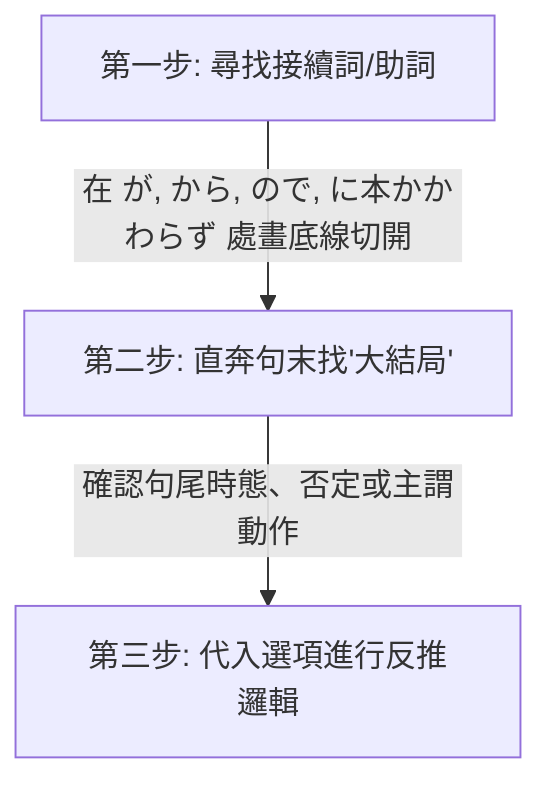

# 🌸 JLPT N2 核心備考與學習優化筆記（一）：學習策略與文法句型

本筆記已拆分為三個部分，以減少 Context 長度並提升學習效率：
1. **[第一部分：學習策略與文法句型](file:///D:/StudyJapanese/1_N2_Study_Strategy_and_Grammar.md)** (本文件)
2. **[第二部分：核心漢字與近義詞辨析](file:///D:/StudyJapanese/2_N2_Kanji_and_Synonym_Distinctions.md)**
3. **[第三部分：自他動詞與分類詞彙表](file:///D:/StudyJapanese/3_N2_Vocabulary_Bank_and_Verbs.md)**

---

## 🎯 個人化學習背景與備考策略 (Personalized Strategy)

> [!NOTE]
> **你的學習畫像 (Learning Profile)**：
> *   **優勢**：通過動漫、遊戲積累了良好的「語感」與「聽力直覺」，具備接近 **N3** 的潛在實力。
> *   **盲點**：從未系統性學習日語，直接挑戰 **N2**，文法地基較為薄弱。**N3 文法亦有遺漏與不扎實之處**，需要隨時回顧鞏固。
> *   **核心策略**：以 **N2 為絕對重心**（超綱詞僅作字根比對輔助，不作重點），並且在學習 N2 句型時，**主動對接並複習相關的 N3 語法**以鞏固地基。
> *   **核心教材**：《新日檢完勝對策 N2》（8 週架構） + 動漫/遊戲日常生詞積累。

### 🚀 學習優化三部曲
1.  **「單字」與「文法」雙軌並行，不要分開！**
    *   由於 N2 的字彙和文法深度綁定（很多副詞和接續詞就是文法題考點，例如 `のに` / `ので`），**不需要等整本單字背完才看文法書**。建議每天在看《完勝對策單字》的同時，翻開《完勝對策文法》的對應章節進行對照，把看不懂的接續規則隨時發在這裡，我來幫你梳理。
2.  **將「動漫/遊戲生詞」融入《完勝對策》的主題中**
    *   《完勝對策》是按**生活主題**（如：廚房、掃除、辦公室）劃分每天任務的。當你在動漫或遊戲裡看到生詞時，我會幫你把它們歸類到筆記中的相應主題表格中。這樣可以把“破碎的娛樂記憶”轉化為“系統的考試分數”。
3.  **語感轉化為文法規則**
    *   在遊戲中聽到的「口語/台詞」，往往包含複雜的語法（例如使役被動、授受關係）。遇到看不懂的台詞，隨時寫在 [note.txt](file:///D:/StudyJapanese/note.txt)，我會為你拆解背後的 N2/N3 文法邏輯。

### 📊 N2 考試核心考點與優先級分析 (Exam Priorities)

由於你是從 N3 語感直接跳考 N2，**不需要死背每一個單字**，應採取「高回報率」的策略。以下為你分析 N2 考題中各類內容的權重與筆記中的優先級標記：

#### 🔴 優先級 1：核心考點與語意理解關鍵（⚠️ 權重極高，必拿分）
*   **自他動詞**：如 `ずれる/ずらす`、`閉まる/閉める`。不僅單字會考，**聽力題**中也常考「到底是誰做了這件事」，分不清自他動詞在聽力中會被秒殺。
*   **核心漢字辨析**：如六個 `はかる`（`量る/計る/測る/圖る/謀る/諮る`）、`揃う/揃える`。常考在讀音或漢字選擇題中。
*   **敬語與謙讓語**：如 `伺う`、`拝見する`。主要考在文法選擇題 and 職場閱讀中，也是華人考生的重災區。
*   **備考策略**：**每天都要看一遍**。這部分是考試的硬性拿分點，必須熟練到反射動作的程度。

#### 🟡 優先級 2：副詞、接續詞與核心動詞（🌟 權重高，閱讀理解的靈魂）
*   **副詞與接續詞**：如 `一段と`、`常々`、`差異`。副詞常出現在單字填空題，而接續詞決定了文章的邏輯轉折，**閱讀理解（長文）的死活完全取決於你有沒有看懂接續詞**。
*   **動作與身體狀態動詞**：如 `省く`、`溜まる`、`しつける`、`綜合` 系列。這些動詞是閱讀理解中描述細節的關鍵。
*   **備考策略**：**每週複習一次**。重點在於理解其前後語意邏輯與情境接續。

#### 🟢 優先級 3：日常/電腦文書處理詞彙（📊 權重中低，混個眼熟即可）
*   **日常/生活專有名詞**：如 `小兒科`、`停留所`、`築二十年`。
*   **電腦文書詞彙**：如 `改行する` (換行)、`余白` (邊距)。
*   **備考策略**：這類詞彙主要是為了應對**「資訊檢索（通知信件、公文閱讀）」**題型。你不需要會拼寫、也不用知道它的深層字源，**只要在閱讀題中看到時能「認出」它是換行、邊距或小兒科即可**。**每兩週複習一次**即可。

---

## 📅 學習進度與每日複習建議 (Study Tracker)
> [!TIP]
> **「1-3-7-14」 遺忘曲線複習法與筆記瘦身機制**：
> - **第一天**：通讀本筆記中的「核心學習策略」，嘗試用「切西瓜法」分析 3 個長難句。
> - **第三天**：重點複習「自他動詞對照表」，遮住他動詞，嘗試根據畫面感寫出對應的自動詞。
> - **第七天**：複習「六大 Hakarus」與「Awases」，用它們各自造一個句子。
> - **第十四天**：快速掃視「分類詞彙表」，只看日語漢字，能在一秒內反應出讀音與畫面者過關，否則打星號標記。
>
> **💡 筆記防臃腫與高效複習三原則**：
> 1.  **導入「紅黃綠」標記**：
>     *   `🔴` (生疏/極難記)：每天都要看一遍。
>     *   `🟡` (模糊/需複習)：每週複習一次，若複習時答對則升為綠色，答錯降為紅色。
>     *   `🟢` (熟記/已掌握)：兩週複習一次。
> 2.  **定期歸檔 (Archiving)**：
>     *   當某些單字已經連續三次維持在 `🟢` (熟記) 狀態時，我們會將它們**移出主筆記**，歸檔到 `Mastered_Vocabulary_Archive.md` 中。主筆記只保留你「還不會」或「不熟」的內容，永遠保持在 **500 行以內**。
>     *   只在考前一週把歸檔文件調出來快速掃視即可。
> 3.  **主動回想 (Active Recall) 摺疊設計**：
>     *   我們會在複習表中將中文釋義或讀音用 Markdown / HTML 摺疊代碼包裹，複習時遮住答案，點擊再顯現，達到自我測試的效果。

---

## 目錄 (Table of Contents)
- [💡 核心學習策略與方法論 (Methodology)](#-核心學習策略與方法論-methodology)
  - [1. 「切西瓜」長難句拆解法 (Sentence Slicing)](#1-切西瓜長難句拆解法-sentence-slicing)
  - [2. 「畫面感」字根聯想記憶法 (Visual Anchoring)](#2-畫面感字根聯想記憶法-visual-anchoring)
  - [3. 「猜字遊戲」：面對日語生詞的三大推理工具 (How to Deduce Vocabulary)](#3-猜字遊戲面對日語生詞的三大推理工具-how-to-deduce-vocabulary)
- [⚠️ 語法與句型易錯點 (Common Pitfalls)](#-語法與句型易錯點-common-pitfalls)
  - [1. 職場社交：主動請求 vs 被動請求](#1-職場社交主動請求-vs-被動請求)
  - [2. 時間接續：做完某事之後](#2-時間接續做完某事之後)
  - [3. 因果與轉折：ので vs のに](#3-因果與轉折ので-vs-のに)
  - [4. 易混淆詞彙與情境辨析 (職場與生活)](#4-易混淆詞彙與情境辨析-職場與生活)
  - [5. 實用長句拆解與語法分析 (Real-World Sentence Slicing)](#5-實用長句拆解與語法分析-real-world-sentence-slicing)
  - [6. 實用商業告示牌與免責聲明句型拆解 (Store Signs & Disclaimers)](#6-實用商業告示牌與免責聲明句型拆解-store-signs--disclaimers)
  - [7. N2 核心文法：～がたい (難以……)](#7-n2-核心文法がたい-難以)

---

## 💡 核心學習策略與方法論 (Methodology)

### 1. 「切西瓜」長難句拆解法 (Sentence Slicing)
閱讀 N2 長難句時，不要習慣性地從左到右死譯。這會導致大腦短期記憶載荷過大，漏掉前後邏輯。請使用以下三步：

#### 💡 實戰案例分析
> **例題**：申し訳ありません。部長はちょっと（　　）おりますが、すぐ戻ると思います。
>
> 1. **切斷**：在 **が** (但是/稍微帶出後文) 處切開。
>    - 前半句：`部長はちょっと（ 空格 ）おりますが`
>    - 後半句：`すぐ戻ると思います` (我想他馬上會回來)
> 2. **找大結局**：後半句的靈魂是 **「すぐ戻る (馬上回來)」**。
> 3. **反推空格邏輯**：既然能「馬上回來」，說明人還在公司，只是暫時離開。
>    - 選項 `早退して` (早退/回家了)、`休みを取って` (請假了) 均不符合「馬上回來」的前提。
>    - 選項 `不足して` (人手不足) 搭配不通。
>    - 答案鎖定：**`席を外して` (離開一下座位)**，完美契合！

---

### 2. 「畫面感」字根聯想記憶法 (Visual Anchoring)
利用漢字字根的核心「動作畫面」來連帶記憶一長串詞彙，避免孤立背誦。

#### 🔹 典型案例 1：字尾 `込む（こむ）` —— “深深地塞入、灌注、沉浸”
*   **字根獨立用法**：
    *   **込む（こむ）** 與 **混む（こむ）**【自動詞】：這兩個詞在發音與語源上完全相同，但在現代日語的漢字書寫上有明確的分工：
        *   **混む**：專門用來表示**「擁擠、人多、混雜」**（例：`電車が混んでいる` 電車很擠。因為「混」有混雜擠在一起的畫面，這是最標準的寫法）。
        *   **込む**：專門用來表示**「進入內部、包含在內」**（例：`税込み` 含稅、複合動詞接尾詞 `～込む`）。
*   **字尾接尾詞用法（～込む）**：
    *   接在動詞連用形（去ます形）後，構成複合動詞。主要有以下 **四大核心畫面感**：

##### 1. 朝著內部進去、放入之內 (Into / Inside)
*   **書き込む（かきこむ）**：寫（書き）進去（込む） ➔ **填寫、留言、登錄數據**。
*   **飛び込む（とびこむ）**：跳（飛び）進去（込む） ➔ **跳入、飛奔進入**（例：`プールに飛び込む` 跳入泳池）。
*   **吸い込む（すいこむ）**：吸（吸い）進去（込む） ➔ **吸入、吸收**（例：`掃除機がゴミを吸い込む` 吸塵器吸入垃圾）。
*   **入れ込む（いれこむ）**：
    1.  *物理面*：放（入れ）進去（込む） ➔ **裝入、塞入**（例：`予定をカレンダーに入れ込む` 把行程塞入行事曆）。
    2.  *精神面*：把心力/感情放（入れ）得很深進去（込む） ➔ **沉迷、著迷、熱衷、傾注情感**（例：`競馬に入れ込む` 沉迷賽馬、`彼女に入れ込む` 對女友極度迷戀）。

##### 2. 徹底、深刻、持續的狀態 (Thoroughly / Deeply)
*   **思い込む（お模いこむ）**：想（思い）得太深進去了 ➔ **深信不疑、認定、誤以為**（例：`自分が正しいと思い込む` 盲目認定自己是對的）。
*   **信じ込む（しんじこむ）**：相信（信じ）得很深 ➔ **深信不疑、篤信**。
*   **落ち込む（おちこむ）**：掉（落ち）得很深進去 ➔ **情緒低落、沮喪**；或經濟**下滑、蕭條**（例：`成績が落ち込む` 成績下滑）。
*   **煮込む（にこむ）**：煮（煮）得很透、讓味道滲透進去 ➔ **燉煮、熬煮**。

##### 3. 固化、保持在原地 (Fixing / Staying)
*   **座り込む（すわりこむ）**：坐下就不起來了 ➔ **靜坐、坐著不動**（例：`道端に座り込む` 坐在路邊不走）。
*   **泊まり込む（とまりこむ）**：住下不走了 ➔ **留宿、通宵加班不回家**（例：`会社に泊まり込む` 住在公司加班）。
*   **黙り込む（だまりこむ）**：保持沉默不說話了 ➔ **陷入沉默、沉默不語**。

##### 4. 原有詞彙的延伸：
*   **振り込む（ふりこむ）**：揮動(振る)著把錢「塞入」 ➡️ **轉帳**。
*   **払い込む（はらいこむ）**：把應付款項「塞入」 ➡️ **繳納、還錢**。
*   **仕込む（しこむ）**：為了做事(仕事)而提前把材料或心力「塞入」 ➡️ **事先準備、訓練/教導徒弟或動物**（類似 `躾ける` 的畫面）。
*   **引き込む（ひきこむ）**：拉扯(引く)著塞進去 ➡️ **拉入、捲入**。

##### 🎮 覺得聯想太抽象？請直接記住 N2 / 動漫與遊戲最常出現的「這 5 個核心詞」：
1.  **落ち込む（おちこむ）**
    *   *動漫畫面*：角色頭頂有三條藍色陰影，蹲在角落畫圈圈。
    *   *含意*：**沮喪、憂鬱、心情掉進谷底**；或經濟/業績**下滑**。
    *   *例句*：`成績が落ちて、かなり落ち込んでいる。` (成績退步，現在非常沮喪。)
2.  **思い込む（おもいこむ）**
    *   *遊戲畫面*：你一直主觀認定某個角色是壞人，結果他根本是來幫你的。
    *   *含意*：**誤以為、主觀認定、深信不疑**（思維鑽牛角尖出不來）。
    *   *例句*：`彼は犯人だと思い込んでいたが、間違いだった。` (我深信他就是犯人，結果搞錯了。)
3.  **申し込む（もうしこむ）**
    *   *動漫畫面*：男主角鼓起勇氣對女主角提出交往的請求（交際を申し込む）。
    *   *含意*：**申請、報名、提出（申請/告白）**（把自己的請求送進去）。
    *   *例句*：`日本語能力試験の受験を申し込む。` (報名參加日語能力試驗。)
4.  **黙り込む（だまりこむ）**
    *   *RPG對話畫面*：對話框出現「……」，角色低下頭，氣氛陷入尷尬。
    *   *含意*：**陷入沉默、一句話也不說**（沉默的狀態固定不變了）。
    *   *例句*：`理由を聞かれて、彼は黙り込んでしまった。` (被問及理由，他便陷入了沉默。)
5.  **煮込む（にこむ）**
    *   *遊戲烹飪系統*：把各種蔬菜 and 肉類丟進大鍋裡慢火熬煮以製作料理。
    *   *含意*：**慢火燉煮、熬煮**（讓調味料和湯汁徹底滲透進去）。
    *   *例句*：`カレーを弱火でじっくり煮込む。` (用小火慢慢熬煮咖哩。)

##### 💡 額外補充：你提過的 **入れ込む（いれこむ）**
*   *聯想*：把自己的精力與熱情「全部塞進去」某個嗜好或對象中。
*   *含意*：**沉迷、熱衷、迷戀**。
*   *例句*：`彼はソシャゲ（手遊）のガチャに入れ込んでいる。` (他沉迷於手機遊戲的抽卡。)

---
#### 🔹 典型案例 2：字根 `組む（くむ）` —— “互相交叉、結合、 interlocking”
想像兩根繩子或人的雙手雙腳交織在一起的動作：
*   **腕/足を組む**：雙手抱胸 / 翹二郎腿（身體交叉）。
*   **スケジュールを組む**：把零散的時間塊「交叉拼接」在一起 ➡️ **制定/排定日程表**。
*   **コンビを組む**：兩個人緊密結合在一起 ➡️ **搭檔、組隊**。

---

### 3. 「猜字遊戲」：面對日語生詞的三大推理工具 (How to Deduce Vocabulary)
日語確實很難死記硬背，但它有一個巨大的優勢：**高度模組化**。面對不認識的 N2 甚至 N1 單字，可以利用以下三個推理工具來猜測意思：

#### 🛠️ 工具一：音讀字（漢語詞）的「積木拆字法」
音讀單字（如 `削減`, `削除`, `消去`, `排除`, `除去`）是由漢字積木拼接而成的。只要掌握個別漢字的核心畫面，就可以像拼積木一樣猜出整組詞的意思：
*   **削（さく）**：核心畫面是「拿刀去切、刮掉、削弱」。
    *   `削減` = 刮掉（削）+ 變少（減） ➔ **縮減（預算/成本）**。
    *   `削除` = 刮掉（削）+ 去掉（除） ➔ **刪除（字元/檔案/帳號）**。
*   **除（じょ）**：核心畫面是「除掉、弄走不想要的雜質或東西」。
    *   `除去` = 除掉（除）+ 拿走（去） ➔ **排除、清除（毒素/雜質）**。
    *   `排除` = 除掉（除）+ 排擠（排） ➔ **排除、排除（障礙/威脅）**。

#### 🛠️ 工具二：訓讀動詞的「字尾/接頭詞推理」
日語的純日語動詞（訓讀字，如 `～直す`, `～出す`, `～合わせ連`, `～込む`）非常規律。複合動詞的後半部分決定了**「動作的方向、狀態或性質」**：
*   **～直す（なおす）** ➔ 核心畫面是「修復、改進、重新來過」。
    *   `やり直す` = 做（やり）+ 重新來 ➔ **重做**。
    *   `見直す` = 看（見）+ 重新來 ➔ **重新考慮、複審、改觀**。
    *   `書き直す` = 寫（書き）+ 重新來 ➔ **重寫**。
*   **～出す（だす）** ➔ 核心畫面是「朝向外面、或是動作開始」。
    *   `引き出す` = 拉（引き）+ 出來 ➔ **拉出、提款**。
    *   `思い出す` = 想（思い）+ 出來 ➔ **回想起來**。
    *   `動き出す` = 動（動き）+ 出來 ➔ **開始動起來**。
*   **～合わせる（あわせる）** ➔ 核心畫面是「湊在一起、核對、對齊」 ➔ `問い合わせる`（詢問核對）、`打ち合わせる`（事前商量）。

#### 🛠️ 工具三：「名詞/擬聲詞變身動詞」的字源溯源法
日語許多三音節、四音節的訓讀動詞，通常是由**我們已經認識的基礎名詞**或**擬聲擬態詞**演變而來的。當你看到一個生詞，試著看它的前半部分：
*   **こなす** ➔ 前兩個音是 `こな`（粉） ➔ 磨成粉 ➔ 消化 ➔ **消化、搞定工作**。
*   **ずらす/ずれる** ➔ 來自副詞 `ずるずる`（滑動、拖延的擬態聲音） ➔ **偏離、挪動**。
*   **たまる/ためる** ➔ 來自 `田（た - 水田）` 或 `水たまり（水窪）` ➔ 聚水 ➔ **積攢、儲存**（如：垃圾堆積、存錢）。
*   **宿る（やどる）** ➔ 來自 `宿（やど - 旅館/客棧）` ➔ 住宿 ➔ **寄生、寄宿、懷孕**。
*   **煙る（けむる）** ➔ 來自 `煙（けむり - 煙霧）` ➔ **冒煙、煙霧濛濛**。

---

## ⚠️ 語法與句型易錯點 (Common Pitfalls)

### 1. 職場社交：主動請求 vs 被動請求
在商務日語中，主動請求對方做事與請求對方允許自己做事極易混淆，直接關係到職場禮貌。

> [!WARNING]
> *   **`～してください`** / **`ご～ください`**：**「請你做某事」**（動作發出者是**對方**）。
> *   **`～させてください`**：**「請讓我做某事」**（使役形 + ください，動作發出者是**自己**）。

*   **錯誤造句**：`スケジュールを組んだあとで、連絡させてください。`❌
    *   *誤讀意*：日程表排好之後，請**讓我**聯絡你（如果你是老闆/客戶，這樣說顯得很奇怪）。
*   **正確改法**：
    *   **平輩/一般同事**：`スケジュールを組んだあとで、連絡してください。` (排好日程後請聯絡我)
    *   **對上級/客戶（敬語）**：`スケジュールを組んだあとで、ご連絡ください。` / `スケジュールを組んでから、ご連絡ください。`

---

### 2. 時間接續：做完某事之後
表示「做完前項動作，再做後項」時：
*   **`動詞た形 + あとで`** (在...之後)
    *   注意「組む」的過去式是 `組んだ`。不要多寫促音，如 `組んだったあとで` ❌ 是錯誤的，應為 **`組んだあとで`** ⭕。
*   **`動詞て形 + から`** (自從...以後 / 緊接著做...)
    *   **`スケジュールを組んでから、ご連絡ください。`**

---

### 3. 因果與轉折：ので vs のに
這兩個詞非常容易因為只差一個字而混淆：
*   **`ので`（表示客觀因果）**：相當於 `から`，表示「因為前者的緣故，所以導致了後者的客觀結果」。語氣比 `から` 更柔和客氣。
*   **`のに`**：
    1.  **表示轉折（明明……卻）**：`一生懸命勉強したのに、不合格だった。` (明明拼命學了，卻沒考過)。
    2.  **表示目的/用途（為了……）**：當後面接 `使う` (使用)、`必要` (必要)、`かかる` (花費時間/金錢) 等詞時。
        *   `この仕事をするのに1時間かかる。` (為了做這工作需要花1小時)。

---

### 4. 易混淆詞彙與情境辨析 (職場與生活)

#### 💡 辨析 1：轉勤（転勤） vs 派遣（派遣）
*   **句型**：`大阪支社から（転勤）してきました、田中と申します。` (我叫田中，是從大阪分公司調職過來的。)
*   **為什麼不能用「派遣」？**
    *   **転勤（てんきん）**：指**「同一家公司內部，不同分公司/部門之間的調職、轉勤」**。你依然是這家公司的正式員工，所以說「從大阪分公司（支社）調職過來」非常自然。
    *   **派遣（はけん）**：指**「派遣（外包）員工」**。派遣員工的雇主是「派遣公司（派遣会社）」，被派到客戶公司工作。
        1.  *文法問題*：`派遣する` 是他動詞「派遣某人」，自我介紹時應使用被動形 `派遣されてきました`。
        2.  *情境問題*：派遣通常是從「派遣公司」派來，而不是從「大阪分公司（支社）派遣過來」。

#### 💡 辨析 2：離席（席を外す） vs 讓座（席を譲る）
*   **為什麼「バスで老人に席を外した」是錯誤的？**
    *   **席を外す（せきをはずす）**：指**「暫時離開座位/辦公桌（一會兒就回來）」**。這張辦公桌或座位的**所有權依然是你的**，你只是人暫時不在。
        *   *例句*：`課長の鈴木は今、席を外しております。` (鈴木課長現在暫時離開座位了 ➔ 他還在上班，等一下就回座位)。
    *   **席を譲る（せきをゆずる）**：指**「讓座、把座位讓給別人（轉交所有權）」**。
        *   *例句*：`バスで老人に席を譲った。` (在公車上讓座給老人 ➔ 正確 ⭕)。

---

### 5. 實用長句拆解與語法分析 (Real-World Sentence Slicing)

在你提供的 [note.txt](file:///D:/StudyJapanese/note.txt) 中有以下兩句經典的日檢及日常實用句子，我們使用**「切西瓜閱讀法」**來為你逐一拆解：

#### 💡 句子 1：再配送須知（快遞/物流常用提示）
> **ご連絡を頂きました時間によっては、当日の再配達ができない場合がございます。**
> *(原文 `できない場合はございます` 應為商務日語的 `場合がございます`，在此作標準語法拆解。)*

*   **切西瓜分段拆解**：
    1.  **ご連絡を頂きました** ➔ **主動聯絡的動作（對象是「您」）**
        *   `頂きました` 是 `もらう` 的謙讓語，字面是「我們承蒙您給予聯絡」，這是日本商家對顧客的客氣說法。
    2.  **時間によっては** ➔ **文法考點：`～によっては` (根據……而有所不同)**
        *   表示前項的「時間」會決定後面的結果。
    3.  **当日の再配達ができない** ➔ **當天無法重新配送**
        *   `再配達（さいはいたつ）`：在日本，如果快遞員送貨上門時你不在家，他會留下一張「不在聯絡票」，你需要聯絡他們重新投遞。
    4.  **場合がございます** ➔ **文法考點：`～場合がある / ～ことがあります` (有時會出現……的情況)**
        *   用在商務或委婉口氣中，比直接說 `できません` (不行) 更客氣。
*   **整句中文大意**：**「根據您聯絡我們的時間不同，有時候可能會出現當天無法重新配送的情況。」**
*   *備考策略*：遇到 N2 的資訊檢索題（閱讀最後一題，通常是快遞單或廣告），這句話非常關鍵，代表「如果聯絡得太晚，今天就拿不到包裹了」。

---

#### 💡 句子 2：工作分配說明（辦公室/班級常用語）
> **今お配りしたプリントに作業の分擔が書いてあります。**

*   **切西瓜分段拆解**：
    1.  **今お配りした** ➔ **文法考點：`お + 動詞連用形 + した / する` (謙讓語，我為您做某事)**
        *   `配る（くばる）` (分發) 去掉 `る` 接上 `お...した` 變成 `お配りした`，表示「我發（給各位）的」。
    2.  **プリントに** ➔ **講義/資料上**
        *   `プリント`：源自英文 Print，在日本指學校或公司開會發的**單張講義、印好的資料**。
    3.  **作業の分担が** ➔ **工作的分配/分工**
    4.  **書いてあります** ➔ **文法考點：`動詞て形 + あります` (表示人有意施加的動作所留下來的既存狀態)**
        *   這裡的動作是「寫（書く）」，`書いてあります` 表示「上面已經寫好了（你現在能看到這個寫好的狀態）」。
*   **整句中文大意**：**「剛剛發給各位的講義上，有寫著工作的分配。」**
*   *備考策略*：這句話在 N2 聽力的第一大題（課題理解）非常常考，聽到這句話，接下來的題目通常就會問你「接下來某個人要負責做什麼工作」。

---

#### 💡 句子 3：垃圾郵件的煩惱
> **迷惑メールが何通も届いて困っている。**

*   **「切西瓜」分段拆解**：
    1.  **迷惑メールが** ➔ **垃圾郵件（主語）**
        *   **`迷惑（めいわく）`**：給人添麻煩、困擾（N2 核心字彙）。`迷惑メール` 即垃圾郵件、騷擾信件。
    2.  **何通も** ➔ **好幾封 / 許多封**
        *   **`通（つう）`**：信件、郵件的計量計數詞（N2/N3 常考量詞）。
        *   `何 + 量詞 + も` 表示「好幾次/好幾件」，起強烈強調數量多之意。
    3.  **届いて** ➔ **寄到、送達**
        *   動詞 **`届く（とどく）`** (自動詞，寄達/傳遞) 的て形，表示原因或前後連貫。
    4.  **困っている** ➔ **感到困擾、為難**
        *   動詞 `困る（こまる）` (自動詞) 的正在進行/持續狀態。
*   **整句中文大意**：**「好幾封垃圾郵件接連寄達，真讓人感到困擾。」**
*   *備考策略*：這句話常用於模擬真實生活或辦公室日常中的困擾描述。在 N2 聽力中，聽到 `困っている` 往往是「問題解決/對策題」的起點。

---

#### 💡 句子 4：商務邀請與客氣拜訪 (常見於官網或店面告示)
> **お近くにお越しの際は是非お立ち寄りください。**

*   **「切西瓜」分段拆解**：
    1.  **お近くに** ➔ **附近、這附近（敬語美化語）**
        *   `近く（ちかく）` 前面加上 `お` 表示客氣禮貌。
    2.  **お越しの際は** ➔ **文法考點：`お越し` (「來/去」的尊他敬語) + `の際は` (在……的時候)**
        *   `お越しになる` 是 `來/去` 的敬語。
        *   `～の際（さい）` 是比 `～のとき` 更正式、更莊重的書面語，意為「在……之際 / 當……之時」。
    3.  **是非** ➔ **務必、一定要**
        *   副詞 **`是非（ぜひ）`**，後接請求或願望，起強烈推薦、懇請之意。
    4.  **お立ち寄りください** ➔ **文法考點：`お + 立ち寄り + ください` (敬語：請您順道前來)**
        *   動詞 **`立ち寄る（たちよる）`**：順道前來、順路拜訪（指去主要目的地途中，順便到某個地方待一下）。
        *   `立ち寄り` 是 `立ち寄る` 去掉 `る` 的連用形，加上 `お...ください` 尊他敬語。
*   **整句中文大意**：**「如果您來到這附近時，請務必順道前來坐坐。」**
*   *備考策略*：這句話是日本店家、企業或朋友發出邀請時的「黃金社交客套話」。在 N2 聽力的職場對話或信件閱讀中極其高頻，代表「隨時歡迎光臨」。

---

#### 💡 句子 5：職場職責與詞彙選擇 (任務 vs 事務)
> **会社の経理（事務）を担当しています。**

*   **「切西瓜」分段拆解**：
    1.  **会社の経理** ➔ **公司的財務/會計**
        *   `経理（けいり）` 指公司的財務會計工作。
    2.  **（事務）を担当** ➔ **負責……事務**
        *   **`事務（じむ）`**：日常行政、辦公室文書處理（日常性、重複性的工作）。「經理事務」是固定搭配。
        *   **`任務（にんむ）`**：上級給予的特定、重大、必須完成的使命（如：國防任務、機密任務）。一般日常會計工作不會用「任務」來形容，除非是極其特殊的秘密使命。
        *   `担当する（たんとうする）`：擔任、負責。
    3.  **しています** ➔ **正在從事（狀態持續）**
*   **整句中文大意**：**「我目前負責公司的財務會計事務。」**
*   *備考策略*：這是一道經典的詞彙選擇題。在 N2 考試中，常考 `事務` 與 `任務`、`義務`、`職務` 的差別。記住：常規辦公室文書行政工作，一律用 **`事務（じむ）`**；重大使命才用 **`任務（にんむ）`**。

---

### 6. 實用商業告示牌與免責聲明句型拆解 (Store Signs & Disclaimers)

在日本生活、旅遊，或者在 N2 的閱讀理解「資訊檢索」中，常常需要看懂商店、洗衣店的提示牌與免責聲明。我們來拆解你提供的兩句非常地道、實用的告示牌句子：

#### 💡 句子 1：洗衣店/寄物處的溫馨提示
> **ポケットの中に忘れ物がないか点検してからお出し下さい。**

*   **「切西瓜」分段拆解**：
    1.  **ポケットの中に忘れ物がないか** ➔ **口袋裡有沒有遺留物品**
        *   `忘れ物`：遺漏的東西、忘記拿走的東西。
        *   `～ないか`：表示**「是否……」**的疑問（有沒有……）。
    2.  **点検してから** ➔ **檢查之後再……**
        *   `点検する`：檢查、點檢。
        *   `～てから`：表示動作的先後順序（先做前項，再做後項）。
    3.  **お出し下さい** ➔ **文法考點：`お + 動詞連用形 + ください` (敬語：請您做某事)**
        *   `出す` (拿出來/交給我們) 去掉 `す` 加上 `お...ください` 變成 `お出しください`（請拿出來/請交給我們）。
*   **整句中文大意**：**「請檢查口袋中是否有遺留物品後，再交給我們。」**
*   **實用場景**：常出現在洗衣店（送洗衣服前需清空口袋）或飯店前台寄放行李處。

---

#### 💡 句子 2：店家的免責聲明（非常重要！）
> **お引き取りがなく、1ヶ月以上経過した品物は責任を負いかねます。**

*   **「切西瓜」分段拆解**：
    1.  **お引き取りがなく** ➔ **若沒有前來領取**
        *   `引き取り（取件、領回）`：動詞 `引き取る` 的名詞化，前面加 `お` 敬語化。
    2.  **1ヶ月以上経過した品物は** ➔ **且經過了一個月以上的物品**
        *   `経過する（けいかする）`：時間流逝、經過。
    3.  **責任を負いかねます** ➔ **文法考點：`動詞連用形 + かねます` (很難…… / 無法……)**
        *   **`～かねます`** 是 N2 重點語法，用來表示**「主觀上很難做到，因此委婉拒絕/否定」**。在日本服務業中，店家絕對不會生硬地說 `できません` (我們不能)，而是用 `負いかねます` (恕難承擔)。
        *   `負う（おう）`：承擔、背負（責任、受傷等）。
*   **整句中文大意**：**「若未前來領回，且逾期一個月以上的物品，本公司恕不承擔保管責任。」**
*   **實用場景**：洗衣店、行李寄存處、失物招領處等。如果逾期未取，物品丟失或損壞，商家依法不予賠償。

---

#### 💡 句子 3：垃圾收集處的分類提示 (ゴミ集積所)
> **ダンボールはひもでしばって、お出してください。**
> **紙パックは洗って、開いて平らにしてしばってください。**

*   **「切西瓜」分段拆解**：
    1.  **ダンボールは** ➔ **紙箱/紙板（主體）**
        *   `ダンボール`：源於英文 Corrugated cardboard，日語特指**瓦楞紙箱、紙板**。
    2.  **ひもでしばって** ➔ **用繩子綁起來**
        *   `ひも` (繩子) + `で` (使用工具/方式)。
        *   `しばって`：動詞 **`縛る（しばる）`** (捆綁、束縛) 的て形。
    3.  **お出してください** ➔ **請拿出來（丟垃圾）**
        *   **`お + 動詞連用形 + ください`** 尊他敬語，請對方做某事。`出す` (丟出/拿出) 變成 `お出しください`。
    4.  **紙パックは洗って** ➔ **紙盒/紙包裝（牛奶盒等）要清洗後**
        *   `紙パック（かみぱっく）`：飲料紙盒（如牛奶盒）。
    5.  **開いて平らにして** ➔ **剪開、壓平**
        *   `開いて（ひらいて）`：動詞 `開く（ひらく）` (展開、剪開) 的て形。
        *   `平らにして`：形容動詞 **`平ら（たいら）`** (平坦、扁平) + `にする` (使動，使其變平)。
    6.  **しばってください** ➔ **再綁起來**
*   **整句中文大意**：**「紙箱請用繩子捆綁後再丟出。紙盒包裝請先清洗、剪開壓平後，再捆綁丟棄。」**
*   **實用場景**：日本社區的「垃圾收集處（ゴミ集積所）」。日本垃圾分類極其嚴格，紙箱與紙餐盒必須分別處理，若不壓平綁好，清潔隊會拒收。

---

### 7. N2 核心文法：～がたい (難以……)

在你的學習記錄中提到了 `～し難い（しがたい）`，這確實是 N2 語法考試的**必考常客**！

#### 💡 文法解析
*   **接續**：**`動詞連用形（去 ます 形）+ がたい`**
*   **字義**：表示**「很難做某事 / 難以做某事」**。
*   **核心語感與畫面**：
    *   這並非指「物理上無法做到」（如：沒有工具所以不能做），而是指**「心理上、情感上、道義上或常識上「極難接受或抗拒去做」**（Psychologically or morally impossible/difficult）。
    *   主語通常是第一人稱大腦或情感的活動（如：信じる、理解する、許す、動かす）。

#### 🔹 考試超高頻搭配（直接記住這 4 個黃金詞）：
1.  **信じがたい（しんじがたい）**：難以置信。
    *   *例句*：`彼が嘘をついたなんて、信じがたい。` (他居然撒謊了，真是令人難以置信)。
2.  **許しがたい（ゆるしがたい）**：難以原諒。
    *   *例句*：`犯人の行為は極めて許しがたい。` (犯人的行為極其難以原諒)。
3.  **理解しがたい（りかいしがたい）**：難以理解。
    *   *例句*：`彼の不可解な行動は、理解しがたい。` (他那令人費解的行為，實在難以理解)。
4.  **言い表しがたい（いいあらわしがたい）**：難以言喻 / 難以用言語表達。
    *   *例句*：`あの時の感動は、言葉では言い表しがたい。` (那時的感動，實在是難以用言語表達)。

#### ⚠️ 易混淆辨析：～がたい vs ～にくい vs ～づらい

這三個在中文都翻譯成「難以……」，但在日語中有本質上的差異：

| 句型 | 難以度類型 | 核心畫面與例句 |
| :--- | :--- | :--- |
| **～がたい** | **心理/主觀難以做到** | · 信じがたい（心理上無法相信） · 物理上可以相信，但理智或情感「抗拒相信」。 |
| **～にくい** | **物理/客觀難以做到** | · このペンは書き**にくい**（這筆不好寫 ➔ 筆的物理屬性導致不好寫） · この字は読み**にくい**（這字不好讀 ➔ 字跡遺漏） |
| **～づらい** | **肉體痛苦/尷忑難以做到** | · 喉が痛くて話し**づらい**（喉嚨痛說話很難受） · 相手に直接は言い**づらい**（當面跟對方說感覺很尷尬） |

*   **補充詞彙對照**：
    *   **難い / 難しい（むずかしい）**【形】：困難的。
    *   **易しい（やさしい）**【形】：簡單的、容易的。

