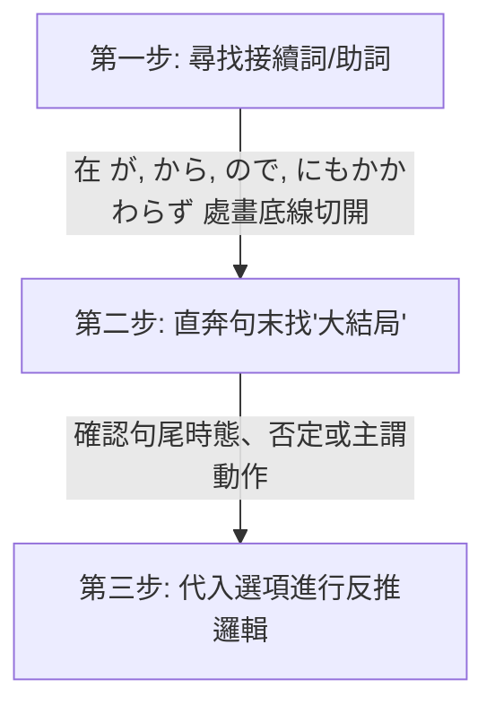

# 🌸 JLPT N2 核心備考與學習優化筆記

歡迎來到你的專屬 N2 備考空間！這份筆記對原有的 NotebookLM 碎片化內容進行了結構化重組與深度擴充，融入了**畫面聯想法**與**切西瓜閱讀法**，旨在將「死記硬背」轉化為「直覺反射」。

---

## 📅 學習進度與每日複習建議 (Study Tracker)
> [!TIP]
> **「1-3-7-14」 遺忘曲線複習法**：
> - **第一天**：通讀本筆記中的「核心學習策略」，嘗試用「切西瓜法」分析 3 個長難句。
> - **第三天**：重點複習「自他動詞對照表」，遮住他動詞，嘗試根據畫面感寫出對應的自動詞。
> - **第七天**：複習「六大 Hakarus」與「Awases」，用它們各自造一個句子。
> - **第十四天**：快速掃視「分類詞彙表」，只看日語漢字，能在一秒內反應出讀音與畫面者過關，否則打星號標記。

---

## 目錄 (Table of Contents)
- [💡 核心學習策略與方法論 (Methodology)](#-核心學習策略與方法論-methodology)
  - [1. 「切西瓜」長難句拆解法 (Sentence Slicing)](#1-切西瓜長難句拆解法-sentence-slicing)
  - [2. 「畫面感」字根聯想記憶法 (Visual Anchoring)](#2-畫面感字根聯想記憶法-visual-anchoring)
- [⚠️ 語法與句型易錯點 (Common Pitfalls)](#-語法與句型易錯點-common-pitfalls)
  - [1. 職場社交：主動請求 vs 被動請求](#1-職場社交主動請求-vs-被動請求)
  - [2. 時間接續：做完某事之後](#2-時間接續做完某事之後)
  - [3. 因果與轉折：ので vs のに](#3-因果與轉折ので-vs-のに)
- [🔍 核心漢字與同音/近義詞辨析 (Kanji & Synonym Distinctions)](#-核心漢字與同音近義詞辨析-kanji--synonym-distinctions)
  - [1. 「はかる」的六大漢字辨析](#1-はかる的六大漢字辨析)
  - [2. 「～合わせ」複合動詞辨析](#2-合わせ複合動詞辨析)
  - [3. 空間角落：角（かど/つの/かく） vs 隅（すみ）](#3-空間角落角かどつのかく-vs-隅すみ)
  - [4. 金融財務：稼ぐ vs 儲ける vs 儲かる](#4-金融財務稼ぐ-vs-儲ける-vs-儲かる)
  - [5. 「取り」與「やり」複合詞辨析 (Tori & Yari series)](#5-取り與やり複合詞辨析-tori--yari-series)
- [🔄 自他動詞專項整理 (Intransitive & Transitive Verbs)](#-自他動詞專項整理-intransitive--transitive-verbs)
- [📚 分類核心詞彙表 (Categorized Vocabulary List)](#-分類核心詞彙表-categorized-vocabulary-list)
  - [Ⅰ. 職場與商務 (Workplace & Business)](#ⅰ-職場與商務-workplace--business)
  - [Ⅱ. 家庭與日常生活 (Daily Life & Housework)](#ⅱ-家庭與日常生活-daily-life--housework)
  - [Ⅲ. 動作、身體與狀態 (Actions, Body & States)](#ⅲ-動作身體與狀態-actions-body--states)
  - [Ⅳ. 金融與銀行操作 (Finance & Banking)](#ⅳ-金融與銀行操作-finance--banking)
  - [Ⅴ. 描述、程度與副詞 (Descriptions & Adverbs)](#ⅴ-描述程度與副詞-descriptions--adverbs)

---

## 💡 核心學習策略與方法論 (Methodology)

### 1. 「切西瓜」長難句拆解法 (Sentence Slicing)
閱讀 N2 長難句時，不要習慣性地從左到右死譯。這會導致大腦短期記憶載荷過大，漏掉前後邏輯。請使用以下三步：



#### 💡 實戰案例分析
> **例題**：申し訳ありません。部長はちょっと（　　）おりますが、すぐ戻ると思います。
>
> 1. **切斷**：在 **が** (但是/稍微帶出後文) 處切開。
>    - 前半句：`部長はちょっと（ 空格 ）おりますが`
>    - 後半句：`すぐ戻ると思います` (我想他馬上會回來)
> 2. **找大結局**：後半句的靈魂是 **「すぐ戻る (馬上回來)」**。
> 3. **反推空格邏輯**：既然能「馬上回來」，說明人還在公司，只是暫時離開。
>    - 選項 `早退して` (早退/回家了)、`休みを取って` (請假了) 均不符合「馬上回來」的前提。
>    - 選項 `不足して` (人手不足) 搭配不通。
>    - 答案鎖定：**`席を外して` (離開一下座位)**，完美契合！

---

### 2. 「畫面感」字根聯想記憶法 (Visual Anchoring)
利用漢字字根的核心「動作畫面」來連帶記憶一長串詞彙，避免孤立背誦。

#### 🔹 典型案例 1：字尾 `込む（こむ）` —— “深深地塞入、灌注、沉浸”
*   **振り込む（ふりこむ）**：揮動(振る)著把錢「塞入」 ➡️ **轉帳**。
*   **払い込む（はらいこむ）**：把應付款項「塞入」 ➡️ **繳納、還錢**。
*   **仕込む（しこむ）**：為了做事(仕事)而提前把材料或心力「塞入」 ➡️ **事先準備、訓練/教導徒弟或動物**（類似 `躾ける` 的畫面）。
*   **引き込む（ひきこむ）**：拉扯(引く)著塞進去 ➡️ **拉入、捲入**。

#### 🔹 典型案例 2：字根 `組む（くむ）` —— “互相交叉、結合、 interlocking”
想像兩根繩子或人的雙手雙腳交織在一起的動作：
*   **腕/足を組む**：雙手抱胸 / 翹二郎腿（身體交叉）。
*   **スケジュールを組む**：把零散的時間塊「交叉拼接」在一起 ➡️ **制定/排定日程表**。
*   **コンビを組む**：兩個人緊密結合在一起 ➡️ **搭檔、組隊**。

---

## ⚠️ 語法與句型易錯點 (Common Pitfalls)

### 1. 職場社交：主動請求 vs 被動請求
在商務日語中，主動請求對方做事與請求對方允許自己做事極易混淆，直接關係到職場禮貌。

> [!WARNING]
> *   **`～してください`** / **`ご～ください`**：**「請你做某事」**（動作發出者是**對方**）。
> *   **`～させてください`**：**「請讓我做某事」**（使役形 + ください，動作發出者是**自己**）。

*   **錯誤造句**：`スケジュールを組んだあとで、連絡させてください。`❌
    *   *誤讀意*：日程表排好之後，請**讓我**聯絡你（如果你是老闆/客戶，這樣說顯得很奇怪）。
*   **正確改法**：
    *   **平輩/一般同事**：`スケジュールを組んだあとで、連絡してください。` (排好日程後請聯絡我)
    *   **對上級/客戶（敬語）**：`スケジュールを組んだあとで、ご連絡ください。` / `スケジュールを組んでから、ご連絡ください。`

---

### 2. 時間接續：做完某事之後
表示「做完前項動作，再做後項」時：
*   **`動詞た形 + あとで`** (在...之後)
    *   注意「組む」的過去式是 `組んだ`。不要多寫促音，如 `組んだったあとで` ❌ 是錯誤的，應為 **`組んだあとで`** ⭕。
*   **`動詞て形 + から`** (自從...以後 / 緊接著做...)
    *   **`スケジュールを組んでから、ご連絡ください。`**

---

### 3. 因果與轉折：ので vs のに
這兩個詞非常容易因為只差一個字而混淆：
*   **`ので`（表示客觀因果）**：相當於 `から`，表示「因為前者的緣故，所以導致了後者的客觀結果」。語氣比 `から` 更柔和客氣。
*   **`のに`**：
    1.  **表示轉折（明明……卻）**：`一生懸命勉強したのに、不合格だった。` (明明拼命學了，卻沒考過)。
    2.  **表示目的/用途（為了……）**：當後面接 `使う` (使用)、`必要` (必要)、`かかる` (花費時間/金錢) 等詞時。
        *   `この仕事をするのに1時間かかる。` (為了做這工作需要花1小時)。

---

## 🔍 核心漢字與同音/近義詞辨析 (Kanji & Synonym Distinctions)

### 1. 「はかる」的六大漢字辨析
日語中讀作 `はかる` 的動詞極多，考試中常以漢字選擇題出現。

| 漢字 | 核心畫面與測量對象 | 常見搭配 | 中文釋義 |
| :--- | :--- | :--- | :--- |
| **量る** | 測量**重量**或**體積/容器容量** | 体重/重さを量る、容積を量る | 稱量、分量 |
| **計る** | 測量**時間**、**數字**或**度數** | 時間を計る、熱（体温）を計る、計画を計る | 計時、計算 |
| **測る** | 測量**空間長度**、**面積**、**溫度**、**高度**或**數值深度** | 身長/熱さを測る、水深を測る、面積を測る | 測量、測定 |
| **図る** | 努力爭取實現某個**目標**、**計劃**或**對策** | 解決を図る、再起を図る、便宜を図る | 謀求、力圖 |
| **謀る** | 設計**算計別人**、**策劃陰謀**或**欺騙** | 暗殺を謀る、だまして金をとろうと謀る | 策劃、圖謀、算計 |
| **諮る** | 將疑問或議題提交給眾人**商討、諮詢意見** | 委員会に諮る、会議に諮って決定する | 諮詢、商討 |

---

### 2. 「～合わせ」複合動詞辨析
這組詞的核心都是 `合わせる`（把東西湊在一起/對齊），區別在於前綴動詞帶來的動作感：

```
引き (拉扯) ──> 把兩人拉近碰面 ──> 引き合わせ (引見 / 對照)
取り (拿取) ──> 從中挑幾件湊齊 ──> 取り合わせ (搭配 / 組合)
打ち (敲擊) ──> 敲打樂器對齊節拍 ─> 打ち合わせ (商量 / 事前會議)
```

1.  **引き合わせ（ひきあわせ）**：
    *   *畫面*：你伸手拉著（引く）A 和 B，讓他們站到一起（合わせる）。
    *   *含義*：**引見、介紹**（讓雙方認識）；**對照、對比**（把兩份資料拉到一起比對）。
2.  **取り合わせ（とりあわせ）**：
    *   *畫面*：在一堆衣服或食物裡挑拿（取る）出來幾樣湊在一起（合わせる）看協調不協調。
    *   *含義*：**搭配、組合、配色**（常指拼盤、穿搭、禮盒搭配）。
3.  **打ち合わせ（うちあわせ）**：
    *   *畫面*：源於演奏樂器前，樂手們互相「敲擊（打ち）」樂器以「對齊（合わせ）」音調拍子。
    *   *含義*：**商量、事前碰頭會議**（職場極高頻詞）。

---

### 3. 空間角落：角（かど/つの/かく） vs 隅（すみ）
同樣是「角落」，視角的內外方向完全不同：
*   **角（かど）**：**外部凸角**。從外面看突出的地方。
    *   *例*：`街角（まちかど）` (街角)、`机の角に頭をぶつけた` (頭撞到桌角)。
*   **隅（すみ）**：**內部凹角**。從裡面看縮進去的角落（通常顯得陰暗、隱蔽）。
    *   *例*：`部屋の隅（すみ）にゴミがたまっている` (房間角落堆著垃圾)。
*   **其他讀音補充**：
    *   `角（つの）`：動物的角（如鹿角、牛角）。
    *   `角（かく）`：幾何學上的角度。

---

### 4. 金融財務：稼ぐ vs 儲ける vs 儲かる
這三個詞都與「賺錢」有關，但賺錢的「性質」和自他動詞性有別：
*   **稼ぐ（かせぐ）**【自他】：**出汗出力賺取辛苦錢**。靠工作、出賣時間或勞動力換取薪水。
    *   *例*：`一生懸命働いてお金を稼ぐ。` (拼命工作賺錢)
*   **儲ける（もうける）**【他動】：**靠商業運作或運氣賺大錢/獲暴利**。多用於做生意、股票或中獎。
    *   *例*：`株で百万ドルを儲けた。` (炒股賺了一百萬美元)
*   **儲かる（もうかる）**【自動】：**（生意/店鋪）很賺錢、有收益**。主語通常是店鋪、生意、行業。
    *   *例*：`あの店は最近かなり儲かっている。` (那家店最近非常賺錢)

---

### 5. 「取り」與「やり」複合詞辨析 (Tori & Yari series)
這組詞都包含「取り（拿）」或「やり（給）」，在 N2 聽力與職場對話中非常高頻：

*   **引き取り（ひきとり）**【名/自他】
    *   *字面畫面*：拉回來（引き）收到自己手中（取る）。
    *   *核心釋義*：**領回、領取、接管、收回**。
    *   *例句*：`空港で預けた荷物の引き取りを行う。` (在機場領取寄存的行李)
*   **やり取り（やりとり）**【名/他動】
    *   *字面畫面*：我給你拿（やり），你給我拿（取り） ➔ 雙向傳遞。
    *   *核心釋義*：**往來、交換、互動、交流**（如收發郵件、意見交流）。
    *   *例句*：`取引先とメールのやり取りをする。` (與客戶進行郵件往來/收發郵件)
*   **取り引き（とりひき / 取引）**【名/他動】
    *   *字面畫面*：拿過來（取り）再拉過去（引き） ➔ 雙方的商業拉鋸/等價交換。
    *   *核心釋義*：**交易、買賣、商業往來**。
    *   *例句*：`新しい企業と取引を始める。` (開始與新企業進行商業交易)
*   **取り次ぎ（とりつぎ / 取次）**【名/他動】
    *   *字面畫面*：拿過來（取り）再接續遞給下一個人（次ぎ） ➔ 居中傳達。
    *   *核心釋義*：**轉接、傳達、代辦、代理經銷**（做中間接線人）。
    *   *例句*：`電話を取り次ぐ。` (轉接電話) / `取次店` (代理經銷店)

---

## 🔄 自他動詞專項整理 (Intransitive & Transitive Verbs)

N2 考試的詞彙與聽力極其偏愛考查自他動詞。記住：**自動詞表示狀態或自然發生，他動詞表示人有意施加的動作。**

| 自動詞（表示狀態/自然改變） | 他動詞（人有意施加動作） | 核心畫面與記憶記憶要點 |
| :--- | :--- | :--- |
| **入る（はいる）**<br>· 人的意識進去/自己進去 | **入れる（いれる）**<br>· 放入、塞入某物 | 部屋に入る / コーヒーに砂糖を入れる |
| **閉まる（しまる）**<br>· 門窗自行關閉 | **閉める（しめる）**<br>· 人去關門窗 | ドアが閉まる / ドアを閉める |
| **閉じる（とじる）**<br>· *自他同形/特殊* | **閉じる（とじる）**<br>· *特殊關閉動作* | 目/本/傘/会議 を閉じる（通常指對折、合上的結構） |
| **漏れる（もれる）**<br>· 漏水；秘密洩露出來 | **漏らす（もらす）**<br>· 漏掉水分；主動洩露秘密 | 秘密が漏れる / 秘密を漏らす（把秘密抖落出去） |
| **溢れる（あふれる）**<br>· 滿得從邊緣溢出（自動） | **こぼす**【他】 / **こぼれる**【自】<br>· 灑出、傾倒液體 | 涙がこぼれる / ジュースをこぼす（不小心灑了飲料） |
| **甘える（あまえる）**<br>· 撒嬌、依賴他人（自動） | **甘やかす（あまやかす）**<br>· 溺愛、寵壞孩子（他動） | 子供が親に甘える / 子供を甘やかす |
| **生まれる（うまれる）**<br>· 嬰兒出生（自動） | **産む（うむ）**<br>· 母親生育、產卵（他動） | 赤ちゃんが生まれる / 赤ちゃんを産む |
| **捕まる（つかまる）**<br>· 犯人被逮捕、抓獲 | **掴む（つかむ）** / **掴まれる**<br>· 用手死死抓住、揪住 | 泥棒が捕まった / 腕を掴まれた（胳膊被揪住） |
| **浮く（うく）**<br>· 漂浮；多出來；顯得突兀 | **沈む（しずむ）**【自】<br>· 沉入水底；心情鬱悶 | 浮かれている（興高采烈） vs 沈んでいる（情緒低落） |
| **変わる（かわる）**<br>· 電話號碼變了（自動） | **変える（かえる）**<br>· 人去改電話號碼（他動） | 番号が変わる / 番号を変える |
| **決まる（きまる）**<br>· 選手人員被定下來了（自動） | **決める（きめる）** / **選ぶ**<br>· 決定某事/挑選人（他動） | 選手が決まった / 選手を決める（選ぶ） |

---

## 📚 分類核心詞彙表 (Categorized Vocabulary List)

### Ⅰ. 職場與商務 (Workplace & Business)
與日常辦公、工作調動、會議準備密切相關的必備 N2 詞彙。

| 漢字 | 讀音 | 中文釋義 | 記憶要點 / 例句 |
| :--- | :--- | :--- | :--- |
| **長引く** | ながびく | 拖延、延長 | 会議が**長引く**（會議開得很長/拖拉） |
| **述べる** | のべる | 陳述、表達 | 意見を**述べる**（陳述意見、發表看法） |
| **まとめる** | まとめる | 彙整、總結、整理 | 意見を**まとめる**（彙整各方意見） |
| **求める** | もとめる | 索求、尋求、要求 | 意見を**求められて**（我被要求提出意見） |
| **配る** | くばる | 分發、分派 | 資料を**配る**（發資料） |
| **引き受けける** | ひきうける | 接受、承擔 | 面倒な仕事を引き受ける（攬下棘手的工作） |
| **こなす** | こなす | 熟練完成、妥善處理 | 仕事を順調に**こなす**（順利完成工作） |
| **出世する** | しゅっせする | 出人頭地、成功 | 彼は若くして**出世した**（他年紀輕輕就飛黃騰達） |
| **昇進する** | しょうしんする | 晉升、升職 | 部長に**昇進する**（升職為部長） |
| **転勤になる** | てんきんになる | 調職、轉勤 | 本社に**転勤になる**（調到總部工作） |
| **転職する** | てんしょくする | 跳槽、換工作 | キャリアアップのために**転職する** |
| **リストラされる**| りすとらされる | 被裁員 | 首になる（被開除）的職場委婉語 |
| **退職する** | たいしょくする | 離職、退休 | 自己都合で**退職する**（因個人原因離職） |
| **失業する** | しつぎょうする | 失業 | 会社が倒産して**失業する** |
| **御中** | おんちゅう | 公啟、寫給某機關 | 寫給機構/公司信件的收件人後綴（不用於個人） |
| **点検** | てんけん | 檢查、檢修 | エレベーターの**點檢**（電梯點檢） |
| **見習い** | みならい | 學徒、見習 | 料理人の**見習い**として働く（作為見習廚師工作） |
| **立ち上げる** | たちあげる | 啟動（電腦）、開機 | パソコンを**立ち上げる**（啟動電腦） |
| **起動する** | きどうする | 啟動（電腦/軟體） | パソコンを**起動する**（電腦開機） |
| **やり取りする** | やりとりする | 往來、收發、交換 | メールの**やり取り**をする（收發電子郵件） |
| **引き取り** | ひきとり | 領回、接管、領取 | 荷物の**引き取り**（領取行李） |
| **取引** | とりひき | 交易、商業往來 | 闇**取引**（非法交易）/ 取引先（客戶） |
| **取り次ぎ** | とりつぎ | 轉接、傳達、代辦 | 電話の**取り次ぎ**（轉接電話） |

---

### Ⅱ. 家庭與日常生活 (Daily Life & Housework)
居家生活、打掃衛生、親子教育及日常買賣相關詞彙。

| 漢字 | 讀音 | 中文釋義 | 記憶要點 / 例句 |
| :--- | :--- | :--- | :--- |
| **屋台** | やたい | 路邊攤、大排檔 | 日本の祭りで**屋台**が出る（日本祭典上會出現路邊攤） |
| **引き出し** | ひきだし | 抽屜 | 机の**引き出し**からペンを出す（從桌子抽屜拿筆） |
| **押し入れ** | おしいれ | 壁櫥 | 布団を**押し入れ**にしまう（把被子收進壁櫥） |
| **備える** | そなえる | 防備、設置、準備 | 災害に**備える**（防備災害） |
| **備え付けの** | そなえつけの | 配備的、自帶的 | **備え付けの**家具（房間自帶的/配備的家具） |
| **定規** | じょうぎ | 尺子 | **定規**で直線を引く（用直尺畫直線） |
| **清書** | せいしょ | 謄寫、謄清 | 作文を清書する（把作文乾淨地謄寫一遍） |
| **掃く** | はく | 掃、清掃 | ほうきで庭を**掃く**（用掃帚掃院子） |
| **溜まる** | たまる | 積攢、堆積 | ゴミが**溜まる**（垃圾堆積） / ストレスが溜まる |
| **濯ぐ** | すすぐ | 沖洗、漂洗、漱口 | 洗剤を水で**濯ぐ**（用水把洗滌劑沖掉） |
| **剥がす** | はがす | 撕下、剝落 | 壁のポスターを**剥がす**（撕下牆上的海報） |
| **貼る** | はる | 貼上、粘上 | 切手を封筒に**貼る**（把郵票貼在信封上） |
| **潰す** | つぶす | 捏碎、壓扁、浪費 | 空き缶を**潰す**（把空易拉罐踩扁） |
| **生ゴミ** | なまごみ | 廚餘垃圾、濕垃圾 | 暑い日は**生ゴミ**が臭う（熱天廚餘垃圾容易發臭） |
| **手ごろ** | てごろ | 實惠、合適 | **手ごろ**な価格のマンション（價格實惠的公寓） |
| **招き** | まねき | 邀請、招待 | 友人の**招き**に応じる（應友人的邀請） |
| **寛ぐ** | くつろぐ | 放鬆、舒服 | リビングで**寛ぐ**（在客廳愜意放鬆） |
| **しつける / 躾ける**| しつける | 管教、教育 | 子どもを厳しく**しつける**（嚴厲管教孩子） |
| **お尻を叩く** | おしりをたたく | 打屁股 | いたずらした子の**お尻を叩く** |
| **怒鳴る** | どなる | 怒吼、大聲斥責 | 大声で**怒鳴る**（大聲咆哮） |
| **流し** | ながし | 洗碗槽、流理台 | 食器を**流し**に置く（把碗筷放在水槽裡） |
| **築二十年** | ちくにじゅうねん | 房齡20年 | この物件は**築二十年**だ（這棟房子建了20年了） |
| **小児科** | しょうにか | 兒科 | 子どもを**小児科**に連れて行く（帶孩子去看兒科） |
| **停留所** | ていりゅうじょ | 公交停靠站 | バスの**停留所**（公交站，簡寫為バス停） |

---

### Ⅲ. 動作、身體與狀態 (Actions, Body & States)
描述具體的人體動作、危險物理狀態或情緒變化的詞彙。

| 漢字 | 讀音 | 中文釋義 | 記憶要點 / 例句 |
| :--- | :--- | :--- | :--- |
| **張り切る** | はりきる | 幹勁十足、緊張 | 明日からの仕事に**張り切る**（對明天的任務摩拳擦掌） |
| **危うい** | あやうい | 危險、危在旦夕 | 命が**危うい**（生命危在旦夕，比 `危ない` 語感更莊重） |
| **関わる** | かかわる | 關係到、牽涉 | 命に**関わる**大病（關係到生命的大病） |
| **落第する** | らくだいする | 不及格、留級 | 試験に**落第する**（考試掛科） |
| **改める** | あらためる | 改變、革新、檢查 | 態度を**改める**（端正態度） / 切符を改める |
| **優れる** | すぐれる | 優秀、傑出 | 彼は成績が**優れている**（他成績拔尖） |
| **皮肉な** | ひにく | 諷刺的、挖苦的 | **皮肉な**笑いを浮かべる（露出一絲冷笑/諷刺的笑） |
| **看病する** | かんびょうする | 看護、照料病人 | 病気の母を**看病する**（伺候生病的母親） |
| **揃い** | そろい | 齊全、成套 | 道具が一揃いある（工具一套備齊了） |
| **受かる** | うかる | 考上、合格 | 第一志望の大学に**受かる**（考上第一志願大學） |
| **暴れる** | あばれる | 亂鬧、胡鬧、暴走 | 酔っ払いが駅で**暴れる**（醉漢在車站撒野） |
| **頭を打つ** | あたまをうつ | 撞到頭、受挫 | 打つ也可念「ぶつ」（毆打/撞擊） |
| **殴る** | なぐる | 揍、用拳頭毆打 | 顔を**殴る**（揍臉） |
| **蹴る** | ける | 踢 | ボールを強く**蹴る**（用力踢球） |
| **潜る** | もぐる | 潛水、鑽進 | 海に**潜る**（潛入海中） / 布団に潜る |
| **溺れる** | おぼれる | 溺水、沉溺於 | 川で**溺れる**（在河裡溺水） / 酒に溺れる |
| **漕ぐ** | こぐ | 劃（船）、蹬（自行車）| 自転車のペダルを**漕ぐ** / ボートを漕ぐ |
| **ひっくり返る** | ひっくりかえる | 翻轉、傾覆、底朝天 | 車が**ひっくり返る**（翻車） |
| **近寄る** | ちかよる | 靠近、挨近 | 危険だから**近寄る**な（危險，切勿靠近！） |
| **釣り合う** | つりあう | 平衡、相配、般配 | 収入と支出が**釣り合う**（收支平衡） |
| **現れる** | あらわれる | 顯露、出現 | 霧の中から船が**現れた**（霧中顯現出船影） |
| **満ちる** | みちる | 充滿、月圓 | 自信に**満ちた**表情（充滿自信的表情） |
| **冷える** | ひえる | 變冷（物理狀態） | 手足が**冷える**（手腳冰涼） |
| **冷やす** | ひやす | 冰鎮、使冷卻 | ビールを冷蔵庫で**冷やす**（把啤酒放冰箱裡冰鎮） |
| **冷める** | さめる | 熱度降低（抽象/物理）| スープが**冷める**（湯涼了） / 熱意が冷める |
| **冷ます** | さます | 弄涼、潑冷水 | お湯を**冷ます**（把開水晾涼） |
| **収まる** | おさまる | 收納、平息、安頓 | 怒りが**収まる**（怒氣平息） / 押し入れに収まる |
| **湿る** | しめる | 潮濕、受潮 | 洗濯物がまだ**湿っている**（衣服還沒乾透/潮乎乎的） |
| **保つ** | たもつ | 維持、保持 | 健康を**保つ**（保持健康） |
| **済む** | すむ | 解決、完了 | お金で**済む**問題ではない（不是用錢就能解決的問題） |
| **出場する** | しゅつじょうする | 出場、參賽 | オリンピックに**出場する**（參加奧運會） |

---

### Ⅳ. 金融與銀行操作 (Finance & Banking)
ATM 常用詞彙，對去日本留學、生活或閱讀理解中的實用情境極為重要。

| 漢字 | 讀音 | 中文釋義 | 記憶要點 / 例句 |
| :--- | :--- | :--- | :--- |
| **万円札** | まんえんさつ | 一萬日圓紙幣 | 日本の最高額紙幣（札也可讀作 ふだ，意為牌子） |
| **為替** | かわせ | 匯兌、外匯 | 外国**為替**レート（外匯匯率，特殊讀音注意！） |
| **分割** | ぶんかつ | 分割、分期付款 | 三回**分割**で支払う（分三期付款） |
| **割引** | わりびき | 打折 | 2**割引**（打八折，即減去兩成） |
| **割増** | わりまし | 加價、加成費 | 深夜**割増**料金（深夜加價費） |
| **寄付** | きふ | 捐款、捐贈 | 被災地に義援金を**寄付**する（給災區捐款） |
| **取り寄せ** | とりよせ | 訂購、郵購 | 海外から商品を**取り寄せ**る（從海外訂貨） |
| **手数料** | てすうりょう | 手續費 | ATMの利用**手数料**（ATM使用手續費） |
| **預ける** | あずける | 存、委託保管 | 銀行にお金を**預ける**（把錢存銀行，動作發出：自己）|
| **預かる** | あずかる | 保管、收存 | お客様の荷物を**預かる**（幫客人寄存行李，動作：店員）|
| **払い戻し** | はらいもどし | 退款、返還金 | 切符の**払い戻し**（退票） |
| **早戻し / 巻き戻し**| はやもどし/まきもどし | 倒帶、倒行 | 早期錄音帶/錄像帶退帶動作（對照：早送り 快速前進）|
| **残高照会** | ざんだかしょうかい | 查詢餘額 | 在ATM查詢卡內還剩多少錢 |
| **返金** | へんきん | 退款 | 不良品につき**返金**いたします（因殘次品給予退款） |
| **返済** | へんさい | 還債、償還 | 借金を**返済**する（還清借款） |
| **引き出し** | ひきだし | 取款 | 銀行口座からお金を**引き出す**（從帳戶取錢） |
| **預け入れ** | あずけいれ | 存款 | ATMで**預け入れ**を行う（在ATM上進行存款操作） |

---

### Ⅴ. 描述、程度與副詞 (Descriptions & Adverbs)
修飾人或事物的性質、變化程度的語法高頻副詞與形容詞。

| 漢字 | 讀音 | 中文釋義 | 記憶要點 / 例句 |
| :--- | :--- | :--- | :--- |
| **抽象的** | ちゅうしょうてき | 抽象的 | **抽象的**な説明で分かりにくい（解釋太抽象了聽不懂） |
| **一段と** | いちだんと | 更加、越發 | 今日は**一段と**寒い（今天比以往更冷，表示跨越了一級） |
| **常に** | つねに | 經常、總是 | **常に**準備をしておく（時刻做好準備） |
| **快い** | こころよい | 爽快、高興地 | 頼みを**快く**引き受ける（爽快地答應了請求） |
| **一段と** | いちだんと | 更加 | 表示程度深了一層（同：いっそう、さらに） |
| **騒々しい** | そうぞうしい | 嘈雜的、鬧哄哄的 | 外が**騒々しい**（外面吵吵嚷嚷的） |
| **喧しい** | やかましい | 吵鬧的、挑剔的 | 音が**喧しい** / 規則に**喧しい**（對規則極其挑剔/嚴苛） |
| **派手な** | はでな | 耀眼的、華麗的 | **派手な**シャツ（花哨的襯衫，反義詞：地味 じみな） |
| **片寄る / 偏る**| かたよる | 偏頗、不均衡 | 營養が**偏る**（營養失衡/偏食） |
| **無駄遣い** | むだづかい | 鋪張浪費 | お金の**無駄遣い**（亂花錢） |
| **高くつく** | たかくつく | 開銷大、代價高 | 外食ばかりだと**高くつく**（天天在外吃開銷會很大） |
| **広々とした** | ひろびろとした | 寬敞的、遼闊的 | **広々とした**リビング（寬敞通透的客廳） |
| **冷静な** | れいせいな | 冷靜的 | **冷静な**態度で対処する（冷靜應對） |
| **冷たい** | つめたい | 冰涼的、冷淡的 | **冷たい**水 / **冷たい**人（冷淡無情的人） |
| **寒い** | さむい | 寒冷的 | 空気が**寒い**（指空氣溫度低，身體感知） |
| **新緑** | しんりょく | 新綠、嫩葉 | **新緑**の季節（初夏滿眼嫩綠的季節） |
| **温暖な** | おんだんな | 溫暖的 | **温暖な**気候（溫暖的氣候） |
| **鋭い** | するどい | 尖銳的、敏銳的 | **鋭い**痛み（劇痛） / 觀察力が**鋭い** |
| **鈍い** | にぶい | 遲鈍的、不鋒利的 | 運動神経が**鈍い**（運動神經大條/遲鈍） |

---

## 🛠️ 後續筆記擴充指南 (How to add more)
當你有新的單詞、漢字或者做錯的題目時，你可以按照上面的格式繼續在下方追加。
你可以使用類似下面的快捷模板：
```markdown
### 📝 新增學習：[單詞/漢字]
*   **讀音**：[平假名]
*   **中文**：[釋義]
*   **核心畫面聯想**：[畫面的動感特徵]
*   **常見考點/對比**：[指出容易搞混的其他單詞]
```
祝你備考順利，一口氣拿下 N2！🌸
