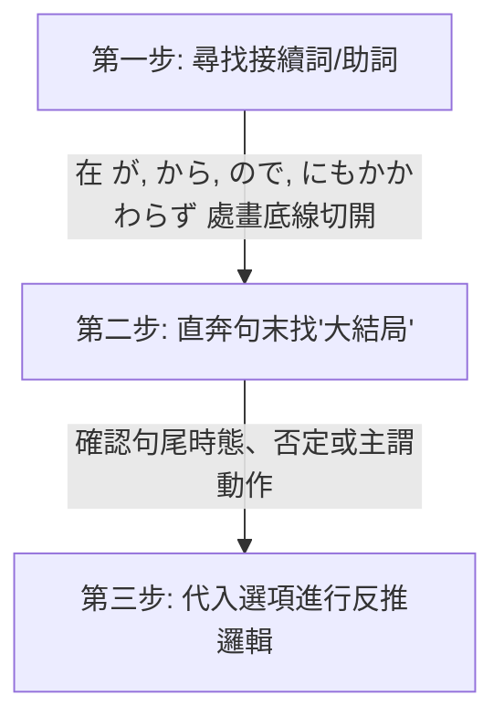

# 🌸 JLPT N2 核心備考與學習優化筆記

歡迎來到你的專屬 N2 備考空間！這份筆記對原有的 NotebookLM 碎片化內容進行了結構化重組與深度擴充，融入了**畫面聯想法**與**切西瓜閱讀法**，旨在將「死記硬背」轉化為「直覺反射」。

---

## 🎯 個人化學習背景與備考策略 (Personalized Strategy)

> [!NOTE]
> **你的學習畫像 (Learning Profile)**：
> *   **優勢**：通過動漫、遊戲積累了良好的「語感」與「聽力直覺」，具備接近 **N3** 的潛在實力。
> *   **盲點**：從未系統性學習日語，直接挑戰 **N2**，因此**文法基礎較為薄弱**（如接續詞、敬語、自他動詞、副詞搭配等常有知識盲區）。
> *   **核心教材**：《新日檢完勝對策 N2》（8 週架構） + 動漫/遊戲日常生詞積累。

### 🚀 學習優化三部曲
1.  **「單字」與「文法」雙軌並行，不要分開！**
    *   由於 N2 的字彙和文法深度綁定（很多副詞和接續詞就是文法題考點，例如 `のに` / `ので`），**不需要等整本單字背完才看文法書**。建議每天在看《完勝對策單字》的同時，翻開《完勝對策文法》的對應章節進行對照，把看不懂的接續規則隨時發在這裡，我來幫你梳理。
2.  **將「動漫/遊戲生詞」融入《完勝對策》的主題中**
    *   《完勝對策》是按**生活主題**（如：廚房、掃除、辦公室）劃分每天任務的。當你在動漫或遊戲裡看到生詞時，我會幫你把它們歸類到筆記中的相應主題表格中。這樣可以把“破碎的娛樂記憶”轉化為“系統的考試分數”。
3.  **語感轉化為文法規則**
    *   在遊戲中聽到的「口語/台詞」，往往包含複雜的語法（例如使役被動、授受關係）。遇到看不懂的台詞，隨時寫在 [note.txt](file:///D:/StudyJapanese/note.txt)，我會為你拆解背後的 N2/N3 文法邏輯。

### 📊 N2 考試核心考點與優先級分析 (Exam Priorities)

由於你是從 N3 語感直接跳考 N2，**不需要死背每一個單字**，應採取「高回報率」的策略。以下為你分析 N2 考題中各類內容的權重與筆記中的優先級標記：

#### 🔴 優先級 1：核心考點與語意理解關鍵（⚠️ 權重極高，必拿分）
*   **自他動詞**：如 `ずれる/ずらす`、`閉まる/閉める`。不僅單字會考，**聽力題**中也常考「到底是誰做了這件事」，分不清自他動詞在聽力中會被秒殺。
*   **核心漢字辨析**：如六個 `はかる`（`量る/計る/測る/圖る/謀る/諮る`）、`揃う/揃える`。常考在讀音或漢字選擇題中。
*   **敬語與謙讓語**：如 `伺う`、`拝見する`。主要考在文法選擇題和職場閱讀中，也是華人考生的重災區。
*   **備考策略**：**每天都要看一遍**。這部分是考試的硬性拿分點，必須熟練到反射動作的程度。

#### 🟡 優先級 2：副詞、接續詞與核心動詞（🌟 權重高，閱讀理解的靈魂）
*   **副詞與接續詞**：如 `一段と`、`常々`、`差異`。副詞常出現在單字填空題，而接續詞決定了文章的邏輯轉折，**閱讀理解（長文）的死活完全取決於你有沒有看懂接續詞**。
*   **動作與身體狀態動詞**：如 `省く`、`溜まる`、`しつける`、`綜合` 系列。這些動詞是閱讀理解中描述細節的關鍵。
*   **備考策略**：**每週複習一次**。重點在於理解其前後語意邏輯與情境接續。

#### 🟢 優先級 3：日常/電腦文書處理詞彙（📊 權重中低，混個眼熟即可）
*   **日常/生活專有名詞**：如 `小兒科`、`停留所`、`築二十年`。
*   **電腦文書詞彙**：如 `改行する` (換行)、`余白` (邊距)。
*   **備考策略**：這類詞彙主要是為了應對**「資訊檢索（通知信件、公文閱讀）」**題型。你不需要會拼寫、也不用知道它的深層字源，**只要在閱讀題中看到時能「認出」它是換行、邊距或小兒科即可**。**每兩週複習一次**即可。

---

## 📅 學習進度與每日複習建議 (Study Tracker)
> [!TIP]
> **「1-3-7-14」 遺忘曲線複習法與筆記瘦身機制**：
> - **第一天**：通讀本筆記中的「核心學習策略」，嘗試用「切西瓜法」分析 3 個長難句。
> - **第三天**：重點複習「自他動詞對照表」，遮住他動詞，嘗試根據畫面感寫出對應的自動詞。
> - **第七天**：複習「六大 Hakarus」與「Awases」，用它們各自造一個句子。
> - **第十四天**：快速掃視「分類詞彙表」，只看日語漢字，能在一秒內反應出讀音與畫面者過關，否則打星號標記。
>
> **💡 筆記防臃腫與高效複習三原則**：
> 1.  **導入「紅黃綠」標記**：
>     *   `🔴` (生疏/極難記)：每天都要看一遍。
>     *   `🟡` (模糊/需複習)：每週複習一次，若複習時答對則升為綠色，答錯降為紅色。
>     *   `🟢` (熟記/已掌握)：兩週複習一次。
> 2.  **定期歸檔 (Archiving)**：
>     *   當某些單字已經連續三次維持在 `🟢` (熟記) 狀態時，我們會將它們**移出主筆記**，歸檔到 `Mastered_Vocabulary_Archive.md` 中。主筆記只保留你「還不會」或「不熟」的內容，永遠保持在 **500 行以內**。
>     *   只在考前一週把歸檔文件調出來快速掃視即可。
> 3.  **主動回想 (Active Recall) 摺疊設計**：
>     *   我們會在複習表中將中文釋義或讀音用 Markdown / HTML 摺疊代碼包裹，複習時遮住答案，點擊再顯現，達到自我測試的效果。

---

## 目錄 (Table of Contents)
- [💡 核心學習策略與方法論 (Methodology)](#-核心學習策略與方法論-methodology)
  - [1. 「切西瓜」長難句拆解法 (Sentence Slicing)](#1-切西瓜長難句拆解法-sentence-slicing)
  - [2. 「畫面感」字根聯想記憶法 (Visual Anchoring)](#2-畫面感字根聯想記憶法-visual-anchoring)
  - [3. 「猜字遊戲」：面對日語生詞的三大推理工具 (How to Deduce Vocabulary)](#3-猜字遊戲面對日語生詞的三大推理工具-how-to-deduce-vocabulary)
- [⚠️ 語法與句型易錯點 (Common Pitfalls)](#-語法與句型易錯點-common-pitfalls)
  - [1. 職場社交：主動請求 vs 被動請求](#1-職場社交主動請求-vs-被動請求)
  - [2. 時間接續：做完某事之後](#2-時間接續做完某事之後)
  - [3. 因果與轉折：ので vs のに](#3-因果與轉折ので-vs-のに)
  - [4. 易混淆詞彙與情境辨析 (職場與生活)](#4-易混淆詞彙與情境辨析-職場與生活)
- [🔍 核心漢字與同音/近義詞辨析 (Kanji & Synonym Distinctions)](#-核心漢字與同音近義詞辨析-kanji--synonym-distinctions)
  - [1. 「はかる」的六大漢字辨析](#1-はかる的六大漢字辨析)
  - [2. 「～合わせ」複合動詞辨析](#2-合わせ複合動詞辨析)
  - [3. 空間角落：角（かど/つの/かく） vs 隅（すみ）](#3-空間角落角かどつのかく-vs-隅すみ)
  - [4. 金融財務：稼ぐ vs 儲ける vs 儲かる](#4-金融財務稼ぐ-vs-儲ける-vs-儲かる)
  - [5. 「取り」與「やり」複合詞辨析 (Tori & Yari series)](#5-取り與やり複合詞辨析-tori--yari-series)
  - [6. 「揃い（そろい）」與「お揃い」用法與自他動詞全解析](#6-揃いそろい與お揃い用法與自他動詞全解析)
  - [7. 電腦文書處理常見近義詞與易混詞辨析](#7-電腦文書處理常見近義詞與易混詞辨析)
  - [8. 「切る」與「切れる」多義性解析 (用完/過期/生氣)](#8-切る與切れる多義性解析-用完過期生氣)
  - [9. 「刪除/清除」近義詞辨析 (消去/削除/消す/取り消す/除去/削減)](#9-刪除清除近義詞辨析-消去削除消す取り消す除去削減)
  - [10. 謙讓語與同音異義字辨析：伺う（うかがう） vs 窺う（うかがう）](#10-謙讓語與同音異義字辨析伺ううかがう-vs-窺ううかがう)
- [🔄 自他動詞專項整理 (Intransitive & Transitive Verbs)](#-自他動詞專項整理-intransitive--transitive-verbs)
- [📚 分類核心詞彙表 (Categorized Vocabulary List)](#-分類核心詞彙表-categorized-vocabulary-list)
  - [Ⅰ. 職場與商務 (Workplace & Business)](#ⅰ-職場與商務-workplace--business)
  - [Ⅱ. 家庭與日常生活 (Daily Life & Housework)](#ⅱ-家庭與日常生活-daily-life--housework)
  - [Ⅲ. 動作、身體與狀態 (Actions, Body & States)](#ⅲ-動作身體與狀態-actions-body--states)
  - [Ⅳ. 金融與銀行操作 (Finance & Banking)](#ⅳ-金融與銀行操作-finance--banking)
  - [Ⅴ. 描述、程度與副詞 (Descriptions & Adverbs)](#ⅴ-描述程度與副詞-descriptions--adverbs)

---

## 💡 核心學習策略與方法論 (Methodology)

### 1. 「切西瓜」長難句拆解法 (Sentence Slicing)
閱讀 N2 長難句時，不要習慣性地從左到右死譯。這會導致大腦短期記憶載荷過大，漏掉前後邏輯。請使用以下三步：



#### 💡 實戰案例分析
> **例題**：申し訳ありません。部長はちょっと（　　）おりますが、すぐ戻ると思います。
>
> 1. **切斷**：在 **が** (但是/稍微帶出後文) 處切開。
>    - 前半句：`部長はちょっと（ 空格 ）おりますが`
>    - 後半句：`すぐ戻ると思います` (我想他馬上會回來)
> 2. **找大結局**：後半句的靈魂是 **「すぐ戻る (馬上回來)」**。
> 3. **反推空格邏輯**：既然能「馬上回來」，說明人還在公司，只是暫時離開。
>    - 選項 `早退して` (早退/回家了)、`休みを取って` (請假了) 均不符合「馬上回來」的前提。
>    - 選項 `不足して` (人手不足) 搭配不通。
>    - 答案鎖定：**`席を外して` (離開一下座位)**，完美契合！

---

### 2. 「畫面感」字根聯想記憶法 (Visual Anchoring)
利用漢字字根的核心「動作畫面」來連帶記憶一長串詞彙，避免孤立背誦。

#### 🔹 典型案例 1：字尾 `込む（こむ）` —— “深深地塞入、灌注、沉浸”
*   **字根獨立用法**：
    *   **込む（こむ）** 與 **混む（こむ）**【自動詞】：這兩個詞在發音與語源上完全相同，但在現代日語的漢字書寫上有明確的分工：
        *   **混む**：專門用來表示**「擁擠、人多、混雜」**（例：`電車が混んでいる` 電車很擠。因為「混」有混雜擠在一起的畫面，這是最標準的寫法）。
        *   **込む**：專門用來表示**「進入內部、包含在內」**（例：`税込み` 含稅、複合動詞接尾詞 `～込む`）。
*   **字尾接尾詞用法（～込む）**：
    *   接在動詞連用形（去ます形）後，構成複合動詞。主要有以下 **四大核心畫面感**（如果覺得較難記憶，可以參考下方補充的動漫與遊戲高頻詞）：

##### 1. 朝著內部進去、放入之內 (Into / Inside)
*   **書き込む（かきこむ）**：寫（書き）進去（込む） ➔ **填寫、留言、登錄數據**。
*   **飛び込む（とびこむ）**：跳（飛び）進去（込む） ➔ **跳入、飛奔進入**（例：`プールに飛び込む` 跳入泳池）。
*   **吸い込む（すいこむ）**：吸（吸い）進去（込む） ➔ **吸入、吸收**（例：`掃除機がゴミを吸い込む` 吸塵器吸入垃圾）。
*   **入れ込む（いれこむ）**：
    1.  *物理面*：放（入れ）進去（込む） ➔ **裝入、塞入**（例：`予定をカレンダーに入れ込む` 把行程塞入行事曆）。
    2.  *精神面*：把心力/感情放（入れ）得很深進去（込む） ➔ **沉迷、著迷、熱衷、傾注情感**（例：`競馬に入れ込む` 沉迷賽馬、`彼女に入れ込む` 對女友極度迷戀）。

##### 2. 徹底、深刻、持續的狀態 (Thoroughly / Deeply)
*   **思い込む（おもいこむ）**：想（思い）得太深進去了 ➔ **深信不疑、認定、誤以為**（例：`自分が正しいと思い込む` 盲目認定自己是對的）。
*   **信じ込む（しんじこむ）**：相信（信じ）得很深 ➔ **深信不疑、篤信**。
*   **落ち込む（おちこむ）**：掉（落ち）得很深進去 ➔ **情緒低落、沮喪**；或經濟**下滑、蕭條**（例：`成績が落ち込む` 成績下滑）。
*   **煮込む（にこむ）**：煮（煮）得很透、讓味道滲透進去 ➔ **燉煮、熬煮**。

##### 3. 固化、保持在原地 (Fixing / Staying)
*   **座り込む（すわりこむ）**：坐下就不起來了 ➔ **靜坐、坐著不動**（例：`道端に座り込む` 坐在路邊不走）。
*   **泊まり込む（とまりこむ）**：住下不走了 ➔ **留宿、通宵加班不回家**（例：`会社に泊まり込む` 住在公司加班）。
*   **黙り込む（だまりこむ）**：保持沉默不說話了 ➔ **陷入沉默、沉默不語**。

##### 4. 原有詞彙的延伸（已收錄於筆記）：
*   **振り込む（ふりこむ）**：揮動(振る)著把錢「塞入」 ➡️ **轉帳**。
*   **払い込む（はらいこむ）**：把應付款項「塞入」 ➡️ **繳納、還錢**。
*   **仕込む（しこむ）**：為了做事(仕事)而提前把材料或心力「塞入」 ➡️ **事先準備、訓練/教導徒弟或動物**（類似 `躾ける` 的畫面）。
*   **引き込む（ひきこむ）**：拉扯(引く)著塞進去 ➡️ **拉入、捲入**。

##### 🎮 覺得聯想太抽象？請直接記住 N2 / 動漫與遊戲最常出現的「這 5 個核心詞」：
1.  **落ち込む（おちこむ）**
    *   *動漫畫面*：角色頭頂有三條藍色陰影，蹲在角落畫圈圈。
    *   *含意*：**沮喪、憂鬱、心情掉進谷底**；或經濟/業績**下滑**。
    *   *例句*：`成績が落ちて、かなり落ち込んでいる。` (成績退步，現在非常沮喪。)
2.  **思い込む（おもいこむ）**
    *   *遊戲畫面*：你一直主觀認定某個角色是壞人，結果他根本是來幫你的。
    *   *含意*：**誤以為、主觀認定、深信不疑**（思維鑽牛角尖出不來）。
    *   *例句*：`彼は犯人だと思い込んでいたが、間違いだった。` (我深信他就是犯人，結果搞錯了。)
3.  **申し込む（もうしこむ）**
    *   *動漫畫面*：男主角鼓起勇氣對女主角提出交往的請求（交際を申し込む）。
    *   *含意*：**申請、報名、提出（申請/告白）**（把自己的請求送進去）。
    *   *例句*：`日本語能力試験の受験を申し込む。` (報名參加日語能力試驗。)
4.  **黙り込む（だまりこむ）**
    *   *RPG對話畫面*：對話框出現「……」，角色低下頭，氣氛陷入尷尬。
    *   *含意*：**陷入沉默、一句話也不說**（沉默的狀態固定不變了）。
    *   *例句*：`理由を聞かれて、彼は黙り込んでしまった。` (被問及理由，他便陷入了沉默。)
5.  **煮込む（にこむ）**
    *   *遊戲烹飪系統*：把各種蔬菜和肉類丟進大鍋裡慢火熬煮以製作料理。
    *   *含意*：**慢火燉煮、熬煮**（讓調味料和湯汁徹底滲透進去）。
    *   *例句*：`カレーを弱火でじっくり煮込む。` (用小火慢慢熬煮咖哩。)

##### 💡 額外補充：你提過的 **入れ込む（いれこむ）**
*   *聯想*：把自己的精力與熱情「全部塞進去」某個嗜好或對象中。
*   *含意*：**沉迷、熱衷、迷戀**。
*   *例句*：`彼はソシャゲ（手遊）のガチャに入れ込んでいる。` (他沉迷於手機遊戲的抽卡。)

---
#### 🔹 典型案例 2：字根 `組む（くむ）` —— “互相交叉、結合、 interlocking”
想像兩根繩子或人的雙手雙腳交織在一起的動作：
*   **腕/足を組む**：雙手抱胸 / 翹二郎腿（身體交叉）。
*   **スケジュールを組む**：把零散的時間塊「交叉拼接」在一起 ➡️ **制定/排定日程表**。
*   **コンビを組む**：兩個人緊密結合在一起 ➡️ **搭檔、組隊**。

---

### 3. 「猜字遊戲」：面對日語生詞的三大推理工具 (How to Deduce Vocabulary)
日語確實很難死記硬背，但它有一個巨大的優勢：**高度模組化**。面對不認識的 N2 甚至 N1 單字，可以利用以下三個推理工具來猜測意思：

#### 🛠️ 工具一：音讀字（漢語詞）的「積木拆字法」
音讀單字（如 `削減`, `削除`, `消去`, `排除`, `除去`）是由漢字積木拼接而成的。只要掌握個別漢字的核心畫面，就可以像拼積木一樣猜出整組詞的意思：
*   **削（さく）**：核心畫面是「拿刀去切、刮掉、削弱」。
    *   `削減` = 刮掉（削）+ 變少（減） ➔ **縮減（預算/成本）**。
    *   `削除` = 刮掉（削）+ 去掉（除） ➔ **刪除（字元/檔案/帳號）**。
*   **除（じょ）**：核心畫面是「除掉、弄走不想要的雜質或東西」。
    *   `除去` = 除掉（除）+ 拿走（去） ➔ **排除、清除（毒素/雜質）**。
    *   `排除` = 除掉（除）+ 排擠（排） ➔ **排除、排除（障礙/威脅）**。

#### 🛠️ 工具二：訓讀動詞的「字尾/接頭詞推理」
日語的純日語動詞（訓讀字，如 `～直す`, `～出す`, `～合わせ連`, `～込む`）非常規律。複合動詞的後半部分決定了**「動作的方向、狀態或性質」**：
*   **～直す（なおす）** ➔ 核心畫面是「修復、改進、重新來過」。
    *   `やり直す` = 做（やり）+ 重新來 ➔ **重做**。
    *   `見直す` = 看（見）+ 重新來 ➔ **重新考慮、複審、改觀**。
    *   `書き直す` = 寫（書き）+ 重新來 ➔ **重寫**。
*   **～出す（だす）** ➔ 核心畫面是「朝向外面、或是動作開始」。
    *   `引き出す` = 拉（引き）+ 出來 ➔ **拉出、提款**。
    *   `思い出す` = 想（思い）+ 出來 ➔ **回想起來**。
    *   `動き出す` = 動（動き）+ 出來 ➔ **開始動起來**。
*   **～合わせる（あわせる）** ➔ 核心畫面是「湊在一起、核對、對齊」 ➔ `問い合わせる`（詢問核對）、`打ち合わせる`（事前商量）。

#### 🛠️ 工具三：「名詞/擬聲詞變身動詞」的字源溯源法
日語許多三音節、四音節的訓讀動詞，通常是由**我們已經認識的基礎名詞**或**擬聲擬態詞**演變而來的。當你看到一個生詞，試著看它的前半部分：
*   **こなす** ➔ 前兩個音是 `こな`（粉） ➔ 磨成粉 ➔ 消化 ➔ **消化、搞定工作**。
*   **ずらす/ずれる** ➔ 來自副詞 `ずるずる`（滑動、拖延的擬態聲音） ➔ **偏離、挪動**。
*   **たまる/ためる** ➔ 來自 `田（た - 水田）` 或 `水たまり（水窪）` ➔ 聚水 ➔ **積攢、儲存**（如：垃圾堆積、存錢）。
*   **宿る（やどる）** ➔ 來自 `宿（やど - 旅館/客棧）` ➔ 住宿 ➔ **寄生、寄宿、懷孕**。
*   **煙る（けむる）** ➔ 來自 `煙（けむり - 煙霧）` ➔ **冒煙、煙霧濛濛**。

---

## ⚠️ 語法與句型易錯點 (Common Pitfalls)

### 1. 職場社交：主動請求 vs 被動請求
在商務日語中，主動請求對方做事與請求對方允許自己做事極易混淆，直接關係到職場禮貌。

> [!WARNING]
> *   **`～してください`** / **`ご～ください`**：**「請你做某事」**（動作發出者是**對方**）。
> *   **`～させてください`**：**「請讓我做某事」**（使役形 + ください，動作發出者是**自己**）。

*   **錯誤造句**：`スケジュールを組んだあとで、連絡させてください。`❌
    *   *誤讀意*：日程表排好之後，請**讓我**聯絡你（如果你是老闆/客戶，這樣說顯得很奇怪）。
*   **正確改法**：
    *   **平輩/一般同事**：`スケジュールを組んだあとで、連絡してください。` (排好日程後請聯絡我)
    *   **對上級/客戶（敬語）**：`スケジュールを組んだあとで、ご連絡ください。` / `スケジュールを組んでから、ご連絡ください。`

---

### 2. 時間接續：做完某事之後
表示「做完前項動作，再做後項」時：
*   **`動詞た形 + あとで`** (在...之後)
    *   注意「組む」的過去式是 `組んだ`。不要多寫促音，如 `組んだったあとで` ❌ 是錯誤的，應為 **`組んだあとで`** ⭕。
*   **`動詞て形 + から`** (自從...以後 / 緊接著做...)
    *   **`スケジュールを組んでから、ご連絡ください。`**

---

### 3. 因果與轉折：ので vs のに
這兩個詞非常容易因為只差一個字而混淆：
*   **`ので`（表示客觀因果）**：相當於 `から`，表示「因為前者的緣故，所以導致了後者的客觀結果」。語氣比 `から` 更柔和客氣。
*   **`のに`**：
    1.  **表示轉折（明明……卻）**：`一生懸命勉強したのに、不合格だった。` (明明拼命學了，卻沒考過)。
    2.  **表示目的/用途（為了……）**：當後面接 `使う` (使用)、`必要` (必要)、`かかる` (花費時間/金錢) 等詞時。
        *   `この仕事をするのに1時間かかる。` (為了做這工作需要花1小時)。

---

### 4. 易混淆詞彙與情境辨析 (職場與生活)

#### 💡 辨析 1：轉勤（転勤） vs 派遣（派遣）
*   **句型**：`大阪支社から（転勤）してきました、田中と申します。` (我叫田中，是從大阪分公司調職過來的。)
*   **為什麼不能用「派遣」？**
    *   **転勤（てんきん）**：指**「同一家公司內部，不同分公司/部門之間的調職、轉勤」**。你依然是這家公司的正式員工，所以說「從大阪分公司（支社）調職過來」非常自然。
    *   **派遣（はけん）**：指**「派遣（外包）員工」**。派遣員工的雇主是「派遣公司（派遣会社）」，被派到客戶公司工作。
        1.  *文法問題*：`派遣する` 是他動詞「派遣某人」，自我介紹時應使用被動形 `派遣されてきました`。
        2.  *情境問題*：派遣通常是從「派遣公司」派來，而不是從「大阪分公司（支社）派遣過來」。

#### 💡 辨析 2：離席（席を外す） vs 讓座（席を譲る）
*   **為什麼「バスで老人に席を外した」是錯誤的？**
    *   **席を外す（せきをはずす）**：指**「暫時離開座位/辦公桌（一會兒就回來）」**。這張辦公桌或座位的**所有權依然是你的**，你只是人暫時不在。
        *   *例句*：`課長の鈴木は今、席を外しております。` (鈴木課長現在暫時離開座位了 ➔ 他還在上班，等一下就回座位)。
    *   **席を譲る（せきをゆずる）**：指**「讓座、把座位讓給別人（轉交所有權）」**。
        *   *例句*：`バスで老人に席を譲った。` (在公車上讓座給老人 ➔ 正確 ⭕)。

---

### 5. 實用長句拆解與語法分析 (Real-World Sentence Slicing)

在你提供的 [note.txt](file:///D:/StudyJapanese/note.txt) 中有以下兩句經典的日檢及日常實用句子，我們使用**「切西瓜閱讀法」**來為你逐一拆解：

#### 💡 句子 1：再配送須知（快遞/物流常用提示）
> **ご連絡を頂きました時間によっては、当日の再配達ができない場合がございます。**
> *(原文 `できない場合はございます` 應為商務日語的 `場合がございます`，在此作標準語法拆解。)*

*   **切西瓜分段拆解**：
    1.  **ご連絡を頂きました** ➔ **主動聯絡的動作（對象是「您」）**
        *   `頂きました` 是 `もらう` 的謙讓語，字面是「我們承蒙您給予聯絡」，這是日本商家對顧客的客氣說法。
    2.  **時間によっては** ➔ **文法考點：`～によっては` (根據……而有所不同)**
        *   表示前項的「時間」會決定後面的結果。
    3.  **当日の再配達ができない** ➔ **當天無法重新配送**
        *   `再配達（さいはいたつ）`：在日本，如果快遞員送貨上門時你不在家，他會留下一張「不在聯絡票」，你需要聯絡他們重新投遞。
    4.  **場合がございます** ➔ **文法考點：`～場合がある / ～ことがある` (有時會出現……的情況)**
        *   用在商務或委婉口氣中，比直接說 `できません` (不行) 更客氣。
*   **整句中文大意**：**「根據您聯絡我們的時間不同，有時候可能會出現當天無法重新配送的情況。」**
*   *備考策略*：遇到 N2 的資訊檢索題（閱讀最後一題，通常是快遞單或廣告），這句話非常關鍵，代表「如果聯絡得太晚，今天就拿不到包裹了」。

---

#### 💡 句子 2：工作分配說明（辦公室/班級常用語）
> **今お配りしたプリントに作業の分担が書いてあります。**

*   **切西瓜分段拆解**：
    1.  **今お配りした** ➔ **文法考點：`お + 動詞連用形 + した / する` (謙讓語，我為您做某事)**
        *   `配る（くばる）` (分發) 去掉 `る` 接上 `お...した` 變成 `お配りした`，表示「我發（給各位）的」。
    2.  **プリントに** ➔ **講義/資料上**
        *   `プリント`：源自英文 Print，在日本指學校或公司開會發的**單張講義、印好的資料**。
    3.  **作業の分担が** ➔ **工作的分配/分工**
    4.  **書いてあります** ➔ **文法考點：`動詞て形 + あります` (表示人有意施加的動作所留下來的既存狀態)**
        *   這裡的動作是「寫（書く）」，`書いてあります` 表示「上面已經寫好了（你現在能看到這個寫好的狀態）」。
*   **整句中文大意**：**「剛剛發給各位的講義上，有寫著工作的分配。」**
*   *備考策略*：這句話在 N2 聽力的第一大題（課題理解）非常常考，聽到這句話，接下來的題目通常就會問你「接下來某個人要負責做什麼工作」。

---

### 6. 實用商業告示牌與免責聲明句型拆解 (Store Signs & Disclaimers)

在日本生活、旅遊，或者在 N2 的閱讀理解「資訊檢索」中，常常需要看懂商店、洗衣店的提示牌與免責聲明。我們來拆解你提供的兩句非常地道、實用的告示牌句子：

#### 💡 句子 1：洗衣店/寄物處的溫馨提示
> **ポケットの中に忘れ物がないか点検してからお出し下さい。**

*   **「切西瓜」分段拆解**：
    1.  **ポケットの中に忘れ物がないか** ➔ **口袋裡有沒有遺留物品**
        *   `忘れ物`：遺漏的東西、忘記拿走的東西。
        *   `～ないか`：表示**「是否……」**的疑問（有沒有……）。
    2.  **点検してから** ➔ **檢查之後再……**
        *   `点検する`：檢查、點檢。
        *   `～てから`：表示動作的先後順序（先做前項，再做後項）。
    3.  **お出し下さい** ➔ **文法考點：`お + 動詞連用形 + ください` (敬語：請您做某事)**
        *   `出す` (拿出來/交給我們) 去掉 `す` 加上 `お...ください` 變成 `お出しください`（請拿出來/請交給我們）。
*   **整句中文大意**：**「請檢查口袋中是否有遺留物品後，再交給我們。」**
*   **實用場景**：常出現在洗衣店（送洗衣服前需清空口袋）或飯店前台寄放行李處。

---

#### 💡 句子 2：店家的免責聲明（非常重要！）
> **お引き取りがなく、1ヶ月以上経過した品物は責任を負いかねます。**

*   **「切西瓜」分段拆解**：
    1.  **お引き取りがなく** ➔ **若沒有前來領取**
        *   `引き取り（取件、領回）`：動詞 `引き取る` 的名詞化，前面加 `お` 敬語化。
    2.  **1ヶ月以上経過した品物は** ➔ **且經過了一個月以上的物品**
        *   `経過する（けいかする）`：時間流逝、經過。
    3.  **責任を負いかねます** ➔ **文法考點：`動詞連用形 + かねます` (很難…… / 無法……)**
        *   **`～かねます`** 是 N2 重點語法，用來表示**「主觀上很難做到，因此委婉拒絕/否定」**。在日本服務業中，店家絕對不會生硬地說 `できません` (我們不能)，而是用 `負いかねます` (恕難承擔)。
        *   `負う（おう）`：承擔、背負（責任、受傷等）。
*   **整句中文大意**：**「若未前來領回，且逾期一個月以上的物品，本公司恕不承擔保管責任。」**
*   **實用場景**：洗衣店、行李寄存處、失物招領處等。如果逾期未取，物品丟失或損壞，商家依法不予賠償。

---

## 🔍 核心漢字與同音/近義詞辨析 (Kanji & Synonym Distinctions)

### 1. 「はかる」的六大漢字辨析
日語中讀作 `はかる` 的動詞極多，考試中常以漢字選擇題出現。

| 漢字 | 核心畫面與測量對象 | 常見搭配 | 中文釋義 |
| :--- | :--- | :--- | :--- |
| 🔴 **量る** | 測量**重量**或**體積/容器容量** | 体重/重さを量る、容積を量る | 稱量、分量 |
| 🔴 **計る** | 測量**時間**、**數字**或**度數** | 時間を計る、熱（体温）を計る、計画を計る | 計時、計算 |
| 🔴 **測る** | 測量**空間長度**、**面積**、**溫度**、**高度**或**數值深度** | 身長/熱さを測る、水深を測る、面積を測る | 測量、測定 |
| 🔴 **図る** | 努力爭取實現某個**目標**、**計劃**或**對策** | 解決を図る、再起を図る、便宜を図る | 謀求、力圖 |
| 🔴 **謀る** | 設計**算計別人**、**策劃陰謀**或**欺騙** | 暗殺を謀る、だまして金をとろうと謀る | 策劃、圖謀、算計 |
| 🔴 **諮る** | 將疑問或議題提交給眾人**商討、諮詢意見** | 委員会に諮る、会議に諮って決定する | 諮詢、商討 |

---

### 2. 「～合わせ」複合動詞辨析
這組詞的核心都是 `合わせる`（把東西湊在一起/對齊），區別在於前綴動詞帶來的動作感：

```
引き (拉扯) ──> 把兩人拉近碰面 ──> 引き合わせ (引見 / 對照)
取り (拿取) ──> 從中挑幾件湊齊 ──> 取り合わせ (搭配 / 組合)
打ち (敲擊) ──> 敲打樂器對齊節拍 ─> 打ち合わせ (商量 / 事前會議)
問い (詢問) ──> 提出疑問對齊解答 ─> 問い合わせ (詢問 / 諮詢)
```

1.  **引き合わせ（ひきあわせ）**：
    *   *畫面*：你伸手拉著（引く）A 和 B，讓他們站到一起（合わせる）。
    *   *含義*：**引見、介紹**（讓雙方認識）；**對照、對比**（把兩份資料拉到一起比對）。
2.  **取り合わせ（とりあわせ）**：
    *   *畫面*：在一堆衣服或食物裡挑拿（取る）出來幾樣湊在一起（合わせる）看協調不協調。
    *   *含義*：**搭配、組合、配色**（常指拼盤、穿搭、禮盒搭配）。
3.  **打ち合わせ（うちあわせ）**：
    *   *畫面*：源於演奏樂器前，樂手們互相「敲擊（打ち）」樂器以「對齊（合わせ）」音調拍子。
    *   *含義*：**商量、事前碰頭會議**（職場極高頻詞）。
4.  **問い合わせ（といあわせ）/ 問い合わせる**：
    *   *畫面*：向對方提出詢問（問う），並把得來的解答與事實核對對齊（合わせる）。
    *   *含義*：**詢問、查詢、諮詢、聯絡處**（常見於官網的聯絡我們）。

---

### 3. 空間角落：角（かど/つの/かく） vs 隅（すみ）
同樣是「角落」，視角的內外方向完全不同：
*   **角（かど）**：**外部凸角**。從外面看突出的地方。
    *   *例*：`街角（まちかど）` (街角)、`机の角に頭をぶつけた` (頭撞到桌角)。
*   **隅（すみ）**：**內部凹角**。從裡面看縮進去的角落（通常顯得陰暗、隱蔽）。
    *   *例*：`部屋の隅（すみ）にゴミがたまっている` (房間角落堆著垃圾)。
*   **其他讀音補充**：
    *   `角（つの）`：動物的角（如鹿角、牛角）。
    *   `角（かく）`：幾何學上的角度。

---

### 4. 金融財務：稼ぐ vs 儲ける vs 儲かる
這三個詞都與「賺錢」有關，但賺錢的「性質」和自他動詞性有別：
*   **稼ぐ（かせぐ）**【自他】：**出汗出力賺取辛苦錢**。靠工作、出賣時間或勞動力換取薪水。
    *   *例*：`一生懸命働いてお金を稼ぐ。` (拼命工作賺錢)
*   **儲ける（もうける）**【他動】：**靠商業運作或運氣賺大錢/獲暴利**。多用於做生意、股票或中獎。
    *   *例*：`株で百万ドルを儲けた。` (炒股賺了一百萬美元)
*   **儲かる（もうかる）**【自動】：**（生意/店鋪）很賺錢、有收益**。主語通常是店鋪、生意、行業。
    *   *例*：`あの店は最近かなり儲かっている。` (那家店最近非常賺錢)

---

### 5. 「取り」與「やり」複合詞辨析 (Tori & Yari series)
這組詞都包含「取り（拿）」或「やり（給）」，在 N2 聽力與職場對話中非常高頻：

*   **引き取り（ひきとり）**【名/自他】
    *   *字面畫面*：拉回來（引き）收到自己手中（取る）。
    *   *核心釋義*：**領回、領取、接管、收回**。
    *   *例句*：`空港で預けた荷物の引き取りを行う。` (在機場領取寄存的行李)
*   **やり取り（やりとり）**【名/他動】
    *   *字面畫面*：我給你拿（やり），你給我拿（取り） ➔ 雙向傳遞。
    *   *核心釋義*：**往來、交換、互動、交流**（如收發郵件、意見交流）。
    *   *例句*：`取引先とメールのやり取りをする。` (與客戶進行郵件往來/收發郵件)
*   **取り引き（とりひき / 取引）**【名/他動】
    *   *字面畫面*：拿過來（取り）再拉過去（引き） ➔ 雙方的商業拉鋸/等價交換。
    *   *核心釋義*：**交易、買賣、商業往來**。
    *   *例句*：`新しい企業と取引を始める。` (開始與新企業進行商業交易)
*   **取り次ぎ（とりつぎ / 取次）**【名/他動】
    *   *字面畫面*：拿過來（取り）再接續遞給下一個人（次ぎ） ➔ 居中傳達。
    *   *核心釋義*：**轉接、傳達、代辦、代理經銷**（做中間接線人）。
    *   *例句*：`電話を取り次ぐ。` (轉接電話) / `取次店` (代理經銷店)

---

### 6. 「揃い（そろい）」與「お揃い」用法與自他動詞全解析
動漫與日常生活中極常聽到的「お揃い（おそろい）」是名詞「揃い」加上美化語（接頭詞）「お」構成的。其動作核心畫面是**「齊全、一致、整齊排開」**。

#### 🔹 用法 1：配飾、服裝的「同款、成雙成對」
當兩人以上擁有一模一樣的配飾、服裝或小物件時，日語稱為「お揃い」。
*   **お揃いのキーホルダー**：同款的吊飾 / 成對的鑰匙圈。
*   **お揃いの服（お揃いコーデ）**：情侶裝 / 閨蜜同款穿搭。
*   **お揃いにする**：配成一套 / 買同款。
    *   *例句*：`これ、彼とお揃いなんだ！` (這個是我和男朋友的同款喔！)

#### 🔹 用法 2：人員「到齊、聚齊」（敬語/美化語用法）
形容家庭成員或團體成員全部聚齊在一起的狀態。
*   **メンバーがお揃いになりました**：成員都到齊了。
*   **家族お揃いで**：全家聚齊。
    *   *例句*：`皆様お揃いでどちらへお出かけですか？` (大家聚得這麼齊，是要去哪裡呀？)

---

#### 💡 自他動詞延伸：揃う（そろう） vs 揃える（そろえる）
要徹底掌握「揃い」，必須記住它背後的自他動詞組合：

| 動詞 | 自/他 | 核心含意與記憶畫面 | 實用例句 |
| :--- | :--- | :--- | :--- |
| 🔴 **揃う（そろう）** | **自動詞** | 東西或人**「自己聚齊、對齊、一致」**的狀態。 | · 書類が**揃う**（資料齊全了）<br>· 息が**揃う**（呼吸/步伐一致，極有默契）<br>· 靴が綺麗に**揃っている**（鞋子整齊地排著） |
| 🔴 **揃える（そろえる）** | **他動詞** | 人主動去**「把東西聚齊、對齊、弄成一致」**。 | · 書類を**揃える**（把資料收集齊全）<br>· 声を**揃えて**言う（異口同聲地說）<br>· 玄関で靴を**揃える**（在門口把鞋子擺整齊） |

---

### 7. 電腦文書處理常見近義詞與易混詞辨析
在學習本章的辦公室電腦編輯詞彙時，有幾個極易混淆的 N2 核心概念，需要特別注意：

#### 💡 辨析 1：圖片放大是「拡大」，那可以說「拡張」或「増大」嗎？
**答案：絕對不行！** 雖然中文都可以翻譯成“擴大、增加”，但日語中的漢字使用對象有非常嚴格的限制：
*   **拡大（かくだい）**：指**視覺尺寸、比例、面積**的放大。
    *   *常見搭配*：`図/画像を拡大する` (放大圖片/縮放比例)、`写真を拡大コピーする` (放大影印)。
*   **拡張（かくちょう）**：指**範圍、權力、功能、容量**的擴張/擴展。
    *   *常見搭配*：`事業を拡張する` (擴張事業)、`道路を拡張する` (拓寬道路)、`メモリ拡張` (擴充電腦記憶體)。
*   **増大（ぞうだい）**：指**抽象的數量、程度、力量**的增加。
    *   *常見搭配*：`利益が増大する` (利潤增大)、`不安が増大する` (不安感加劇)、`負担が増大する` (負擔增大)。

#### 💡 辨析 2：「やり直す」是重做，那麼有修復或還原（Undo）的意思嗎？
**答案：沒有！**
*   **やり直す（やりなおす）**：表示**「因為前一次失敗或不滿意，而從頭重做、重新開始」**。
    *   *例句*：`失敗したので、もう一度最初からやり直す。` (因為失敗了，所以再次從頭重做)。
*   **元に戻す（もとにもどす）**【他】 / **元に戻る**【自】：這才是電腦軟體中的 **「復原、撤銷（Undo）」**。
    *   *例句*：`間違えて消した文字を、元に戻す。` (把不小心刪除的字復原)。
*   **修理（しゅうり） / 修復（しゅうふく）**：用於機器硬體故障的「修復、修理」，或系統文件的毀損修復。

#### ⚠️ 易錯糾正：「切り取り」與「やり取り」不要記混！
*   **貼り付ける / ペーストする**：貼上、黏貼。
*   **画像を取り込む**：匯入圖像、掃描圖片。
*   **ファイルを添付する**：附加檔案、附加附件。
*   **切り取る / カットする**：剪切、裁切（圖片/文字）。
*   **やり取り（やりとり）**：往來、收發、互動（例如：郵件的往來、言語的交談）。

#### 💡 辨析 3：電腦中病毒，是用「に」感染還是「を」感染？
**答案：用「に」！** 
*   **感染する（かんせんする）**【自動詞/狀態】：本身是「被感染、染病」的狀態，前面接 `に` 代表感染源。
    *   *例句*：`ウイルスに感染する` (感染病毒)、`コロナに感染する` (感染新冠)。
*   **感染させる（かんせんさせる）**【他動詞/使役】：主動去「傳播病毒、讓……感染」，這時才用 `を`。
    *   *例句*：`他のPCにウイルスを感染させる` (讓別台電腦感染病毒)。

---

### 8. 「切る」與「切れる」多義性解析 (用完/過期/生氣)
在日語中，「切る」是動詞的物理起點，但在漫長的語言演變中，它從**「用刀切斷」**的物理動作，延伸出了**「中斷、結束、用盡、過期」**等抽象含意。

#### 💡 自他動詞基礎
*   **切る（きる）**【他動詞】 ➔ 人主動去**「切斷、切開、斬斷」**（例：`紙を切る` 剪紙、`電話を切る` 掛斷電話）。
*   **切れる（きれる）**【自動詞】 ➔ 東西**「自己斷開、中斷、用光」**（例：`糸が切れる` 繩子斷了）。

#### 📈 從「切斷」到「用完/過期」的演變邏輯：
為什麼「切れる」可以表示「用完、過期」？
這是一個非常美的語意延伸過程：

```
1. 物理切斷 (糸が切れる 繩子斷了)
       ↓
2. 流動中斷 (電流/水流/供應被切斷了)
       ↓
3. 資源用光 / 斷貨 (電池が切れる 電池沒電 / 在庫が切れる 斷貨用完)
       ↓
4. 時間截止 / 過期 (期限が切れる 期限被切斷 ➔ 過期)
```

*   **電池が切れる / 電源が切れる**：電池用完了 / 電源斷了。
    *   *聯想*：源源不絕傳輸的電流通道被「切斷」了 ➔ 沒電。
*   **在庫が切れる / 売り切れ**：庫存用完了（斷貨） / 售罄（賣光）。
    *   *聯想*：商品的供應鏈被「切斷」了 ➔ 沒貨了。
*   **期限が切れる / 賞味期限が切れた**：過期 / 賞味期限過了。
    *   *聯想*：時間軸上的那一條期限線段被「切斷」了 ➔ 時間截止。

#### 🎮 動漫高頻延伸：キレる（生氣）
在動漫裡常聽到的 **「キレる / キレた」**（常用片假名書寫），意思是 **「生氣、暴怒、理智斷線」**。
*   *源於*：`堪忍袋の緒が切れる`（忍耐之袋的繩子斷了） ➔ 忍無可忍，理智的弦「斷了」 ➔ 生氣。

---

### 9. 「刪除/清除」近義詞辨析 (消去/削除/消す/取り消す/除去/削減)
這組詞在中文裡都可以翻譯成「刪除、清除、取消」，但在日語中，它們的**適用對象和細微畫面**完全不同，是 N2 詞彙辨析的熱門考點：

#### 🔹 消去（しょうきょ）
*   **字面畫面**：消去跡象，使其不復存在。
*   **核心含意**：**完全抹去、清除（數據、痕跡、變數）**。指讓原本存在的東西「徹底消失」。
*   *常見搭配*：`データを消去する` (清除硬碟/檔案數據)、`履歴を消去する` (清除歷史紀錄)。

#### 🔹 削除（さくじょ）
*   **字面畫面**：削（削）去多餘部分，除（除）去特定條目。
*   **核心含意**：**刪除、剔除（部分文字、條目、檔案、帳號）**。指從一個整體（清單、文件、名單）中，把其中一部分「劃掉/刪掉」。
*   *常見搭配*：`不適切な箇所を削除する` (刪除不妥當的段落)、`ファイルを削除する` (刪除某個檔案)、`文字を削除する` (刪除文字)。

#### 🔹 消す（けす）
*   **字面畫面**：日常生活中的「擦掉、熄滅、關掉」。
*   **核心含意**：最基礎的口語，指**擦去字跡、關掉電燈/電視、熄滅火源**。
*   *常見搭配*：`黒板の文字を消す` (擦掉黑板的字)、`テレビを消す` (關電視)、`火を消す` (滅火)。

#### 🔹 取り消す（とりけす）/ 取消（とりけし）
*   **字面畫面**：拿回來（取り）並消滅它（消す）。
*   **核心含意**：**取消、撤銷、收回（承諾、約定、合約、訂單）**。
*   *常見搭配*：`注文を取り消す` (取消訂單)、`約束を取り消す` (取消約定)、`発言を取り消す` (收回發言)。

#### 🔹 除去（じょきょ）
*   **字面畫面**：除掉有害或不需要的附屬物。
*   **核心含意**：**排除、清除、除去（污垢、毒素、雜草、障礙物）**。
*   *常見搭配*：`毒素を除去する` (排除毒素)、`障害物を除去する` (清除障礙物)。

*   **削減（さくげん）**：
    *   *字面畫面*：削減數量。
    *   *核心含意*：**減少、縮減、削減（預算、成本、人員）**。注意：這不是徹底刪除，而是**減少數量/經費**。
    *   *常見搭配*：`経費を削減する` (縮減開支)、`人員を削減する` (裁員/縮減人手)。

---

### 10. 謙讓語與同音異義字辨析：伺う（うかがう） vs 窺う（うかがう）
讀音為「うかがう」的字是 N2 敬語與詞彙辨析的重中之重。主要分為「謙讓語（伺う）」與「普通動詞（窺う）」兩大陣營：

#### 陣營一：謙讓語「伺う（うかがう）」
「伺う」是極其高頻的**謙讓語**（用於降低自己，向對方表示尊敬），它一個人分飾三角，同時是以下三個動詞的謙讓語：

1.  **「行く（去）」 / 「来る（來）」 的謙讓語 ➔ 拜訪、拜會**
    *   *例句*：`明日、10時にそちらへ伺います。` (我明天 10 點去拜訪您處 ➔ 下對上表現禮貌)。
2.  **「聞く（詢問）」 的謙讓語 ➔ 請教、詢問**
    *   *例句*：`ちょっとお伺いしたいのですが……` (我想稍微向您請教一件事……)。
3.  **「聞く（聽說/聽到）」 的謙讓語 ➔ 聽說、聞悉**
    *   *例句*：`ご高名はかねがね伺っております。` (您的威名我早已有所耳聞 / 久仰大名)。

---

#### 陣營二：普通動詞「窺う（うかがう）」
這是一個普通的 N2 動詞，**沒有敬語含意**。它的核心動作畫面是**「從縫隙中偷偷看、暗中打量、尋找（機會）」**：
*   **窺う（うかがう）**：窺視、暗中觀察、窺探。
*   *常見搭配*：
    1.  `チャンス/好機を窺う` ➔ 尋求時機 / 暗中等待機會（像貓伺機捕鼠一樣）。
    2.  `相手の顔色を窺う` ➔ 察言觀色 / 窺探對方的臉色（看人臉色做事）。
    3.  `內部的様子を窺う` ➔ 窺探內部的動靜。

---

### 11. 「髒污」系列詞彙辨析 (汚い / 汚れる / 汚す / 汚染)
日語中表示「髒」的詞彙，訓讀和音讀的對象與語境不同：
*   **汚い（きたない）**【形】：**乾淨的反義詞**。指物理上的骯髒，或指行為、心靈的卑鄙。
    *   *例句*：`部屋が汚い。` (房間很髒) / `汚い手を使う。` (使用卑鄙的手段)
*   **汚れる（よごれる）**【自五】：**變髒的狀態**（物理上）。主語通常是衣服、手等。
    *   *例句*：`服が泥で汚れる。` (衣服被泥弄髒了)
*   **汚す（よごす）**【他五】：**人主動或不小心弄髒某物**；也可以指玷污名譽。
    *   *例句*：`スープで服を汚してしまった。` (用湯把衣服弄髒了)
    *   *註*：`汚れる/汚す` 也可以唸成 `けがれる/けがす`，但那是**宗教或精神上的「玷污、失去純潔」**（如：神聖的名譽或心靈被玷污）。
*   **汚れ（よごれ）**【名】：**污垢、髒污**。
    *   *例句*：`襟元の汚れを落とす。` (洗掉領口的污垢)
*   **汚染（おせん）**【名・他サ】：**音讀詞彙，專指環境、水源或大自然的污染**。
    *   *例句*：`排気ガスで空気が汚染される。` (空氣被廢氣污染了)

---

### 12. 雙音多義字：額（ひたい） vs 額（がく）
同一個漢字「額」，讀音不同時，意思完全不同，是 N2 常考的漢字雙音字：
*   **額（ひたい）**：**額頭（Forehead）**。
    *   *常見慣用語*：
        1.  `額（ひたい）を集める`：大家把額頭湊在一起 ➔ **聚在一起商量/集思廣益**。
        2.  `猫の額（ひたい）`：像貓的額頭一樣大 ➔ **形容土地或地方極其狹小**（高頻考點）。
*   **額（がく）**：**金額、額度**；或指掛在牆上的**匾額、畫框**。
    *   *常見搭配*：`金額（きんがく）`、`額面（がくめん）` (票面價值)。

---

### 13. 「おさめる」的四大漢字辨析
讀作 `おさめる` 的動詞在日語中有四種常見寫法，考試時常出現在漢字辨析題：
*   **収める（おさめる）**：**收納、取得、獲得、平息**。把東西收進合適的地方，或取得抽象的好結果。
    *   *例句*：`成功/勝利を収める` (取得成功/贏得勝利)；`成果を収める` (取得成果)；`倉庫に収める` (收進倉庫)。
*   **納める（おさめる）**：**繳納、交貨**。把該交的錢或物品交付出去。
    *   *例句*：`税金/会費を納める` (繳稅/交會費)；`注文品を納める` (交貨/納期)。
*   **治める（おさめる）**：**治理、統治、平息**。管理國家、社會或平息混亂。
    *   *例句*：`国/天下を治める` (治國/治理天下)；`紛爭を治める` (平息紛爭)。
*   **修める（おさめる）**：**修得學業、修行**。學習並掌握學問或修養品德。
    *   *例句*：`学業を修める` (完成學業)。

---

### 14. 彙整與收集辨析：集める（あつめる） vs まとめる
這兩個動詞在 N2 的寫作與詞彙理解中非常高頻，它們代表了兩個前後連續的不同動作階段：
*   **集める（あつめる）**【他五】：**「聚集、收集、集中」**。
    *   *畫面*：單純將分散在各處的人、事、物或資訊，**搬到同一個地方**。收集過來後，這些東西通常還是**零散、雜亂的**。
    *   *例句*：`データを集める` (蒐集數據，指下載收集各處的報表，目前仍很混亂)。
*   **まとめる（纏める）**【他一】：**「彙整、整理、使一致、得出結論」**。
    *   *畫面*：將已經收集好、雜亂無章的東西，**進行分類、理順、打包，使其變得井然有序**；或是將分歧的意見**化繁為簡、達成統一共識**。
    *   *例句*：`データをまとめる` (彙整數據，指將收集來的報表分析並製作成精簡的圖表)。
    *   *對比一覽表*：
        *   **意見**：`意見を集める` (收集各方意見) ➔ `意見をまとめる` (將意見彙整一致，得出結論)。
        *   **人手**：`メンバーを集める` (召集小組成員) ➔ `メンバーをまとめる` (領導成員，使團隊團結一致)。
        *   **行李**：`服を集める` (把散落的衣服撿到一堆) ➔ `服を荷物にまとめる` (把衣服整齊打包進旅行箱)。

---

### 15. 「凍・冰」與「藏・儲」讀音與漢字辨析 (こおる / れいとう / れいぞう / ちょぞう)
這一組音讀與訓讀在日常及物流情境（如：寄送冷藏、冷凍包裹）中極常出現：
*   **凍る（こおる）**【自五，🔴】：**結冰、結凍**（訓讀）。
    *   *例句*：`池の水が凍る。` (池水結冰了) 
    *   *自他配對*：`凍る（こおる）`【自】 vs `凍らせる（こおらせる）`【他，使結冰】。
*   **冷凍（れいとう）**【名・他サ，🟡】：**冷凍**（音讀 `凍` 唸 `とう`）。維持在 -15℃ 以下。
    *   *例句*：`肉を冷凍して保存する。` (把肉冷凍保存) / `冷凍食品`。
*   **冷蔵（れいぞう）**【名・他サ，🟡】：**冷藏**（維持在 0℃~10℃ 之間）。
    *   *例句*：`牛乳は冷蔵庫に入れてください。` (牛奶請放冰箱冷藏)
*   **貯蔵（ちょぞう）**【名・他サ，🟡】：**貯藏、儲藏**。
    *   *⚠️ 讀音注意*：漢字「貯」唸 **`ちょ`**。常考讀音選擇題。
    *   *例句*：`食料を倉庫に貯蔵する。` (將糧食儲藏在倉庫)
*   **内蔵（ないぞう）**【名・他サ，🟡】：**內建、內置**。
    *   *例句*：`このパソコンはカメラが内蔵されている。` (這台電腦有內建相機)

---

### 16. 謙讓語與日常詞：「參」字輩辨析 (参る / お参り / 持参)
漢字「參」在日語中有多個重磅考點，包含謙讓語和特殊語境：
*   **参る（まいる）**【自五，🔴】：
    1.  **「行く（去）」「来る（來）」的謙讓語**（下對上表現禮貌）。
        *   *例句*：`ただいま参りました。` (我來了/我到了 ➔ 職場常用)。
    2.  **吃不消、受不了、被打敗**（高頻日常/口語）。
        *   *例句*：`この暑さには本当に参った。` (這天氣熱得我真受不了) / `降参する` (投降)。
*   **持参（じさん）**【名・他サ，🔴】：**攜帶、帶來**。
    *   *💡 備考秘訣*：常用在商業信件或通知中，作為「帶……前來」的客氣說法。
    *   *例句*：`面接の際は、履歴書をご持参ください。` (面試時請攜帶履歷表前來)
*   **お参り（おまいり）**【名・自サ，🟡】：**參拜（神社、寺廟或掃墓）**。
    *   *例句*：`お正月にお寺へお参りに行く。` (新年去寺廟參拜)
*   **参考書（さんこうしょ）**【名，🟢】：**參考書**。

---

### 17. 多義動詞「当たる（あたる）」的四大核心語境 (🔴)
「当たる」是一個極度活躍的 N2 動詞，在閱讀和聽力中會根據語境變換出完全不同的意思：
1.  **物理碰撞 / 照射 / 風吹**：
    *   `ボールが頭に当たる。` (球砸到了頭 ➔ 碰撞)
    *   `日に当たる。` (曬太陽 ➔ 照射)
2.  **中獎 / 猜中 / 說中**：
    *   `宝くじが当たる。` (中彩券 ➔ 中獎)
    *   `天気予報が当たる。` (天氣預報說中了 ➔ 猜中)
3.  **對應 / 相當於**：
    *   `日本語の「ありがとう」に当たる言葉。` (相當於日語中「謝謝」的詞 ➔ 對應)
4.  **負責 / 擔當 / 面對**：
    *   `彼がその業務に当たっている。` (他正在負責那項工作 ➔ 擔當/從事)
    *   `困難に当たる。` (面對困難)

---

### 18. 「共同（きょうどう）」 vs 「共通（きょうつう）」的核心區分 (🔴)
這兩個詞在中文裡都可以翻譯成「共同」，但在日文的搭配上有本質上的區別：
*   **共通（きょうつう）**【名・自サ】：**共通的、共同擁有**。
    *   *核心畫面*：指雙方**本來就擁有的「特點、興趣、屬性」是相同的**（Shared traits / properties）。
    *   *常見搭配*：`共通の趣味` (共同的興趣)、`共通の友達` (共同的朋友)、`共通点` (共同點)。
*   **共同（きょうどう）**【名・自サ】：**聯合、協同、合作**。
    *   *核心畫面*：指雙方**「一起出力去做某件事，或者一起擁有某物」**（Shared actions / possession）。
    *   *常見搭配*：`共同で使う` (共同使用/合租)、`共同開発` (聯合研發)、`共同作業` (分工協作)、`共同生活` (共同生活)。

---

### 19. 「背負」的層次：負う（おう） vs 背負う（せおう） vs おんぶする (🔴 🟡)
日文裡表示「背、負擔」的動詞有很多，從書面抽象到動漫生活口語各有不同：
*   **負う（おう）**【他五，🔴】：**承擔（抽象）、背負（物理）**。
    *   *書面/抽象*：專指**承擔（責任、義務、傷勢）**。如 `責任を負う` (承擔責任)、`火傷/怪我を負う` (受傷/燒傷)。
    *   *物理上*：指用背馱起重物，如 `荷物を負う`。
*   **背負う（せおう / しょおう）**【他五，🔴】：**背（書包/重擔）**。
    *   *物理上*：用肩膀和背扛起東西。如 `リュックを背負う` (背後背包)。
    *   *抽象上*：背負沉重命運或債務，如 `借金を背負う`。
*   **おんぶする**【名・他サ，🟡】：**背人（口語）**。
    *   *💡 深度考點（動漫/生活）*：**おんぶ** 其實就是由 **負う（おう）** 的嬰幼兒音變演變而來的（`おぶう` ➔ `おんぶ`）。專指**「把人（尤其是小孩、情侶或生病的人）背在背上（Piggyback）」**。
    *   *例句*：`彼女をおんぶする。` (背女朋友) / `親におんぶに抱っこ（だっこ）` (完全依賴父母)。

---

### 20. 「過」字輩辨析：過ぎる（すぎる） vs 過ごす（すごす） (🔴)
這是一組極具代表性的「自他動詞」配對：
*   **過ぎる（すぎる）**【自一】：**時間流逝、超過、過度**。
    *   *例句*：`予定時間を過ぎる` (超過預定時間) / `食べ過ぎる` (吃太多)。
*   **過ごす（すごす）**【他五】：**度過、消磨（時間/生活）**。指人有意圖地安排、消遣這段時間。
    *   *例句*：`週末を家で過ごす` (在度過週末) / `楽しい時間を過ごす` (度過快樂的時光)。

---

### 21. 「效」字輩：効く（きく） vs 効果 vs 有効 (🔴)
日語中表示「效力、起作用」的詞彙：
*   **効く（きく）**【自五，🔴】：**靈驗、起作用、有效力**。
    *   *💡 備考搭配*：主語通常是**藥物、空調冷暖氣、煞車**。
    *   *例句*：`この風邪薬はよく効く。` (這感冒藥很靈驗) / `エアコンが効いていて涼しい。` (冷氣很給力，很涼爽) / `ブレーキが効かない` (煞車失靈)。
*   **効き目（ききめ）**【名，🟡】：藥效、效驗（偏日常口語）。如 `薬の効き目が現れる` (藥效顯現)。
*   **有効（ゆうこう）**【名・形動，🔴】：有效的、有效力。如 `有効期限` (有效期限)。
*   **効果（こうか）**【名，🟡】：效果。如 `ダイエットの効果` (減肥的效果) / `効果的だ` (效果顯著)。

---

### 22. 「せめる」同音漢字辨析：責める vs 攻める (🔴)
在聽力或漢字題中，讀音都是 `せめる`，但漢字不同：
*   **責める（せめる）**【他五】：**責怪、指責**（本筆記新增）。
    *   *例句*：`自分を責める` (自責) / `相手の失敗を責める` (責備對方的失敗)。
*   **攻める（せめる）**【他五】：**進攻、攻擊**（軍事/比賽中）。
    *   *例句*：`敵の城を攻める` (進攻敵人的城堡)。

---

## 🔄 自他動詞專項整理 (Intransitive & Transitive Verbs)

N2 考試的詞彙與聽力極其偏愛考查自他動詞。記住：**自動詞表示狀態或自然發生，他動詞表示人有意施加的動作。**

| 自動詞（表示狀態/自然改變） | 他動詞（人有意施加動作） | 核心畫面與記憶記憶要點 |
| :--- | :--- | :--- |
| 🔴 **入る（はいる）**<br>· 人的意識進去/自己進去 | **入れる（いれる）**<br>· 放入、塞入某物 | 部屋に入る / コーヒーに砂糖を入れる |
| 🔴 **閉まる（しまる）**<br>· 門窗自行關閉 | **閉める（しめる）**<br>· 人去關門窗 | ドアが閉まる / ドアを閉める |
| 🔴 **閉じる（とじる）**<br>· *自他同形/特殊* | **閉じる（とじる）**<br>· *特殊關閉動作* | 目/本/傘/会議 を閉じる（通常指對折、合上的結構） |
| 🔴 **漏れる（もれる）**<br>· 漏水；秘密洩露出來 | **漏らす（もらす）**<br>· 漏掉水分；主動洩露秘密 | 秘密が漏れる / 秘密を漏らす（把秘密抖落出去） |
| 🔴 **溢れる（あふれる）**<br>· 滿得從邊緣溢出（自動） | **こぼす**【他】 / **こぼれる**【自】<br>· 灑出、傾倒液體 | 涙がこぼれる / ジュースをこぼす（不小心灑了飲料） |
| 🔴 **甘える（あまえる）**<br>· 撒嬌、依賴他人（自動） | **甘やかす（あまやかす）**<br>· 溺愛、寵壞孩子（他動） | 子供が親に甘える / 子供を甘やかす |
| 🔴 **生まれる（うまれる）**<br>· 嬰兒出生（自動） | **産む（うむ）**<br>· 母親生育、產卵（他動） | 赤ちゃんが生まれる / 赤ちゃんを産む |
| 🔴 **捕まる（つかまる）**<br>· 犯人被逮捕、抓獲 | **掴む（つかむ）** / **掴まれる**<br>· 用手死死抓住、揪住 | 泥棒が捕まった / 腕を掴まれた（胳膊被揪住） |
| 🔴 **浮く（うく）**<br>· 漂浮；多出來；顯得突兀 | **沈む（しずむ）**【自】<br>· 沉入水底；心情鬱悶 | 浮かれている（興高采烈） vs 沈んでいる（情緒低落） |
| 🔴 **変わる（かわる）**<br>· 電話號碼變了（自動） | **変える（かえる）**<br>· 人去改電話號碼（他動） | 番号が変わる / 番号を変える |
| 🔴 **決まる（きまる）**<br>· 選手人員被定下來了（自動） | **決める（きめる）** / **選ぶ**<br>· 決定某事/挑選人（他動） | 選手が決まった / 選手を決める（選ぶ） |
| 🔴 **揃う（そろう）**<br>· 人或物品自己聚齊、對齊 | **揃える（そろえる）**<br>· 人主動去收集齊、排整齊 | 書類が揃う / 玄関で靴を揃える |
| 🔴 **ずれる**<br>· 位置或對齊「滑開、歪掉」➔ 偏離<br>※ 物理上通常是**負面**的 | **ずらす**<br>· 人主動去「移開、挪動、錯開」➔ 調整<br>※ 時間上通常是**中性/策略性**的 | 印刷がずれる（印歪了 ❌）<br>予定をずらす（錯開行程 ⭕） |
| 🔴 **切れる**<br>· 紙張等資源用光（自動） | **切らす（きらす）**<br>· 讓資源用光、斷貨（他動） | 用紙が切れる / 用紙を切らす |
| 🔴 **曲がる（まがる）**<br>· 東西自己彎曲；轉彎 | **曲げる（まげる）**<br>· 人主動去折彎；歪曲事實 | 角を曲がる（轉彎） / 針金を曲げる（折彎鐵絲） |

---

## 📚 分類核心詞彙表 (Categorized Vocabulary List)

### Ⅰ. 職場與商務 (Workplace & Business)
與日常辦公、工作調動、會議準備密切相關的必備 N2 詞彙。

| 漢字 | 讀音 | 中文釋義 | 記憶要點 / 例句 |
| :--- | :--- | :--- | :--- |
| 🔴 **長引く** | ながびく | 拖延、延長 | 会議が**長引く**（會議開得很長/拖拉） |
| 🔴 **述べる** | のべる | 陳述、表達 | 意見を**述べる**（陳述意見、發表看法） |
| 🔴 **まとめる** | まとめる | 彙整、總結、整理 | 意見を**まとめる**（彙整各方意見） |
| 🔴 **求める** | もとめる | 索求、尋求、要求 | 意見を**求められて**（我被要求提出意見） |
| 🟡 **配る** | くばる | 分發、分派 | 資料を**配る**（發資料） |
| 🔴 **引き受ける** | ひきうける | 接受、承擔 | 面倒な仕事を引き受ける（攬下棘手的工作） |
| 🔴 **こなす（熟す / 粉す）** | こなす | 熟練完成、搞定、消化 | 仕事を順調に**こなす**（順利完成工作）<br>※ 通常寫平假名。源自「把東西磨成粉（粉 - こな）」，引申為「消化食物」，最後延伸為「消化/搞定工作或角色」。 |
| 🟢 **出世する** | しゅっせする | 出人頭地、成功 | 彼は若くして**出世した**（他年紀輕輕就飛黃騰達） |
| 🟢 **昇進する** | しょうしんする | 晉升、升職 | 部長に**昇進する**（升職為部長） |
| 🟡 **転勤になる** | てんきんになる | 調職、轉勤 | 本社に**転勤になる**（調到總部工作） |
| 🟢 **転職する** | てんしょくする | 跳槽、換工作 | キャリアアップのために**転職する** |
| 🟢 **リストラされる**| りすとらされる | 被裁員 | 首になる（被開除）的職場委婉語 |
| 🟢 **退職する** | たいしょくする | 離職、退休 | 自己都合で**退職する**（因個人原因離職） |
| 🟢 **失業する** | しつぎょうする | 失業 | 会社が倒産して**失業する** |
| 🔴 **御中** | おんちゅう | 公啟、寫給某機關 | 寫給機構/公司信件的收件人後綴（不用於個人） |
| 🟢 **点検** | てんけん | 檢查、檢修 | エレベーターの**點檢**（電梯點檢） |
| 🟢 **見習い** | みならい | 學徒、見習 | 料理人の**見習い**として働く（作為見習廚師工作） |
| 🟢 **立ち上げる** | たちあげる | 啟動（電腦）、開機 | パソコンを**立ち上げる**（啟動電腦） |
| 🟢 **起動する** | きどうする | 啟動（電腦/軟體） | パソコンを**起動する**（電腦開機） |
| 🔴 **やり取りする** | やりとりする | 往來、收發、交換 | メールの**やり取り**をする（收發電子郵件） |
| 🔴 **引き取り** | ひきとり | 領回、接管、領取 | 荷物の**引き取り**（領取行李） |
| 🔴 **取引** | とりひき | 交易、商業往來 | 闇**取引**（非法交易）/ 取引先（客戶） |
| 🔴 **取り次ぎ** | とりつぎ | 轉接、傳達、代辦 | 電話の**取り次ぎ**（轉接電話） |
| 🟢 **書類を作成する** | しょるいをさくせいする | 製作文件、寫公文 | 画像を取り込んで、はがきを**作成**した。 |
| 🟢 **改行する** | かいぎょうする | 換行、換新行 | 文章を**改行**する（文章換行） |
| 🟡 **寄せる** | よせる | 靠攏、靠向 | 文字を右に**寄せる**（文字靠右對齊） |
| 🟢 **下線をつける / 下線を引く** | かせんをつける / かせんをひく | 加下底線 / 畫下底線 | キーワードに**下線をつける** |
| 🟢 **挿入する** | そうにゅうする | 插入（圖表/文字） | 図を**挿入**する（插入圖表） |
| 🟡 **拡大する** | かくだいする | 放大（圖片/比例） | 図を**拡大**する（放大圖片） |
| 🟡 **縮小する** | しゅくしょうする | 縮小（圖片/比例） | 図を**縮小**する（縮小圖片） |
| 🟢 **やり直す** | やりなおす | 重做、重新開始 | 始めから**やり直す**（重新從頭開始做） |
| 🟢 **切り取る / カットする** | きりとる / かっとする | 剪切、裁切（圖片/文字） | 画像を**切り取る**（剪切/裁切圖片） |
| 🟢 **貼り付ける / ペーストする** | はりつける / ぺーすとする | 貼上、黏貼 | コピペ（複製貼上） |
| 🟢 **画像を取り込む** | がぞうをとりこむ | 匯入圖像、掃描圖片 | 画像をパソコンに**取り込む**（匯入圖像） |
| 🟢 **ファイルを添付する** | ファイルをてんぷする | 附加檔案、附加附件 | メールにファイルを**添付する** |
| 🟢 **余白** | よはく | 頁邊空白、邊距 | **余白**を多くする（多留一些邊距） |
| 🔴 **ずれる** | ずれる | 偏離、歪掉、不對齊 | 印刷が**ずれる**（印刷歪了） |
| 🔴 **ずらす** | ずらす | 挪動、錯開（時間） | 予定を**ずらす**（錯開行程）<br>※ 別の日時に動かして予定が重ならないようにする（移到其他時間以避免行程重疊） |
| 🟡 **手間** | てま | 勞力、工夫、時間 | **手間**がかかる（費事、花時間） |
| 🔴 **省く** | はぶく | 省去、省略、避免 | 手間を**省く**（省去繁瑣步驟） |
| 🟡 **感染する** | かんせんする | 感染（注意接「に」） | ウイルスに**感染する**（感染病毒） |
| 🟡 **対応する** | たいおうする | 對應、應對、處理 | ウイルスに**対応する**（處理/應對病毒） |
| 🔴 **問い合わせる** | といあわせる | 詢問、諮詢、查詢 | メールで担当者に**問い合わせる**（用郵件詢問負責人） |
| 🔴 **消去する** | しょうきょする | 清除、抹去（數據/紀錄） | データを**消去**する（清除硬碟數據） |
| 🔴 **削除する** | さくじょする | 刪除、剔除（部分檔案/文字） | 文字を**削除**する（刪除文字） |
| 🔴 **削減する** | さくげんする | 縮減、削減（預算/成本） | コストを**削減**する（縮減成本） |
| 🔴 **除去する** | じょきょする | 排除、除去（毒素/障礙） | 不純物を**除去**する（去除雜質） |
| 🟡 **要約** | ようやく | 摘要、概括、大意整理 | 論文の**要約**（論文的摘要） |
| 🟢 **要点** | ようてん | 要點、重點 | 話の**要点**をまとめる（總結說話的要點） |
| 🔴 **在中** | ざいちゅう | 內有、在中（信封裝載標註）| 履歴書**在中**（內有履歷表） |
| 🟡 **お届け先氏名** | おとどけさきしめい | 收件人姓名 | 伝票に**お届け先氏名**を記入する（在快遞單上填寫收件人姓名） |
| 🟡 **配達日時** | はいたつにちじ | 送達日期與時間 | **配達日時**を指定する（指定送達時間） |
| 🔴 **生もの** | なまもの | 生鮮食品、易腐壞食品 | **生もの**につき冷蔵保存（生鮮食品請冷藏保存） |
| 🔴 **入荷** | にゅうか | 到貨、進貨 | 商品が**入荷**する（商品到貨了） |
| 🔴 **出荷** | しゅっか | 出貨、發貨 | 荷物を**出荷**する（將貨物發出） |
| 🟡 **届け出** | とどけで | 申報、報告、通知 | 住所変更の**届け出**（變更地址的申報） |
| 🔴 **着払い** | ちゃくばらい | 貨到付款（收件人付運費） | 荷物を**着払い**で送る（寄貨到付款的快遞） |
| 🔴 **代金引換** | だいきんひきかえ | 貨到付款（代收貨款） | **代金引換**（代引き）を利用する（使用貨到付款付款） |
| 🔴 **お引き替え** | おひきかえ | 兌換、交換 | 現金との**お引き替え**はいたしません（恕不兌換現金） |
| 🔴 **仕上がり予定日** | しあがりよていび | 預計完工/取件日 | 傳票に**仕上がり予定日**を書く（在單據上寫上預計取件日） |
| 🟡 **経理** | けいり | 財務、會計 | **経理**部に領収書を提出する（向財務部提交收據） |
| 🔴 **持参** | じさん | 攜帶、帶來（謙讓） | 履歴書を**持参**してください（請攜帶履歷表前來） |


---

### Ⅱ. 家庭與日常生活 (Daily Life & Housework)
居家生活、打掃衛生、親子教育及日常買賣相關詞彙。

| 漢字 | 讀音 | 中文釋義 | 記憶要點 / 例句 |
| :--- | :--- | :--- | :--- |
| 🟢 **屋台** | やたい | 路邊攤、大排檔 | 日本の祭りで**屋台**が出る（日本祭典上會出現路邊攤） |
| 🟢 **引き出し** | ひきだし | 抽屜 | 机の**引き出し**からペンを出す（從桌子抽屜拿筆） |
| 🟢 **押し入れ** | おしいれ | 壁櫥 | 布団を**押し入れ**にしまう（把被子收進壁櫥） |
| 🔴 **備える** | そなえる | 防備、設置、準備 | 災害に**備える**（防備災害） |
| 🟡 **備え付けの** | そなえつけの | 配備的、自帶的 | **備え付けの**家具（房間自帶的/配備的家具） |
| 🟢 **定規** | じょうぎ | 尺子 | **定規**で直線を引く（用直尺畫直線） |
| 🟢 **清書** | せいしょ | 謄寫、謄清 | 作文を清書する（把作文乾淨地謄寫一遍） |
| 🟡 **掃く** | はく | 掃、清掃 | ほうきで庭を**掃く**（用掃帚掃院子） |
| 🔴 **溜まる** | たまる | 積攢、堆積 | ゴミが**溜まる**（垃圾堆積） / ストレスが溜まる |
| 🟡 **濯ぐ** | すすぐ | 沖洗、漂洗、漱口 | 洗剤を水で**濯ぐ**（用水把洗滌劑沖掉） |
| 🟡 **剥がす** | はがす | 撕下、剝落 | 壁のポスターを**剥がす**（撕下牆上的海報） |
| 🟡 **貼る** | はる | 貼上、粘上 | 切手を封筒に**貼る**（把郵票貼在信封上） |
| 🟡 **潰す** | つぶす | 捏碎、壓扁、浪費 | 空き缶を**潰す**（把空易拉罐踩扁） |
| 🟢 **生ゴミ** | なまごみ | 廚餘垃圾、濕垃圾 | 暑い日は**生ゴミ**が臭う（熱天廚餘垃圾容易發臭） |
| 🟡 **手ごろ** | てごろ | 實惠、合適 | **手ごろ**な価格のマンション（價格實惠的公寓） |
| 🟢 **招き** | まねき | 邀請、招待 | 友人の**招き**に応じる（應友人的邀請） |
| 🟡 **寛ぐ** | くつろぐ | 放鬆、舒服 | リビングで**寛ぐ**（在客廳愜意放鬆） |
| 🟡 **しつける / 躾ける**| しつける | 管教、教育 | 子どもを厳しく**しつける**（嚴厲管教孩子） |
| 🟢 **お尻を叩く** | おしりをたたく | 打屁股 | いたずらした子の**お尻を叩く** |
| 🟡 **怒鳴る** | どなる | 怒吼、大聲斥責 | 大声で**怒鳴る**（大聲咆哮） |
| 🟢 **流し** | ながし | 洗碗槽、流理台 | 食器を**流し**に置く（把碗筷放在水槽裡） |
| 🟢 **築二十年** | ちくにじゅうねん | 房齡20年 | この物件は**築二十年**だ（這棟房子建了20年了） |
| 🟢 **小児科** | しょうにか | 兒科 | 子どもを**小児科**に連れて行く（帶孩子去看兒科） |
| 🟢 **停留所** | ていりゅうじょ | 公交停靠站 | バスの**停留所**（公交站，簡寫為バス停） |
| 🟢 **氷** | こおり | 冰、冰塊 | コップに**氷**を入れる（往杯子裡加冰） |
| 🟡 **お参り** | おまいり | 參拜（神明/掃墓） | お正月にお寺へ**お参り**に行く（新年去寺廟參拜） |
| 🟢 **衣食住** | いしょくじゅう | 衣食住行、日常生活 | **衣食住**が足りる（衣食無憂/日常生活充實） |
| 🟡 **おんぶ** | おんぶ | 背人（口語） | 子供を**おんぶ**する（背小孩） |
| 🟡 **個々** | ここ | 個個、各個 | **個々**の意見を聞く（聽取每個人的意見） |


---

### Ⅲ. 動作、身體與狀態 (Actions, Body & States)
描述具體的人體動作、危險物理狀態或情緒變化的詞彙。

| 漢字 | 讀音 | 中文釋義 | 記憶要點 / 例句 |
| :--- | :--- | :--- | :--- |
| 🟡 **張り切る** | はりきる | 幹勁十足、緊張 | 明日からの仕事に**張り切る**（對明天的任務摩拳擦掌） |
| 🔴 **危うい** | あやうい | 危險、危在旦夕 | 命が**危うい**（生命危在旦夕，比 `危ない` 語感更莊重） |
| 🔴 **関わる** | かかわる | 關係到、牽涉 | 命に**関わる**大病（關係到生命的大病） |
| 🟢 **落第する** | らくだいする | 不及格、留級 | 試験に**落第する**（考試掛科） |
| 🔴 **改める** | あらためる | 改變、革新、檢查 | 態度を**改める**（端正態度） / 切符を改める |
| 🔴 **優れる** | すぐれる | 優秀、傑出 | 彼は成績が**優れている**（他成績拔尖） |
| 🟡 **皮肉な** | ひにく | 諷刺的、挖苦的 | **皮肉な**笑いを浮かべる（露出一絲冷笑/諷刺的笑） |
| 🟢 **看病する** | かんびょうする | 看護、照料病人 | 病気の母を**看病する**（伺候生病的母親） |
| 🟡 **揃い** | そろい | 齊全、成套 | 道具が一揃いある（工具一套備齊了） |
| 🟡 **受かる** | うかる | 考上、合格 | 第一志望の大学に**受かる**（考上第一志願大學） |
| 🟡 **暴れる** | あばれる | 亂鬧、胡鬧、暴走 | 酔っ払いが駅で**暴れる**（醉漢在車站撒野） |
| 🟢 **頭を打つ** | あたまをうつ | 撞到頭、受挫 | 打つ也可念「ぶつ」（毆打/撞擊） |
| 🟢 **殴る** | なぐる | 揍、用拳頭毆打 | 顔を**殴る**（揍臉） |
| 🟢 **蹴る** | ける | 踢 | ボールを強く**蹴る**（用力踢球） |
| 🟢 **潜る** | もぐる | 潛水、鑽進 | 海に**潜る**（潛入海中） / 布団に潜る |
| 🟡 **溺れる** | おぼれる | 溺水、沉溺於 | 川で**溺れる**（在河裡溺水） / 酒に溺れる |
| 🟢 **漕ぐ** | こぐ | 劃（船）、蹬（自行車）| 自転車のペダルを**漕ぐ** / ボートを漕ぐ |
| 🟡 **ひっくり返る** | ひっくりかえる | 翻轉、傾覆、底朝天 | 車が**ひっくり返る**（翻車） |
| 🟡 **近寄る** | ちかよる | 靠近、挨近 | 危険だから**近寄る**な（危險，切勿靠近！） |
| 🔴 **釣り合う** | つりあう | 平衡、相配、般配 | 収入と支出が**釣り合う**（收支平衡） |
| 🟡 **現れる** | あらわれる | 顯露、出現 | 霧の中から船が**現れた**（霧中顯現出船影） |
| 🔴 **満ちる** | みちる | 充滿、月圓 | 自信に**満ちた**表情（充滿自信的表情） |
| 🔴 **冷える** | ひえる | 變冷（物理狀態） | 手足が**冷える**（手腳冰涼） |
| 🔴 **冷やす** | ひやす | 冰鎮、使冷卻 | ビールを冷蔵庫で**冷やす**（把啤酒放冰箱裡冰鎮） |
| 🔴 **冷める** | さめる | 熱度降低（抽象/物理）| スープが**冷める**（湯涼了） / 熱意が冷める |
| 🔴 **冷ます** | さます | 弄涼、潑冷水 | お湯を**冷ます**（把開水晾涼） |
| 🔴 **収まる** | おさまる | 收納、平息、安頓 | 怒りが**収まる**（怒氣平息） / 押し入れに収まる |
| 🟡 **湿る** | しめる | 潮濕、受潮 | 洗濯物がまだ**湿っている**（衣服還沒乾透/潮乎乎的） |
| 🔴 **保つ** | たもつ | 維持、保持 | 健康を**保つ**（保持健康） |
| 🔴 **済む** | すむ | 解決、完了 | お金で**済む**問題ではない（不是用錢就能解決的問題） |
| 🟢 **出場する** | しゅつじょうする | 出場、參賽 | オリンピックに**出場する**（參加奧運會） |
| 🟢 **器械体操** | きかいたいそう | 器械體操（鞍馬、單槓等）| **器械体操**の練習（練習器械體操） |
| 🟢 **曲線** | きょくせん | 曲線 | 美しい**曲線**を描く（畫出美麗的曲線） |
| 🟡 **折り曲げる** | おりまげる | 折彎、折疊（他動） | 紙を半分に**折り曲げる**（把紙對折） |
| 🔴 **凍る** | こおる | 結冰、結凍 | 水が**凍る**（水結冰了） |
| 🔴 **当たる** | あたる | 碰撞、中獎、相當於、負責 | 宝くじが**当たる**（中彩券） / 業務に**当たる**（負責業務） |
| 🟡 **貯蔵する** | ちょぞうする | 儲藏、貯藏 | 食料を**貯蔵**する（儲藏糧食） |
| 🔴 **過ごす** | すごす | 度過、消磨（他動） | 週末を家で**過ごす**（在家度過週末） |
| 🟡 **通過** | つうか | 通過（車站/考試） | 快速電車が駅を**通過**する（快速電車通過車站） |
| 🔴 **責める** | せめる | 責備、責怪 | 相手の失敗を**責める**（責怪對方的失敗） |
| 🔴 **負う** | おう | 承擔（責任）、背負 | 責任を**負う**（承擔責任） / 怪我を**負う**（受傷） |
| 🔴 **背負う** | せおう / しょおう | 背（書包/重擔） | 重い荷物を**背負う**（背著重物） |


---

### Ⅳ. 金融與銀行操作 (Finance & Banking)
ATM 常用詞彙，對去日本留學、生活或閱讀理解中的實用情境極為重要。

| 漢字 | 讀音 | 中文釋義 | 記憶要點 / 例句 |
| :--- | :--- | :--- | :--- |
| 🟢 **万円札** | まんえんさつ | 一萬日圓紙幣 | 日本の最高額紙幣（札也可讀作 ふだ，意為牌子） |
| 🔴 **為替** | かわせ | 匯兌、外匯 | 外国**為替**レート（外匯匯率，特殊讀音注意！） |
| 🟡 **分割** | ぶんかつ | 分割、分期付款 | 三回**分割**で支払う（分三期付款） |
| 🟡 **割引** | わりびき | 打折 | 2**割引**（打八折，即減去兩成） |
| 🟡 **割増** | わりまし | 加價、加成費 | 深夜**割増**料金（深夜加價費） |
| 🟡 **寄付** | きふ | 捐款、捐贈 | 被災地に義援金を**寄付**する（給災區捐款） |
| 🟡 **取り寄せ** | とりよせ | 訂購、郵購 | 海外から商品を**取り寄せ**る（從海外訂貨） |
| 🟡 **手数料** | てすうりょう | 手續費 | ATMの利用**手数料**（ATM使用手續費） |
| 🔴 **預ける** | あずける | 存、委託保管 | 銀行にお金を**預ける**（把錢存銀行，動作發出：自己）|
| 🔴 **預かる** | あずかる | 保管、收存 | お客様の荷物を**預かる**（幫客人寄存行李，動作：店員）|
| 🟡 **払い戻し** | はらいもどし | 退款、返還金 | 切符の**払い戻し**（退票） |
| 🟢 **早戻し / 巻き戻し**| はやもどし/まきもどし | 倒帶、倒行 | 早期錄音帶/錄像帶退帶動作（對照：早送り 快速前進）|
| 🟢 **残高照会** | ざんだかしょうかい | 查詢餘額 | 在ATM查詢卡內還剩多少錢 |
| 🟢 **返金** | へんきん | 退款 | 不良品につき**返金**いたします（因殘次品給予退款） |
| 🔴 **返済** | へんさい | 還債、償還 | 借金を**返済**する（還清借款） |
| 🟢 **引き出し** | ひきだし | 取款 | 銀行口座からお金を**引き出す**（從帳戶取錢） |
| 🟡 **預け入れ** | あずけいれ | 存款 | ATMで**預け入れ**を行う（在ATM上進行存款操作） |
| 🟡 **金利** | きんり | 利率、利息 | **金利**が高い（利率高） / **金利**を引き下げる |
| 🟡 **明細書** | めいさいしょ | 明細單、清單 | 給与**明細書**（薪資明細單） / 利用明細 |
| 🟡 **領収書** | りょうしゅうしょ | 收據、發票（正式報銷憑證）| 宛名入りの**領収書**をいただく（拿到寫有抬頭的收據） |
| 🟡 **払込受領証** | はらいこみじゅりょうしょう | 付款收據、繳費證明 | 銀行で受け取った**払込受領証**（在銀行收到的繳費存根） |


---

### Ⅴ. 描述、程度與副詞 (Descriptions & Adverbs)
修飾人或事物的性質、變化程度的語法高頻副詞與形容詞。

| 漢字 | 讀音 | 中文釋義 | 記憶要點 / 例句 |
| :--- | :--- | :--- | :--- |
| 🟢 **抽象的** | ちゅうしょうてき | 抽象的 | **抽象的**な説明で分かりにくい（解釋太抽象了聽不懂） |
| 🔴 **一段と** | いちだんと | 更加、越發 | 今日は**一段と**寒い（比以往更冷）。表示程度深了一層（同：いっそう、さらに）。 |
| 🔴 **常に** | つねに | 經常、總是 | **常に**準備をしておく（時刻做好準備） |
| 🔴 **快い** | こころよい | 爽快、高興地 | 頼みを**快く**引き受ける（爽快地答應了請求） |
| 🔴 **騒々しい** | そうぞうしい | 嘈雜的、鬧哄哄的 | 外が**騒々しい**（外面吵吵嚷嚷的） |
| 🔴 **喧しい** | やかましい | 吵鬧的、挑剔的 | 音が**喧しい** / 規則に**喧しい**（對規則極其挑剔/嚴苛） |
| 🔴 **派手な** | はでな | 耀眼的、華麗的 | **派手な**シャツ（花哨的襯衫，反義詞：地味 じみな） |
| 🔴 **片寄る / 偏る**| かたよる | 偏頗、不均衡 | 營養が**偏る**（營養失衡/偏食） |
| 🟡 **無駄遣い** | むだづかい | 鋪張浪費 | お金の**無駄遣い**（亂花錢） |
| 🟡 **高くつく** | たかくつく | 開銷大、代價高 | 外食ばかりだと**高くつく**（天天在外吃開銷會很大） |
| 🟡 **広々とした** | ひろびろとした | 寬敞的、遼闊的 | **広々とした**リビング（寬敞通透的客廳） |
| 🟢 **冷静な** | れいせいな | 冷靜的 | **冷静な**態度で対処する（冷靜應對） |
| 🟢 **冷たい** | つめたい | 冰涼的、冷淡的 | **冷たい**水 / **冷たい**人（冷淡無情的人） |
| 🟢 **寒い** | さむい | 寒冷的 | 空気が**寒い**（指空氣溫度低，身體感知） |
| 🟢 **新緑** | しんりょく | 新綠、嫩葉 | **新緑**の季節（初夏滿眼嫩綠的季節） |
| 🟢 **温暖な** | おんだんな | 溫暖的 | **温暖な**気候（溫暖的氣候） |
| 🔴 **鋭い** | するどい | 尖銳的、敏銳的 | **鋭い**痛み（劇痛） / 觀察力が**鋭い** |
| 🔴 **鈍い** | にぶい | 遲鈍的、不鋒利的 | 運動神経が**鈍い**（運動神經大條/遲鈍） |
| 🔴 **要る** | いる | 需要（注意是五段動詞！） | お金が**要る**（需要錢） / パスポートが要る |
| 🔴 **心細い** | こころぼそい | 孤單、無助、膽怯 | 一人では**心細い**（一個人感覺很沒底氣/孤單） |
| 🟡 **細い** | ほそい | 細的、瘦的 | 線が**細い**（線很細） / 足が**細い**（腿很細） |
| 🟡 **細かい** | こまかい | 細小的、詳細的、零碎的 | **細かい**お金（零錢） / **細かい**説明 |
| 🔴 **等しい** | ひとしい | 相等的、等同於 | 差別に**等しい**扱い（等同於歧視的待遇） |
| 🟡 **その他 / 他** | そのた / そのほか | 其他、其餘 | **その他**の質問（其他問題） |
| 🟡 **他方** | たほう | 另一方面 | 一方は賛成し、**他方**は反対する（一方面贊成，另一方面反對） |
| 🟢 **参考書** | さんこうしょ | 參考書 | N2の**参考書**（N2的參考書） |
| 🟡 **頂上** | ちょうじょう | 頂端、山頂 | 山の**頂上**（山頂） |
| 🟡 **頂点** | ちょうてん | 頂點、極點 | 三角形の**頂点**（三角形的頂點） |
| 🔴 **頂く** | いただく | 吃、喝、收到（謙讓語）| お土産を**いただく**（收到伴手禮） |
| 🟢 **復習** | ふくしゅう | 複習 | 習った内容を**復習**する（複習學過的內容） |
| 🔴 **有効** | ゆうこう | 有效的、有效力 | **有効**期限（有效期限） |
| 🟡 **効果** | こうか | 效果、成效 | 薬の**効果**（藥效） / 効果的な学習 |
| 🔴 **効く** | きく | 靈驗、起作用 | 薬がよく**効く**（感冒藥很靈） / エアコンが**効く** |
| 🟡 **効き目** | ききめ | 藥效、效力 | 薬の**効き目**が切れる（藥效過了） |
| 🔴 **限り** | かぎり | 限度、極限、只要...就 | 今日を**限り**に（就到今天為止） / 生きている**限り** |


---

## 🛠️ 後續筆記擴充指南 (How to add more)
當你有新的單詞、漢字或者做錯的題目時，你可以按照上面的格式繼續在下方追加。
你可以使用類似下面的快捷模板：
```markdown
### 📝 新增學習：[單詞/漢字]
*   **讀音**：[平假名]
*   **中文**：[釋義]
*   **核心畫面聯想**：[畫面的動感特徵]
*   **常見考點/對比**：[指出容易搞混的其他單詞]
```
祝你備考順利，一口氣拿下 N2！🌸
